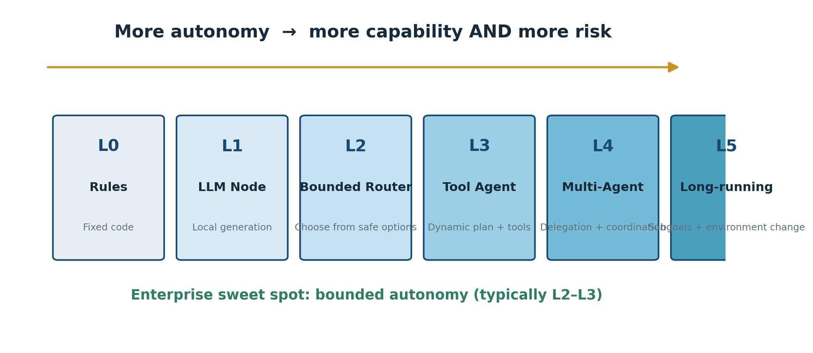
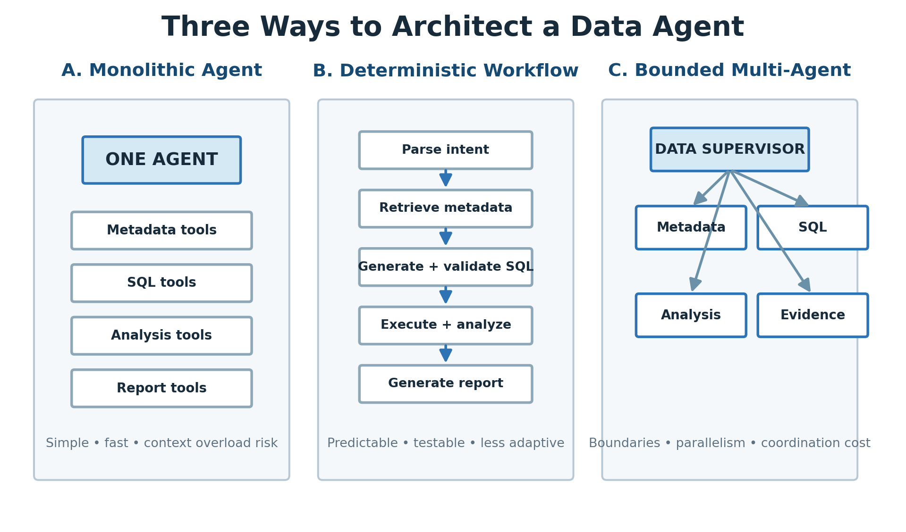

# 第 01 章：到底什么才算 AI Agent？

目标闭环 · 自治等级 · 系统边界 · 架构选择 · Data Agent 实战

!!! abstract "本章定位"
    面向具备软件、数据或 AI 工程基础的学习者。既可作为 90—120 分钟公开课讲义，也可作为开源教材的独立章节使用。

作者 / 讲师：DataDan  
版本：v0.1 · 2026 年 7 月  
许可：CC BY 4.0

## 开源出版与使用说明

本章面向公开教学和GitHub开源书写作。正文为重新组织与独立推演的原创教学内容，吸收了多智能体系统、Agent工程、分布式系统和生产AI实践中的通用思想。

本章不是对任何单一本书的翻译、节录或替代。涉及《Practical Multi-Agent AI Systems》等资料时，仅用于概念研究、批判性比较和延伸阅读；公开发布时应保留参考文献，不应附带原书正文、插图或受版权保护的配套代码。

!!! info "发布建议"
    GitHub 仓库中同时提供 Markdown 正文、图片源文件、实验代码、LICENSE、CONTRIBUTING.md 和版本变更记录。Word 版本适合课程交付与编辑审校，Markdown 版本适合开源协作。

### 课程元数据

| **项目**     | **说明**                                                  |
|--------------|-----------------------------------------------------------|
| **建议课时** | 90—120分钟讲授 + 45—90分钟实战                            |
| **适合对象** | AI工程师、数据工程师、架构师、产品技术负责人、FDE         |
| **前置知识** | 了解LLM、API、基本软件架构；无需先掌握LangGraph           |
| **核心产出** | 一张Agent适用性决策表、一份系统边界诊断、一份架构选择说明 |
| **授课方式** | 概念讲解、案例推演、现场投票、架构白板、课后作业          |
| **下一课**   | Agent如何规划、调用工具并根据反馈改变行动                 |

### 学习目标

1.  用工程语言定义AI Agent，而不是用“像人一样思考”等模糊比喻。

2.  区分普通LLM应用、LLM增强工作流、单Agent和多Agent系统。

3.  理解自治性是一条连续谱，并找到企业应用中的合理自治边界。

4.  识别多Agent拆分所需的真实领域、数据、工具、权限、状态和故障边界。

5.  为一个Data Agent或业务Agent选择满足需求的最简单架构。

### 本章路线图

| **模块** | **关键问题** | **课堂产出** |
|----|----|----|
| **1. 开场案例** | 同一套业务为什么可能是工作流，也可能是Agent？ | 初始判断 |
| **2. 最小定义** | Agent最少必须形成什么闭环？ | Agent闭环图 |
| **3. 五层结构** | 目标、认知、行动、状态、控制如何配合？ | 组件检查表 |
| **4. 类型辨析** | LLM调用多次就算多Agent吗？ | 系统分类表 |
| **5. 自治边界** | 自治越高越好吗？ | L0—L5分级 |
| **6. 多Agent判断** | 什么时候拆，什么时候不要拆？ | 适用性评分表 |
| **7. Data Agent实战** | 三种架构如何取舍？ | 架构ADR草案 |
| **8. 练习与验收** | 能否把判断迁移到真实项目？ | 系统诊断作业 |

## 1. 从一个退款率问题开始

假设业务负责人问Data Agent：“分析本月华东地区付费客户的退款率为什么上涨，主要影响了哪些产品？如果排除新客户，趋势还成立吗？”

乍看之下，它只是一个数据问题。实际上，系统至少需要理解指标、时间、地区、客群和比较口径；检索指标定义和元数据；寻找表与Join路径；生成并校验SQL；执行查询；根据中间结果决定是否继续下钻；最后形成带证据的解释。

### 1.1 两套系统，表面相同，性质不同

系统甲预先规定固定步骤：先查总体指标，再按地区、渠道、产品和客群依次展开，最后生成报告。无论中间结果如何，路径都不会改变。

```python
query_overall_metric()
query_by_region()
query_by_channel()
query_by_product()
query_by_customer_segment()
generate_report()
```

系统乙只接收一个目标。查询总体数据后，它发现华南贡献了72%的增量，于是停止扫描其他地区，转而下钻华南的渠道和活动；如果证据不足，它会补充查询或向用户澄清。

```python
goal = "Identify the main drivers of refund-rate growth"
while not done:
    observation = inspect(state, evidence)
    next_action = decide(observation, constraints, tools)
    result = execute(next_action)
    state = update(state, result)
```

!!! tip "第一次判断"
    系统甲更接近 LLM 增强工作流；系统乙具备 Agent 特征。区别不在于是否调用 LLM 或工具，而在于执行路径是否根据反馈动态变化。

### 1.2 课堂互动：先投票，再解释

公开授课时，可以在展示答案之前发起一次现场投票：

- A：只要系统调用了工具，就是Agent。

- B：只要系统会规划，就是Agent。

- C：只有形成观察—决策—行动—更新闭环，才具有Agent性。

- D：必须存在长期记忆，才算Agent。

推荐答案是C。规划、工具和记忆都能增强Agent，但最小本质是围绕目标形成可持续行动闭环。

## 2. AI Agent的最小工程定义

AI Agent是一个围绕目标运行，能够感知当前状态，选择并执行动作，根据动作结果更新状态，并持续决定下一步行为的系统。


*图1-1 AI Agent最小闭环：Observe → Decide → Act → Update*

这一定义刻意避开“像人一样思考”“自主完成一切”等营销语言。工程上，我们只关心系统是否具备可观察、可约束、可测试的闭环。

### 2.1 Observe：观察什么

- 用户当前请求以及多轮对话中的必要信息；

- 任务当前执行状态、已经完成和尚未完成的步骤；

- 工具返回的结构化结果、错误、超时和权限拒绝；

- 环境中的实时事实，例如库存、订单状态或数据库结果；

- 预算、时间、风险等级和人工审批状态。

!!! warning "关键提醒"
    工具输出、RAG 文档和其他 Agent 消息都属于外部输入，不能因为它们来自“内部工具”就默认可信。间接 Prompt Injection 往往正是从这些通道进入。

### 2.2 Decide：决定什么

决定层不应被理解成一段不可见的“神秘思维链”。生产系统需要的是结构化、可验证的决策结果，例如：下一步动作、所选工具、参数、依赖证据、风险等级、是否需要继续。

```json
{
  "next_action": "query_refund_by_channel",
  "arguments": {"region": "华南", "period": "2026-07"},
  "reason_code": "REGION_CONTRIBUTION_HIGH",
  "required_evidence": ["refund_rate", "refund_count", "paid_orders"],
  "risk_level": "read_only",
  "stop_after_action": false
}
```

### 2.3 Act：动作必须穿过确定性控制层

模型可以提出动作意图，但权限、参数合法性、幂等性、人工审批和实际执行必须由确定性系统控制。

!!! danger "架构原则"
    Agent 可以决定“想做什么”，但不能自行决定“有没有权做”。授权必须来自策略引擎、RBAC/ABAC、工具网关或业务规则。

### 2.4 Update：为什么状态更新决定了系统是否可靠

Agent每次执行后都要将结果转化为明确状态：成功、失败、证据不足、权限拒绝、等待人工或需要重试。若状态只存在于自然语言对话中，恢复、审计和测试都会变得困难。

| **状态**                  | **含义**             | **允许的下一步**       |
|---------------------------|----------------------|------------------------|
| **SUCCEEDED**             | 动作成功且证据有效   | 继续计划或结束         |
| **RETRYABLE_ERROR**       | 临时错误、限流或超时 | 按策略重试或换Provider |
| **INVALID_INPUT**         | 参数或用户信息不足   | 修正参数或请求澄清     |
| **PERMISSION_DENIED**     | 调用者无权执行       | 终止或升级人工         |
| **WAITING_APPROVAL**      | 高风险动作等待审批   | 暂停并持久化状态       |
| **INSUFFICIENT_EVIDENCE** | 无法形成可靠结论     | 补查或明确拒答         |

## 3. Agent的五层工程结构

原理层可以列出角色、目标、记忆、知识、工具、规划、反馈、评估、反思、内省和环境等要素。为了方便架构设计，我们将其压缩为五个可以落到接口、状态和测试上的工程层。

| **层** | **核心问题** | **典型内容** | **主要失败** |
|----|----|----|----|
| **目标层** | 为什么存在，何时完成？ | 角色、目标、成功标准、约束、终止条件 | 目标模糊、无限循环 |
| **认知层** | 下一步做什么？ | 规划、路由、推理、评估、反思 | 计划错、路由错 |
| **行动层** | 如何影响环境？ | 检索、计算、写操作、通信工具 | 工具误用、越权 |
| **状态层** | 系统记住什么？ | 任务状态、对话记忆、领域事实、错误状态 | 污染、丢失、不一致 |
| **控制层** | 何时阻止、重试或升级？ | 校验、预算、HITL、熔断、审计 | 失控、成本爆炸 |

### 3.1 目标层：角色不等于目标

“你是一名资深数据分析师”只是Persona，不是任务定义。它没有告诉系统应该交付什么、什么叫正确、何时停止，也没有说明不可触碰的边界。

| **弱定义** | **可执行定义** |
|----|----|
| **你是一名资深数据分析师。** | 分析指定时间段内退款率的变化，识别贡献度最高的驱动因素。所有结论必须由可追溯查询结果支持；不得访问无权数据；证据不足时必须明确说明。 |

一个可执行的Agent目标至少需要五部分：目标对象、范围、成功标准、约束和终止条件。

### 3.2 认知层：推理与规划不是一回事

| **概念** | **回答的问题** | **示例** |
|----|----|----|
| **推理 Reasoning** | 当前证据意味着什么？ | 华南贡献了整体退款增量的72%。 |
| **规划 Planning** | 接下来采取什么步骤？ | 先按渠道下钻华南，再检查营销活动。 |
| **评估 Evaluation** | 刚才的结果是否足够？ | 只有相关性，没有排除客群结构变化。 |
| **反思 Reflection** | 是否应修改原计划？ | 停止扫描其他地区，增加新老客对照。 |
| **内省 Introspection** | 系统知道自己的限制吗？ | 当前无活动配置表访问权限，无法验证促销假设。 |

### 3.3 行动层：工具是能力，也是风险

| **工具类型** | **作用** | **示例** | **典型控制** |
|----|----|----|----|
| **检索** | 读取事实 | 搜索、RAG、SQL查询 | 数据范围、行列级权限 |
| **计算** | 确定性运算 | Python、统计、规则引擎 | 资源限制、输入校验 |
| **操作** | 改变外部状态 | 更新工单、发起退款 | 审批、幂等、回滚 |
| **通信** | 向人或Agent传递任务 | 邮件、Slack、A2A | 身份、签名、防重放 |

### 3.4 状态层：任务状态、对话记忆和领域知识必须分开

把所有内容塞进一个不断增长的Prompt，看似省事，实际上会让历史对话、执行状态和领域事实互相污染。

| **信息类型** | **示例** | **生命周期** | **建议载体** |
|----|----|----|----|
| **任务状态** | 当前步骤、完成项、错误、重试次数 | 一次任务 | 结构化State、Checkpoint |
| **对话记忆** | 用户上一轮限制“只看付费客户” | 一个会话或更长 | 消息历史、摘要、记忆库 |
| **领域知识** | 产品归属、政策、指标定义 | 跨任务共享 | 关系库、KG、向量库 |
| **决策轨迹** | 为何选择某团队和工具 | 审计周期 | Trace、Context Graph、Audit Log |

### 3.5 控制层：成功路径只占一半

真实生产路径往往是“工具超时—重试—参数错误—修正—数据为空—换检索方式—权限不足—转人工”。因此，Agent的工程质量不仅体现在会做事，还体现在出错时能安全地停下来。

!!! question "课堂追问"
    如果一个 Agent 能完成 80% 的正常请求，却在 2% 的高风险请求上可能越权写入，你会把它定义为 80 分的系统，还是不可上线的系统？

## 4. 四类系统：不要把所有AI应用都叫Agent

| **类型** | **路径控制者** | **是否动态行动** | **典型例子** | **主要优势** |
|----|----|----|----|----|
| **普通LLM应用** | 单次Prompt | 否 | 翻译、摘要、抽取 | 简单、便宜 |
| **LLM增强工作流** | 开发者预定义 | 局部 | 合同解析、报告流水线 | 可控、可测试 |
| **单Agent** | 模型在边界内决定 | 是 | 研究、SQL分析、代码修复 | 灵活、状态集中 |
| **多Agent系统** | 多个角色协作与委托 | 是 | 跨域客服、复杂研究、软件工程 | 专业化、隔离、并行 |

### 4.1 多个Prompt不等于多个Agent

如果研究、写作和审核三个角色使用同一模型、同一数据、同一权限、没有独立状态，执行顺序完全固定，那么更准确的名字是“多阶段LLM工作流”。角色扮演是一种Prompt组织方式，不自动构成分布式Agent架构。


*图1-2 真正的Agent拆分应建立在工程边界上*

### 4.2 判断一个组件是否足以称为Agent

| **检查项**   | **问题**                           | **必要性**      |
|--------------|------------------------------------|-----------------|
| **目标**     | 是否拥有明确目标与完成条件？       | 必要            |
| **观察**     | 是否接收环境或工具反馈？           | 必要            |
| **决策**     | 是否能基于反馈选择下一动作？       | 必要            |
| **行动**     | 是否能调用工具或改变外部状态？     | 通常必要        |
| **状态**     | 是否保存任务进度和中间结果？       | 复杂任务必要    |
| **控制**     | 是否有预算、权限、终止和升级机制？ | 生产环境必要    |
| **独立身份** | 是否拥有独立能力、权限或责任边界？ | 多Agent拆分必要 |

## 5. 自治不是开关，而是一条连续谱



*图1-3 L0—L5自治等级；企业常见最优区间是受约束的L2—L3*

自治提高并不会单向带来收益。它同时扩大了执行空间、测试空间、安全暴露面和责任归因难度。架构师的任务不是追求最大自治，而是找到完成目标所需的最小自治。

### 5.1 L0—L5逐级解释

| **级别** | **行为** | **LLM职责** | **确定性系统职责** | **适用场景** |
|----|----|----|----|----|
| **L0** | 完全固定 | 无 | 全部逻辑 | 规则稳定的计算与交易 |
| **L1** | 局部生成 | 抽取、分类、改写 | 编排全过程 | 内容和文档流水线 |
| **L2** | 受控选择 | 在安全选项中路由 | 候选集合、校验、执行 | 客服路由、工具选择 |
| **L3** | 动态规划 | 规划、调用工具、调整步骤 | 权限、预算、状态、执行 | 研究、数据分析、代码任务 |
| **L4** | 协作委托 | 跨Agent分工与再规划 | 协议、隔离、审计 | 跨域复杂任务 |
| **L5** | 长期自治 | 形成子目标并持续改变环境 | 强监督和治理 | 少数受控长期任务 |

### 5.2 Bounded Autonomy：企业真正需要的形态

- LLM负责理解非结构化意图、生成候选计划、处理模糊判断。

- Schema负责约束计划与工具参数的结构。

- 策略层负责身份、权限、风险和审批。

- 工具层负责实际执行、幂等、事务和回滚。

- 状态机负责步骤推进、重试、超时和恢复。

- 评测系统负责判断质量是否达到发布门槛。

!!! tip "一句话总结"
    把模型放在它擅长的模糊决策位置，把确定性、权限和一致性交还给传统软件工程。

## 6. 什么时候应该使用多Agent

多Agent不是因为任务“听起来很复杂”，而是因为单一责任单元已经无法同时满足领域、工具、权限、状态、扩容或故障隔离要求。

| **信号** | **具体表现** | **多Agent可能带来的收益** |
|----|----|----|
| **跨独立业务域** | 一个请求同时涉及会员、理赔、政策和服务商 | 领域专业化 |
| **权限显著不同** | 只读查询与高风险写操作并存 | 最小权限与隔离 |
| **可并行子任务** | 多个独立证据源可同时检索 | 缩短总体耗时 |
| **上下文冲突** | 工具Schema过多、规则互相干扰 | 减少无关上下文 |
| **独立扩缩容** | 某类任务请求量或资源需求特殊 | 按团队扩容 |
| **故障隔离** | 一个域失败不应拖垮全局 | 限制爆炸半径 |
| **团队所有权** | 不同组织维护不同能力 | 清晰责任与发布节奏 |

## 7. 什么时候不要使用多Agent

- 任务路径稳定，步骤、分支和终止条件可以由代码明确描述。

- 所有角色访问相同数据、工具和权限，拆分后没有真实隔离价值。

- 任务只需一次生成、分类、抽取或轻量工具调用。

- 接口对延迟和成本极其敏感，无法接受多次规划与汇总调用。

- 核心计算必须完全确定，例如结算、权限判定、合规阈值。

- 单Agent版本尚未具备稳定工具契约、基础评测和错误处理。


*图1-4 架构复杂度升级阶梯：能用简单系统解决，就不要主动分布式化*

!!! failure "反模式"
    为了展示“Agent 团队”而人为创建经理、专家、评论家和审核员，却没有真实的数据、权限、工具或状态差异。这类系统经常增加 Token 消耗，却没有增加可控能力。

## 8. 多Agent应该按什么边界拆分

最可靠的拆分方法不是先给Agent起名字，而是先画边界。只有边界清楚后，角色名称才有意义。

| **边界**   | **诊断问题**                   | **可验证产物**             |
|------------|--------------------------------|----------------------------|
| **领域**   | 它拥有哪一组独立业务知识？     | 领域模型、术语表、能力清单 |
| **数据**   | 它可以访问哪些表、文档和实体？ | Data Access Policy         |
| **工具**   | 它能执行哪些读写动作？         | Tool Registry、Schema      |
| **权限**   | 谁能委托它，哪些动作需审批？   | RBAC/ABAC策略              |
| **状态**   | 什么状态由它创建、维护和销毁？ | State Contract             |
| **故障**   | 它失败会影响哪些上下游？       | Failure Domain、Runbook    |
| **扩容**   | 它的负载和资源是否独立？       | SLO、容量模型              |
| **所有权** | 哪个团队负责变更和事故？       | Owner、Release Policy      |

## 9. Data Agent案例：三种架构如何选择



*图1-5 同一Data Agent需求可以落成三种完全不同的架构*

### 9.1 方案A：单体Data Agent

一个Agent持有元数据检索、SQL生成、SQL执行、统计分析、图表和报告工具。它实现快、状态集中、调用链短，适合作为早期产品或单领域系统。

| **优势** | **风险** | **适用条件** |
|----|----|----|
| **开发快、延迟低、调试路径短** | 工具过多导致选择准确率下降；Prompt和Schema膨胀；权限边界弱 | 单领域、工具数量有限、以只读操作为主 |

### 9.2 方案B：确定性数据工作流

```text
意图与参数抽取
→ 指标/维度解析
→ 元数据检索
→ NL2SQL
→ SQL AST 与权限校验
→ 只读执行
→ 驱动分析
→ 证据化报告
```

它最可控、最容易测试。对于固定模式的经营分析、指标问答和报表生成，往往比多Agent更可靠。缺点是面对开放式下钻时适应性较弱。

### 9.3 方案C：受约束的多Agent

| **Agent** | **职责** | **允许的工具** | **禁止事项** |
|----|----|----|----|
| **Metadata Agent** | 检索指标、字段、表和Join路径 | Metadata DB、Schema Graph | 不得执行生产SQL |
| **SQL Agent** | 生成与修正查询 | 只读SQL执行器 | 不得绕过AST和权限校验 |
| **Analysis Agent** | 决定下钻方向并计算贡献度 | 统计、结果查询 | 不得自由访问任意表 |
| **Evidence Agent** | 核验结论、分母、时间和过滤条件 | 证据读取、规则校验 | 不得生成无证据新事实 |
| **Data Supervisor** | 拆目标、管理依赖、合并结果 | Agent目录、状态存储 | 不得直接调用高风险工具 |

这套拆分只有在真实建立能力、工具、权限与评测边界时才有价值。如果四个Agent仍共享一切，它只是把一个Prompt拆成了四段。

### 9.4 推荐演进路线

1. 先用确定性工作流把输入、指标、元数据、SQL、安全和证据契约做稳。

2. 只在动态下钻环节引入一个受约束的 Analysis Agent。

3. 当工具选择、上下文冲突或权限隔离成为真实瓶颈时，再拆 Metadata 与 SQL 责任。

4. 当跨域并行、独立扩缩容和组织所有权出现后，再升级为 Supervisor 式多 Agent。

5. 每次升级前，用评测数据证明收益覆盖了延迟、成本和维护复杂度。

## 10. Agent适用性评分表

下面的评分表不是数学真理，而是一种架构讨论工具。它迫使团队把“为什么需要Agent”说清楚。每项0—2分。

| **判断项**     | **0分**  | **1分**      | **2分**      |
|----------------|----------|--------------|--------------|
| **任务路径**   | 完全固定 | 少量分支     | 高度动态     |
| **领域数量**   | 单领域   | 两个相关领域 | 多个独立领域 |
| **工具空间**   | 少于5个  | 5—12个       | 多且异质     |
| **权限差异**   | 无       | 部分不同     | 明确隔离     |
| **并行需求**   | 无       | 偶尔         | 经常         |
| **上下文冲突** | 很少     | 偶尔         | 严重         |
| **独立扩容**   | 不需要   | 可能需要     | 明确需要     |
| **故障隔离**   | 不重要   | 有要求       | 强要求       |
| **自主规划**   | 不需要   | 局部需要     | 强烈需要     |
| **审计要求**   | 低       | 中           | 高           |

| **总分**  | **初步建议**            | **说明**               |
|-----------|-------------------------|------------------------|
| **0—5**   | 确定性程序或普通LLM应用 | 不要Agent化            |
| **6—10**  | LLM增强工作流           | 局部节点使用模型       |
| **11—15** | 单Agent或混合Agent      | 在关键动态节点引入自治 |
| **16—20** | 认真评估多Agent         | 仍需用收益数据证明     |

## 11. 常见失败模式

| **失败模式** | **表面现象** | **真正原因** | **优先修复** |
|----|----|----|----|
| **角色膨胀** | Agent很多但质量没提高 | 没有真实边界 | 合并角色、恢复工作流 |
| **工具超市** | 经常选错工具 | 工具描述相似、数量过多 | 分组、候选路由、Schema优化 |
| **上下文泥潭** | 多轮后遗忘约束 | 状态、记忆、知识混放 | 拆分Context Contract |
| **计划漂移** | 越做越偏离目标 | 缺少完成标准和预算 | 结构化计划、停止条件 |
| **循环调用** | 重复查询同一信息 | 没有动作去重和状态检查 | 幂等键、最大步数 |
| **权限旁路** | Agent直接调用高风险工具 | 授权依赖Prompt | 工具网关强制策略 |
| **假并行** | 多Agent更慢 | 存在依赖却被错误并行 | 显式依赖图 |
| **不可诊断** | 答案错但不知道错在哪 | 缺少分层Trace和证据 | 执行树、Trace ID、Eval |

## 12. 公开课教学设计

下面给出一套可直接使用的90—120分钟授课流程。它不是把正文逐字念完，而是通过问题、投票、图解和案例推演推进理解。

| **时间** | **环节** | **讲师动作** | **学员产出** |
|----|----|----|----|
| **0—10分钟** | 开场问题 | 展示退款率案例，不先给定义 | 第一次系统分类投票 |
| **10—25分钟** | 最小闭环 | 讲Observe—Decide—Act—Update | 画出闭环 |
| **25—45分钟** | 五层结构 | 用失败案例解释每一层 | 组件检查表 |
| **45—60分钟** | 四类系统 | 对比LLM应用、工作流、单Agent、多Agent | 快速分类练习 |
| **60—75分钟** | 自治等级 | 讨论为什么自治不是越高越好 | 选择合理L级别 |
| **75—95分钟** | Data Agent案例 | 现场比较三套架构 | 小组架构选择 |
| **95—110分钟** | 评分与答辩 | 要求用边界和约束解释 | 一页ADR草案 |
| **110—120分钟** | 总结与作业 | 回顾五个结论 | 提交真实项目诊断 |

### 12.1 讲师提示

- 不要一开始给出Agent定义。先让学员暴露直觉，再用闭环纠偏。

- 每次学员说“这个场景很复杂，所以要多Agent”，都追问复杂性具体落在哪个边界。

- 避免把LangGraph、AutoGen或CrewAI当作课程中心。框架是实现，架构判断才是能力。

- 讨论Data Agent时，始终追问谁拥有SQL执行权，防止抽象讨论脱离安全边界。

- 把“不使用Agent”当成一种成熟架构决策，而不是保守或落后。

## 13. 多媒体配套设计

为了让这一章既能阅读，也能公开教学，建议同时制作短视频、音频、白板图和现场演示。以下脚本可直接作为后续制作底稿。

### 13.1 8分钟概念视频分镜

| **时间** | **画面** | **旁白重点** |
|----|----|----|
| **00:00—00:45** | 退款率问题逐字出现 | 同一个业务，为什么可能是工作流，也可能是Agent？ |
| **00:45—02:00** | 固定流程与动态流程并排 | 区别不是有没有LLM，而是谁决定下一步。 |
| **02:00—03:20** | Agent闭环动画 | 观察、决策、行动、更新以及终止。 |
| **03:20—04:30** | L0—L5自治光谱 | 自治越高，能力与风险同时提高。 |
| **04:30—05:40** | 四类系统卡片 | 普通LLM、工作流、单Agent、多Agent。 |
| **05:40—06:50** | 七类边界依次亮起 | 多Agent不是按人物角色拆，而是按工程边界拆。 |
| **06:50—07:40** | 三种Data Agent架构 | 简单架构优先，逐步演进。 |
| **07:40—08:00** | 五个结论 | 完成目标所需的最小自主性，才是合理自主性。 |

### 13.2 5分钟音频导读脚本

!!! quote "音频开场"
    很多人判断一个系统是不是 Agent，看它有没有调用大模型、有没有工具、有没有几个叫“研究员”和“审核员”的角色。这个判断方法几乎一定会把你带偏。真正的分界线，是系统能不能围绕目标观察环境、选择动作、执行并根据结果更新下一步。

音频主体建议围绕三个问题展开：第一，固定工作流和Agent的执行路径由谁决定；第二，企业为什么更需要受约束的自主性；第三，多Agent拆分为什么必须对应真实领域、数据、工具、权限或故障边界。结尾用Data Agent三种架构收束。

### 13.3 现场演示建议

1. 先运行一个固定退款分析脚本，无论结果如何都查询全部维度。

2. 再运行一个受约束 Agent，让它读取第一步结果后选择下钻维度。

3. 故意让工具返回超时，观察系统是否重试、换工具或安全停止。

4. 模拟一次高风险写操作，展示 Prompt 同意并不等于策略授权。

5. 展示执行日志，让学员判断错误发生在计划、路由、工具还是总结层。

## 14. 课堂练习

### 练习一：系统分类

某系统执行以下流程：用户上传招标文件；LLM抽取资格要求；程序查询企业资质库；LLM比较是否满足；程序生成固定格式报告。它属于普通LLM应用、LLM增强工作流、单Agent还是多Agent？请说明路径控制者是谁。

### 练习二：是否拆分

某Data Agent有15个只读工具：6个元数据工具、4个SQL工具、3个图表工具和2个报告工具。所有工具使用相同权限，单轮查询为主，但工具选择准确率只有82%，Prompt已经很长。你会直接拆成4个Agent，还是先优化单Agent？请用真实边界解释。

### 练习三：真实项目诊断

1. 系统的最终目标是什么？

2. 哪些步骤允许 LLM 判断？

3. 哪些步骤必须由确定性代码完成？

4. 当前有哪些真实领域、数据、工具、权限、状态或故障边界？

5. 它更适合工作流、单 Agent 还是多 Agent？

6. 拆分多个 Agent 的最大实际收益是什么？

7. 新增的延迟、成本、安全和运维风险是什么？

## 15. 参考答案与评分标准

!!! info "教学使用建议"
    公开授课时，可以将本节放到讲师版，学员版暂时隐藏。不要只给结论，要要求学员说明路径控制者、自治等级和真实边界。

### 15.1 练习一参考

推荐判断：LLM增强工作流。整个执行顺序由开发者预先规定，LLM只负责抽取和比较两个局部节点。系统没有根据中间结果动态选择下一动作，也没有持续行动闭环。

### 15.2 练习二参考

推荐先保持单Agent或改成“两阶段候选路由＋单Agent执行”。原因是四组工具虽然类别不同，但数据权限、任务生命周期和故障域并未明显分离。应先优化工具命名、描述、参数Schema、候选工具检索和分层路由；若仍因上下文冲突或独立权限需求受限，再拆分。

### 15.3 评分Rubric

| **维度** | **优秀** | **合格** | **需改进** |
|----|----|----|----|
| **概念准确** | 用闭环和路径控制者判断 | 能基本分类 | 只看是否调用LLM |
| **边界意识** | 明确数据、工具、权限、状态等边界 | 能指出部分边界 | 按人物称谓拆Agent |
| **复杂度意识** | 同时分析收益、延迟、成本和维护 | 能提到部分代价 | 默认多Agent更先进 |
| **确定性控制** | 明确授权、校验和执行不能交给LLM | 知道高风险需审批 | 依赖Prompt约束权限 |
| **证据能力** | 用指标或实验验证架构升级 | 有定性理由 | 无验证计划 |

## 16. 可复制的实战模板

### 16.1 Agent定义卡

| **字段**       | **填写内容**                       |
|----------------|------------------------------------|
| **Agent名称**  | 避免只写人格名称，体现责任域       |
| **业务目标**   | 它为谁解决什么问题                 |
| **成功标准**   | 如何判断已完成且正确               |
| **允许输入**   | 接受哪些任务、上下文和身份         |
| **允许工具**   | 可调用的读、写、计算和通信工具     |
| **禁止动作**   | 不可访问、不可推断、不可执行的内容 |
| **状态所有权** | 创建、读取和更新哪些状态           |
| **停止条件**   | 完成、预算耗尽、证据不足、风险超限 |
| **升级条件**   | 何时请求用户、上级Agent或人工      |
| **评测指标**   | 结构、行为、语义、推理、成本和延迟 |

### 16.2 架构决策记录 ADR

```markdown
# ADR-001: 是否采用多 Agent 架构

## 背景
业务目标、用户、任务类型和当前瓶颈。

## 约束
延迟、成本、权限、合规、数据、团队和运维约束。

## 候选方案
1. 确定性工作流
2. 单 Agent
3. 混合式 Agent
4. 多 Agent

## 决策
选择哪一种，核心理由是什么。

## 真实边界
领域 / 数据 / 工具 / 权限 / 状态 / 故障 / 扩容 / 所有权。

## 代价
新增模型调用、延迟、测试、安全面和维护成本。

## 验证
用哪些离线评测、线上指标和故障演练证明决策有效。

## 回退
若收益不达标，如何降级为更简单架构。
```

### 16.3 Agent上线前十问

1. 不使用 Agent，能否用确定性程序完成？

2. 执行路径中究竟哪一步需要动态判断？

3. 模型的选择空间是否已经被明确限制？

4. 工具参数是否有 Schema 和业务校验？

5. 权限是否由模型之外的系统强制执行？

6. 高风险动作是否具备审批、幂等和回滚？

7. 任务状态能否持久化并从中断处恢复？

8. 错误能否定位到计划、路由、工具或汇总层？

9. 是否存在 Golden Dataset 和回归门禁？

10. 多 Agent 带来的收益是否覆盖新增复杂度？

## 17. 本课结论

| **结论** | **工程含义** |
|----|----|
| **调用LLM不等于Agent** | 关键是是否形成目标驱动的动态行动闭环 |
| **多个角色不等于多Agent** | 拆分必须对应真实责任和隔离边界 |
| **Agent核心是行动，不是生成文本** | 工具、状态和反馈决定系统能力 |
| **自治不是越高越好** | 企业通常需要L2—L3受约束自治 |
| **简单架构优先** | 程序 → 工作流 → 单Agent → 多Agent逐级升级 |
| **权限不能由Prompt保证** | 授权、校验、执行必须确定性落地 |
| **失败路径必须先设计** | 安全停止与恢复能力决定能否生产使用 |

!!! success "带走的一句话"
    完成业务目标所需的最小自主性，才是合理自主性；能够被真实边界解释的 Agent 拆分，才是有价值的多 Agent 架构。

## 18. 下一课预告

下一课将进入Agent运行机制：模型如何从目标生成计划，如何选择工具、约束参数、处理工具结果，并根据反馈决定继续、重试、换工具、澄清还是终止。

- Tool Calling究竟发生了什么；

- ReAct循环如何工作；

- 结构化计划与状态机如何配合；

- 为什么工具结果不是可信上下文；

- 怎样实现一个最小但可测试的Data Agent；

- 如何防止循环调用、无限重试和Token失控。

## 参考资料

- Murali Kashaboina. Practical Multi-Agent AI Systems: How to Architect, Build, and Scale Next-Generation AI Systems That Work in the Real World. Wiley, 2026.

- LangChain / LangGraph official documentation: agent state, tool calling, graph orchestration and observability.

- Model Context Protocol specification: tool and context interoperability.

- OWASP Top 10 for LLM Applications: agent and LLM application security risks.

- NIST AI Risk Management Framework: governance, measurement and operational risk.

说明：上述资料用于进一步研究。公开仓库应以链接或书目信息引用，不附带受版权保护的原文、插图和未授权内容。

**LESSON 01 COMPLETE**

**从“会调用模型”到“会设计Agent边界”**

下一课：Agent如何规划、调用工具并根据反馈改变行动
