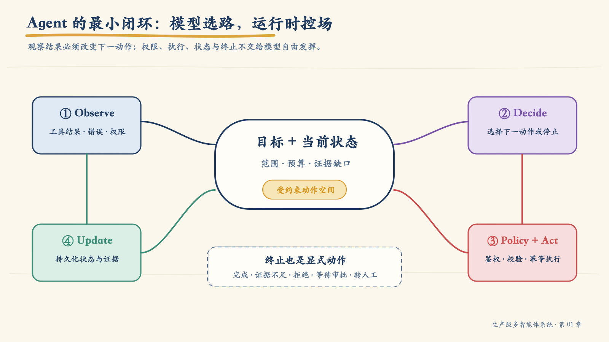
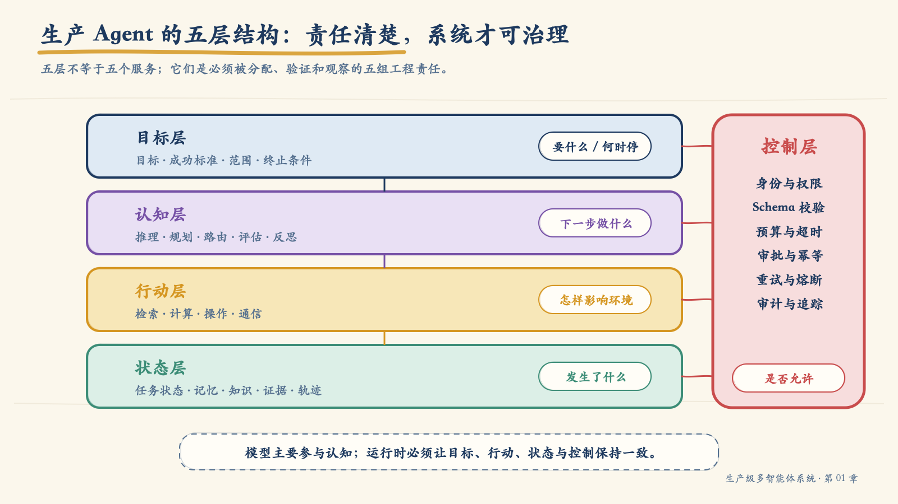
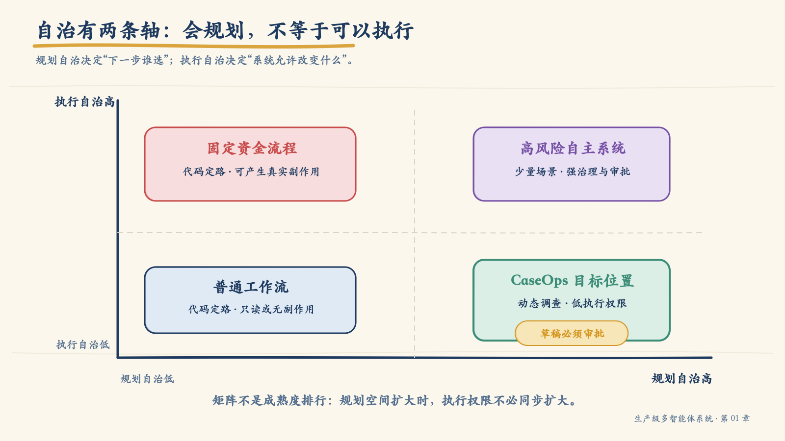
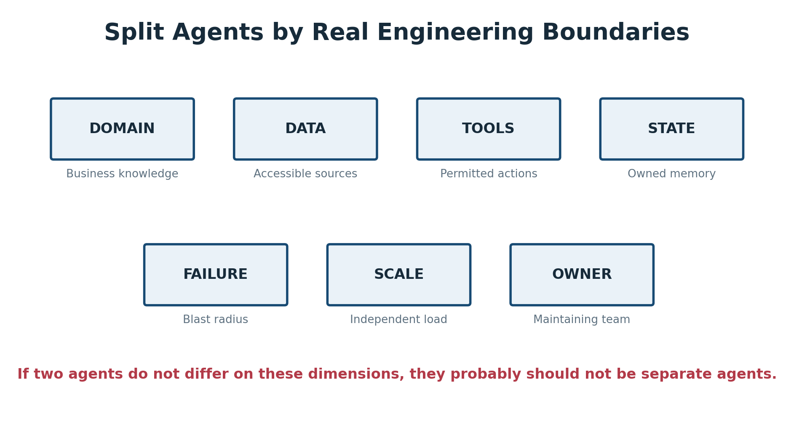
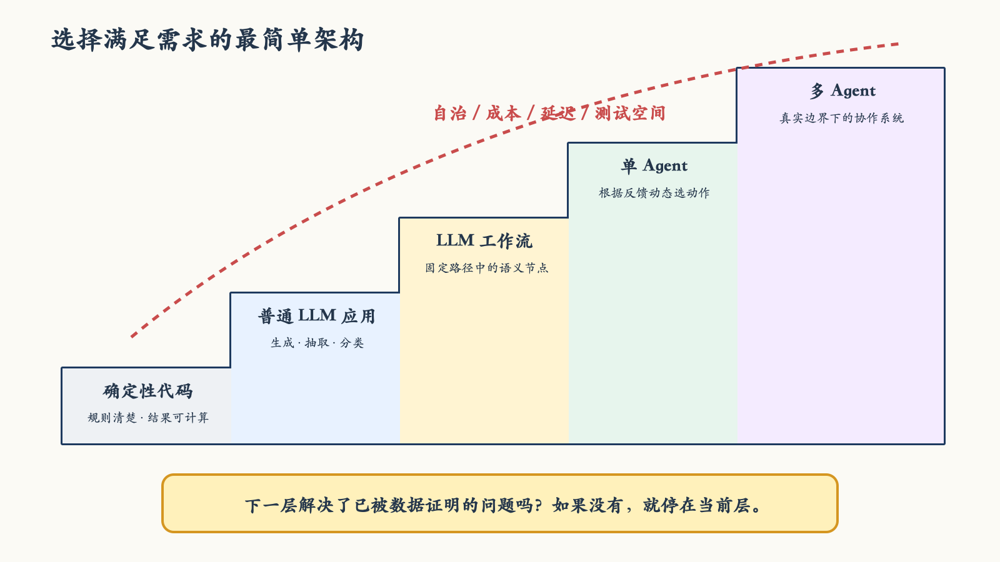
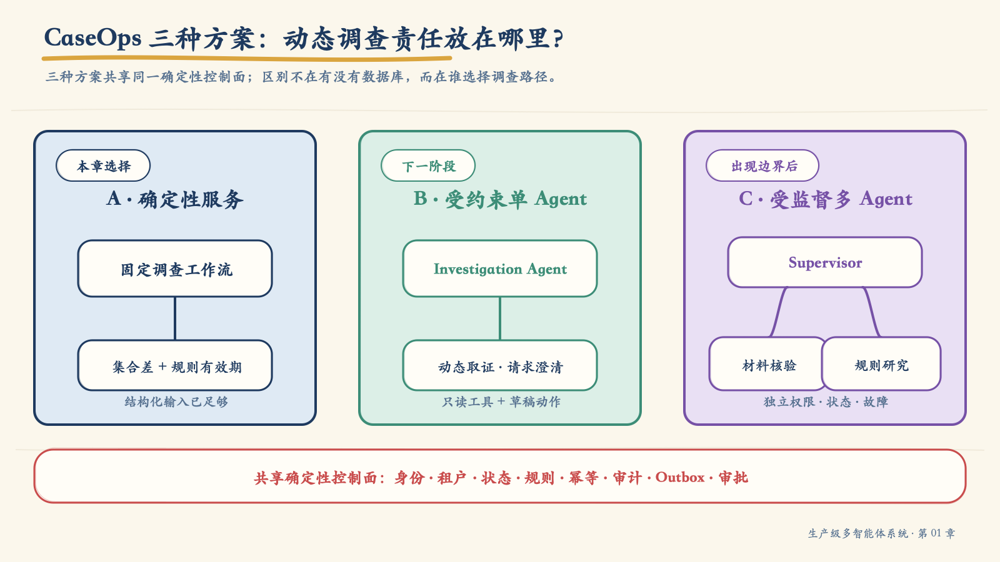

# 第 01 章：理解 Agent——从本质到架构边界

谈论 Agent 时，人们很容易从技术名词开始：大模型、工具调用、记忆、规划、Supervisor、MCP。把这些组件画在一张图上并不难，难的是回答一个更基本的问题：

> 系统中的哪一部分，真的需要根据环境反馈自主决定下一步？

如果这个问题没有答案，后面的设计很可能只是把原本清楚的程序改写成昂贵、缓慢而难以测试的模型调用。如果这个问题有答案，我们还要继续追问：模型可以决定到什么程度，哪些责任必须留在确定性系统中，什么时候一个 Agent 已经足够，什么时候才值得拆成多个 Agent。

这一章先不急着进入代码。我会先建立一套完整的概念坐标：

1. Agent 与普通大模型应用、工作流的分界在哪里；
2. 一个 Agent 由哪些工程层次构成；
3. 推理、规划、状态、记忆、知识分别解决什么问题；
4. 自治程度应该怎样设计，而不是怎样追求；
5. 多 Agent 的拆分依据是什么；
6. 如何选择满足需求的最低复杂度架构。

在这些概念形成之后，我们再把它们放进贯穿全书的 CaseOps 理赔协同系统。项目在这一章中的作用不是替代理论，而是检验理论：每一个架构结论，都必须能够解释真实需求、代码边界和可观察结果。

## 1. 先凭直觉区分：工作流与 Agent 到底差在哪里

先看两个处理同一任务的系统。用户希望查明一宗理赔案件为什么迟迟没有完成，并确认下一步应该补充什么材料。

系统甲按预先编排的步骤执行：

```text
读取案件
  → 读取规则
  → 比较已收材料与必需材料
  → 生成缺件结论
  → 创建通知草稿
```

无论中间结果是什么，路径都由开发者事先写好。程序可以包含大模型，例如用模型抽取文档中的材料名称，但整体执行次序不变。模型完成的是某个局部能力，系统的路径控制权仍在代码中。

系统乙只固定目标和边界：

```text
目标：查明案件阻塞原因，并给出有证据的下一步建议
允许动作：读取案件、解析材料、查询规则、交叉核验、请求澄清
禁止动作：发送通知、修改赔付结果、访问其他租户数据
```

它先读取案件。如果材料已经结构化，就直接核对规则；如果收到的是扫描件，就先解析文档；如果新旧规则冲突，就补查事故日期和发生地；如果证据仍然矛盾，就请求澄清或转交人工。中间观察结果改变了下一步行动。

两套系统都可能使用大模型，也都可能调用工具。真正的区别是：

> 工作流由开发者预先决定路径；Agent 在给定目标和边界内，根据反馈选择下一动作。

这条分界比“是否用了大模型”“是否会调用 API”“是否有记忆”更可靠。工具调用可能只是固定流程中的一个节点，多轮对话也可能只是不断执行同一个问答模板。只有当模型围绕目标参与路径控制，系统才开始呈现 Agent 性。

### 1.1 动态并不等于随机

“根据反馈选择路径”不意味着让模型随意发挥。一个工程化 Agent 面对的不是无限动作空间，而是一组经过定义和授权的候选动作：

```json
{
  "next_action": "read_policy",
  "arguments": {
    "policy_id": "motor-claim-standard",
    "effective_at": "2026-07-01"
  },
  "reason_code": "POLICY_VERSION_REQUIRES_CONFIRMATION",
  "risk_level": "read_only"
}
```

模型负责在候选动作中做模糊判断，运行时负责检查动作是否存在、参数是否合规、调用者是否有权执行、当前状态是否允许转换。动态性来自观察和决策，不来自取消约束。

### 1.2 真正的分界是“转移规则”由谁掌握

传统工作流同样可以读取反馈、包含条件分支，甚至出现循环。例如“查询失败则重试三次，仍失败则转人工”显然会根据结果改变路径，但它不是 Agent。因为每个状态允许转向哪里、满足什么条件时转移，都已经由开发者写成确定性规则。

可以把两类系统都画成状态图：

```text
工作流：next_state = transition(current_state, result)
Agent： next_action = model_policy(goal, current_state, observation)
```

工作流的 `transition` 在发布时已经固定。Agent 的 `model_policy` 则在运行时综合目标、状态和观察，从允许的动作空间中选择下一步。开发者不再枚举完整路径，但仍然定义动作集合、约束和状态合法性。

因此，更严谨的判断不是“路径会不会变化”，而是：

> 路径变化是否包含模型基于语义和上下文所做的运行时裁量。

这也解释了为什么普通规则引擎不是 AI Agent，为什么带有循环和分支的 DAG 仍可能只是工作流，以及为什么单次工具调用通常不足以构成 Agent。Agent 性来自模型进入了反馈闭环中的“策略选择”位置。

## 2. AI Agent 的工程定义

“Agent 是能够代表用户完成任务的智能系统”是一个直观定义，但对工程设计还不够。它没有告诉我们系统需要保存什么、控制什么，也无法帮助团队区分一个普通聊天机器人和一个可持续运行的 Agent。

本书采用下面这个可落实到代码的定义：

> AI Agent 是一个围绕目标运行，能够观察任务与环境状态，在受约束的动作空间中选择下一行动，根据行动结果更新状态，并持续决定继续、停止、拒绝或转交的系统。

这个定义包含六个不可忽略的元素：目标、观察、决策、行动、状态更新和终止。



*图 1-1　模型参与下一步选择，运行时负责权限、执行、状态和终止。*

### 2.1 用一个简化模型理解 Agent 闭环

如果愿意稍微形式化一点，一个 Agent 的单步运行可以写成：

```text
oₜ       = observe(environmentₜ, stateₜ)
proposal = model(goal, stateₜ, oₜ, allowed_actions)
action   = gate(proposal, identity, policy, budget)
result   = execute(action)
stateₜ₊₁ = update(stateₜ, action, result, evidence)
done     = terminate(goal, stateₜ₊₁, constraints)
```

这里最值得注意的不是公式，而是责任分离。

- 模型产生的是 `proposal`，即动作提议；
- `gate` 代表确定性控制层，它可以允许、修改、拒绝或转交审批；
- `execute` 才真正读取或改变外部环境；
- `update` 把结果转换成下一轮可靠状态；
- `terminate` 保证系统不会因为模型仍能生成内容就无限运行。

从这个角度看，大模型只是 Agent 的**策略提议器**，不是完整 Agent。数据库、工具网关、状态存储、策略引擎和执行器也不是外围配件，而是闭环的一部分。

这个模型还揭示了一个常被忽略的事实：模型看到的不是客观环境本身，而是经过权限过滤、数据转换和上下文组装后的观察 `oₜ`。如果观察缺失、过期或被污染，再强的模型也只能在错误前提上推断。因此，Agent 的质量既取决于模型，也取决于观察构造和状态更新是否忠实。

### 2.2 目标：不是角色描述，而是任务契约

“你是一名资深理赔专家”只能约束语言风格和关注角度，不能定义任务何时完成。一个可执行目标至少应包含：

- **任务范围**：处理哪个对象、哪个时间范围、哪些业务问题；
- **成功标准**：什么结果才算完成，结论需要哪些证据；
- **约束条件**：预算、时限、数据范围、禁止动作；
- **终止条件**：完成、证据不足、风险超限、等待审批或转人工。

角色可以帮助模型进入合适的语义空间，目标才是系统运行的依据。生产事故中常见的“越做越多”和无限循环，往往不是模型不够聪明，而是目标没有被写成可判定的完成条件。

### 2.3 观察：Agent 到底看到了什么

观察不是简单地把用户消息交给模型。一次决策所需的观察通常包括：

- 当前目标和任务阶段；
- 已经完成的动作及其结果；
- 工具返回的事实、错误和版本；
- 剩余时间、Token 或调用预算；
- 当前身份、权限和审批状态；
- 尚未满足的证据要求；
- 环境是否发生变化。

观察的质量决定决策的上限。状态丢失、错误被改写成普通文本、过期数据没有时间戳，都会让模型在错误世界中做出看似合理的判断。

### 2.4 决策：选择下一步，不等于输出长篇思考

工程系统需要的是可执行的决策记录，而不是依赖一段不可验证的自由文本。一个决策至少要回答：

- 下一动作是什么；
- 参数来自哪些已知事实；
- 为什么当前状态允许这个动作；
- 动作需要补齐什么证据；
- 失败后应该重试、改路还是停止。

模型可以在内部进行复杂推断，但系统之间传递的应该是结构化动作提议、证据引用和原因码。这样才能校验、评测、审计和重放。

### 2.5 行动：能力与风险从这里开始

行动让 Agent 从“会回答”变成“能影响环境”。常见工具可以分成四类：

| 工具类型 | 典型能力 | 主要风险 | 常见控制 |
|---|---|---|---|
| 检索 | 搜索、RAG、SQL 只读查询 | 越权读取、过期事实、提示注入 | 数据范围、来源标记、行列级权限 |
| 计算 | 规则引擎、统计、代码执行 | 资源耗尽、错误输入、不可信代码 | Schema、资源限额、沙箱 |
| 操作 | 更新工单、创建订单、发起赔付 | 重复执行、越权写入、不可逆影响 | 审批、幂等、事务、回滚 |
| 通信 | 邮件、消息、Agent 间委托 | 身份伪造、重放、错误传播 | 签名、授权、防重放、消息契约 |

这里有一条贯穿全书的原则：

> 模型可以提出动作，但不能给自己授权。

是否允许执行，必须由模型之外的策略、身份和业务规则决定。Prompt 中写着“不得越权”是行为提示，不是访问控制。

### 2.6 更新：让一次调用变成持续系统

执行结束后，系统必须把结果变成下一轮可以使用的状态。更新不只是把工具响应追加到对话，它还需要处理：

- 当前步骤是否完成；
- 产生了哪些新事实和证据；
- 哪些假设被证实或推翻；
- 是否消耗预算；
- 是否需要重试、补查或等待审批；
- 哪些信息可以进入长期记忆，哪些只能保留在本次任务。

没有可靠状态更新，Agent 就会重复调用工具、遗忘限制，或者在进程中断后无法恢复。

### 2.7 终止：停止也是系统能力

很多原型只设计成功路径，却没有定义“什么时候不再继续”。生产系统至少要把以下结果表示为显式状态：

| 状态 | 含义 | 合法的下一步 |
|---|---|---|
| `SUCCEEDED` | 目标和证据要求已经满足 | 返回结果并结束 |
| `RETRYABLE_ERROR` | 临时错误、限流或超时 | 按策略重试或更换提供方 |
| `INVALID_INPUT` | 参数或用户信息不足 | 修正参数或请求澄清 |
| `PERMISSION_DENIED` | 当前身份无权执行 | 停止或升级人工 |
| `WAITING_APPROVAL` | 高风险动作等待审批 | 持久化并暂停 |
| `INSUFFICIENT_EVIDENCE` | 无法形成可靠结论 | 补查、明确拒答或转人工 |

会安全停止的 Agent，通常比“无论如何都要给答案”的 Agent 更接近生产要求。

### 2.8 哪些是必要条件，哪些只是常见实现

围绕 Agent 的争论经常源于把“常见组件”误当成“定义条件”。下面这张表可以帮助我们保持概念准确：

| 能力 | 是否构成 Agent 的关键条件 | 原因 |
|---|---|---|
| 明确目标 | 是 | 没有目标，就无法判断动作是否推进任务 |
| 接收环境反馈 | 是 | 没有反馈，就不能形成闭环 |
| 根据反馈选择下一动作 | 是 | 这是 Agent 与固定流程的核心分界 |
| 维护任务状态 | 复杂任务中是 | 没有状态就无法连续规划、恢复和去重 |
| 调用外部工具 | 通常是，但不绝对 | 行动可以是工具调用，也可以是向用户提问或委托 |
| 长期记忆 | 否 | 一次性任务只需要短期任务状态 |
| 自我反思 | 否 | 它是可选的质量改进机制，不是定义条件 |
| 多个角色或多个模型 | 否 | 数量不决定 Agent 性 |
| 高执行权限 | 否 | Agent 可以只有只读动作 |

这个区分非常重要。它让架构师能够按任务需要添加能力，而不是为了“看起来像 Agent”堆叠组件。

## 3. 一个生产 Agent 的五层结构

最小闭环解释了 Agent 怎样运行，五层结构则回答团队应该把责任放在哪里。我把生产 Agent 拆成目标层、认知层、行动层、状态层和控制层。



*图 1-2　五层不是五个微服务，而是五组必须被明确分配和测试的责任。*

| 层次 | 核心问题 | 典型内容 | 主要失败 |
|---|---|---|---|
| 目标层 | 为什么运行，何时完成 | 目标、范围、成功标准、约束、终止条件 | 目标漂移、无限循环 |
| 认知层 | 下一步做什么 | 推理、规划、路由、评估、反思 | 计划错误、选路错误 |
| 行动层 | 如何读取或改变环境 | 工具、参数、执行结果 | 工具误用、重复副作用 |
| 状态层 | 系统需要记住什么 | 任务状态、记忆、知识、证据 | 污染、丢失、不一致 |
| 控制层 | 何时允许、阻止或升级 | 鉴权、预算、审批、熔断、审计 | 越权、失控、不可诊断 |

这五层不要求物理拆分。一个小型 Agent 完全可以是模块化单体，但每层责任仍应在接口和测试中可见。把所有内容塞进一段 System Prompt，并不会让这些责任消失，只会让它们难以治理。

### 3.1 认知层：推理、规划、评估不是同一件事

这些词经常混用，结果是系统出了问题却不知道应该修哪里。

| 能力 | 回答的问题 | 理赔调查中的例子 |
|---|---|---|
| 推理 Reasoning | 当前证据意味着什么 | 两个材料名称可能指向同一种事故证明 |
| 规划 Planning | 接下来做哪些步骤 | 先核对材料，再按日期确定规则版本 |
| 评估 Evaluation | 上一步结果是否足够 | 当前只有文件名，没有内容证据 |
| 反思 Reflection | 是否应该修改原计划 | 停止重复检索，改为请求客户澄清 |
| 内省 Introspection | 系统是否知道自身限制 | 当前没有地方规则库的访问权限 |

推理得到一个判断，规划组织未来动作，评估检查结果，反思决定是否改路，内省暴露能力边界。它们可以由一次模型调用共同完成，也可以由不同节点承担；概念上分开，才能设计对应的评测和故障处理。

还要避免另一个误区：规划不是把所有步骤一次性列得越长越好。环境越不确定，越应该缩短规划视野。一个实用做法是“滚动规划”：

1. 只规划当前证据下最有价值的下一步或少数几步；
2. 执行后读取真实结果；
3. 评估原假设是否仍成立；
4. 再决定保留、修改或放弃原计划。

这比生成一份十几步的宏大计划更稳健，因为后续步骤不会建立在尚未发生的工具结果上。

### 3.2 状态层：状态、记忆、知识和证据必须分开

“给 Agent 加记忆”并不是一个足够清楚的需求。团队首先要分辨系统究竟要保存什么。

| 信息类型 | 示例 | 生命周期 | 合适载体 |
|---|---|---|---|
| 任务状态 | 当前步骤、重试次数、等待审批 | 一次任务 | 结构化 State、Checkpoint |
| 对话记忆 | 用户上一轮补充的限制 | 一个会话或跨会话 | 消息历史、摘要、记忆库 |
| 领域知识 | 理赔规则、材料定义、组织关系 | 跨任务共享 | 关系库、知识图谱、向量库 |
| 证据 | 案件版本、规则版本、工具结果哈希 | 审计与追溯周期 | Evidence Store、审计日志 |
| 决策轨迹 | 为什么选择某个动作 | 诊断与评测周期 | Trace、Context Graph |

任务状态回答“现在进行到哪里”；记忆回答“过去交互中有什么值得保留”；知识回答“这个领域有哪些可复用事实”；证据回答“这次结论依据什么”。把它们全部放进消息列表，会同时制造上下文膨胀、时效混乱和权限泄漏。

更深一层看，这四类信息的**真值责任**也不同：

- 任务状态由运行时写入，必须满足状态机约束；
- 记忆通常来自历史交互，可能需要摘要、遗忘和用户纠正；
- 领域知识由业务数据源维护，需要版本、有效期和访问控制；
- 证据必须能回到具体来源，不能只保存模型的转述。

模型可以总结这些信息，但不能因为生成了一句陈述，就把它升级为系统事实。

### 3.3 控制层：不是护栏插件，而是系统骨架

控制层横跨其他四层。它限制目标范围，过滤观察内容，校验动作提议，控制状态转换，并决定是否终止。它至少包括：

- 调用者身份与委托链；
- 数据、工具和动作权限；
- 输入输出 Schema；
- 最大步数、时间和费用预算；
- 写操作审批与幂等；
- 重试、超时、熔断和降级；
- 审计、追踪和证据保留。

这也是原型与生产系统最明显的差异。原型证明“模型有时能完成任务”，控制层证明“系统在成功、失败和被攻击时都不会超出边界”。

五层结构最终形成一种清晰分工：目标层定义“要什么”，认知层提出“做什么”，行动层负责“怎么做”，状态层保存“发生了什么”，控制层决定“是否允许”。如果一个职责在架构图中找不到所有者，它通常会在运行时落入 Prompt，并成为最难测试的隐性行为。

## 4. 不要把所有大模型应用都叫 Agent

理解组件之后，还需要理解系统类型。下面四类系统可能使用相同的大模型和工具，但路径控制方式不同。

| 系统类型 | 路径控制者 | 是否根据反馈动态行动 | 典型任务 |
|---|---|---|---|
| 普通 LLM 应用 | 单次调用或用户 | 否 | 翻译、摘要、抽取 |
| LLM 增强工作流 | 开发者预定义 | 局部 | 合同解析、报告流水线 |
| 单 Agent | 模型在边界内选择 | 是 | 研究、故障诊断、动态调查 |
| 多 Agent 系统 | 多个独立责任主体协作 | 是 | 跨域服务、复杂工程、并行取证 |

可以进一步从三个维度区分它们：

| 维度 | LLM 增强工作流 | 单 Agent | 多 Agent |
|---|---|---|---|
| 步骤顺序 | 基本由代码固定 | 由模型在运行时选择 | 由多个责任主体协商或委托 |
| 动作集合 | 每个节点通常固定 | 有限集合，可动态组合 | 每个 Agent 拥有自己的有限集合 |
| 状态所有权 | 工作流统一持有 | Agent 任务状态集中持有 | 需要明确局部状态和共享状态 |
| 失败恢复 | 节点级重试和补偿 | 计划调整、降级或转人工 | 局部恢复加跨 Agent 协调 |
| 主要复杂度 | 编排分支 | 非确定性路径 | 分布式责任和协议 |

### 4.1 工具调用不是充分条件

如果一个程序固定执行“提取参数 → 调用搜索 → 生成摘要”，模型即使发出了工具调用，它仍然是 LLM 增强工作流。工具说明系统能够做什么，不能说明谁控制路径。

判断时可以问一句：

> 工具返回意外结果后，下一步是代码早已写好的分支，还是模型在允许范围内重新选择？

前者通常是工作流，后者才可能是 Agent。

同样，模型输出一个工具名称也不等于模型拥有执行权。工具选择、工具授权和工具执行是三件事：

1. **选择**回答“模型希望调用什么”；
2. **授权**回答“当前身份和任务是否允许调用”；
3. **执行**回答“系统怎样以可重试、可审计的方式完成调用”。

把三者混成一次 SDK 调用，是许多原型走向生产时最先暴露的问题。

### 4.2 多个 Prompt 不是多 Agent

一个系统依次调用“分析员 Prompt”“审核员 Prompt”“总结员 Prompt”，不代表它拥有三个 Agent。如果三者共享同一状态、同一权限和同一故障域，而且永远按固定次序运行，更准确的称呼是多阶段 LLM 工作流。

多 Agent 的“多”不是人设数量，而是独立责任边界的数量。这个判断将在第 7 节展开。

### 4.3 Agent 不是越多越先进

系统类型不是成熟度排名。固定规则、金额计算、权限判断和事务提交通常就应该使用确定性代码。一个可证明正确的工作流，比无法恢复、无法审计的多 Agent 系统更成熟。

## 5. 自治不是开关，而是需要设计的边界

“这个 Agent 自治程度很高”是一句信息不足的话。自治至少要从两个视角观察。

第一种视角是行为层级：

| 等级 | 模型承担的责任 | 确定性系统承担的责任 | 典型形态 |
|---|---|---|---|
| L0 固定执行 | 无 | 全部路径和动作 | 规则程序 |
| L1 局部生成 | 抽取、分类、改写 | 编排全过程 | LLM 工作流 |
| L2 受控选择 | 从安全候选项中路由 | 候选集合、校验、执行 | 受限工具选择 |
| L3 动态规划 | 规划、调用工具、调整步骤 | 权限、预算、状态、执行 | 单 Agent |
| L4 协作委托 | 跨 Agent 分工与再规划 | 协议、隔离、审计 | 多 Agent |
| L5 长期自治 | 形成子目标并持续行动 | 强监督、治理和紧急停止 | 少量受控长期任务 |

这个分级适合描述系统整体处在哪个行为阶段，但它容易让人误以为等级越高越好。因此还需要第二种视角：把规划自治和执行自治拆成两条轴。

- **规划自治**：模型可以在多大范围内决定下一步做什么；
- **执行自治**：系统允许它在多大风险范围内改变外部世界。



*图 1-3　规划空间可以较大，执行权限仍然可以很低。两条轴必须分别设计。*

研究型 Agent 可以自由调整检索方向，规划自治很高，但只读公开资料，执行自治很低。固定退款程序的路径完全由代码决定，规划自治为零，却可能直接改变资金状态，执行风险反而很高。

企业系统常见的合理形态不是“全面自治”，而是**受约束自治**：

- 允许模型处理模糊语义和动态选路；
- 缩小工具和数据访问范围；
- 让高风险动作进入确定性策略和人工审批；
- 让预算、终止和审计独立于模型存在。

完成目标所需的最小自治，通常才是合理自治。

### 5.1 自治风险从哪里产生

自治本身不是风险，风险来自自治与能力、权限和作用范围结合。可以用一个定性模型理解：

```text
风险暴露 ≈ 决策不确定性 × 工具能力 × 权限范围 × 持续时间
           ─────────────────────────────────────────
                     监督强度 × 可恢复性
```

这不是用来计算精确数值的公式，而是一张设计检查表。

- 只读研究 Agent 即使规划自由度很高，工具能力和权限范围仍然有限；
- 能够修改资金状态的 Agent，即使只执行一步，风险也可能很高；
- 长时间无人监督的 Agent 会不断累积错误和成本；
- 有审批、幂等、补偿和紧急停止的系统，能够缩小错误影响。

因此，提升模型质量不是控制自治风险的唯一手段。减少工具权限、缩短任务时长、限制作用对象和增强恢复能力，往往更直接、更可验证。

## 6. 什么时候值得使用 Agent

OpenAI 的工程指南建议优先寻找传统确定性和规则方法难以处理、包含复杂决策或大量非结构化数据的任务；Anthropic 对工作流与 Agent 的区分也强调，应从满足需求的最简单方案开始，而不是默认使用自治系统。

我在实际评审中会寻找四类信号。

### 6.1 路径无法在运行前完整确定

如果下一步取决于刚刚发现的证据，而且可能反复调整，固定工作流会出现大量脆弱分支。研究、故障诊断、开放式数据分析和复杂材料调查通常属于这一类。

### 6.2 输入包含大量语义不确定性

同一意图可能有多种表达，材料结构不稳定，规则需要结合上下文解释。模型在这里可以承担分类、匹配、解释和候选动作选择，但最终事实和权限仍需确定性验证。

### 6.3 工具之间存在动态组合

系统不能事先知道需要调用哪些工具、调用多少次或以什么顺序调用，但动作集合本身可以被限制和校验。这比给模型开放任意代码和任意 API 更适合生产落地。

### 6.4 任务能够定义反馈和停止

Agent 必须知道动作是否成功、证据是否充分以及何时停止。如果任务只有“尽量做好”而没有可观察反馈，自治循环很难稳定。

### 6.5 哪些情况不应该 Agent 化

以下场景通常应优先使用确定性程序或工作流：

- 规则明确、路径稳定、分支可以完整枚举；
- 低认知负荷的转换、校验和计算；
- 极低延迟或极高吞吐的核心链路；
- 金额、权限、合规状态等要求精确一致的决策；
- 无法定义成功、反馈或安全停止；
- 模型带来的质量收益无法覆盖延迟、成本和风险。

“任务很重要”并不是使用 Agent 的理由。任务越重要，越需要把模型只放在它确实优于规则的位置。

### 6.6 架构选择本质上是净收益判断

Agent 不是只要“效果更好一点”就值得采用。一个完整判断应同时考虑收益和新增成本：

```text
Agent 净收益
  = 新增任务覆盖 + 质量提升 + 人工流程改善
  - 模型与基础设施成本
  - 延迟和可用性损失
  - 评测、治理与运维成本
  - 错误行动的预期损失
```

例如，模型把非结构化材料识别率提高了 8%，但让核心链路延迟增加十倍，而且错误结果会触发不可逆写操作，这个升级未必成立。反过来，如果它让原本必须人工调查的长尾案件获得稳定的辅助处理能力，即使单位调用成本较高，也可能具有显著价值。

所以，Agent 适用性不能只靠一次演示判断。至少要建立：

1. 不使用 Agent 的确定性基线；
2. 覆盖正常、边界和高风险情况的代表性任务集；
3. 质量、路径、延迟、成本和安全指标；
4. 明确的上线阈值与回退条件。

### 6.7 一张适用性评分表

评分不能替代架构判断，但可以迫使团队把直觉变成可讨论的证据。每项按 0—2 分评估：

| 判断项 | 0 分 | 1 分 | 2 分 |
|---|---|---|---|
| 任务路径 | 完全固定 | 少量动态分支 | 高度依赖中间反馈 |
| 输入结构 | 稳定结构化 | 半结构化 | 非结构化且表达多样 |
| 语义判断 | 不需要 | 局部需要 | 贯穿任务 |
| 工具组合 | 固定顺序 | 少量选择 | 需要动态组合 |
| 反馈质量 | 无明确反馈 | 部分可观察 | 可持续评价每一步 |
| 自主规划收益 | 没有 | 有局部收益 | 明显减少脆弱流程 |

总分可以作为起点：

- 0—3：优先确定性程序或普通 LLM 调用；
- 4—7：优先 LLM 增强工作流；
- 8—10：评估受约束单 Agent；
- 11—12：Agent 很可能有价值，但仍需基线实验。

这张表有三个否决条件：无法可靠授权、无法安全停止、无法获得反馈。即使分数很高，只要其中一项成立，也不应该直接进入生产自治。

评分是筛选工具，不是决策算法。最后的架构选择仍然要由基线实验和风险分析证明。

## 7. 什么时候才需要多 Agent

单 Agent 的上下文和工具会随着任务增长而膨胀，但“任务复杂”仍不足以证明要拆分。多 Agent 解决的是责任分布问题，它只有在专业化、隔离、并行或组织所有权带来可测收益时才有价值。

### 7.1 什么是多 Agent 系统

多 Agent 系统不是“一个程序调用了多次模型”，而是多个具备局部目标、能力或责任的 Agent，通过明确交互共同完成全局任务。

可以把它抽象为：

```text
全局目标 G
  → 分解为局部目标 g₁, g₂, ... gₙ
  → Agentᵢ 基于自己的状态 sᵢ、工具 Tᵢ 和策略 πᵢ 行动
  → 通过消息、共享环境或协调者交换结果
  → 按结果契约合并为全局结果 R
```

这一定义强调五个条件：

| 条件 | 需要回答的问题 |
|---|---|
| 局部责任 | 每个 Agent 独立对什么结果负责 |
| 局部能力 | 它拥有哪些知识、工具和权限 |
| 交互协议 | 任务、结果、错误和证据怎样传递 |
| 协调机制 | 依赖、并行、冲突和超时怎样处理 |
| 汇合契约 | 局部结果满足什么条件才能形成全局结果 |

多个 Agent 可以同构，也可以异构；可以由 Supervisor 集中编排，也可以通过事件或共享环境协作。但只要它们没有独立责任和交互契约，“多 Agent”就只是实现细节或角色包装。

### 7.2 协作为什么可能产生额外价值

一个多 Agent 系统的能力，不只是各 Agent 输出的简单相加。协作可能产生四类额外价值：

1. **任务分解**：把一个超出单一上下文的问题拆成可验收的局部目标；
2. **专业化**：让不同 Agent 使用更窄的知识、工具和评测标准；
3. **并行处理**：同时处理没有依赖关系的证据源或子任务；
4. **故障隔离**：允许局部能力失败、降级或替换，而不是拖垮全部任务。

但所谓“涌现能力”不能被当作免检理由。如果系统表现优于单 Agent，我们仍然要找到原因：是上下文更聚焦、搜索空间变小、并行缩短了时间，还是独立审核减少了错误。无法解释和复现的提升，不应成为生产架构依据。

协作也必须解决几个基础问题：

- 谁有权创建和委托子任务；
- 子任务的输入、截止时间和验收标准是什么；
- Agent 返回的是事实、建议还是可执行命令；
- 两个结果冲突时以什么规则裁决；
- 局部失败是重试、替换、降级还是终止全局任务；
- 共享状态由谁写入，怎样避免并发覆盖。

这些问题分别对应任务协议、消息协议、Join Contract 和状态一致性。第 3 章会深入讨论具体协作模式；在本章，我们只需要记住：Agent 一旦拆分，系统就从模型编排问题进入了分布式系统问题。

### 7.3 拆分必须对应真实工程边界



*图 1-4　先寻找真实责任差异，再决定是否创建新的 Agent。*

我会逐项检查八类边界：

| 边界 | 诊断问题 | 可验证产物 |
|---|---|---|
| 领域 | 是否拥有独立术语、规则和成功标准 | 领域模型、能力清单 |
| 数据 | 是否只能访问特定数据范围 | Data Access Policy |
| 工具 | 是否拥有不同的读写能力 | Tool Registry、Schema |
| 权限 | 是否需要独立身份和审批策略 | RBAC/ABAC、委托策略 |
| 状态 | 是否独立创建和维护任务状态 | State Contract |
| 故障 | 是否需要单独重试、降级和恢复 | Runbook、Failure Domain |
| 扩缩容 | 负载和资源需求是否独立 | SLO、容量模型 |
| 所有权 | 是否由不同团队独立发布和负责 | Owner、Release Policy |

如果这些边界大多不存在，拆分通常只会增加：

- Agent 路由和委托错误；
- 上下文在交接过程中的丢失；
- 分布式状态一致性问题；
- 更长延迟和更多 Token；
- 更复杂的测试、追踪和故障恢复。

多 Agent 也不天然提高可靠性。只有当一个 Agent 的失败能够被隔离、替代或降级，而不是被其他 Agent 继续传播时，系统才真正获得韧性。

### 7.4 专业化、并行与隔离要分别证明

多 Agent 常见的三类收益不能混为一谈。

**专业化**意味着每个 Agent 拥有更窄的领域上下文、工具和评测标准。只有当上下文冲突或工具选择错误因此下降，专业化才产生了价值。

**并行**意味着子任务之间没有未声明依赖，并且并发节省的时间大于协调和合并成本。把有先后依赖的步骤强行并行，只会制造不一致。

**隔离**意味着局部失败不会污染全局状态，权限也不能横向扩散。仅仅把 Prompt 放进不同函数或容器，并不会自动获得故障隔离。

这三类收益都应该用指标证明：工具选择准确率是否提高，端到端延迟是否下降，失败爆炸半径是否缩小。否则，“多 Agent 更擅长复杂任务”只是一句无法验收的口号。

## 8. 从最低复杂度开始选择架构

现在可以把前面的知识压缩成一条架构阶梯。



*图 1-5　只有当前一层无法满足需求，而且收益能够被评测证明时，才增加自治和分布式复杂度。*

**确定性代码**适合规则明确、输入稳定的计算和控制。权限判断、状态转换、金额计算、Schema 校验和事务提交应优先停在这一层。

**普通 LLM 调用**适合摘要、分类、抽取和改写。模型处理非结构化信息，但不持续控制路径。

**LLM 增强工作流**把模型放进预定义步骤。它是大量企业任务的合理终点，不是“尚未升级成 Agent”的过渡品。

**单 Agent**适合路径无法事先枚举、需要根据反馈调整，但目标和责任仍然集中的任务。

**多 Agent**适合领域、权限、状态、故障或所有权必须独立，并且专业化、并行或隔离收益可以验证的任务。

这条阶梯不是要求系统逐级实现，而是要求架构师说明：为什么更简单的一层不够。

每向上一层移动，团队都在花费一笔“复杂度预算”：更多非确定性状态、更大的测试空间、更复杂的安全面和更高的运维要求。合理架构不是能力最多，而是用最少复杂度稳定满足业务目标。

### 8.1 五个常见误判

在进入案例之前，先把最容易混淆的判断放在一起：

1. **会调用工具就是 Agent**：工具是能力，动态路径控制才是 Agent 性。
2. **有多个角色就是多 Agent**：角色是提示语，工程边界才是架构。
3. **有长期记忆才算 Agent**：短任务可以没有长期记忆，但必须有足以维持闭环的任务状态。
4. **自治越高越先进**：自治增加能力，也同时扩大风险、成本和测试空间。
5. **模型能力强就能减少控制层**：模型越能行动，身份、权限、预算和审计越重要。

## 9. 把知识框架放进 CaseOps

到这里，我们才进入贯穿项目。

CaseOps 是一套企业理赔协同系统。本章使用的任务是：

> 调查案件 C-102 为什么仍未完成，确认缺失材料和适用规则；如果需要联系客户，只生成通知草稿，不得自动发送。

这个任务同时包含结构化事实、规则匹配、自然语言材料、时间语义和潜在外部动作。它看起来适合 Agent，但“看起来适合”不等于架构结论。我们按照前面的框架逐步判断。

### 9.1 先把自然语言改写成任务契约

| 契约字段 | C-102 的定义 |
|---|---|
| 目标 | 识别案件阻塞原因，并给出下一步建议 |
| 成功标准 | 缺失材料和适用规则均有版本化证据 |
| 允许输入 | 当前租户内的案件、材料和规则 |
| 允许动作 | 读取、比较、生成通知草稿 |
| 禁止动作 | 发送通知、修改赔付结论、跨租户访问 |
| 终止条件 | 结论充分、证据不足、无权限或等待人工 |
| 审计要求 | 保存案件版本、规则版本、原因码和动作记录 |

这个动作很重要。只有先固定成功和禁止条件，后面讨论自治才有坐标。

### 9.2 分离确定性核心与语义不确定区

C-102 当前已经有结构化事实：

| 业务对象 | 固定事实 |
|---|---|
| 案件 | `C-102`，版本 7 |
| 租户 | `tenant-demo` |
| 状态 | `waiting_for_documents` |
| 规则 | `motor-claim-standard@2026.1` |
| 已收材料 | 损失情况说明、身份材料 |
| 必需材料 | 损失情况说明、身份材料、事故证明 |
| 动作限制 | 只允许生成补件草稿 |

在这个输入下，核心路径完全可以预先描述：

1. 在当前租户内读取案件；
2. 读取案件绑定的规则版本；
3. 校验规则在事故时间上有效；
4. 用必需材料集合减去已收材料集合；
5. 如果存在缺件，创建等待人工审核的通知草稿。

这里没有哪一步需要开放式规划。集合差不会因为 Prompt 更长而更正确，租户隔离也不能由模型临场判断。因此，当前需求对 Agent 适用性评分很低。

但任务周围存在潜在的语义不确定区：

- 扫描件没有标准材料编码；
- 地方机构使用了“事故证明”的别名；
- 新旧规则同时命中；
- 两个数据源对收件状态存在冲突；
- 调查过程中发现疑似重复案件；
- 证据不足时，需要在补查、澄清和停止之间选择。

这些变化会让路径依赖中间观察。它们是未来引入 Agent 的理由，但不是当前版本提前引入 Agent 的借口。

### 9.3 比较三种候选架构



*图 1-6　三种方案共享确定性控制面，差异只在动态调查责任放在哪里。*

| 方案 | 路径控制 | 适用条件 | 本章判断 |
|---|---|---|---|
| A：确定性调查服务 | 应用代码 | 当前事实结构化、规则唯一 | 选择 |
| B：受约束单 Agent | Investigation Agent | 出现非结构化材料和动态取证 | 下一演进阶段 |
| C：受监督多 Agent | Supervisor 与专业 Agent | 出现独立权限、状态、故障或并行收益 | 暂不选择 |

三种方案都需要身份、租户、规则、状态、幂等、审计和审批。Agent 不是这些基础设施的替代品，它只改变动态调查责任的位置。

### 9.4 用可运行基线证明“暂时不需要 Agent”

CaseOps Slice 0 实现的是方案 A。核心应用逻辑保持确定性：

```python
case, case_evidence = cases.get(tenant_id, case_id)
policy, policy_evidence = policies.get(
    tenant_id,
    case.policy_id,
    case.policy_version,
)

missing = tuple(
    item
    for item in policy.required_documents
    if item.code not in set(case.received_document_codes)
)

return InvestigationResult(
    decision=decision_for(missing),
    recommended_action=draft_only_action(missing),
    evidence=(case_evidence, policy_evidence),
)
```

完整代码位于独立的 [CaseOps 仓库](https://github.com/dataPro-lgtm/production-grade-multi-agent-caseops)，本章固定使用不可变版本 `chapter-01-slice-0`：

```bash
git clone https://github.com/dataPro-lgtm/production-grade-multi-agent-caseops.git
cd production-grade-multi-agent-caseops
git checkout chapter-01-slice-0
docker compose up --build -d
```

发起调查：

```bash
curl --fail-with-body \
  --request POST \
  http://localhost:8080/v1/cases/C-102/investigations \
  --header 'Content-Type: application/json' \
  --header 'X-API-Key: caseops-local-dev-key' \
  --header 'Idempotency-Key: book-ch01-c102-0001' \
  --data '{"notification_action":"draft"}'
```

关键响应如下：

```json
{
  "result": {
    "decision": {
      "code": "MISSING_REQUIRED_DOCUMENTS",
      "explanation": "案件缺少规则要求的必要材料：事故证明。"
    },
    "recommended_action": {
      "type": "draft_notification",
      "execution_policy": "human_approval_required",
      "side_effect": "none"
    },
    "evidence": [
      {"ref": "case://C-102@7"},
      {"ref": "policy://motor-claim-standard@2026.1"}
    ]
  }
}
```

这段实现同时验证了前面的五层结构：

- **目标层**：任务只处理缺件调查和草稿建议；
- **认知层**：当前没有模型规划，规则判断由应用代码完成；
- **行动层**：只有读取和创建草稿，没有发送端口；
- **状态层**：结果、证据、审计和 Outbox 进入持久化存储；
- **控制层**：租户过滤、幂等、事务和审批策略独立存在。

项目之所以有价值，不是因为它展示了 Agent，而是因为它建立了一条以后可以比较的基线。第二章引入模型后，我们必须证明它解决了 Slice 0 无法解决的问题，同时没有破坏这些确定性边界。

### 9.5 明确升级触发器

CaseOps 不会因为“下一章需要讲 Agent”就升级。它只在下面的证据出现后升级到受约束单 Agent：

1. 非结构化材料无法通过稳定抽取流程覆盖；
2. 调查路径确实依赖中间证据并频繁变化；
3. 固定分支的维护成本和遗漏率已经可测；
4. Agent 在同一 Golden Dataset 上带来可验证收益；
5. 权限、状态、预算和安全停止已经能够独立执行。

从单 Agent 升级到多 Agent，则还需要额外证明独立领域、权限隔离、故障恢复、并行收益或团队所有权中的至少一项真实存在。

### 9.6 用 ADR 固定架构判断

“先做简单版本”不能只存在于口头讨论。CaseOps 的 [ADR-0001](https://github.com/dataPro-lgtm/production-grade-multi-agent-caseops/blob/chapter-01-slice-0/docs/adr/0001-start-with-a-deterministic-modular-monolith.md) 记录了候选方案、当前约束、选择理由、升级条件和回退路径。

一份合格的 Agent 架构 ADR 至少应该回答：

| 判断问题 | 需要给出的证据 |
|---|---|
| 不使用 Agent 能完成多少目标 | 可运行基线和未满足需求 |
| 哪个决策必须动态发生 | 固定路径无法稳定处理的案例 |
| 模型可以选择哪些动作 | 有限动作集合和参数契约 |
| 哪些动作不能自主执行 | 策略、审批和副作用边界 |
| 状态由谁拥有 | State Schema、版本和恢复责任 |
| 升级后是否更好 | 质量、延迟、成本和风险对照 |
| 收益不足如何回退 | 保留的确定性路径 |

如果团队无法回答“哪个决策必须由模型动态完成”，我不会建议继续 Agent 化。如果无法回答“状态和权限由谁拥有”，我更不会建议拆成多 Agent。

## 10. 一套可以迁移到其他项目的判断方法

离开 CaseOps，仍然可以用下面六步判断任何 Agent 项目。

### 第一步：定义结果，而不是定义角色

把“做一个分析 Agent”改写成业务目标、成功标准、证据要求和终止条件。角色名称放在最后。

### 第二步：先画确定性基线

写出不用 Agent 时可以完成的最小流程。它既是成本基线，也是后续评测和回退路径。

### 第三步：圈出真正的模糊决策

只把无法稳定编码、需要语义理解或根据反馈动态选路的部分交给模型。不要把事务、权限和一致性一起圈进去。

### 第四步：分开规划自治与执行自治

明确模型能决定什么，系统真正允许执行什么。写操作、高风险通信和资金动作应有更强的策略与审批。

### 第五步：先评估单 Agent

只有当领域、数据、工具、权限、状态、故障、扩缩容或所有权存在独立边界时，才继续评估多 Agent。

### 第六步：用同一组证据决定是否升级

使用相同任务集比较完成质量、路径正确性、延迟、成本、权限违规和恢复能力。架构升级必须带来可测收益，而不是更漂亮的拓扑图。

你可以把最终判断压缩成一句话：

> 把模型放在它擅长的模糊决策位置，把确定性、权限和一致性交还给软件工程。

## 11. 本章结论

现在，我们可以完整回答“什么是 Agent”。

Agent 不是大模型的别名，也不是工具调用、长期记忆或多轮对话的集合。它是一个目标驱动的动态行动系统：观察当前状态，在受约束动作空间中选择下一步，执行后更新状态，并能够完成、拒绝、等待或安全停止。

一个生产 Agent 至少需要目标、认知、行动、状态和控制五层责任。推理与规划不同，任务状态与长期记忆不同，知识与证据也不同。把这些概念分清，才能知道错误发生在哪一层，应该用 Prompt、代码、策略还是数据修复。

自治不是越高越好。规划自治和执行自治必须分开设计。多 Agent 也不是角色数量，而是独立责任边界；没有真实边界的拆分，只会增加协调成本和故障面。

CaseOps 在本章选择确定性调查服务，不是因为它永远不需要 Agent，而是因为当前结构化任务还不需要动态选路。这个可运行基线让后续升级有了比较对象。下一章会引入第一个受约束 Investigation Agent，重点不是再写一段 Prompt，而是把工具调用放进显式状态机：请求怎样校验，错误怎样分类，状态怎样恢复，副作用怎样避免重复，以及 MCP 在责任链中究竟解决什么问题。

## 延伸阅读

- [Anthropic：Building Effective Agents](https://www.anthropic.com/engineering/building-effective-agents)
- [OpenAI：A Practical Guide to Building Agents](https://openai.com/business/guides-and-resources/a-practical-guide-to-building-ai-agents/)
- [NIST：AI Risk Management Framework](https://www.nist.gov/itl/ai-risk-management-framework)
- [OWASP Top 10 for Agentic Applications 2026](https://genai.owasp.org/resource/owasp-top-10-for-agentic-applications-for-2026/)
- [CaseOps `chapter-01-slice-0`](https://github.com/dataPro-lgtm/production-grade-multi-agent-caseops/tree/chapter-01-slice-0)
