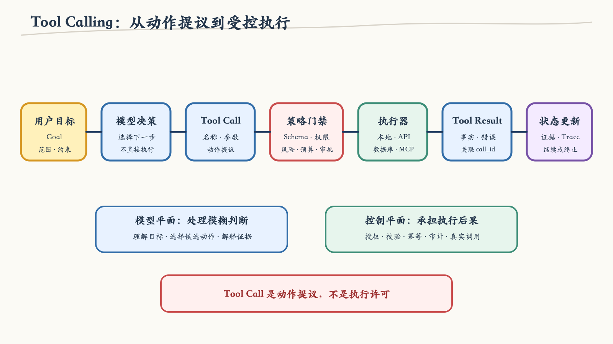
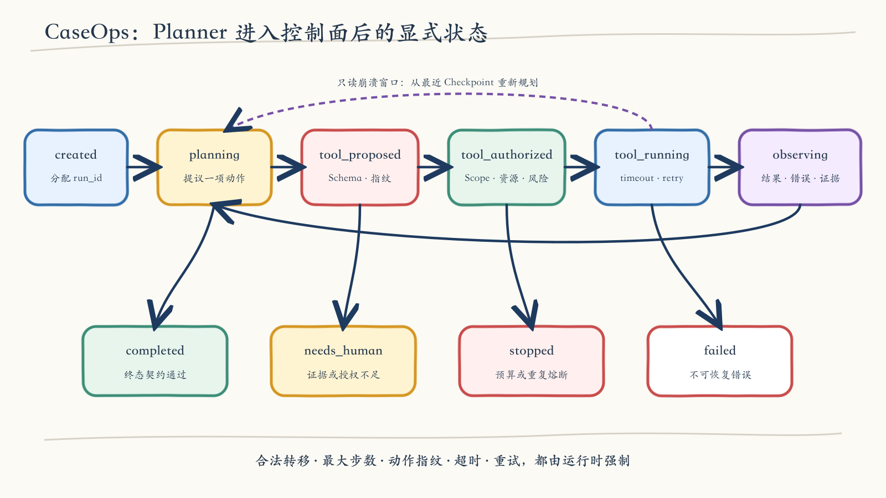
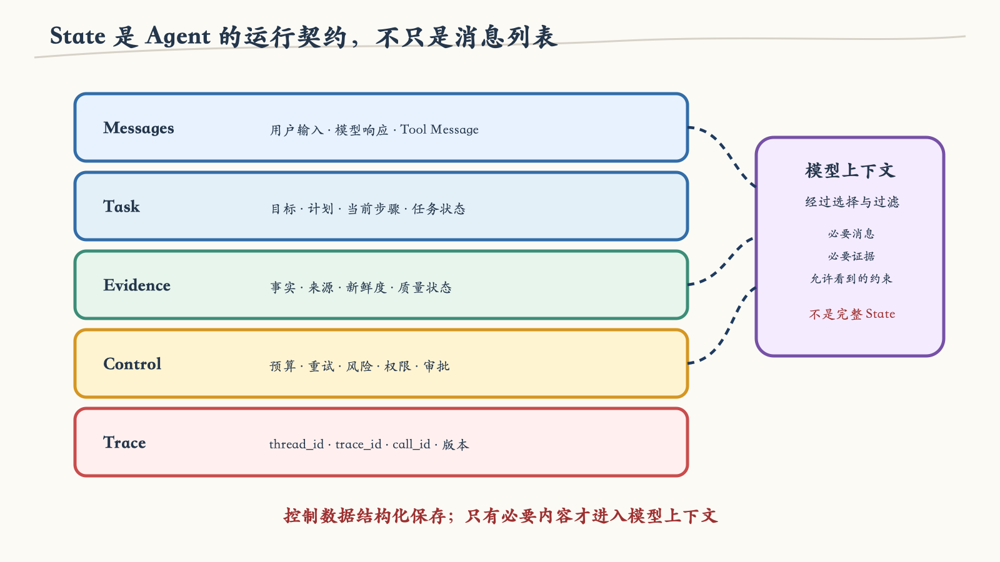
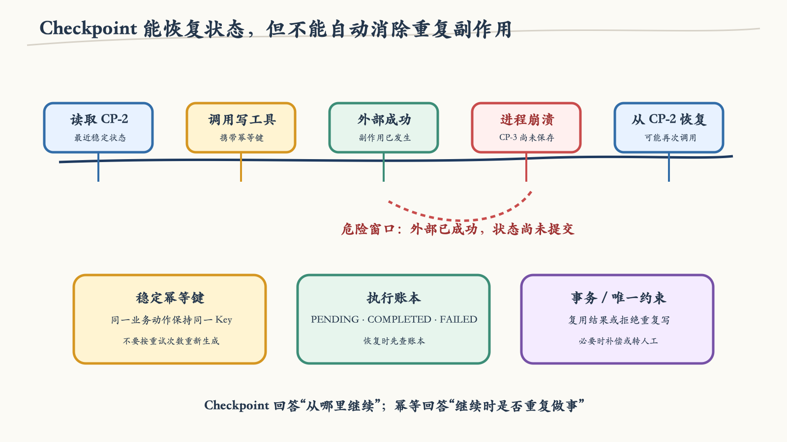
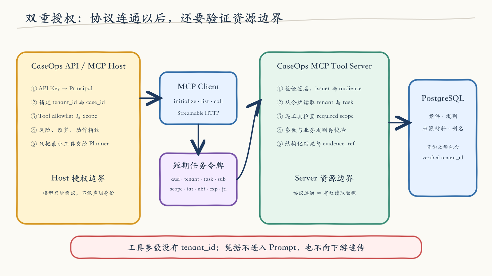
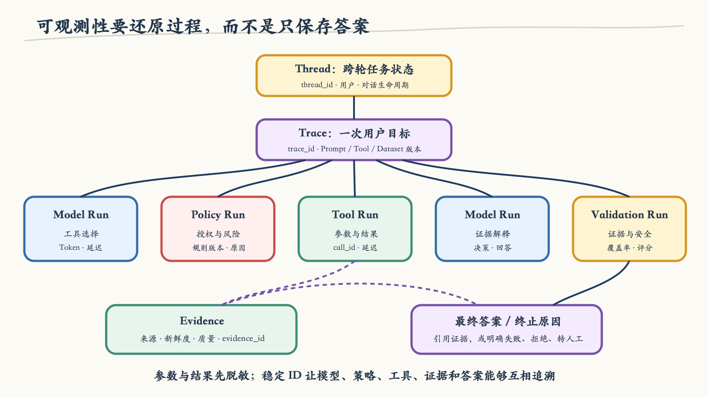

# 第 02 章：让 Agent 安全地行动

第 1 章做了一件看似保守、其实非常重要的事：我没有一开始就把 CaseOps 写成 Agent，而是先建立一个确定性调查基线。它能读取案件、锁定规则版本、比较材料代码，并生成不产生外部副作用的通知草稿。

这个基线很快遇到了真实系统常见的问题。案件 C-102 的结构化字段里只有两种材料：

```text
LOSS_STATEMENT
IDENTITY_DOCUMENT
```

按照规则，它确实缺少 `ACCIDENT_CERTIFICATE`。然而来源材料区还躺着一份“道路交通事故认定书”，只是上游没有把它归一成标准代码。

如果所有输入始终整齐，继续扩充确定性流程就够了。现在的问题却变成了：系统应该先查哪里，发现未结构化材料后是否需要补做语义归一，归一结果能不能作为证据，以及证据不足时应该继续、停止还是转人工。这正是模型可以提供价值的地方——它能根据中间观察选择下一步。

但“让模型会调用工具”离生产系统还很远。模型一旦能够行动，我们必须同时回答：

1. Tool Call 是请求，还是执行许可；
2. 参数、权限和资源边界由谁校验；
3. ReAct 循环怎样变成可检查的状态机；
4. 进程崩溃后从哪里继续；
5. 如何避免重复副作用和无限循环；
6. MCP 标准化了什么，又没有替我们解决什么；
7. 怎样证明每一步真的执行过。

这一章先把这些概念、原理和判断讲透，再进入 CaseOps Slice 1。项目的作用仍然是验证知识，而不是替代理论：正文里出现的控制边界，最终都要能在代码、数据库记录和测试中找到。

## 1. 模型没有手：Tool Call 只是动作提议

Tool Calling 经常被描述成“大模型调用函数”。这个说法便于入门，却容易让人误解责任归属。模型通常不会在推理进程里直接连接数据库，也不会凭空获得某个 Python 函数的执行能力。

应用先把可用工具的名称、说明和输入 Schema 交给模型。模型返回一段结构化输出：

```json
{
  "call_id": "call_8f34c9",
  "name": "caseops_get_case_snapshot",
  "arguments": {
    "case_id": "C-102"
  }
}
```

此时没有数据库被读取。它表达的只是：

> 根据当前目标和观察，我建议下一步调用这个工具，并使用这些参数。

真正的执行仍然发生在模型之外。应用必须解析提议，检查工具是否存在，验证参数，判断当前主体是否有权限，再由确定性执行器调用本地函数、HTTP API、数据库适配器或 MCP Server。

这条分界决定了 Agent 的安全模型：

> 模型拥有提议权，控制平面拥有授权权，执行器拥有实际能力。



*图 2-1　从目标到结果，模型只负责候选动作；控制平面负责授权、执行、记录和终止。*

### 1.1 一次完整工具调用的责任链

我通常把一轮工具调用拆成九个环节：

| 环节 | 输入 | 责任主体 | 失败时的含义 |
|---|---|---|---|
| 目标装配 | 用户请求、业务对象、约束 | 应用层 | 目标不完整，不能安全启动 |
| 能力过滤 | 身份、场景、租户、风险 | 策略层 | 工具不应对模型可见 |
| 动作提议 | 状态、观察、候选工具 | 模型 / Planner | 提议可能错误，不等于事故 |
| 协议解析 | 模型结构化输出 | Provider Adapter | 输出不符合协议 |
| 参数校验 | 名称、参数、Schema | Tool Runtime | 参数无效或越界 |
| 运行时授权 | Principal、scope、资源、状态 | Policy Engine | 当前调用不被允许 |
| 工具执行 | 已授权调用 | Executor / MCP Client | 真实依赖失败 |
| 结果归一 | 原始响应、错误 | Tool Adapter | 输出不符合契约 |
| 状态更新 | Tool Result、证据、预算 | State Machine | 决定继续、停止或转人工 |

把它们压成一个 `model.bind_tools()` 调用，代码会短很多，责任却不会消失。它们只是被框架默认值、回调和异常处理隐藏了。一旦出现越权、重试风暴或重复写入，团队仍然要把这些环节重新找出来。

### 1.2 Schema 为什么必要，却远远不够

输入 Schema 能拒绝缺失字段、未知字段、错误类型和明显越界值。例如：

```json
{
  "type": "object",
  "additionalProperties": false,
  "properties": {
    "case_id": {
      "type": "string",
      "minLength": 1,
      "maxLength": 80
    }
  },
  "required": ["case_id"]
}
```

这个 Schema 能证明 `case_id` 是一个格式正确的字符串，却不能证明：

- 当前调用者属于 C-102 所在租户；
- 运行目标本来就是调查 C-102；
- 当前状态允许读取案件；
- 这个工具仍在租户的能力白名单中；
- 调用预算还没有耗尽。

因此，参数合法性与动作授权是两种不同判断：

```text
valid(arguments) ≠ authorized(principal, resource, state, action)
```

在 CaseOps 中，即使模型提交了格式完全正确的 `{"case_id":"C-999"}`，运行时仍会因为它离开了本次 run 的资源边界而拒绝。模型不能通过“构造一个合法参数”给自己扩权。

### 1.3 `tool_call_id` 与 Action Fingerprint 各解决什么

`tool_call_id` 用来关联一次具体提议和一次具体结果。并行调用、重试和长链路中，如果没有它，后续模型很难判断哪个 Tool Result 回应哪个请求，审计系统也无法重建时间线。

但 `tool_call_id` 不适合检测循环。模型每轮都可以生成一个新 ID：

```text
call_a → read_case(C-102)
call_b → read_case(C-102)
call_c → read_case(C-102)
```

三个调用 ID 不同，动作却完全相同。循环检测需要另一个标识：

```text
fingerprint = SHA256(tool_name + canonical_json(arguments))
```

两者的职责应当分开：

| 标识 | 粒度 | 主要用途 |
|---|---|---|
| `tool_call_id` | 一次调用实例 | 请求与结果关联、审计、协议交互 |
| `action_fingerprint` | 动作语义 | 重复检测、缓存、风险统计 |
| `idempotency_key` | 一次业务意图 | 防止同一外部请求产生重复业务效果 |

把三个概念混成一个字段，往往会在恢复和重试时留下隐患。

## 2. Tool Contract：不要只写一个函数签名

一个工具真正暴露的不是函数，而是一项受约束能力。函数签名只是输入形状，生产契约还要说明身份、资源、风险、时间和效果。

我会要求每个工具回答九个问题：

1. **它做什么**：单一、明确、可判断是否成功的业务语义；
2. **谁可以调用**：角色、scope、租户和委托关系；
3. **何时可以调用**：允许的任务阶段和前置状态；
4. **输入从哪里来**：模型可填字段与系统注入字段怎样分开；
5. **输出怎样验证**：结构、版本、证据引用和新鲜度；
6. **风险等级是什么**：只读、可逆写、不可逆写；
7. **能否安全重试**：幂等键、最大次数、退避与超时；
8. **外部效果怎样确认**：成功、失败和未知结果如何区分；
9. **必须记录什么**：主体、参数摘要、结果、延迟、版本和关联 ID。

可以把最小契约写成类似下面的结构：

```yaml
name: caseops_resolve_document_alias
version: "1.0"
required_scope: document:resolve
risk: read_only
timeout_seconds: 5
max_attempts: 2
input:
  case_id: run-bound-resource
  document_id: model-proposed
output:
  resolved: boolean
  canonical_code: optional string
  rule_version: optional string
  evidence_ref: string
```

这里最关键的一处是 `case_id: run-bound-resource`。它意味着模型可以提议使用哪个工具，却不能把工具带离本次任务对象。运行时会将提议参数与 run 中已经授权的案件 ID 比较。

### 2.1 输入字段要区分“模型填写”和“系统注入”

不应该让模型填写的典型字段包括：

- `tenant_id`；
- 调用主体和组织身份；
- OAuth access token、API Key；
- 审批状态；
- 当前任务预算；
- 服务端幂等键；
- 审计时间戳。

这些字段必须来自可信运行环境。把它们放进工具 Schema，相当于让模型参与声明自己的身份和权限。

CaseOps 的四个 MCP 工具都没有 `tenant_id` 参数。租户、任务 ID、调用主体和 scope 来自 API 内部签发的短期任务令牌；MCP Server 验证令牌后再构造数据库查询边界。

### 2.2 输出应面向证据，不只面向语言

下面这类返回很难用于可靠推理：

```json
{
  "message": "看起来材料已经齐了"
}
```

它缺少规则版本、来源和可验证字段。更好的返回会把事实与证据分开：

```json
{
  "case_id": "C-102",
  "document_id": "DOC-C102-003",
  "resolved": true,
  "canonical_code": "ACCIDENT_CERTIFICATE",
  "rule_version": "2026.1",
  "confidence": 1.0,
  "evidence_ref": "evidence://C-102/DOC-C102-003@1"
}
```

模型仍然可以根据这些字段生成自然语言解释，但结论的基础已经能被程序、审计员和评测系统复核。

### 2.3 工具越多，不代表 Agent 越强

把整个企业工具目录一次性交给模型，会同时带来三个问题：

- 选择空间变大，模型更容易选错或混淆相近工具；
- 高风险工具在不需要时也进入攻击面；
- 工具说明和 Schema 挤占上下文预算。

更合理的做法是先由确定性策略按租户、角色、任务阶段、风险和审批状态过滤，再把当前最小能力集交给模型。

可以把有效动作空间写成一个交集：

```text
effective_tools
  = tenant_catalog
  ∩ principal_scopes
  ∩ task_stage_policy
  ∩ risk_policy
  ∩ runtime_health
```

模型看到的是结果，不参与计算这个交集。

## 3. ReAct 的工程本质是受控状态转换

ReAct 常被概括为“思考—行动—观察”。对工程系统来说，最重要的不是让模型输出一大段思考，而是建立一个闭环：

```text
读取状态
  → 提议下一动作
  → 校验与授权
  → 执行动作
  → 记录观察
  → 更新状态
  → 判断继续或终止
```

我不建议把自由文本 Chain of Thought 当作系统状态。生产系统真正需要保存的是动作提议、原因码、证据引用、授权结果和终止原因。内部推理过程既不是可靠业务事实，也可能包含不应进入日志的敏感内容。



*图 2-2　ReAct 不是一个无限 while 循环，而是一组合法状态、转移条件和终态。*

### 3.1 一轮 Planner 只允许三类输出

CaseOps 把 Planner 输出收敛成三种：

| 类型 | 含义 | 运行时动作 |
|---|---|---|
| `tool_call` | 提议一个下一动作 | 进入校验、授权和执行 |
| `final` | 证据已足够，给出结构化结论 | 验证终态 Schema 后完成 |
| `needs_human` | 无法安全继续 | 保存原因并转人工 |

通用系统还可以加入 `clarification_required` 或 `waiting_approval`，但不要让“任何自然语言”都被解释成合法控制信号。

模型适配器与运行时之间应有稳定协议：

```python
class Planner(Protocol):
    async def decide(
        self,
        state: AgentState,
        tools: tuple[ToolDefinition, ...],
    ) -> PlannerDecision:
        ...
```

这个接口带来一个很实用的好处：测试控制面时不必依赖外部模型。CaseOps 使用确定性的 `ConformancePlanner` 驱动同一状态机，验证授权、MCP、检查点和终止逻辑；真实模型则通过 Responses API 适配器接入。

我要特别强调：`ConformancePlanner` 是协议一致性驱动器，不是 Agent，也不代表模型效果。把固定脚本包装成“离线 Agent”会混淆系统正确性与模型能力。

### 3.2 状态转移要由程序约束

CaseOps Slice 1 的主路径是：

```text
created
  → planning
  → tool_proposed
  → tool_authorized
  → tool_running
  → observing
  → planning
  → completed
```

旁路终态包括：

```text
needs_human | stopped | failed
```

程序维护合法转移表。例如 `created → completed` 是非法的，因为系统还没有经过规划和证据形成；`tool_proposed → tool_running` 也是非法的，因为它绕过了授权状态。

这看起来比一个 `while True` 啰嗦，却能回答事故现场最重要的问题：

- 模型提议了什么；
- 参数是否通过；
- 谁授权了执行；
- 工具是否真的开始；
- 返回的是事实、业务错误还是协议错误；
- 系统为什么停止。

### 3.3 停止条件必须是硬约束

“没有新的 Tool Call 就停止”不够。模型可能不断读取同一个案件，也可能在错误后反复改写参数。运行时至少应强制：

- 最大工具步数；
- 最大墙钟时间；
- 单工具超时；
- 总 Token 或费用预算；
- 同一动作指纹的重复上限；
- 连续没有新增证据的上限；
- 权限拒绝、安全阻断和审批等待；
- 不可重试错误；
- 已满足成功标准。

CaseOps Slice 1 把 `max_steps`、`repeat_limit`、工具 timeout 和 `max_attempts` 放进结构化控制状态。即使模型仍想继续，达到边界后也只能进入终态。

## 4. State 是运行契约，不是聊天记录

把消息列表叫作 State，在简单聊天中没有问题；在行动系统中远远不够。一次 Agent run 至少要同时表达任务、证据、控制和关联信息。



*图 2-3　消息只是模型上下文的一部分；任务、证据、控制和追踪信息必须独立结构化。*

可以把状态拆成五层：

| 状态层 | 典型字段 | 谁负责使用 |
|---|---|---|
| Task | `goal`、`case_id`、`status`、`step_count` | 状态机、产品界面 |
| Proposal | `pending_call`、参数、动作指纹 | 授权器、执行器 |
| Evidence | Tool Observation、来源、规则版本 | Planner、验证器 |
| Control | budget、repeat count、stop reason | 运行时、策略层 |
| Trace | `run_id`、sequence、`tool_call_id` | 审计、恢复、运维 |

完整状态可以持久化，但进入模型的内容应经过 Context Builder 过滤。身份凭据、内部授权细节和无关历史不应因为“都在 State 里”就自动进入 Prompt。

### 4.1 State、Memory、Knowledge 与 Audit 不要混用

| 类型 | 生命周期 | 例子 | 合适载体 |
|---|---|---|---|
| Run State | 一次执行 | 当前步骤、观察、预算 | Checkpoint |
| Long-term Memory | 跨任务 | 经用户确认的偏好 | Memory Store |
| Domain Knowledge | 跨用户共享 | 理赔规则、材料别名 | 业务数据库、知识系统 |
| Audit / Trace | 合规与运维周期 | 身份、动作、授权、版本 | 审计库、Trace Backend |

Checkpoint 解决的是同一次 run 怎样继续，不等于长期记忆。规则数据库也不是模型记忆，它有独立版本、所有者和发布流程。把所有内容都塞进向量库，会让状态、知识和审计失去各自的治理语义。

### 4.2 增量更新与字段所有权

节点通常可以读取完整 State，却不应该随意重写所有字段。每个组件只更新自己负责的部分：

```python
state.observations.append(observation)
state.pending_call = None
state.step_count += 1
```

在并行图中，还要明确 Reducer 或合并规则。两个节点同时写 `status`、`evidence` 或 `budget` 时，如果没有字段所有权，最后写入者会悄悄覆盖前一个结果。这个问题到多 Agent 章节会更加明显。

## 5. Checkpoint、幂等与 Effect Ledger 是三件事

Checkpoint 保存“系统认为自己执行到哪里”；幂等保证“同一业务意图重复到达时不会产生第二份业务效果”；Effect Ledger 记录“外部动作到底发生了什么”。三者互相配合，不能互相替代。



*图 2-4　工具已经成功而新检查点尚未提交时崩溃，恢复后可能再次执行。*

最危险的窗口是：

```text
1. 保存 CP-2：准备执行工具
2. 外部写工具执行成功
3. 进程崩溃
4. CP-3：成功观察尚未保存
5. 系统从 CP-2 恢复
6. 同一工具再次执行
```

只增加 Checkpoint 反而让重复执行更容易复现，因为系统会忠实地回到“尚未记录成功”的位置。

### 5.1 不同风险工具需要不同恢复语义

| 工具风险 | 崩溃后默认策略 | 需要的额外控制 |
|---|---|---|
| 只读、幂等 | 可以重新读取 | timeout、有限重试、结果版本 |
| 可逆写 | 先查询效果，再决定重试 | 业务幂等键、状态查询、补偿 |
| 不可逆写 | 默认停下或审批 | Effect Ledger、审批、回执、人工处置 |
| 结果未知 | 不盲目重试 | 对账接口、外部请求 ID、Runbook |

CaseOps Slice 1 故意只开放只读工具。如果进程停在 `tool_running`，恢复逻辑会丢弃未完成提议，从最近持久化观察重新规划；重复读取是安全的。将来加入写工具时，这条恢复策略不会自动沿用。

### 5.2 不承诺虚假的 Exactly Once

跨网络、数据库和第三方系统时，很难通过一个本地事务获得真正的全局 Exactly Once。更可靠的工程表述是：

```text
at-least-once delivery
+ business idempotency
+ effect confirmation
+ reconciliation
```

如果团队无法说明外部系统如何识别同一业务意图、如何查询已发生效果，就不应把自动重试打开。

## 6. MCP 标准化连接，不替代业务边界

MCP 解决的是应用与外部上下文能力之间的协议问题：怎样初始化连接、协商能力、列出工具、传递结构化参数和返回结果。它很有价值，因为 host 不必为每个工具服务器发明一套私有协议。

截至本章写作时，MCP 当前规范版本是 `2025-11-25`。工具输入与输出 Schema 默认采用 JSON Schema 2020-12；标准也明确区分协议错误与工具执行错误，并强调工具注解只是提示，不能被当作可信授权信息。



*图 2-5　协议边界负责连接与互操作，业务边界仍负责身份、授权、租户和风险。*

### 6.1 Host、Client 与 Server

- **Host**：面向用户的 Agent 应用，拥有任务状态和最终决策；
- **Client**：Host 内的协议组件，维护与某个 Server 的连接；
- **Server**：暴露 Tools、Resources 或 Prompts 的能力提供方。

MCP Server 不是一个新 Agent。它可以只是把一组受治理的企业能力以标准协议暴露出来。模型也不应直接持有 Server 凭据；凭据属于 Host 或受控 Client。

### 6.2 Tools、Resources 与 Prompts 的控制方式

规范对三类原语给出了不同的控制倾向：

| 原语 | 主要用途 | 默认控制者 |
|---|---|---|
| Tools | 执行计算或操作 | 模型选择，客户端授权 |
| Resources | 提供文件、数据和上下文 | 应用选择 |
| Prompts | 提供可复用交互模板 | 用户选择 |

“Tools 是 model-controlled”不等于模型可以越过客户端直接执行。它只表示模型通常负责选择候选工具；Server 仍要验证输入、访问权限和速率，Client 仍要做确认、超时、结果校验和审计。

### 6.3 初始化与能力协商

MCP 连接不是“HTTP 通了就能用”。客户端先发送 `initialize`，双方协商：

- 协议版本；
- Client 与 Server 信息；
- 能力集合；
- 可选扩展。

客户端随后发送 initialized 通知，才能进入正常调用阶段。生产系统应把版本不兼容和 capability 缺失视为启动或就绪失败，而不是等到模型调用后再报错。

### 6.4 stdio 与 Streamable HTTP 怎样选择

MCP 当前标准传输包括 stdio 和 Streamable HTTP：

| 传输 | 适合场景 | 主要注意点 |
|---|---|---|
| stdio | Host 启动的本地进程、桌面扩展 | 进程生命周期、环境变量凭据、资源隔离 |
| Streamable HTTP | 独立服务、跨进程和平台化部署 | TLS、认证、会话、DNS Rebinding、防滥用 |

CaseOps 使用 Streamable HTTP，把 MCP Tool Server 作为独立只读服务部署。服务启用无状态 HTTP 与结构化 JSON 返回，便于后续水平扩展；同时保留 Host 侧任务状态，不把 Agent State 放进 MCP Server。

### 6.5 MCP 授权的正确理解

远程 MCP 的授权规范建立在 OAuth 2.1 等标准之上，并要求资源服务器元数据、resource indicator 和 token audience 绑定。一个关键安全原则是：

> MCP Server 只能接受明确签发给自己的 token，不能把收到的 token 原样转发给下游服务。

否则一个被攻陷的 Server 可能拿着高权限 token 横向访问其他资源。

CaseOps Slice 1 的本地环境使用短期 HMAC 任务令牌，绑定 `issuer`、`audience`、`tenant_id`、`task_id`、`subject`、`scopes`、`iat`、`nbf`、`exp` 和 `jti`。这能验证资源与任务边界，但它只是开发环境中的 STS 替身，不是完整 OAuth 2.1 授权服务器。企业 OIDC、密钥轮换、撤销和策略管理会在第 6 章继续完善。

### 6.6 本地端口、业务 API 与 MCP 的取舍

不要因为 MCP 流行就把所有内部函数远程化。

| 选择 | 适合条件 | 不适合条件 |
|---|---|---|
| 本地函数/端口 | 同进程、强类型、低延迟、单一团队 | 多语言、多 Host、独立发布 |
| 业务 HTTP/gRPC API | 稳定服务边界、非 Agent 消费者很多 | 每个 Host 都要重复工具适配 |
| MCP | 多 Host 工具互操作、动态发现、统一协议 | 极低延迟内核、简单固定流程 |

MCP 是协议选择，不是架构成熟度徽章。

## 7. 错误分类决定是否重试

“工具报错就重试三次”是制造重试风暴的快捷方式。运行时应先识别错误类别：

| 类别 | 示例 | 默认策略 |
|---|---|---|
| Contract | 字段缺失、类型错误、未知工具 | 不重试；修正提议或终止 |
| Authorization | scope 不足、跨租户、审批缺失 | 不重试；拒绝或转人工 |
| Business | 案件不存在、状态不允许、规则缺失 | 通常不重试；补充证据 |
| Transient | 连接超时、限流、临时 5xx | 只对安全工具有限重试 |
| Protocol | MCP 版本、会话、消息格式错误 | 重新初始化或隔离 Server |
| Unknown Effect | 写入超时但外部可能已成功 | 先对账，禁止盲重试 |

MCP 工具执行失败通常应以正常 Tool Result 的 `isError` 表达，让模型有机会调整；无法解析的 JSON-RPC、未知方法或连接级问题才属于协议错误。这个区分能避免把业务失败误判为 Server 崩溃。

### 7.1 重试预算应属于工具契约

不同工具的可重试性不同。一个只读查询可以在超时后重试，发送通知或提交赔付则不能沿用同一策略。

至少要同时限制：

- 单次 timeout；
- 最大 attempts；
- 指数退避与 jitter；
- 单 run 总调用数；
- 同一动作指纹次数；
- 全局并发和下游速率。

CaseOps 当前每个只读工具最大两次尝试，运行时还有更低优先级的总超时上限。测试会注入一次临时错误，确认第二次成功后停止；也会让 Planner 不断提议同一动作，确认执行器只调用一次，第二次在动作指纹门禁处熔断。

## 8. 可观测性：记录答案还原不了执行

一个最终答案无法解释中间到底发生了什么。生产排障至少需要回答：

- 哪个用户请求启动了哪个 run；
- Planner 在第几步提议了什么；
- 哪条策略允许或拒绝；
- MCP 调用了哪个工具版本；
- 结果来自哪个证据和规则版本；
- 重试、恢复和停止发生在哪里；
- 最终答案使用了哪些观察。



*图 2-6　请求、运行、工具调用、检查点和证据应当能够相互关联。*

### 8.1 Trace 与 Audit 关注点不同

Trace 服务于性能和故障诊断，通常记录 span、延迟、依赖和错误；Audit 服务于责任追溯，强调主体、动作、资源、授权结果和不可抵赖性。

两者可以共享 ID，却不应互相替代。把完整 Prompt 和工具结果无条件写进 Trace，既可能泄露敏感数据，也不满足审计记录的不可变和保留要求。

### 8.2 最小关联模型

CaseOps 使用下面的关联关系：

```text
request_id
  └─ run_id
      ├─ checkpoint.sequence
      ├─ tool_call_id
      │   └─ action_fingerprint
      ├─ evidence_ref
      ├─ audit_event
      └─ outbox_event
```

其中 `run_id` 是一次 Agent 执行的主轴，`tool_call_id` 标识调用实例，`evidence_ref` 连接业务来源。

### 8.3 第二章就该具备的测试

不要等到“可观测性章节”才测试运行时。Slice 1 已覆盖：

- 合法与非法状态转移；
- 参数 Schema 与未知字段；
- 工具 allowlist、scope 与案件边界；
- 跨租户统一返回 Not Found；
- 重复动作指纹熔断；
- 临时错误的有限重试；
- step budget 停止；
- MCP 初始化、工具列表与结构化结果；
- 无 Bearer token 返回 401；
- token 篡改与错误 audience；
- 只读 `tool_running` 崩溃窗口恢复；
- Agent run 幂等重放；
- Responses API 工具提议与终态契约；
- PostgreSQL 迁移、容器与端到端调用。

这些测试分别证明控制面、协议面和适配器，不把所有失败都归因于“模型不稳定”。

## 9. 把完整知识框架放进 CaseOps Slice 1

前面的概念现在可以落到一条真实执行链上。

### 9.1 为什么这次值得从工作流升级

第 1 章的确定性基线并没有做错。它只读取受信任的结构化字段，结论是：

```json
{
  "decision": "MISSING_REQUIRED_DOCUMENTS",
  "missing": ["ACCIDENT_CERTIFICATE"]
}
```

Slice 1 新增的事实是：上游来源材料可能存在，但尚未归一。完整处理路径取决于中间观察：

```text
案件字段是否已经齐备？
  ├─ 是 → 可以结束
  └─ 否 → 是否存在未结构化来源材料？
           ├─ 否 → 给出缺件结论
           └─ 是 → 是否存在受治理的别名规则？
                    ├─ 是 → 合并归一结果后重新判断
                    └─ 否 → 证据不足或转人工
```

路径无法完全由最初输入决定，模型在“下一步查什么”上开始有合理价值；而案件、规则和别名仍由确定性系统提供。

### 9.2 代码结构

完整实现位于独立的 [CaseOps 仓库](https://github.com/dataPro-lgtm/production-grade-multi-agent-caseops)。本章固定使用不可变版本：

```text
tag:     chapter-02-slice-1
version: v0.2.0
commit:  ec35916
```

核心代码分工如下：

| 文件 | 责任 |
|---|---|
| [`contracts.py`](https://github.com/dataPro-lgtm/production-grade-multi-agent-caseops/blob/chapter-02-slice-1/src/caseops/agent/contracts.py) | Run、Tool、Observation 与终态契约 |
| [`state_machine.py`](https://github.com/dataPro-lgtm/production-grade-multi-agent-caseops/blob/chapter-02-slice-1/src/caseops/agent/state_machine.py) | 合法状态转移 |
| [`policy.py`](https://github.com/dataPro-lgtm/production-grade-multi-agent-caseops/blob/chapter-02-slice-1/src/caseops/agent/policy.py) | allowlist、scope、风险与案件边界 |
| [`runtime.py`](https://github.com/dataPro-lgtm/production-grade-multi-agent-caseops/blob/chapter-02-slice-1/src/caseops/agent/runtime.py) | 预算、指纹、重试、执行和恢复 |
| [`planner.py`](https://github.com/dataPro-lgtm/production-grade-multi-agent-caseops/blob/chapter-02-slice-1/src/caseops/agent/planner.py) | Conformance 与 OpenAI Responses 适配器 |
| [`mcp_server.py`](https://github.com/dataPro-lgtm/production-grade-multi-agent-caseops/blob/chapter-02-slice-1/src/caseops/agent/mcp_server.py) | Streamable HTTP MCP 工具服务 |
| [`mcp_auth.py`](https://github.com/dataPro-lgtm/production-grade-multi-agent-caseops/blob/chapter-02-slice-1/src/caseops/agent/mcp_auth.py) | 短期任务令牌签发与校验 |
| [`service.py`](https://github.com/dataPro-lgtm/production-grade-multi-agent-caseops/blob/chapter-02-slice-1/src/caseops/agent/service.py) | Run 幂等、持久化、审计与 Outbox |

代码没有使用框架提供的一键 Agent 工厂。这不是否定框架，而是本章需要把状态、授权和恢复语义显式展示。后续如果换成图框架，也必须保留这些契约。

### 9.3 四个工具，四种单一责任

| 次序 | 工具 | 返回的关键事实 |
|---|---|---|
| 1 | `caseops_get_case_snapshot` | 结构化材料与绑定规则版本 |
| 2 | `caseops_get_policy_requirements` | 精确规则版本的必需材料 |
| 3 | `caseops_list_unclassified_documents` | 未归一来源材料 |
| 4 | `caseops_resolve_document_alias` | 规范代码、规则版本、证据引用 |

四个工具都标记为只读、幂等和封闭世界，但运行时不会仅凭注解授权。真实授权仍根据可信 Principal 和任务资源执行。

### 9.4 一次实际运行发生了什么

端到端验收得到的工具账本是：

```text
caseops_get_case_snapshot           succeeded  attempt=1
caseops_get_policy_requirements     succeeded  attempt=1
caseops_list_unclassified_documents succeeded  attempt=1
caseops_resolve_document_alias      succeeded  attempt=1
```

最终结果：

```json
{
  "status": "completed",
  "step_count": 4,
  "result": {
    "outcome": "DOCUMENTS_COMPLETE_AFTER_NORMALIZATION",
    "received_document_codes": [
      "IDENTITY_DOCUMENT",
      "LOSS_STATEMENT"
    ],
    "resolved_document_codes": [
      "ACCIDENT_CERTIFICATE"
    ],
    "missing_document_codes": [],
    "evidence_refs": [
      "case://C-102@7",
      "evidence://C-102/DOC-C102-003@1",
      "policy://motor-claim-standard@2026.1"
    ]
  }
}
```

这次运行写入 4 条工具执行记录和 23 个状态检查点。使用相同幂等键重放时，API 返回同一个 `run_id`，没有再次执行工具。

### 9.5 亲自运行

```bash
git clone https://github.com/dataPro-lgtm/production-grade-multi-agent-caseops.git
cd production-grade-multi-agent-caseops
git checkout chapter-02-slice-1

docker compose up --build -d
docker compose ps
make acceptance
```

验收脚本会执行一次新 run，再用同一幂等键重放。更完整的 MCP 401 验证、工具账本查询和故障说明见 [第 2 章运行手册](https://github.com/dataPro-lgtm/production-grade-multi-agent-caseops/blob/chapter-02-slice-1/docs/chapter-02-runbook.md)。

### 9.6 真实模型模式与证据边界

默认 Docker 配置使用 `conformance + mcp`：

- 真实通过 MCP Streamable HTTP；
- 真实签发与验证任务令牌；
- 真实读取 PostgreSQL；
- 不调用外部模型。

设置 `CASEOPS_AGENT_PLANNER=openai` 和 `CASEOPS_OPENAI_API_KEY` 后，Planner 会切换到 Responses API，默认模型可通过环境变量配置。适配器会关闭并行工具调用，一轮只接收一个提议，并要求结构化终态。

本章交付时的本地环境没有 OpenAI API Key，因此我只声明 Responses API 适配器通过 MockTransport 契约测试，不声明真实模型在线调用已经验收。生产级写作必须把“代码存在”“契约测试通过”和“外部系统实测通过”分开。

## 10. 如何选择实现抽象

理解控制面之后，框架选择会简单很多。

### 10.1 预置 Agent

适合工具少、风险低、状态简单的场景。它能快速提供模型—工具循环，但团队仍要确认：

- 工具执行前能否插入授权；
- 状态能否持久化；
- retry 和 timeout 是否按工具配置；
- 是否能取得完整 tool ledger；
- 是否支持人工审批和安全停止。

### 10.2 图式编排

适合显式分支、人工暂停、并行和恢复。图框架可以减少状态机样板代码，但它不会自动定义字段所有权、幂等和业务授权。

### 10.3 自定义受控执行器

适合强监管、复杂事务或严格审计的系统。代价是代码更多，收益是状态、授权、错误和恢复语义完全可见。

CaseOps Slice 1 选择这一层，因为本章要证明控制边界。将来即使改用 LangGraph 或其他运行时，[ADR-0002](https://github.com/dataPro-lgtm/production-grade-multi-agent-caseops/blob/chapter-02-slice-1/docs/adr/0002-control-plane-before-model-autonomy.md) 中的约束仍然有效。

## 11. 从本章迁移到你的系统

离开 CaseOps，可以按下面顺序建设第一个可控 Agent：

1. 列出模型能够提议的最小动作集；
2. 为每个工具补齐输入、输出、身份、风险、超时和重试契约；
3. 把租户、身份、凭据和审批从模型参数中移出；
4. 定义显式状态和合法转移；
5. 设置 step、时间、费用和重复动作预算；
6. 区分协议、权限、业务、临时和未知效果错误；
7. 为每次状态迁移保存 Checkpoint；
8. 为写工具设计业务幂等和 Effect Ledger；
9. 用确定性驱动器验证控制面，再单独评测模型；
10. 通过故障注入证明系统会停、会恢复、不会越权。

如果这十步中有任何一步只能用“Prompt 里写了”解释，它就还不是可靠的生产控制。

## 12. 本章结论

工具调用真正改变的不是模型能力，而是系统风险：模型输出开始可能引发真实读取、写入和外部效果。

这一章最重要的结论有六条：

1. Tool Call 是动作提议，不是执行许可；
2. Schema 证明参数形状，策略引擎决定是否授权；
3. ReAct 的工程形态是有合法转移和硬终止条件的状态机；
4. Checkpoint、幂等和 Effect Ledger 解决不同问题；
5. MCP 统一协议，但不替代租户、授权和业务风险控制；
6. 控制面与模型能力必须分别测试、分别声明证据。

CaseOps Slice 1 仍然只有一个 Investigation Agent。下一章会引入多个 Agent。到那时，状态所有权、委托权限、部分成功和结果合并会成为新的核心问题。我们不会因为“角色更多”就拆 Agent，而会沿用同一原则：先定义责任和控制，再讨论协作模式。

## 延伸阅读

- [MCP Specification 2025-11-25：Server / Tools](https://modelcontextprotocol.io/specification/2025-11-25/server/tools)
- [MCP Specification 2025-11-25：Transports](https://modelcontextprotocol.io/specification/2025-11-25/basic/transports)
- [MCP Specification 2025-11-25：Authorization](https://modelcontextprotocol.io/specification/2025-11-25/basic/authorization)
- [MCP Python SDK](https://github.com/modelcontextprotocol/python-sdk)
- [OpenAI：Using tools](https://developers.openai.com/api/docs/guides/tools)
- [OpenAI Responses API](https://developers.openai.com/api/reference/resources/responses/methods/create)
- [CaseOps `chapter-02-slice-1`](https://github.com/dataPro-lgtm/production-grade-multi-agent-caseops/tree/chapter-02-slice-1)
