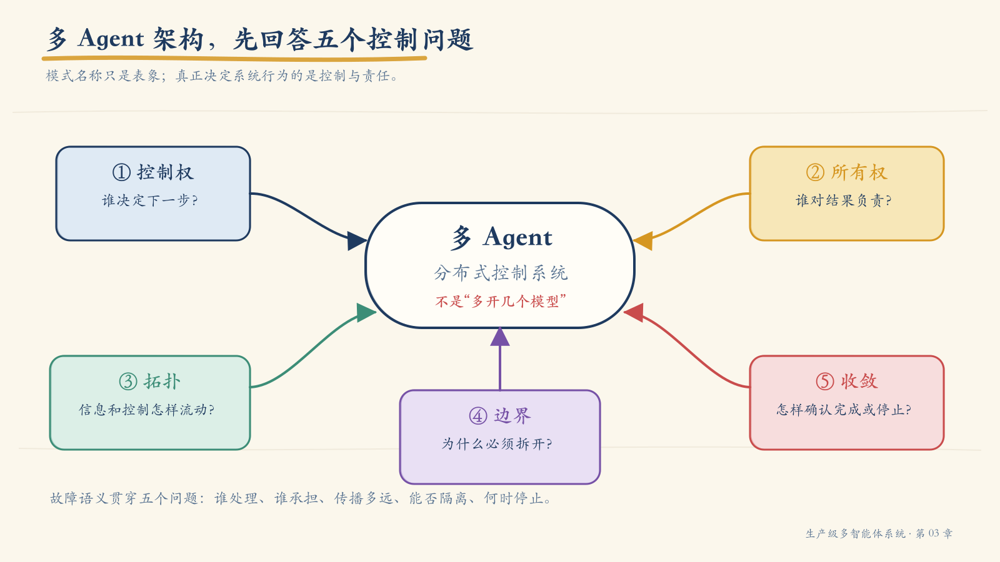
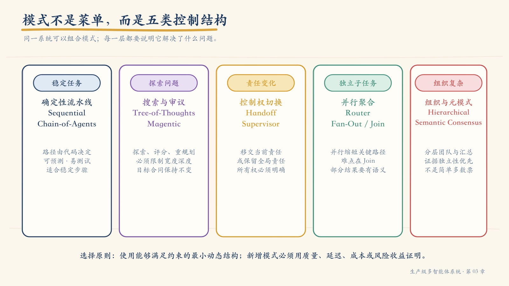
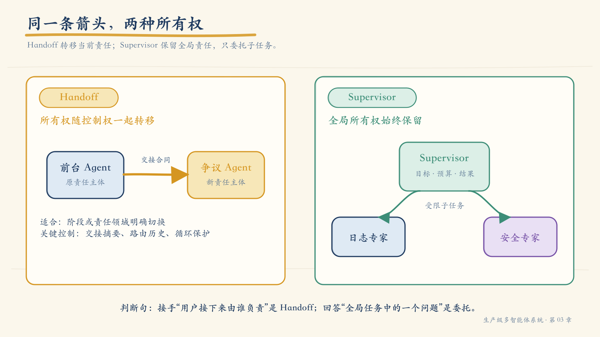
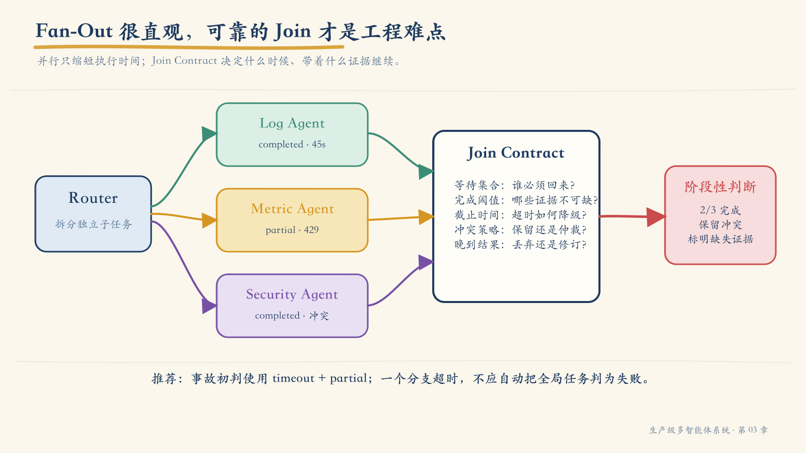
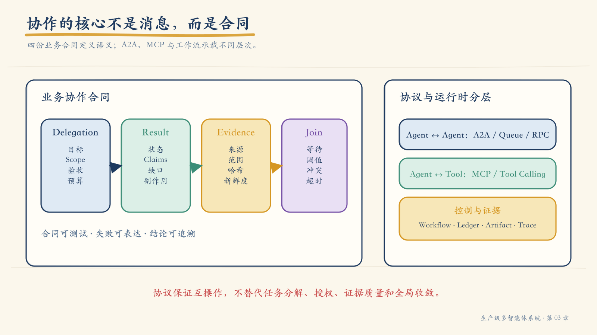
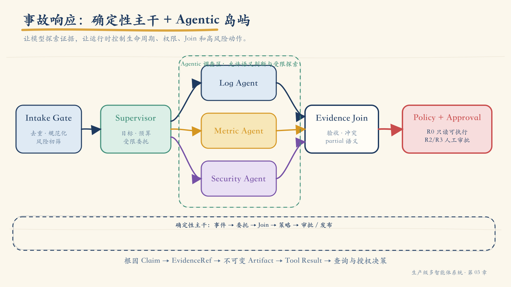
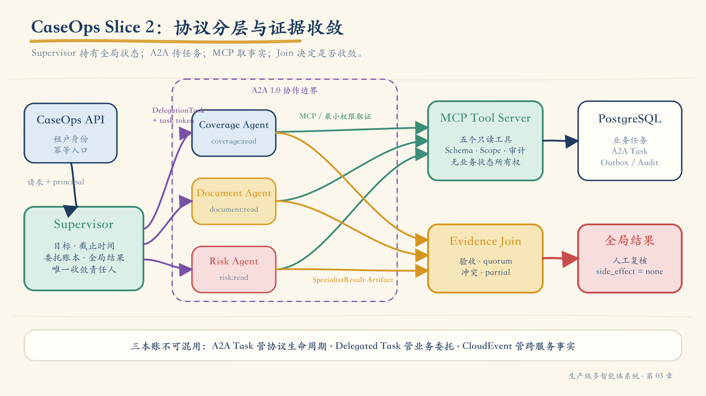

# 第 03 章：让多个 Agent 可靠协作——架构模式、协作合同与事件响应

凌晨 2 点 02 分，支付成功率突然从 99.6% 跌到 93.1%。告警平台在一分钟内同时抛出三类异常：

- 应用日志里出现大量 `payment_confirm timeout`；
- 支付网关的 P95 延迟从 420 ms 上升到 3.8 s；
- 某个刚刚上线的风控规则命中率明显偏离基线。

值班工程师需要在八分钟内给出第一版判断：故障影响多大，最可能的原因是什么，证据是否足够，下一步应该继续调查、限制流量还是申请回滚。

这项任务看起来天然适合多个 Agent：日志 Agent 查错误，指标 Agent 看趋势，安全 Agent 检查规则变更，最后由一个 Supervisor 汇总。于是团队很容易画出四个圆圈、几条箭头，再让模型彼此发送消息。

真正的困难从这里才开始。

如果日志 Agent 超时，整个任务是否失败？三个 Agent 得出互相矛盾的结论时，谁有权裁决？Supervisor 把任务委托出去以后，能否顺便扩大被委托者的生产权限？某个 Agent 说“风控规则是根因”，我们能否一路追溯到原始查询和不可变证据？如果 Supervisor 反复委托却没有获得新证据，系统什么时候必须停止？

这些问题说明，多 Agent 架构的本质不是“多开几个模型”，而是重新设计一个分布式控制系统：

> **多 Agent 架构首先是控制权、责任、状态和故障边界的设计，其次才是角色数量和消息格式的设计。**

本章先沿着这起支付事故建立方法：不同协作模式究竟解决什么问题，怎样用合同约束委托和结果，怎样划分状态所有权，以及 A2A、MCP 与工作流引擎分别位于哪一层。随后，我会回到全书的 CaseOps 项目，把这些判断落成可以运行、测试和回放的 Slice 2。理论负责解释为什么这样设计，项目负责证明这些设计不是停留在白板上的口号。

!!! note "稳定原理与当前协议"
    控制权、责任、状态所有权、证据、幂等和收敛属于相对稳定的工程原理。A2A、MCP、LangChain 与 LangGraph 的对象和接口仍会演进。本文写作时参考 A2A 1.0、MCP 当前稳定规范与 LangChain/LangGraph 1.x 文档；生产实现应固定版本，并通过契约测试验证升级。

## 1. 先别数 Agent：先回答五个控制问题

“这里有几个 Agent”不是最有价值的架构问题。两个 Agent 可能只是同一个循环里的两个 Prompt；一个 Agent 也可能拥有多个隔离的工具域和复杂状态。判断系统是否真正形成多 Agent 架构，应先问五个问题。



*图 3-1　模式名称只是表象；控制权、所有权、拓扑、边界和收敛方式才决定系统行为。*

### 1.1 谁决定下一步：控制权

控制权回答“谁有权选择下一条执行路径”。

在固定流水线中，代码决定 `A → B → C`。在 Supervisor 模式中，Supervisor 可以根据当前证据选择下一位专家。在 Handoff 模式中，当前 Agent 将对话和任务控制交给接收者。在动态规划模式中，Planner 甚至可以生成新的子任务图。

控制越动态，系统越需要：

- 明确允许生成哪些任务；
- 限制最大深度、宽度、轮数、时间和费用；
- 记录为什么选择这条路径；
- 在没有进展时强制停止；
- 为高风险动作设置确定性门禁。

模型能够提出下一步，不代表它拥有最终控制权。生产系统仍需由运行时约束合法状态和合法边。

### 1.2 谁对结果负责：所有权

所有权不是“谁执行了最多工作”，而是“谁对任务最终状态、输出质量和失败处置负责”。

Handoff 通常转移当前任务或对话的主要所有权。Supervisor 则保留全局所有权，只把有边界的子任务委托给专家。这一区别会直接影响：

- 谁向用户解释结果；
- 谁保存全局任务状态；
- 谁处理专家失败或冲突；
- 谁可以再次委托；
- 谁决定任务已经完成。

如果架构图上有 Supervisor，但专家可以绕过它直接改变全局任务状态，那么名义上的监督关系并没有成为真正的所有权边界。

### 1.3 Agent 怎样连接：拓扑

拓扑描述信息和控制怎样流动。常见形态包括链、树、星形、分层网络和共享黑板。

拓扑不是视觉偏好。它决定：

- 关键路径有多长；
- 哪个节点会成为吞吐瓶颈；
- 一次失败会影响多大范围；
- 上下文需要复制多少次；
- 是否容易形成循环；
- 追踪一次任务需要跨越多少个边。

例如，星形 Supervisor 容易统一治理，却可能成为性能和上下文瓶颈；去中心化网络减少单点控制，却显著增加一致性和终止判断难度。

### 1.4 为什么要拆开：边界

一个 Agent 值得独立存在，通常是因为它拥有至少一个真实边界：

| 边界 | 事故响应中的例子 | 拆分价值 |
|---|---|---|
| 领域边界 | 日志诊断、指标分析、安全变更 | 独立知识和评测标准 |
| 数据边界 | 日志库、时序库、审计库 | 最小数据访问范围 |
| 工具边界 | 日志查询、指标聚合、变更审计 | 缩小可执行动作空间 |
| 权限边界 | 只读诊断与生产变更 | 隔离风险和凭证 |
| 状态边界 | 专家草稿与全局事故状态 | 避免并发覆盖 |
| 故障边界 | 指标服务故障不拖垮日志调查 | 局部降级 |
| 团队边界 | 可观测平台、安全平台、支付团队 | 匹配现实所有权 |

如果两个所谓 Agent 共享同一组工具、权限、状态、知识和评测标准，只是 Prompt 中的角色名称不同，那么拆分很可能只是增加延迟和故障点。

### 1.5 怎样确认完成：收敛

单 Agent 循环尚且可能陷入重复调用，多 Agent 系统还会出现互相追问、重复委托、循环转交和无休止投票。系统必须事先定义完成、部分完成和停止的条件。

收敛条件至少应覆盖：

- **成功**：验收标准全部满足，关键结论均有证据；
- **部分成功**：部分专家失败，但现有证据足以给出受限结论；
- **等待**：需要用户补充、外部事件或人工审批；
- **失败**：关键依赖不可用，且没有安全降级路径；
- **拒绝**：权限或策略不允许继续；
- **预算终止**：时间、费用、步骤或委托上限已耗尽；
- **无进展终止**：连续若干轮没有新增任务、证据或结论。

这五个问题共同决定一个多 Agent 系统能否被理解、测试和运营。故障处理则贯穿其中：控制权决定谁处理失败，所有权决定谁承担后果，拓扑决定故障传播范围，边界决定能否隔离，收敛规则决定何时停止。

## 2. 模式不是菜单，而是不同的控制结构

常见资料会列出一长串模式名称：Sequential、Chain-of-Agents、Tree-of-Thoughts、Handoff、Supervisor、Router、Magentic、Hierarchical Network、Semantic Consensus。问题是，这些名称并不处在同一抽象层。

有些模式描述执行顺序，有些描述控制权转移，有些描述搜索策略，还有些只是覆盖在其他架构之上的结果聚合机制。把它们当成互斥选项，会让选型变成“挑一个听起来高级的名字”。

更实用的办法是先按它们主要解决的问题分组。



*图 3-2　同一系统可以组合多个模式，但每一层都应说明它解决的具体控制问题。*

### 2.1 确定性流水线：Sequential 与 Chain-of-Agents

**Sequential** 让任务按预先定义的顺序经过多个节点。前一步输出成为后一步输入，路径由代码或工作流定义。

```text
提取告警 → 查询服务拓扑 → 分析指标 → 生成事故摘要
```

它适合步骤稳定、顺序明确、容易定义中间产物的任务。优势是可预测、易测试、容易设置检查点；代价是面对未知情况时不够灵活。

**Chain-of-Agents** 也呈链式，但每个节点通常承担更明显的语义责任，例如研究者、分析者、审校者。它仍然可以是确定性 Agentic Workflow，而不必把下一跳交给模型自由决定。

二者的共同风险是错误会沿链传播。上游输出必须通过 Schema 和质量门禁，不能把一段未经校验的自然语言直接当成下游事实。

### 2.2 搜索与审议：Tree-of-Thoughts 与 Magentic

**Tree-of-Thoughts（ToT）** 同时探索多个推理分支，再对候选路径进行评分、剪枝和选择。它描述的是搜索结构，不天然等于多 Agent：一个模型、多个模型实例或多个专门评审者都可以实现 ToT。

ToT 适合存在多条合理路径、可以评价中间解、且错误路径能够被尽早剪枝的问题。它不适合低延迟、低成本或具有不可逆副作用的动作链。搜索树如果没有宽度、深度和评分预算，会迅速失控。

**Magentic 类动态规划**允许一个管理者根据进展重写计划、创建新任务并选择新的专家。它适合开放式研究和信息不完整的问题，但生产上必须坚持：

> 动态规划可以改变“怎样完成”，不能偷偷改变“要完成什么”。

原始 Goal Contract、风险等级、权限上限、截止时间和验收标准必须保持稳定。计划可以版本化，目标不能在多轮委托中悄悄漂移。

### 2.3 控制权切换：Handoff 与 Supervisor

**Handoff** 把主要控制权和必要上下文移交给接收 Agent。它适合对话阶段或责任领域发生明显切换的场景，例如售前咨询转交订单售后、机器人转交人工坐席。

**Supervisor** 保留全局控制权和结果所有权，把有边界的子任务委托给专家，再汇总结果。它适合需要并行调查、统一预算、冲突处理和全局审计的任务。

两者看起来都像“Agent A 调用 Agent B”，工程语义却完全不同。下一节会专门展开。

### 2.4 并行聚合：Router + Fan-Out/Join

Router 根据输入选择一个或多个专家；Fan-Out 把独立子任务并行发出；Join 在结果返回后决定何时以及怎样继续。

它适合事故调查中的日志、指标和安全审计：三者使用不同数据源，彼此依赖较少，并行能缩短关键路径。

然而，并行系统最难的部分不是“同时启动三个 Agent”，而是 Join：

- 是否必须等待全部结果？
- 一个专家超时能否给出部分结论？
- 两份证据矛盾时怎样表达？
- 晚到结果是否还能更新已经发布的报告？
- 哪些结果满足最低证据门槛？

没有显式 Join Contract，并行只是把不确定性推迟到汇总节点。

### 2.5 组织结构与元模式：Hierarchical Network 与 Semantic Consensus

**Hierarchical Network** 将多个小组组织成层级。团队 Supervisor 管理本领域专家，顶层 Supervisor 只接收经过压缩和校验的团队结果。

它适合大型组织、复杂领域和不同安全域，但层级会带来信息损失、延迟叠加和风险掩盖。下层输出不能只给“正常/异常”，还应向上携带置信度、缺失证据、风险和可追溯引用。

**Semantic Consensus** 不是一种完整拓扑，而是一种结果聚合元模式。多个 Agent 独立判断，系统再根据语义一致性、证据质量、角色权重或仲裁规则形成结论。

共识不等于多数投票。三个 Agent 可能引用同一个错误数据源，因此数量上的一致不代表证据独立。更可靠的共识需要检查：

- 证据来源是否独立；
- 结论是否可证伪；
- 不同意见是否被保留；
- 权重是否来自可验证能力，而不是模型自报置信度；
- 高风险结论是否仍需人工裁决。

### 2.6 用约束选择模式

模式选择可以从任务约束反推，而不是从框架能力正推。

| 任务特征 | 优先考虑 | 警惕 |
|---|---|---|
| 步骤稳定、路径明确 | Sequential / Chain | 为了“Agent 感”增加动态路由 |
| 阶段责任明确切换 | Handoff | 控制权转移后无人承担全局责任 |
| 多个独立专业域、需统一结论 | Supervisor + Fan-Out/Join | Supervisor 成为上下文与延迟瓶颈 |
| 多条候选推理路径可评分 | ToT | 搜索成本和错误评分器 |
| 开放式、计划需持续修订 | 动态规划 / Magentic | 目标漂移和委托爆炸 |
| 组织或权限域层级明显 | Hierarchical Network | 层层摘要掩盖风险 |
| 需要独立复核或观点融合 | Semantic Consensus | 把投票数量当作事实质量 |

真正的系统经常组合模式。例如，事故响应可以使用确定性主干控制生命周期，Supervisor 负责调查编排，Router 将任务并行发给三个专家，Join 按证据规则聚合，最后由审批节点决定是否执行变更。

组合不是越多越好。每增加一种动态控制结构，都应说明它消除了什么瓶颈，并用延迟、质量、成本或风险指标验证收益。

## 3. Handoff 与 Supervisor：同一条箭头，两种所有权

架构图里从 Agent A 指向 Agent B 的一条箭头，既可能表示调用工具，也可能表示委托子任务、移交对话、发送事件或共享证据。若不标注语义，图无法指导实现。

Handoff 与 Supervisor 的核心差别，不是谁“更高级”，而是所有权是否转移。



*图 3-3　Handoff 转移当前控制与主要责任；Supervisor 保留全局责任，只委托有边界的子任务。*

### 3.1 Handoff：接收者成为当前责任主体

以客户服务为例，前台 Agent 识别出订单已进入争议处理阶段，于是转交争议 Agent。一次合格的 Handoff 至少要传递：

- 为什么转交；
- 当前已确认的事实；
- 用户目标和未解决问题；
- 允许传递的上下文；
- 接收者可执行的动作范围；
- 返回、拒绝或转人工的条件。

转交后，争议 Agent 成为当前交互的主要责任主体。原 Agent 不应继续与它竞争控制权。

Handoff 常见失败包括：

- 只转发完整聊天记录，没有结构化交接摘要；
- 接收者不知道哪些事实已经验证；
- 权限随上下文被隐式扩大；
- 两个 Agent 都认为对方负责；
- 来回转交形成循环。

因此，Handoff 需要路由历史和循环保护。例如同一任务在两个 Agent 之间往返两次后，强制转人工或进入 Supervisor。

### 3.2 Supervisor：专家是受约束的被委托者

事故响应场景更适合 Supervisor。用户把“给出八分钟初判”的目标交给 Supervisor；Supervisor 再分别委托日志、指标和安全专家。

专家只拥有自己的子任务：

```text
全局目标：判断支付成功率下降的影响、根因和下一步

日志子任务：识别错误模式、受影响服务和首次出现时间
指标子任务：量化影响范围、相关指标和变化时间线
安全子任务：核对同期规则、配置和权限变更
```

Supervisor 必须保留：

- 全局验收标准；
- 总预算与截止时间；
- 子任务账本；
- 证据索引；
- 冲突与缺失信息；
- 最终输出和升级责任。

专家可以报告 `blocked`，却不能把整个事故直接标记为失败；可以提出回滚建议，却不能因为 Supervisor 有变更权限就自动继承该权限。

### 3.3 一个实用判断

可以用一句话判断：

> **如果接收者接手“用户接下来应该由谁负责”，这是 Handoff；如果接收者只回答“全局任务中的一个有边界问题”，这是 Supervisor 委托。**

在同一个系统中，两者可以共存。Supervisor 可以把调查任务委托给专家；当确认需要人工处置时，再把当前责任 Handoff 给值班工程师。但这两个动作应使用不同事件类型、状态转换和审计字段。

## 4. 并行不难，可靠地 Join 才难

事故响应的三个调查域大体独立。串行执行需要把三个延迟相加；并行执行的关键路径接近最慢分支。因此 Router + Fan-Out 很有吸引力。

但真实世界不会整齐地返回三个绿色勾：

- 日志 Agent 在 45 秒内完成；
- 指标 Agent 因时序库限流，两次重试后仍未完成；
- 安全 Agent 返回“规则变更高度相关”，但只给了变更时间，没有规则内容；
- 日志与安全 Agent 对根因方向存在冲突。



*图 3-4　Fan-Out 负责并行发出任务；Join Contract 决定等待条件、证据门槛、冲突和晚到结果。*

### 4.1 四种基本 Join 策略

| 策略 | 继续条件 | 适用场景 | 主要风险 |
|---|---|---|---|
| `all` | 所有必需任务完成 | 结果缺一不可 | 尾延迟和单点拖累 |
| `quorum` | 达到数量或权重阈值 | 冗余判断、共识 | 多数可能共享同一错误 |
| `timeout + partial` | 截止时间到，已有结果满足最低门槛 | 时效优先的事故初判 | 必须明确未完成和结论边界 |
| `first_valid` | 首个通过验证的结果到达 | 多路等价检索或竞速 | 快不等于质量最高 |

事故响应适合 `timeout + partial`：八分钟 SLO 优先，但至少要有影响范围证据和一个根因方向。超时的指标 Agent 不应让全局任务自动失败；它应被记录为缺失证据，最终结论降级为“阶段性判断”。

### 4.2 Join Contract 必须写清六件事

```yaml
join_id: join-incident-evidence-v1
required_tasks:
  - impact_assessment
minimum_completion:
  count: 2
  required_evidence_types:
    - impact_metric
    - causal_signal
deadline: 2026-07-23T02:10:00Z
on_timeout: emit_partial
on_conflict: preserve_and_escalate
late_result_policy: append_new_revision
```

一份可执行的 Join Contract 至少包括：

1. **等待集合**：哪些任务是必需的，哪些是可选的；
2. **完成阈值**：按数量、权重、角色或证据类型判断；
3. **截止时间**：超时从何时计算，由谁拥有时钟；
4. **部分结果语义**：哪些结论仍可发布，必须附带什么限制；
5. **冲突策略**：保留、仲裁、重查还是转人工；
6. **晚到结果策略**：丢弃、追加修订，还是重开任务。

### 4.3 不要把冲突抹平成一段顺滑文字

假设日志证据显示支付服务在风控规则发布前已经出现连接池耗尽，而安全证据显示规则发布时间与成功率下降高度重合。一个语言模型很容易把两者融合成“风控规则导致连接池耗尽”，但现有证据并未建立这条因果链。

Join 应保存结构化冲突：

```json
{
  "topic": "primary_cause",
  "claims": [
    {
      "claim_id": "claim_log_17",
      "value": "connection_pool_exhaustion",
      "evidence_refs": ["ev_log_41", "ev_trace_09"]
    },
    {
      "claim_id": "claim_sec_08",
      "value": "risk_rule_change",
      "evidence_refs": ["ev_change_12"]
    }
  ],
  "resolution": "unresolved",
  "next_query": "compare_first_occurrence_and_dependency_path"
}
```

系统可以请求一次有针对性的补充调查，但应限制修复轮数。如果补充证据仍不能解决冲突，就把冲突连同证据交给人，而不是强迫模型生成单一答案。

## 5. 协作的核心不是消息，而是合同

Agent 可以通过函数调用、队列、RPC、A2A 或共享状态通信。传输方式不同，但生产协作都需要回答同一组问题：

- 你究竟被要求完成什么？
- 你可以读取什么、调用什么、花费多少？
- 怎样判断你已经完成？
- 结果以什么结构返回？
- 每项结论依据什么证据？
- 失败、超时和升级怎样表达？

自然语言消息无法稳定承担这些责任。多 Agent 系统至少需要四份合同。



*图 3-5　委托、结果、证据和 Join 合同构成业务语义；A2A、MCP 与工作流运行时承载不同层次的交互。*

### 5.1 Delegation Contract：把子任务变成可验收工作

```json
{
  "task_id": "task-log-01",
  "parent_task_id": "incident-20260723-001",
  "goal": "识别支付失败的主要日志模式和首次出现时间",
  "acceptance_criteria": [
    "返回前三类错误及数量占比",
    "给出首次出现时间和受影响服务",
    "每项结论至少引用一个只读查询证据"
  ],
  "scope": {
    "services": ["payment-api", "risk-gateway"],
    "time_range": ["2026-07-23T01:45:00Z", "2026-07-23T02:10:00Z"]
  },
  "input_refs": ["alert-8821", "service-map-v17"],
  "allowed_tools": ["search_logs@2", "read_trace@1"],
  "deadline": "2026-07-23T02:08:00Z",
  "budget": {
    "max_tool_calls": 8,
    "max_rows_scanned": 200000
  },
  "output_schema": "agent-result.v1",
  "escalation": "return_blocked_with_missing_access"
}
```

这里最容易被忽略的是验收标准。`goal: 分析日志`几乎不可验证；“返回错误占比、首次时间、受影响服务，并引用证据”才能被程序和评测集检查。

委托合同还必须防止任务膨胀。被委托者可以把目标细化为内部步骤，但不能擅自改变时间范围、增加服务、扩大数据范围或执行生产写操作。

### 5.2 Result Contract：让失败和不确定性成为一等状态

```json
{
  "task_id": "task-log-01",
  "agent_id": "log-investigator@3",
  "status": "partial",
  "summary": "连接池耗尽是当前最强信号，但一个日志分片不可用",
  "claims": [
    {
      "claim_id": "claim-log-17",
      "statement": "payment-api 的连接池耗尽先于成功率下降 42 秒出现",
      "evidence_refs": ["ev-log-41", "ev-metric-07"],
      "confidence": 0.84
    }
  ],
  "artifacts": ["artifact://incident-001/log-analysis/v2"],
  "missing_evidence": ["log-shard-cn-east-3"],
  "side_effects": [],
  "recommended_next": "读取 risk-gateway 到 payment-api 的依赖 Trace"
}
```

推荐的任务状态至少包括：

| 状态 | 含义 | Supervisor 的典型动作 |
|---|---|---|
| `completed` | 验收标准全部满足 | 进入 Join |
| `partial` | 有有效产物，但存在明确缺口 | 评估是否满足最低门槛 |
| `blocked` | 缺少权限、输入或外部条件 | 补充条件或升级 |
| `failed` | 在允许策略内无法完成 | 降级、替代或终止 |

不要让专家只返回一段“看起来完成了”的文字。`partial` 和 `missing_evidence` 能阻止 Supervisor 把不完整结果包装成确定性结论。

### 5.3 Evidence Contract：结论必须回到原始读取

一条证据不只是 URL 或自然语言引用。它至少应记录：

```json
{
  "evidence_id": "ev-log-41",
  "kind": "log_aggregate",
  "source": "logs.payment_prod",
  "query_fingerprint": "sha256:7bc...",
  "scope": {
    "tenant": "prod-cn",
    "time_range": ["2026-07-23T01:45:00Z", "2026-07-23T02:10:00Z"]
  },
  "observed_at": "2026-07-23T02:04:32Z",
  "artifact_uri": "artifact://incident-001/evidence/log-41.json",
  "content_hash": "sha256:56a...",
  "quality": "passed",
  "tool_call_id": "call-search-log-04",
  "trace_id": "trace-incident-001"
}
```

最终根因链应能沿着下面的方向逆向追溯：

```text
事故结论
  ← Claim
    ← EvidenceRef
      ← 不可变 Artifact
        ← Tool Result
          ← 规范化查询与授权决策
```

如果最终结论只能追溯到“安全 Agent 说过”，这个系统仍然停留在角色扮演层面。

### 5.4 Join Contract：为聚合行为设定确定性规则

Join Contract 不应隐藏在 Supervisor 的 Prompt 里。它是可以测试的控制逻辑，负责：

- 验证 Result Schema；
- 核对任务与父任务关联；
- 检查最低证据集合；
- 去重和识别相互依赖的证据；
- 保存冲突；
- 计算完成、部分完成或超时；
- 生成下一版聚合状态。

这四份合同让 Agent 间协作从“聊天”变成了可验收的分布式任务执行。

## 6. 状态所有权：不要让所有 Agent 改同一个字典

最省事的原型通常只有一个全局 `state`，所有 Agent 都能读取和修改。并行开始后，两个分支可能同时更新 `messages`、`status`、`evidence` 和 `next_step`，最后一次写入覆盖前一次写入。

问题不只在于技术上的竞态。更深层的问题是：系统没有定义谁有权声明什么事实。

### 6.1 按状态类型指定唯一写入者

| 状态 | 推荐所有者 | 写入原则 |
|---|---|---|
| Global Task Graph | Orchestrator / Supervisor | 单写者或事件溯源 |
| Agent Local State | 对应 Agent | 局部 Checkpoint，不直接覆盖全局 |
| Delegation Ledger | Orchestrator | 追加任务版本和状态转换 |
| Evidence / Artifact | Artifact Store | 不可变版本，按引用共享 |
| Conversation View | Host / UI | 从任务与消息事件投影 |
| Policy Decision | Policy Engine | 仅追加、不可由 Agent 改写 |
| Approval State | Approval Service | 独立状态机与审批身份 |

专家不应直接把 `incident.status` 改成 `resolved`。它只能提交一份 Result；由拥有全局任务的 Orchestrator 验证后推进状态。

### 6.2 用不可变产物共享事实

在 Agent 之间复制整段上下文会产生三个问题：Token 成本增加、敏感信息扩散、事实版本不一致。

更稳妥的方式是：

1. 将查询结果和分析产物写入不可变 Artifact；
2. 生成稳定的 `artifact_uri` 与内容哈希；
3. 委托时只传递必要引用和摘要；
4. 接收者按权限读取原始产物；
5. 新分析生成新版本，不覆盖旧版本。

这样可以明确回答“某个结论依据的是哪一版数据”。

### 6.3 并发更新需要版本条件

即使全局状态由单一服务拥有，多个结果也可能同时返回。更新操作应带版本条件：

```text
update task
set status = "joining", version = 18
where task_id = "incident-001" and version = 17
```

如果条件失败，运行时重新读取当前版本并执行确定性合并，而不是静默覆盖。对于队列重复投递，则使用 `task_id + result_version` 或事件 ID 作为幂等键。

### 6.4 消息历史不是任务状态

聊天记录适合展示“说了什么”，不适合承担全部控制状态。以下信息应使用结构化字段或独立存储：

- 当前任务和父子关系；
- 已满足的验收标准；
- 预算和截止时间；
- 证据索引；
- 策略与审批结果；
- 重试次数和错误分类；
- 当前所有者；
- 无进展计数；
- 终止原因。

模型可以读取经过裁剪的状态投影，但不应靠重新解释整个消息历史来恢复控制语义。

## 7. A2A、MCP 与工作流：三个层次，不是三选一

当系统开始分布式部署，团队经常问：“已经用了 MCP，还需要 A2A 吗？”或者“有 A2A 以后，是否不需要工作流引擎？”

问题的前提有误。三者主要解决不同层次。

### 7.1 MCP：Agent 应用怎样使用外部能力

MCP 建立 Host、Client 与 Server 之间的标准连接，使 AI 应用发现和使用工具、资源与提示等能力。它很适合：

- 日志 Agent 连接日志查询 Server；
- 指标 Agent 读取时序资源和调用聚合工具；
- 安全 Agent 连接变更审计系统。

MCP 规范化的是能力暴露和调用边界。它不替你决定：

- 是否应该创建三个 Agent；
- 谁拥有全局事故状态；
- 三个结果怎样 Join；
- 哪个结论达到事故发布门槛；
- 何时停止继续调查。

### 7.2 A2A：独立 Agent 怎样发现并协作

A2A 1.0 规范定义了独立 Agent 之间的互操作对象和操作。常见核心对象包括：

| 对象 | 作用 |
|---|---|
| `AgentCard` | 描述 Agent 身份、接口、能力、技能和安全方案 |
| `Message` | 传递用户或 Agent 消息及其多个 Part |
| `Task` | 表达有状态、可跟踪的工作及其生命周期 |
| `Artifact` | 表达任务产生的文件、结构化数据或其他产物 |
| `contextId` | 关联一组相关交互或多轮上下文 |

A2A 1.0 有几个很容易被实现者忽略的语义。

第一，新的 `taskId` 由服务端生成。业务系统可以有自己的 `delegation_task_id`，但不能假装它就是 A2A Task ID。前者表达业务责任，后者表达协议生命周期；两者需要关联，却不应混成一个字段。

第二，Message 用于交互，任务结果应进入 Artifact。把关键结果只放在瞬时状态消息里，会让断线后的客户端无法可靠恢复产物。

第三，Agent Card 不只是“能力介绍”。客户端要根据 `supportedInterfaces` 选择自己支持的协议与版本，并在调用流式、推送等可选能力前检查服务端声明。CaseOps Slice 2 只声明 HTTP+JSON 1.0，不虚构尚未实现的 Streaming 或 Push Notification。

第四，Task 是有状态工作单元。长任务可以通过轮询、流式更新或推送通知获得进展，但协议提供的 Task 状态仍不等于企业业务状态。业务系统通常还需要独立的幂等、责任、验收和审计账本。

A2A 可以承载委托、任务更新、流式结果和产物交换。它同样不会自动解决：

- 怎样拆分子任务；
- 委托是否违反最小权限；
- 业务验收标准是否满足；
- 多个 Agent 的证据是否独立；
- 全局任务怎样收敛；
- 生产变更是否需要审批。

这些仍然属于你的控制平面和业务合同。

### 7.3 工作流或状态图：谁推进全局生命周期

LangGraph、Temporal 或业务状态机可以承担：

- 确定性状态转换；
- 暂停、恢复和 Checkpoint；
- 定时器、超时与重试；
- Fan-Out/Join；
- 审批等待；
- 补偿和终止；
- 事件回放。

框架可以帮助实现控制逻辑，却不会替代架构决策。一个写得不清楚的 Join Contract，换成任何工作流引擎仍然不清楚。

### 7.4 推荐的协议分层

```text
业务控制层    Goal / Delegation / Result / Join / Policy
                  ↓
Agent 协作层  A2A、任务队列、受控 RPC
                  ↓
工具能力层    MCP、本地 Tool Calling、领域 API
                  ↓
证据与状态层  Workflow、Task Ledger、Artifact Store、Trace
```

一个典型路径是：Supervisor 通过 A2A 或队列委托日志 Agent；日志 Agent 通过 MCP 调用日志查询工具；工作流引擎保存全局任务、等待结果并执行 Join；Artifact Store 保存不可变证据。

### 7.5 委托不能扩大权限

Agent A 有权限，不代表被它委托的 Agent B 自动继承全部权限。更安全的有效权限可以表达为：

```text
有效权限
= 用户授权
∩ 委托者可委托范围
∩ 被委托者自身能力
∩ 当前任务 Scope
∩ 运行时策略
```

这个交集必须由策略系统计算，而不是让模型在消息里声明“我授权你访问生产库”。

对于短期委托，可以签发范围受限、时间受限、可撤销的任务凭证，并绑定：

- `task_id`；
- 允许的工具与动作；
- 数据范围；
- 租户和环境；
- 到期时间；
- 最大调用次数或成本；
- 是否允许继续委托。

默认情况下，被委托者不应拥有再次委托权；即使允许，也不能突破原始权限和 Scope。

## 8. 生产事故响应：确定性主干与 Agentic 岛屿

现在回到开头的支付故障。我们的目标不是构建一个“全自动运维团队”，而是在八分钟内产出一份证据充分、风险受控、可继续修订的事故初判。

最稳妥的结构不是让所有节点都自由规划，而是：

> **用确定性主干控制生命周期，只在需要语义判断和探索的局部使用 Agent。**



*图 3-6　入口、Join、风险门禁和审批构成确定性主干；日志、指标和安全调查是受约束的 Agentic 岛屿。*

### 8.1 第一步：Intake Gate 先把输入变成事件

告警进入后，确定性入口完成：

- 去重和关联已有事故；
- 解析服务、环境、指标与时间窗口；
- 读取服务目录和负责人；
- 评估初始风险；
- 创建 `incident_id`、`trace_id` 与全局截止时间；
- 拒绝缺少租户、环境或来源的非法事件。

这里不需要 Agent 自由判断。输入规范化、去重和风险初筛应该可重复、可测试。

### 8.2 第二步：Supervisor 只做有边界的规划

Supervisor 根据事件、服务拓扑和可用 AgentCard 生成子任务。计划必须通过运行时检查：

- 子任务是否属于原始事故；
- 是否存在合适的能力；
- Scope 是否落在允许范围内；
- 总预算是否足够；
- 并行宽度是否超限；
- 是否包含生产写动作。

初始调查只允许 R0 只读能力，因此任何“重启服务”“回滚规则”的工具都不应暴露给调查 Agent。

### 8.3 第三步：三个调查 Agent 并行取证

**Log Agent** 查询错误聚类、首次出现时间和受影响调用链；  
**Metric Agent** 量化影响范围，比较发布、依赖和业务指标时间线；  
**Security Agent** 查询规则、配置、权限和密钥等同期变更。

每个 Agent 使用独立工具域和只读凭证。它们提交统一 Result Contract，但允许领域特有 Artifact。

并行分支不直接互相聊天。若日志 Agent 需要一个指标，它通过 Supervisor 提交补充请求，或者读取已经发布且有权限的 Artifact。这样可以避免形成不可控的网状依赖。

### 8.4 第四步：Evidence Join 先验收，再总结

Join 节点先执行确定性检查：

1. Result 是否匹配原始 `task_id` 和 Schema；
2. Artifact 是否存在、哈希是否正确；
3. Claim 是否引用证据；
4. 证据 Scope 是否覆盖结论；
5. 是否满足最低完成和证据门槛；
6. 是否存在需要保留的冲突。

只有通过验收的结果才进入总结模型。总结模型可以组织语言和提出下一步，不能创造不存在的证据，也不能删除冲突。

### 8.5 第五步：风险门禁决定“建议”与“执行”的距离

事故 Agent 可以给出：

- 继续查询建议；
- 影响范围；
- 根因候选；
- 缓解选项及预期风险；
- 需要人工确认的未知项。

但动作是否自动执行取决于风险等级：

| 风险级别 | 动作例子 | 推荐控制 |
|---|---|---|
| R0 只读 | 查日志、查指标、读配置 | Agent 可执行，完整审计 |
| R1 低风险 | 创建工单、生成通知草稿 | 可自动执行，要求幂等 |
| R2 中风险 | 小比例流量切换、限时降级 | 人工审批、短期凭证、自动恢复 |
| R3 高风险 | 生产回滚、封禁、核心配置修改 | 双人审批、专用变更系统、回滚计划 |

本案例中，即使三位 Agent 一致认为风控规则是根因，也不应自动回滚生产。系统生成带证据的变更建议，进入 Approval Gate；真正的变更由独立的变更系统执行并记录。

### 8.6 一次阶段性输出应该长什么样

八分钟截止时，Metric Agent 因限流只返回部分结果。系统仍可以发布：

```text
状态：阶段性判断（2/3 调查完成，指标调查部分完成）

影响：
- 支付成功率从 99.6% 降至 93.1%
- 华东支付流量受影响最明显

当前最强根因候选：
- payment-api 连接池耗尽
- 首次出现时间早于成功率下降 42 秒
- 证据：ev-log-41、ev-trace-09

尚未解决的冲突：
- 风控规则变更与故障时间高度相关
- 尚未证明规则变更导致连接池耗尽

建议：
- 继续查询 risk-gateway → payment-api 的依赖 Trace
- 暂不自动回滚；如需变更，进入 R3 双人审批
```

这比一段笃定但不可追溯的“根因分析”更有生产价值。

## 9. CaseOps Slice 2：把协作合同变成运行事实

前面的支付事故适合解释方法，但一本工程书不能只靠假想架构证明自己。现在回到贯穿全书的 C-102 案件。

第 1 章的确定性内核只能看到两个已经结构化的材料代码，因此认为事故证明缺失。第 2 章的受控 Agent 经 MCP 找到“道路交通事故认定书”，再通过受治理的别名规则将它归一为 `ACCIDENT_CERTIFICATE`。到了这一章，问题不再只是材料是否齐全，而是怎样让三个证据域在不共享权限和可变状态的前提下协作：

- coverage 专家确认案件绑定的规则版本和必要材料；
- document 专家读取来源材料并执行只读归一；
- risk 专家读取结构化风险信号，判断是否需要人工复核；
- Supervisor 对任务、预算、Join 和最终状态负责。

这里确实值得拆成多个 Agent，不是因为我给它们起了三个角色名，而是因为它们的工具、scope、证据类型和失败语义不同。

| 控制问题 | CaseOps Slice 2 的回答 |
|---|---|
| 控制权 | Supervisor 创建任务、并行派发并执行 Join |
| 所有权 | Supervisor 独占全局运行与最终结果写入权 |
| 拓扑 | 星形 Supervisor + 三路 Fan-Out/Join |
| 边界 | coverage、document、risk 使用不同 scope 和证据前缀 |
| 收敛 | 必要节点、最低成功数、冲突和 deadline 写入 Join Contract |

### 9.1 一条完整链路



*图 3-7　业务任务、A2A Task 和 MCP Tool Call 分属三个层次；Supervisor 只接受通过证据 Join 的专业 Artifact。*

一次真实请求经过以下路径：

```text
CaseOps API
  → Supervisor 创建 collaboration_run
  → 写入三个 delegated_task
  → 为每个任务签发最小权限任务令牌
  → 官方 A2A Client 读取 Agent Card
  → 通过 A2A 1.0 HTTP+JSON 并行发送三个 Message
  → A2A Server 创建三个持久化 Task
  → 专业 Agent 通过 MCP 读取获准事实
  → 专业 Agent 返回 SpecialistResult Artifact
  → Supervisor 执行确定性 EvidenceJoin
  → 结果、审计与 CloudEvents Outbox 一起持久化
```

这条链刻意保留三类标识：

| 标识 | 谁生成 | 解决什么问题 |
|---|---|---|
| `collaboration_run.id` | CaseOps Supervisor | 全局业务运行、幂等与审计 |
| `delegated_task.id` | CaseOps Supervisor | 子任务责任、验收和权限绑定 |
| A2A `Task.id` | A2A Server | 协议任务状态、查询和取消 |

把三者都叫 `task_id` 看起来省事，实际上会让恢复、授权和排障变得含混。

### 9.2 Delegation Contract 不是一句“你去查一下”

CaseOps 的委托对象是严格的 Pydantic 合同。下面保留了最关键的字段：

```python
class DelegationTask(BaseModel):
    schema_version: Literal["caseops.delegation-task.v1"]
    task_id: str
    parent_run_id: str
    case_id: str
    specialist_id: SpecialistId
    goal: str
    acceptance_criteria: tuple[str, ...]
    allowed_evidence_kinds: tuple[str, ...]
    required_scopes: tuple[str, ...]
    deadline_at: datetime
```

注意这里没有 `tenant_id`。租户来自 API 已认证的 Principal 和签名任务令牌，而不是来自模型或远程 Agent 可以修改的消息字段。

Supervisor 为三个专家生成的 scope 分别是：

| 专家 | Scope | 可以做什么 |
|---|---|---|
| coverage | `case:read`、`policy:read` | 读取案件快照与绑定规则 |
| document | `case:read`、`document:read`、`document:resolve` | 读取来源材料并做只读别名归一 |
| risk | `risk:read` | 读取结构化风险信号 |

任务令牌同时绑定 `tenant_id`、`task_id`、`audience`、scope、签发时间和过期时间。有效权限仍是多个约束的交集，不会因为 Supervisor 发起委托而自动放大。

### 9.3 专业 Agent 只返回不可变产物

三个专业 Agent 不能更新 `collaboration_runs`，也不能把自己的判断写成最终案件状态。它们只能返回统一的 `SpecialistResult`：

```python
class SpecialistResult(BaseModel):
    schema_version: Literal["caseops.specialist-result.v1"]
    task_id: str
    specialist_id: SpecialistId
    status: Literal["succeeded", "partial", "failed"]
    summary: str
    claims: tuple[Claim, ...]
    artifacts: tuple[str, ...]
    missing_evidence: tuple[str, ...]
    error_code: str | None
```

一条 Claim 必须带 EvidenceRef。coverage 只允许提交 `case://` 和 `policy://`；document 只允许 `case://`、`evidence://` 和 `alias-rule://`；risk 只允许 `risk-signal://` 和 `risk-rule://`。一个 risk Agent 即使返回格式正确的 `policy://` 证据，也会在 Join 阶段被拒绝，因为它越过了证据边界。

### 9.4 A2A Task 不能替代业务任务账本

CaseOps 使用官方 A2A Python SDK 1.1.2 实现 A2A 1.0 HTTP+JSON。Agent Card 对外声明三个 skill，但不声明 Streaming 和 Push Notification，因为 Slice 2 没有交付这两项能力。

A2A Task 使用 PostgreSQL TaskStore 持久化；CaseOps 另有 `delegated_tasks` 表。两张表看似记录了相似信息，职责却不同：

- A2A Task 负责协议规定的 submitted、working、completed 等生命周期；
- DelegatedTask 负责业务目标、验收条件、证据范围、scope、deadline、尝试次数和结果；
- Supervisor 只根据业务账本执行 Join，不能把“协议调用成功”误判成“业务任务合格”。

这正是协议与业务控制面的边界。互操作成功只是必要条件，不是业务正确性的证明。

### 9.5 Evidence Join 怎样作出决定

`EvidenceJoin` 不调用模型。它按固定顺序验收：

1. `task_id` 是否属于预期任务；
2. `specialist_id` 是否与委托匹配；
3. 同一专家是否重复提交；
4. Result 是否为失败或部分成功；
5. Claim 的 EvidenceRef 是否落在专家允许的 URI 前缀；
6. 必要专家是否完成；
7. 最低成功数是否达到；
8. 同一 Claim key 是否出现不同 value。

Join 可能产生五类业务结果：

| 结果 | 含义 | 系统动作 |
|---|---|---|
| `COMPLETE` | 全部必要结果通过，无风险门禁 | 继续只读流程 |
| `COMPLETE_WITH_REVIEW_REQUIRED` | 证据完整，但风险规则要求人工复核 | 路由人工，不自动处置 |
| `PARTIAL_EVIDENCE` | 核心结果可用，可选分支失败 | 带缺口交付阶段结论 |
| `INSUFFICIENT_EVIDENCE` | 必要专家或 quorum 未满足 | 请求补证或终止 |
| `CONFLICT_REQUIRES_HUMAN` | 同一 Claim 存在互斥值 | 保留冲突并转人工 |

这五个状态比“成功/失败”二分法更接近生产现实。

### 9.6 事件是已经发生的事实，不是远程命令

Slice 2 在运行开始、每个委托完成和 Join 完成时产生 CloudEvents 1.0 信封。一次正常运行写入五个 Outbox 事件：

```text
dev.caseops.collaboration.started.v1       × 1
dev.caseops.delegation.completed.v1        × 3
dev.caseops.collaboration.completed.v1     × 1
```

事件包含 `id`、`source`、`type`、`subject`、`time`、`dataschema`、`correlationid` 和 `tenantid`。Outbox 与业务状态在同一个 PostgreSQL 事务中提交，因此不会出现“运行已完成，但完成事件根本没有写入”的双写窗口。

这里需要区分事件与命令：

- `collaboration.completed` 描述已经发生的事实，可以被多个消费者订阅；
- “请 risk Agent 调查 C-102”是有目标接收者、验收和截止时间的命令；
- A2A Message 承载 Agent 间任务交互；
- CloudEvent 统一跨服务事件信封；
- 二者可以共存，但不能因为都使用 JSON 就混为一种语义。

Slice 2 只实现可靠事件产生端。Broker 投递、消费者幂等、死信与重放会在生产基础设施章节继续完善。

### 9.7 一次实测结果

对 C-102 发起协作运行后，三个专业 Agent 均成功：

```json
{
  "status": "completed",
  "result": {
    "outcome": "COMPLETE_WITH_REVIEW_REQUIRED",
    "join": {
      "accepted_specialists": ["coverage", "document", "risk"],
      "failed_specialists": [],
      "missing_required_specialists": [],
      "conflicts": [],
      "quorum_met": true
    },
    "recommended_action": "route_to_human_reviewer",
    "side_effect": "none"
  }
}
```

其中：

- coverage 引用 `case://C-102@7` 和 `policy://motor-claim-standard@2026.1`；
- document 引用来源材料 `evidence://C-102/DOC-C102-003@1`；
- risk 引用两条风险信号和 `risk-rule://rapid-high-value-claim@2026.1`；
- 高金额且保单生效时间较短触发人工复核门禁；
- 系统没有拒赔、冻结、通知或修改案件。

“路由人工”是结论，“没有副作用”是执行事实。二者同时出现，才说明风险建议没有越过控制边界。

### 9.8 怎样运行与验收

配套工程独立发布在 GitHub，书稿只引用不可变版本：

- 仓库：[production-grade-multi-agent-caseops](https://github.com/dataPro-lgtm/production-grade-multi-agent-caseops)
- 本章 tag：[`chapter-03-slice-2`](https://github.com/dataPro-lgtm/production-grade-multi-agent-caseops/tree/chapter-03-slice-2)
- 版本：`v0.3.0`
- commit：`e55153d`
- 运行手册：[`docs/chapter-03-runbook.md`](https://github.com/dataPro-lgtm/production-grade-multi-agent-caseops/blob/chapter-03-slice-2/docs/chapter-03-runbook.md)

```bash
git clone https://github.com/dataPro-lgtm/production-grade-multi-agent-caseops.git
cd production-grade-multi-agent-caseops
git checkout chapter-03-slice-2

docker compose up --build -d
make acceptance-chapter-03
```

验收脚本不会只检查 HTTP 200。它还检查 Agent Card、A2A 未授权 401、三个业务任务、五个 Outbox 事件、Join 结果和幂等重放；本轮端到端验证还通过 SQL 确认了三个 A2A Task 已经持久化。

## 10. 失败语义：局部失败不等于全局失败

多 Agent 系统中的失败具有层次。工具调用失败、子任务失败、Join 不满足和全局任务失败不是同一件事。

### 10.1 建立错误分类，而不是统一重试

| 失败类型 | 示例 | 处理原则 |
|---|---|---|
| 临时基础设施错误 | 429、短暂 5xx、连接重置 | 有上限退避重试 |
| 确定性输入错误 | Schema 不合法、缺少必填 Scope | 拒绝；至多一次结构修复 |
| 权限拒绝 | 无权读取审计库 | 终止该路径，不盲目重试 |
| 依赖超时 | 指标服务未在截止前返回 | 标记 `partial`，按 Join Contract 降级 |
| 证据冲突 | 两个根因候选不兼容 | 保留双方，定向验证或人工裁决 |
| 预算耗尽 | Supervisor 达到委托或 Token 上限 | 停止新委托，输出阶段报告 |
| 策略阻断 | 调查 Agent 请求生产回滚 | 拒绝动作，保留审计 |

“失败就再问一次模型”会把权限错误变成重复攻击，把不可用依赖变成重试风暴，把逻辑错误变成成本膨胀。

### 10.2 重试属于执行语义，不属于愿望

每个可重试动作应明确：

- 最大次数；
- 退避与抖动；
- 哪些错误码可重试；
- 单次与总超时；
- 幂等键；
- 重试是否仍在全局截止时间内；
- 最终失败怎样映射到子任务状态。

对于有副作用的动作，除非外部系统提供幂等语义，否则不能自动重试。事故系统中的 R2/R3 动作还应把审批版本绑定到幂等键，避免审批后参数被替换。

### 10.3 用“无进展”而不是只用“轮数”识别循环

最大轮数是必要的硬上限，但不能识别系统是否有效前进。可以为每轮计算进展指纹：

```text
progress_hash = hash(
  已完成 task_id 集合
  + Artifact 内容哈希集合
  + 规范化 Claim ID 集合
)
```

如果连续两轮 `progress_hash` 不变，即使模型生成了不同措辞，系统也没有获得新任务、新证据或新结论，应停止继续委托。

还需要限制：

- 最大委托深度；
- 每轮最大 Fan-Out；
- 同一任务的最大重委托次数；
- Agent 间最大 Handoff 次数；
- 单一 Agent 占用的预算比例。

## 11. 可观测性：从最终结论回放整个因果链

分布式 Trace 只记录“谁调用了谁”还不够。多 Agent 系统需要同时观察控制、语义、工具和证据。

### 11.1 一条 Span 至少回答什么

| 层次 | 关键字段 |
|---|---|
| 全局任务 | `trace_id`、`incident_id`、目标版本、当前所有者、总预算 |
| 委托 | `task_id`、`parent_task_id`、委托原因、Scope、Agent 版本 |
| 模型 | 模型版本、Prompt/策略版本、输入摘要、输出类型、Token、延迟 |
| 工具 | `tool_call_id`、工具版本、参数指纹、授权决策、错误码 |
| 证据 | `evidence_id`、Artifact URI、哈希、来源、新鲜度、质量 |
| Join | 等待集合、完成阈值、超时、冲突、缺失结果 |
| 审批 | 风险级别、建议动作、审批人、批准参数版本、执行结果 |

这样才能回答：

- 为什么 Supervisor 选择了安全 Agent？
- 某项结论来自哪个子任务？
- 子任务使用了哪个工具版本和查询范围？
- 结果在 Join 时为什么被接受或拒绝？
- 最终报告发布时缺少哪些证据？

### 11.2 日志不是证据仓库

日志适合诊断运行过程，不应作为唯一业务证据。日志可能采样、过期、脱敏或被重新格式化。需要进入最终结论的查询结果应固化为 Artifact，并记录哈希、权限和保留周期。

### 11.3 同时评测节点与系统

多 Agent 评测至少分四层：

1. **Agent 能力**：日志 Agent 能否在给定证据中识别错误模式；
2. **合同遵循**：是否满足 Result Schema、引用证据、遵守 Scope；
3. **编排质量**：是否选择正确专家、合理并行、正确处理超时和冲突；
4. **端到端结果**：在 SLO、成本和风险约束下，事故初判是否准确有用。

只评最终文本，会掩盖偶然正确和不可控路径；只评单个 Agent，又无法发现 Join、状态竞争和权限传播问题。

建议为事故系统建立故障注入用例：

- 一个 Agent 超时；
- 一个 Agent 返回非法 Schema；
- 两个 Agent 引用同一底层错误证据；
- 队列重复投递 Result；
- Supervisor 试图突破委托预算；
- Handoff 形成循环；
- 高风险动作缺少审批；
- Artifact 在 Join 前被替换或损坏。

## 12. 用 PDR 记录一次模式选择

架构模式不应只存在于白板上。可以使用 Pattern Decision Record（PDR）记录为什么选择某种协作结构，以及它在什么条件下应该被推翻。

下面是支付事故响应的简化记录。

### 12.1 背景与约束

- 需要在八分钟内给出初步判断；
- 日志、指标和安全变更来自三个独立数据域；
- 调查阶段只允许只读访问；
- 单个数据源不可用时仍应给出受限结论；
- 任何生产回滚都必须经过双人审批；
- 所有结论必须可追溯到原始证据。

### 12.2 候选方案

| 方案 | 优点 | 主要问题 |
|---|---|---|
| 单 Agent + 全部工具 | 实现简单 | 上下文和权限过大，串行延迟高 |
| 固定 Sequential | 易控制 | 三个独立调查被串行化，尾部前的时间被浪费 |
| Handoff 链 | 责任切换清楚 | 不需要转移全局所有权，事故结论容易碎片化 |
| Supervisor + Fan-Out/Join | 并行取证、统一责任、可部分完成 | Supervisor 与 Join 需要明确合同 |
| 完全去中心化网络 | 局部自治 | 收敛、审计和权限传播成本过高 |

### 12.3 决策

选择**确定性事故主干 + Supervisor + 三路 Fan-Out/Join**。

- Supervisor 保留全局目标和结果所有权；
- 三个专家仅拥有只读、范围受限的调查任务；
- Join 使用 `timeout + partial`，要求至少具备影响证据和一个因果信号；
- 冲突不自动抹平；
- R2/R3 动作进入独立 Approval Gate；
- Artifact 不可变，最终 Claim 必须引用 Evidence。

### 12.4 验证指标

| 指标 | 目标 |
|---|---|
| 初判完成时间 P95 | ≤ 8 分钟 |
| 关键 Claim 证据覆盖率 | 100% |
| 单专家失败时可降级完成率 | ≥ 95% |
| 未授权生产写操作 | 0 |
| 重复事件导致的额外副作用 | 0 |
| 无进展循环自动终止率 | 100% |

### 12.5 回退与重审条件

出现以下情况时重审决策：

- 并行相比单 Agent 没有显著缩短完成时间；
- Supervisor 成为超过 30% 总延迟的瓶颈；
- 专家输出高度相关，独立拆分没有带来证据多样性；
- Join 冲突率长期过高，说明任务边界或证据合同有问题；
- 运行成本增加，但准确率和恢复时间没有改善。

PDR 让“多 Agent 是否值得”成为可以用数据回答的问题，而不是不可逆的架构信仰。

## 13. 常见误判

### 13.1 “角色不同，所以应该拆成多个 Agent”

角色名称不是边界。先检查工具、权限、数据、状态、评测和故障是否真的不同。若没有，使用一个 Agent 的内部步骤或确定性工作流通常更简单。

### 13.2 “用了 A2A，就具备多 Agent 编排”

A2A 解决互操作和任务交换，不替代业务分解、授权、Join、证据质量和收敛控制。协议成功只说明消息送达和对象合规，不说明架构正确。

### 13.3 “Supervisor 会自然地处理所有异常”

如果异常只以自然语言返回，Supervisor 很难稳定区分暂时失败、权限拒绝和部分成功。失败语义必须结构化，并由运行时执行重试和终止策略。

### 13.4 “并行一定更快”

并行只在子任务足够独立、资源没有互相争用、Join 成本可控时缩短关键路径。多个 Agent 同时打满同一个数据库，可能比串行更慢。

### 13.5 “多数 Agent 同意，就更可信”

多个 Agent 可能共享模型、Prompt、数据源和错误前提。应评估证据独立性与质量，而不是只数票。

### 13.6 “共享完整上下文最不容易丢信息”

完整共享会扩大隐私和权限范围，增加 Token 成本，并让不同版本事实混在一起。优先共享结构化委托、必要摘要和不可变 Artifact 引用。

### 13.7 “Agent 提出的回滚建议可以直接执行”

建议和执行属于不同风险域。调查 Agent 可以形成证据充分的建议；高风险生产动作必须经过独立策略、审批、幂等和回滚控制。

## 14. 把本章压缩成一套落地顺序

设计一个多 Agent 系统时，可以按以下顺序推进：

1. **证明拆分必要**：找出真实的领域、工具、权限、状态或故障边界；
2. **定义全局所有者**：明确谁对目标、预算、结果和终止负责；
3. **选择最小动态模式**：能用固定路径就不引入自由路由，能用 Supervisor 就不构建全网自治；
4. **写四份合同**：Delegation、Result、Evidence、Join；
5. **划分状态写入权**：全局状态单写，局部状态隔离，Artifact 不可变；
6. **分层协议责任**：A2A/队列承载 Agent 协作，MCP/Tool Calling 承载工具，工作流控制生命周期；
7. **计算权限交集**：委托只能缩小权限，不能扩大权限；
8. **设计部分成功**：明确超时、缺失、冲突和晚到结果；
9. **设置硬边界**：深度、宽度、轮数、时间、成本、重试和无进展终止；
10. **验证是否值得**：用质量、延迟、成本和风险指标与单 Agent 或工作流基线比较。

如果这十步中有多项无法回答，系统还不适合进入“再增加一个 Agent”的阶段。

## 结语：可靠协作来自边界，不来自热闹

多 Agent 系统最吸引人的画面，是一群具有不同角色的智能体彼此讨论、分工并完成复杂目标。生产系统真正需要的，却是画面之外那些不够显眼的东西：明确的所有权、受限的委托、不可变的证据、可执行的 Join、隔离的权限、可恢复的状态和能够强制终止的运行时。

回到开头的支付事故，系统的价值不是让三个 Agent 都发表意见，而是：

- 三个调查域能在各自最小权限内并行取证；
- 一个全局所有者对时间、预算和结论负责；
- 缺失和冲突不会被语言模型悄悄抹平；
- 每项根因判断都能追溯到原始只读查询；
- 高风险建议与生产执行之间始终存在独立门禁；
- 即使一个分支失败，系统仍能安全地给出阶段性结果或停止。

这才是多 Agent 的工程含义：不是增加角色，而是把复杂任务拆成一组**责任清楚、权限受限、状态可控、证据可验、失败可收敛**的协作单元。

---

## 本章检查清单

- [ ] 每个 Agent 是否对应真实边界，而不只是一个角色名称？
- [ ] 控制权和最终结果所有者是否明确？
- [ ] Handoff 与子任务委托是否使用不同语义？
- [ ] 是否存在 Delegation、Result、Evidence 与 Join Contract？
- [ ] 并行分支超时或冲突时，系统是否有明确结果状态？
- [ ] 全局状态、局部状态、Artifact、策略和审批是否各有写入者？
- [ ] 委托后的有效权限是否只会缩小？
- [ ] A2A、MCP 与工作流控制层是否各司其职？
- [ ] 是否限制委托深度、并行宽度、预算、重试和无进展循环？
- [ ] 高风险建议与实际执行之间是否有独立审批与变更系统？
- [ ] 最终 Claim 是否能追溯到 Evidence、Artifact 和原始 Tool Call？
- [ ] 多 Agent 相比单 Agent 或确定性工作流的收益是否被量化验证？

## 参考资料

- [A2A Protocol 1.0 Specification](https://a2a-protocol.org/latest/specification/)：Agent 发现、任务、消息、产物、流式更新与安全模型。
- [A2A Python SDK](https://github.com/a2aproject/a2a-python)：本章工程采用的官方 A2A 1.0 Python 实现。
- [A2A and MCP](https://a2a-protocol.org/latest/topics/a2a-and-mcp/)：A2A 与 MCP 的互补边界。
- [CloudEvents 1.0.2](https://github.com/cloudevents/spec/tree/ce@v1.0.2)：事件信封、上下文属性与协议绑定。
- [Model Context Protocol Architecture](https://modelcontextprotocol.io/docs/learn/architecture)：MCP Host、Client、Server 与数据层架构。
- [MCP Versioning](https://modelcontextprotocol.io/docs/learn/versioning)：当前协议版本和版本协商规则。
- [LangChain Multi-agent](https://docs.langchain.com/oss/python/langchain/multi-agent)：Subagents、Handoffs、Router 等模式与上下文工程。
- [LangGraph Graph API](https://docs.langchain.com/oss/python/langgraph/use-graph-api)：条件路由、并行节点与 `Send` 等状态图能力。
- [CaseOps Chapter 3 Slice 2](https://github.com/dataPro-lgtm/production-grade-multi-agent-caseops/tree/chapter-03-slice-2)：Supervisor、A2A、MCP、Evidence Join 与 CloudEvents 的可运行实现。
