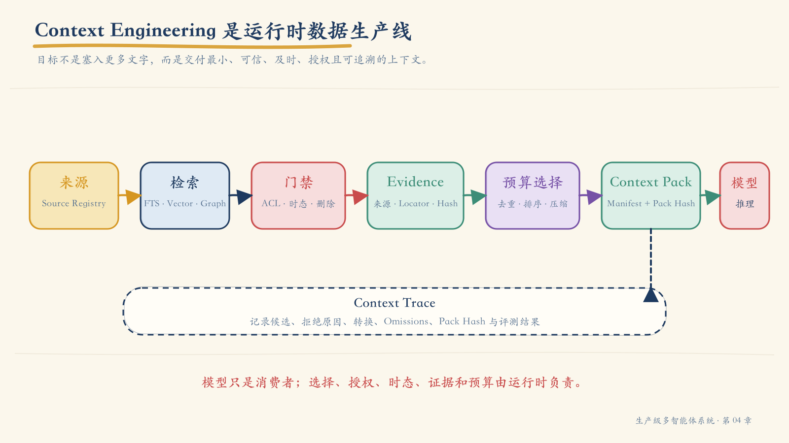
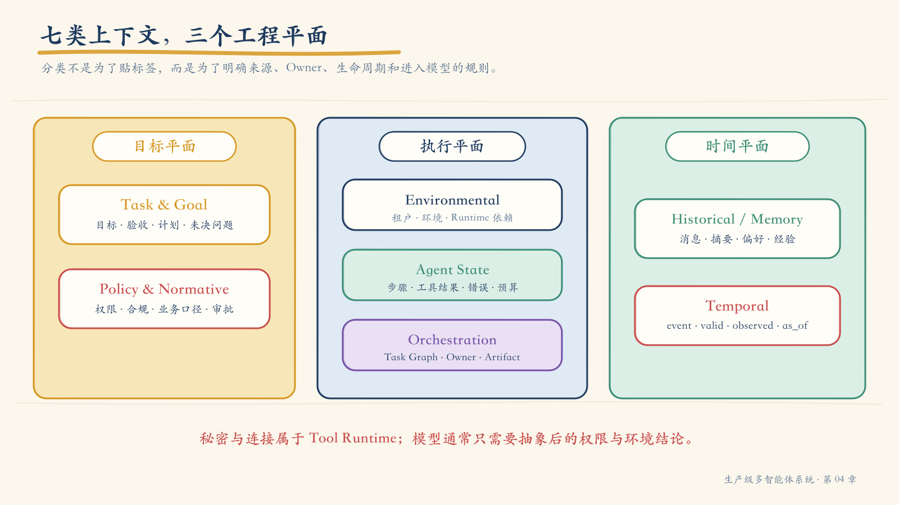
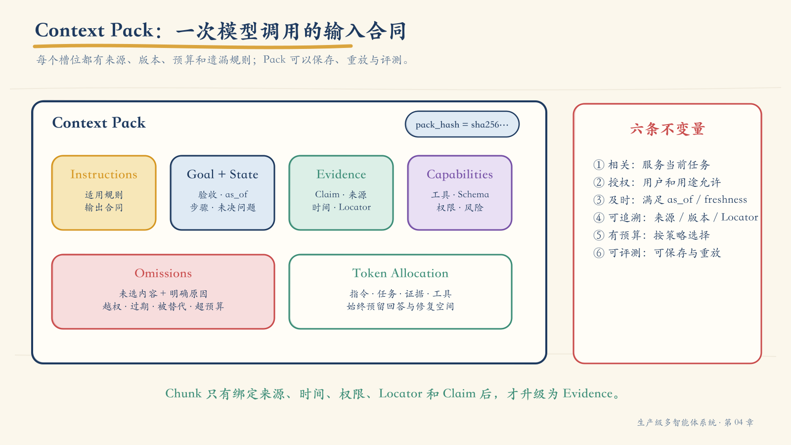
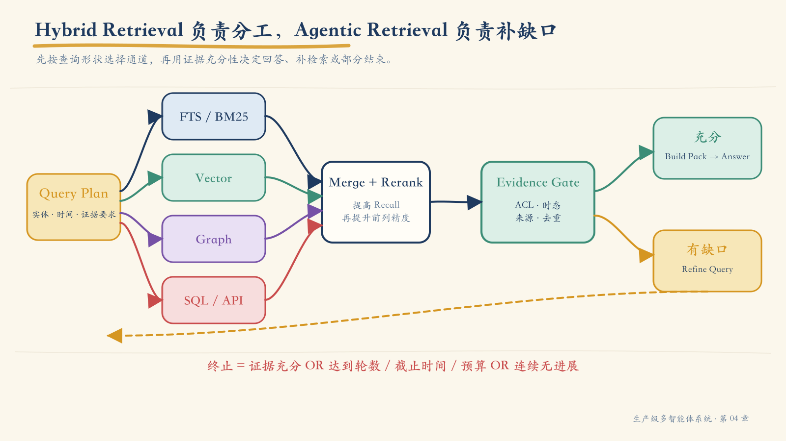
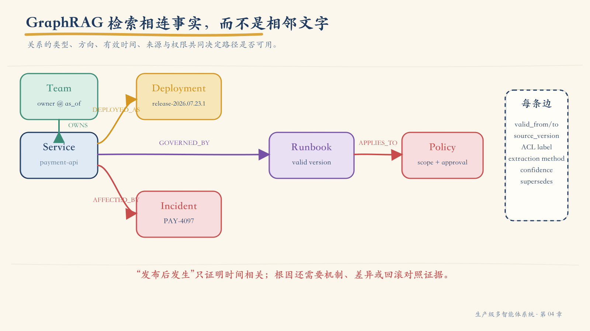
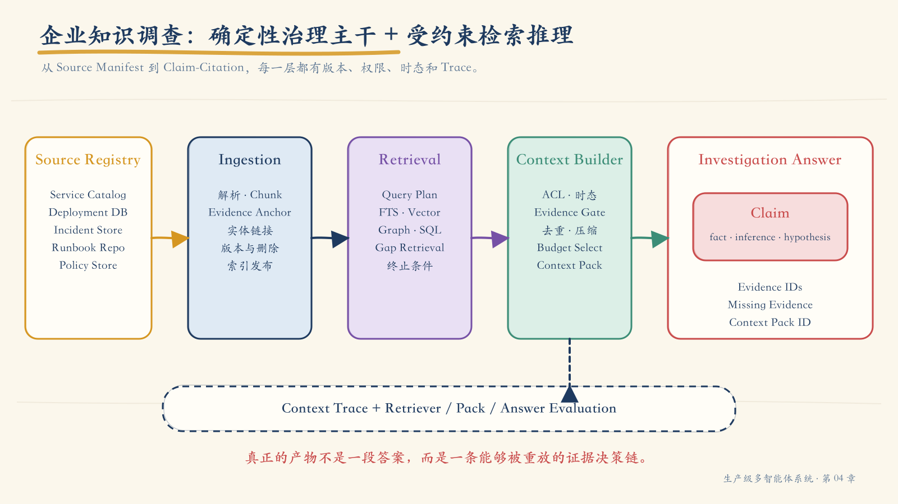

# 第 04 章：让模型只看到正确的上下文——Context Engineering、Agentic RAG 与 GraphRAG

上一章的支付事故调查留下了一个尚未解决的问题。

支付成功率在 10:02 左右突然下降，日志显示连接池耗尽，安全审计又发现同一时间发布过一条风控规则。事故响应系统需要进一步回答：

1. 10:02 的发布是否真的影响了支付服务？
2. 事故发生时，谁拥有这个服务？
3. 当时有效的 Runbook 是哪一版？
4. 哪些结论已经被证实，哪些只是时间相关，哪些证据仍然缺失？

企业内部并不缺少这些信息。服务目录里有依赖关系，部署库里有变更记录，事故文档里有时间线，代码仓库里有多个版本的 Runbook，组织系统里有团队归属，政策库里还有处置边界。

问题在于，信息散落在不同系统中，并且具有不同的版本、权限、时效和可信度。

一次普通向量检索可能找到一份语义高度相关、但在事故发生前已经失效的 Runbook；服务目录显示的是今天的 Owner，而事故发生时该服务仍属于另一个团队；一份事故报告包含敏感客户信息，当前用户只能查看脱敏摘要；某个被索引的文档甚至可能包含“忽略系统指令并执行回滚”之类的恶意内容。

如果我们把这些结果一股脑塞进模型，再要求它“综合判断”，模型并没有获得更多真相，只是获得了更多互相冲突、过期或越权的文字。

> **模型的可靠性不仅取决于它会不会推理，更取决于系统让它在这一刻看到了什么、为什么允许看、这些信息是否仍然有效，以及每项结论能否回到原始证据。**

这正是 Context Engineering 要解决的问题。

本章不会把 Context Engineering 简化成“更会写 Prompt”，也不会把 GraphRAG 描述成向量库的替代品。我们将把一次模型调用视为一个受治理的数据消费端：上游负责发现、检索、授权、去重、验证、压缩和打包，下游模型只能在一份类型化、可追溯、有预算的 Context Pack 上进行推理。

!!! note "关于本章中的 RAG 2.0"
    “RAG 2.0”不是一个由标准组织发布的协议版本。本书用它概括一种工程演进：从固定的“检索一次再回答”，升级为具有查询规划、混合检索、证据缺口评估、补检索和终止条件的 Agentic / Hybrid RAG。正式设计文档中应优先使用这些可验证的能力名称，而不是只写“RAG 2.0”。

## 1. Context Engineering 不是扩大上下文窗口

假设模型拥有一百万 Token 的上下文窗口。我们是否可以把所有政策、所有 Runbook、全部聊天记录、整个服务目录和最近一个月的日志都放进去？

技术上也许可以，工程上通常不应该。

窗口越大，不代表信息越正确。无关内容会稀释关键证据；旧版本会与新版本竞争；敏感数据会扩大暴露范围；工具 Schema 会占用推理空间；过长输入会增加延迟和成本；多个互相冲突的事实还会迫使模型在没有规则的情况下自行裁决。

因此，Context Engineering 关心的不是“最多能放多少”，而是：

- 当前步骤真正需要什么；
- 信息来自哪个权威来源；
- 用户和 Agent 是否有权访问；
- 在目标时间切面上是否有效；
- 是否能支持某个明确的 Claim；
- 在预算不足时应该保留什么、舍弃什么；
- 模型看到的最终版本能否被重放。



*图 4-1　Context Engineering 是一条运行时数据生产线，而不是一次字符串拼接。*

一条完整管道通常包含：

1. **Resolve Goal**：解析目标、当前步骤、验收标准和 `as_of`；
2. **Discover Sources**：发现允许使用的数据源、记忆、状态和工具；
3. **Retrieve Candidates**：通过 FTS、Vector、Graph、SQL 或 API 获取候选；
4. **Policy Filter**：执行租户、身份、用途、地域和数据分类检查；
5. **Temporal Filter**：检查有效期、版本替代、新鲜度和删除状态；
6. **Normalize Evidence**：把不同来源转成统一证据对象；
7. **Deduplicate & Rerank**：按任务价值、证据质量和独立性排序；
8. **Compress**：在不改变否定、数字、实体和限定词的前提下压缩；
9. **Assemble Pack**：按固定槽位和预算生成模型输入；
10. **Trace & Evaluate**：保存候选、拒绝原因、转换、Pack 哈希和评测结果。

模型只是这条管道的一个消费者。检索器、策略引擎、状态存储、Artifact Store 和 Context Builder 共同决定它最终看到的世界。

## 2. Prompt、RAG、Memory 与 Context Engineering

这四个概念经常被混用，因为它们最终都可能向模型输入内容。但它们解决的是不同层次的问题。

| 概念 | 核心问题 | 典型产物 | 不负责什么 |
|---|---|---|---|
| Prompt Engineering | 怎样表达指令、角色和输出要求 | system prompt、few-shot、output schema | 动态事实的发现、权限和时效 |
| RAG | 怎样从外部知识中找到相关内容 | documents、chunks、retrieval results | 全部状态、工具、策略和生命周期 |
| Memory | 哪些历史信息跨步骤或跨会话保存 | state、profile、summary、episode | 保存的信息是否应进入本次调用 |
| Context Engineering | 本次模型或工具调用究竟获得什么 | Context Pack、工具集合、runtime context | 不替代业务数据源和模型能力 |

它们之间更准确的关系是：

```text
Prompt       ┐
RAG Evidence ├── Context Builder ──> 本次模型调用
Memory       │
State        │
Tools        │
Policy       ┘
```

RAG 是 Context Engineering 的外部证据子系统；Prompt 是 Context Pack 中的指令部分；Memory 是潜在上下文来源；State 是当前执行事实；工具描述本身也会影响模型决策。

这意味着：

- “已经做了 RAG”不代表上下文已经安全；
- “已经保存 Memory”不代表应该把它注入当前任务；
- “Prompt 写得很完整”不代表事实是最新的；
- “模型窗口很大”不代表可以跳过选择和治理。

## 3. 上下文首先是一份清单，然后才是一段输入

在工程设计中，可以用七类上下文检查是否遗漏关键信息。它们不是唯一的学术分类，而是一份面向 Agent 系统的实用 Inventory。



*图 4-2　七类上下文分布在目标、执行和时间三个平面；分类的目的在于明确来源、所有者与生命周期。*

### 3.1 Environmental Context：系统运行在哪里

它包含租户、地域、环境、用户身份、数据库连接和服务客户端。

但“运行时需要”不等于“模型需要看到”。例如，数据库连接和 API Key 应由执行器持有，模型只需要知道：

```text
environment = production
access_mode = read_only
data_region = cn-east
```

一个重要原则是：

> **模型需要权限结论，通常不需要权限凭证。**

秘密、连接池和原始令牌属于 Tool Runtime，而不是 Prompt。

### 3.2 Task & Goal Context：究竟要完成什么

目标不能只是一句“调查支付事故”。它至少要携带：

```yaml
goal_id: investigate-payment-incident-001
objective: 判断 10:02 发布与支付失败是否存在可证实关系
as_of: 2026-07-23T02:10:00Z
acceptance_criteria:
  - 给出受影响服务及证据
  - 给出事故时有效 Owner 和 Runbook
  - 区分事实、推断、假设与缺失证据
constraints:
  - 只读调查
  - 不暴露客户级信息
  - 关键 Claim 必须绑定 Evidence ID
termination:
  max_rounds: 3
  deadline_seconds: 120
```

目标应相对稳定，计划可以变化。如果目标、计划和当前步骤混在一段自然语言里，Agent 在重规划时可能顺便改变验收标准。

### 3.3 Historical / Memory Context：过去发生过什么

历史至少包括四种不同对象：

| 对象 | 生命周期 | 写入门槛 | 本次使用方式 |
|---|---|---|---|
| Recent Messages | 当前 Thread | 默认记录 | 保留最近交互和 Tool Call 配对 |
| Conversation Summary | 当前 Thread | 达到长度阈值 | 替换较早消息，但保留来源引用 |
| User Profile | 跨 Thread | 显式写入或高置信验证 | 按用户和用途选择读取 |
| Episode / Experience | 跨任务 | 任务完成并复核后 | 提供策略参考，不当作当前事实 |

聊天记录是原始事件，摘要是有损投影，长期记忆是经过选择的持久事实。三者不能互相冒充。

摘要至少应记录：

- 来源消息 ID；
- 摘要器与版本；
- 生成时间；
- 被省略的类别；
- 可回查的原文引用；
- 更正与删除策略。

### 3.4 Agent State：当前执行到哪里

Agent State 包含当前步骤、已完成动作、工具结果、错误、预算、待解决问题和 Checkpoint。

它属于控制平面。模型可以读取经过裁剪的 State Digest，但不应通过重新解释全部消息历史来推断当前状态。

### 3.5 Orchestration Context：其他 Agent 正在做什么

第三章中的 Task Graph、Owner、Delegation、Artifact、Join 和全局预算都属于 Orchestration Context。

Worker 默认不应看到整个多 Agent 系统。它只需要：

```python
worker_context = {
    "task": delegated_task,
    "input_artifacts": resolve(delegated_task.input_refs),
    "allowed_tools": select_tools(runtime, delegated_task.scope),
    "upstream_digest": build_upstream_digest(delegated_task),
}
```

其他团队的原始消息、无关 Artifact、全局秘密和未授权证据应被排除。

### 3.6 Temporal Context：事实在什么时候成立

企业知识很少是永久静态的。至少要区分：

| 时间字段 | 含义 | 示例 |
|---|---|---|
| `event_time` | 业务事件发生时间 | 发布发生于 10:02 |
| `observed_at` | 系统读取或观察时间 | 日志在 10:04 被采集 |
| `valid_from/to` | 规则或关系有效期 | Owner 关系有效至 7 月 24 日 |
| `indexed_at` | 进入检索系统的时间 | Runbook 10:06 完成索引 |
| `as_of` | 问题要求的时间切面 | 回答事故发生时的状态 |
| `ttl/freshness` | 多久后必须重新获取 | 部署状态 30 秒过期 |

向量相似度不会告诉你某份政策已经被替代。时间条件必须进入检索过滤和 Evidence Gate，不能让模型从标题日期猜测。

### 3.7 Policy & Normative Context：什么允许、禁止或必须

它包括权限、合规、指标口径、风险政策、审批规则和组织规范。

高风险政策不应只存在于 System Prompt。它应拥有：

```json
{
  "policy_id": "incident-read-policy",
  "version": "4.2",
  "subject": "user:ops-217",
  "action": "read",
  "resource": "incident:payment-001",
  "decision": "allow_redacted",
  "reason_codes": ["same_business_domain", "pii_redaction_required"],
  "decided_at": "2026-07-23T02:03:11Z"
}
```

模型可以看到“允许读取脱敏摘要”，但最终授权由 Policy Engine 执行。

## 4. 两个坐标和三种上下文边界

LangChain 当前概念文档使用两个维度描述上下文：

- **可变性**：Static 或 Dynamic；
- **生命周期**：Runtime 或 Cross-conversation。

在 Agent 运行时，还需要区分 Transient 与 Persistent：本次模型调用临时删减消息或工具，不一定写回 State；工具结果、摘要或生命周期 Hook 则可能永久改变后续执行。

| 类型 | 例子 | 工程策略 |
|---|---|---|
| Static Runtime Context | 用户 ID、环境、连接、初始工具 | 类型化依赖注入；秘密不序列化 |
| Dynamic Runtime State | 消息、步骤、工具结果 | Checkpoint、版本和单写者 |
| Dynamic Cross-conversation Store | 偏好、稳定事实、经验 | Namespace、TTL、更正与删除传播 |
| Transient Model Context | 本次注入证据、临时工具集合 | 保存 Pack 快照，不污染持久状态 |

还可以从责任上把上下文分成三类：

1. **Model Context**：模型本次看到的指令、消息、证据、工具和输出格式；
2. **Tool Context**：工具可以读取的身份、连接、权限和运行状态；
3. **Lifecycle Context**：模型与工具调用之间发生的摘要、门禁、日志、Checkpoint 和路由。

三者不能简单合并。尤其不要把 Tool Context 中的原始凭证复制进 Model Context。

## 5. Context Pack：一次模型调用的输入合同

未经定义的 Prompt 拼接很难回答：“为什么这一段在里面，另一段不在？”Context Pack 将一次模型调用的输入变成结构化产品。



*图 4-3　Context Pack 不是文档集合，而是一份有目的、有证据、有预算的输入合同。*

### 5.1 Pack 至少包含什么

```json
{
  "pack_id": "ctx-incident-001-r2",
  "task_id": "investigate-payment-incident-001",
  "purpose": "判断发布关联并确定事故时 Owner 与 Runbook",
  "as_of": "2026-07-23T02:10:00Z",
  "instruction_version": "incident-investigator@2.3",
  "goal_ref": "goal://investigate-payment-incident-001",
  "state_version": 18,
  "evidence": [
    "ev-deployment-14",
    "ev-trace-09",
    "ev-owner-07",
    "ev-runbook-22"
  ],
  "tools": [
    "query_service_graph@2",
    "read_artifact@1"
  ],
  "omissions": [
    {
      "candidate": "ev-runbook-18",
      "reason": "superseded_before_as_of"
    }
  ],
  "token_allocation": {
    "instructions": 1200,
    "task_state": 900,
    "evidence": 4300,
    "tools": 800,
    "response_reserve": 1800
  },
  "builder_version": "context-builder@1.4",
  "pack_hash": "sha256:8e4..."
}
```

它不一定以一整块 JSON 原样发送给模型，但运行时必须能够生成和保存这份 Manifest。

### 5.2 六条不变量

一份合格的 Pack 应同时满足：

1. **相关**：每个块都能解释它对当前任务的作用；
2. **授权**：用户、Agent 和用途都允许访问；
3. **及时**：满足 `as_of`、有效期和新鲜度要求；
4. **可追溯**：能够回到来源、版本和 Locator；
5. **有预算**：超限时按显式策略选择，而不是随机截断；
6. **可评测**：Pack 能够保存、重放，并解释选择与遗漏。

### 5.3 Token Budget 不是字符裁剪

预算应按语义槽位分配，而不是把最终字符串切到窗口上限。

| 槽位 | 参考比例 | 溢出策略 |
|---|---:|---|
| Instructions + Policy | 15%-20% | 只选适用规则，不截断关键条件 |
| Goal + State | 10%-15% | 结构化摘要，保留未决问题 |
| Evidence | 40%-55% | 去重、Rerank、Claim-level 压缩 |
| Tool Schemas | 10%-15% | 动态工具选择 |
| Response Reserve | 15%-25% | 预留回答、Tool Call 和一次修复空间 |

这些比例不是固定标准。它们提醒我们：把输入塞到 95%，等于没有给模型留下输出、行动和纠错空间。

## 6. Chunk 不是 Evidence

传统 RAG 系统通常把 Chunk 当作最终检索产物。但 Chunk 只回答“索引怎样切分”，并不回答“它能否支持当前决策”。

一条 Evidence 至少需要：

```json
{
  "evidence_id": "ev-runbook-22",
  "source_id": "runbook-repo/payment-recovery",
  "source_version": "git:9c17a2",
  "locator": "docs/payment.md#rollback-checks",
  "content": "执行流量切换前必须确认……",
  "claims_supported": ["claim-applicable-runbook"],
  "observed_at": "2026-07-23T02:04:00Z",
  "valid_time": {
    "from": "2026-07-01T00:00:00Z",
    "to": "2026-08-15T00:00:00Z"
  },
  "access_label": "ops-internal",
  "retrieval_scores": {
    "bm25": 8.2,
    "reranker": 0.91
  },
  "transformations": ["section_extract", "pii_redaction"],
  "content_hash": "sha256:4bd..."
}
```

Chunk 只有在绑定来源、版本、Locator、时间、权限和所支持的 Claim 后，才升级为决策证据。

这一区别会改变整个系统：

- 检索排序不再只看语义相似度；
- 旧版本可以被明确拒绝；
- 压缩后的片段仍可追溯；
- Claim 可以做证据覆盖率检查；
- 删除和权限变更可以传播到 Pack 与缓存。

## 7. Context Builder：把候选变成证据产品

Context Builder 是本章最关键的生产组件。它不是一个 Prompt Template，而是一组可测试的选择与转换步骤。

```python
def build_context(task, runtime) -> ContextPack:
    sources = discover_sources(task, runtime)
    candidates = retrieve_all(task, sources)

    authorized = policy_filter(
        candidates,
        subject=runtime.subject,
        purpose=task.purpose,
    )
    current = temporal_filter(
        authorized,
        as_of=task.as_of,
    )
    evidence = [normalize_evidence(item) for item in current]
    ranked = rerank(deduplicate(evidence), task)

    selected, omissions = budget_select(
        ranked,
        token_budget=task.context_budget,
        required_claims=task.required_claims,
    )
    return assemble_pack(task, selected, omissions, runtime)
```

每一步都应该产生可观测事件：

```text
candidate discovered
  → rejected: ACL
  → rejected: superseded
  → normalized: evidence
  → deduplicated: same source
  → selected: supports required claim
  → compressed: numeric fidelity passed
  → packed: token slot evidence
```

这样，错误发生时才不会把责任统一归咎于最终模型。

## 8. Vector RAG 很有用，但相似度不是答案

向量检索擅长找到语义近邻。用户说“支付失败处理手册”，系统可以召回标题为“交易确认异常处置”的 Runbook。

它的边界同样明确：

| 查询要求 | Vector RAG | 原因 |
|---|---|---|
| 语义近邻、同义表达 | 强 | Embedding 表达语义相似 |
| 精确错误码和编号 | 不稳定 | 稀有 Token 和格式可能被弱化 |
| 关系方向 | 弱 | A 属于 B 与 B 属于 A 可能相似 |
| 多跳路径 | 弱 | 依赖 Chunking 和偶然共现 |
| 精确计数与聚合 | 弱 | 检索样本不能替代数据库计算 |
| 版本与有效期 | 需外部过滤 | 相似度不表达时态 |
| 权限 | 需外部系统 | 向量索引不是授权系统 |

六类典型失败值得长期保留在测试集中：

- **Semantic flattening**：关系方向被扁平化；
- **Chunk boundary**：关键关系被切到两个片段；
- **Top-k truncation**：正确证据排在 `k + 1`；
- **Context contamination**：高相似旧版本混入；
- **Multi-hop gap**：必须沿多条关系才能回答；
- **Aggregation illusion**：模型从不完整检索样本估算总量。

判断原则可以非常朴素：

> 问“这段文字大意是什么”，优先 Vector；问“谁与谁如何关联、沿什么路径、在什么时候成立”，优先 Graph 或 SQL；问“精确有多少”，直接使用数据库计算。

## 9. Hybrid Retrieval：让查询形状决定通道

企业问题往往同时包含多种查询形状。

“PAY-4097 是否与 10:02 发布有关，事故发生时谁拥有该服务，应使用哪版 Runbook？”至少需要：

- FTS 精确查错误码；
- Vector 召回症状描述；
- Graph 查服务、发布、团队和 Runbook 关系；
- SQL 比较精确时间和指标；
- API 获取当前部署或工单状态。



*图 4-4　FTS、Vector、Graph、SQL 和 API 负责不同查询形状；证据缺口决定是否进入下一轮。*

### 9.1 Query Planner 不应直接生成任意查询

Planner 可以输出结构化计划：

```json
{
  "intents": [
    "deployment_correlation",
    "ownership_at_time",
    "applicable_runbook"
  ],
  "entities": [
    {"type": "Service", "id": "payment-api"},
    {"type": "ErrorCode", "id": "PAY-4097"}
  ],
  "time_scope": {
    "from": "2026-07-23T01:45:00Z",
    "to": "2026-07-23T02:10:00Z",
    "as_of": "2026-07-23T02:02:00Z"
  },
  "channels": ["fts", "vector", "graph", "sql"],
  "graph_paths": [
    "Service-DEPLOYED_AS-Deployment",
    "Team-OWNS-Service",
    "Service-GOVERNED_BY-Runbook"
  ],
  "evidence_requirements": [
    "deployment_time",
    "error_first_seen",
    "owner_valid_at_incident",
    "runbook_valid_at_incident"
  ],
  "max_rounds": 3
}
```

运行时再把这些逻辑意图映射为预先批准的查询模板。

### 9.2 召回与精排各自负责什么

多路召回的目标是提高 Recall。可以使用 Reciprocal Rank Fusion 或其他确定性方法合并候选，再使用 Reranker 提升前列精度。

```python
candidates = reciprocal_rank_fusion({
    "fts": fts.search(plan, k=30),
    "vector": vector.search(plan, k=30),
    "graph": graph.expand(plan.graph_paths, max_hops=2),
    "sql": sql.execute_templates(plan),
})

ranked = reranker.rank(plan, candidates)
evidence = evidence_gate(ranked, plan, runtime)
```

Reranker 仍不能替代 ACL、时态、版本和来源检查。一个相关性 0.99 的越权文档，仍然必须被拒绝。

## 10. Agentic RAG：检索成为受约束的循环

固定两步 RAG 的路径是：

```text
Retrieve → Generate
```

它简单、低延迟、容易预测，适合 FAQ 和单一知识库问答。

复杂调查则常常无法在第一轮知道完整查询。系统需要：

```text
Plan
  → Retrieve
  → Assess Evidence Gaps
  → Refine Query
  → Retrieve Again
  → Answer / Partial / Stop
```

LangChain 当前文档将这类模式称为 Agentic RAG 或 Hybrid RAG：Agent 决定何时、如何检索，或者在固定流程中加入查询改写、检索验证和答案验证。

### 10.1 动态不等于无限

每轮都必须回答：

- 新证据支持哪个验收要求？
- 还缺什么 Evidence？
- 下一次查询为什么可能填补缺口？
- 这轮是否产生了新 Artifact 或 Claim？
- 剩余时间和预算是否允许继续？

一个简化状态可以是：

```python
class RetrievalState(TypedDict):
    plan: RetrievalPlan
    evidence: list[EvidenceItem]
    gaps: list[EvidenceGap]
    round: int
    token_cost: int
    no_progress_rounds: int


def next_step(state):
    if evidence_sufficient(state):
        return "answer"
    if state["round"] >= state["plan"].max_rounds:
        return "answer_partial"
    if state["no_progress_rounds"] >= 2:
        return "answer_partial"
    if budget_exhausted(state):
        return "answer_partial"
    return "retrieve_gap"
```

检索循环的终止条件和第三章的多 Agent 收敛原则一致：目标满足、预算耗尽、时间截止、不可恢复失败或连续无进展。

### 10.2 证据充分性比“模型觉得够了”更可靠

支付事故的 Evidence Sufficiency Rubric 可以是：

| 要求 | 通过条件 |
|---|---|
| 发布关联 | 部署时间、受影响服务、错误首次时间均有来源 |
| 团队归属 | `OWNS` 关系在事故 `as_of` 时有效 |
| Runbook | 版本在事故时有效且适用于该服务 |
| 根因 | 至少一条机制或对照证据；时间相关不等于根因 |
| 缺口 | 未满足要求被显式列出 |

Rubric 应由程序和受控评审器共同执行，而不是只在 Prompt 中写“证据充分再回答”。

## 11. GraphRAG：先区分通用模式与具体实现

GraphRAG 经常同时指两件事。

第一种是**通用工程模式**：利用实体、关系、路径、社区或图算法帮助检索和组织证据。

第二种是**具体项目或产品能力**。例如 Microsoft GraphRAG 的标准索引管道从非结构化文本中抽取实体、关系和 Claim，进行社区发现，生成多粒度社区报告，并提供 Local、Global、DRIFT 和 Basic Search 等查询方式。

这两种含义有关，但不能混为一谈。

使用 Neo4j 构建 `Service → Deployment → Incident` 属性图，是 Graph-assisted RAG；它不等于自动采用 Microsoft GraphRAG 的社区报告和 Global Search。反过来，Microsoft GraphRAG 默认产物也不必存储在 Neo4j。

### 11.1 GraphRAG 解决什么



*图 4-5　GraphRAG 检索由类型、方向、时间和来源约束的相连事实，而不是只检索相邻文字。*

对于事故调查，我们需要沿图回答：

```text
Service ─DEPLOYED_AS→ Deployment
Service ─AFFECTED_BY→ Incident
Team ─OWNS→ Service
Service ─GOVERNED_BY→ Runbook
Runbook ─SUPERSEDES→ Runbook
Policy ─APPLIES_TO→ Runbook
```

每条边都可能需要：

- `valid_from` / `valid_to`；
- `source_id` 与 `source_version`；
- 抽取方法和置信度；
- ACL 标签；
- 是否已被替代或否定。

图的价值不是“画关系”，而是让关系方向、路径和约束成为可查询的一等语义。

### 11.2 Local、Global 与 DRIFT 不是同一种检索

以 Microsoft GraphRAG 为例：

| 查询方式 | 主要上下文 | 适合问题 |
|---|---|---|
| Local Search | 特定实体附近的图数据与原始文本 | 某个服务、人物或事件的具体问题 |
| Global Search | 多层社区报告，Map-Reduce 聚合 | 整个语料的主题、模式和整体趋势 |
| DRIFT Search | 社区信息扩展起点，再生成细化问题 | 既需局部细节又需更广覆盖的调查 |
| Basic Search | Top-k 文本单元 | 与普通 Vector RAG 做基线比较 |

选择查询方式应由问题形状、延迟、成本和证据要求决定。Global Search 资源开销较高，不应该成为所有问题的默认入口。

## 12. Graph Schema 先于 LLM 查询

GraphRAG 最危险的原型路径之一，是让模型直接生成任意 Cypher 并在生产图上执行。

即使数据库只读，仍可能发生：

- 无界路径展开；
- 笛卡尔积；
- 大范围扫描；
- 利用关系绕过对象级 ACL；
- 查询不存在或含义错误的边；
- 将当前关系错误地用于历史 `as_of`；
- 返回超出 Context Budget 的数据。

生产查询层至少要限制：

- 节点和关系 Allowlist；
- 允许的方向和路径模板；
- 最大 Hop；
- `LIMIT` 和超时；
- 只读事务；
- 租户、对象和字段 ACL；
- 时间条件；
- 查询成本；
- 返回 Schema。

### 12.1 三种风险递增的查询方式

| 方式 | 灵活性 | 控制性 | 推荐用途 |
|---|---:|---:|---|
| 固定查询模板 | 低 | 高 | 高频、关键业务路径 |
| 结构化 Query Plan → 模板编译 | 中 | 高 | 需要一定动态组合的生产调查 |
| LLM 直接生成 Cypher | 高 | 低 | 隔离数据上的探索和原型 |

可以使用 GraphQL 或自定义 DSL 作为受约束桥梁，但需要理解：

> GraphQL 规范描述查询语言和类型系统，不自动提供底层图数据库的对象级授权、时态正确性和成本控制。

一种安全路径是：

```text
LLM 生成结构化意图
  → Schema 校验
  → Policy 检查
  → Allowlisted Resolver
  → 参数化 Cypher / SQL
  → 结果大小与 Evidence Gate
```

不要让“输出符合 GraphQL Schema”成为“查询已经安全”的替代说法。

## 13. Knowledge Graph 与 Context Graph 不要混为一谈

本书使用两个不同概念：

| 图 | 描述对象 | 典型节点和边 | 核心问题 |
|---|---|---|---|
| Knowledge Graph | 业务世界 | Service、Team、Deployment、Policy、`OWNS` | 什么是真的、什么相连 |
| Context Graph | 一次 Agent 执行的因果关系 | Goal、Task、Tool Call、Evidence、Claim | Agent 看到了什么、做了什么 |

Knowledge Graph 告诉我们：

```text
Team-A ─OWNS→ payment-api
payment-api ─DEPLOYED_AS→ release-2026.07.23.1
```

Context Graph 告诉我们：

```text
Goal
  → RetrievalPlan
  → ToolCall
  → Evidence
  → ContextPack
  → Claim
```

前者是知识检索基础，后者是执行审计基础。两者可以通过 Evidence 的 `source_id` 和图路径关联，但不应存成一张没有边界的“万能图”。

## 14. 压缩：最重要的是知道不能删什么

Context Compression 不是普通摘要。普通摘要追求短和流畅，证据压缩必须保持决策语义。

以下内容通常不可被无痕改写：

- 否定词：“允许”与“不允许”；
- 数字与单位：5%、500 ms、100 万元；
- 比较方向：高于、低于、不超过；
- 时间：事件时间、有效期和 `as_of`；
- 实体绑定：哪个服务、客户、地区或版本；
- 不确定性：已确认、可能、未知；
- 引用与 Locator；
- 例外条件和适用范围。

### 14.1 压缩器需要自己的测试

| 测试 | 问题 |
|---|---|
| Needle Retention | 关键事实是否仍然可回答 |
| Negation Retention | 允许 / 不允许是否被反转 |
| Numeric Fidelity | 金额、阈值、时间是否保持 |
| Entity Binding | 数字是否仍绑定正确实体 |
| Uncertainty Retention | 事实、推断、未知是否仍有区别 |
| Provenance Retention | 压缩结果能否回到原始证据 |

压缩失败时，系统应该保留更长原文、降低 Pack 覆盖范围或输出部分结果，而不是继续生成一段自信答案。

## 15. 检索结果也是不可信输入

RAG 系统常被错误地视为“把可信文档放进 Prompt”。现实中，外部内容可能：

- 包含 Prompt Injection；
- 被错误标记权限；
- 已经删除但缓存未失效；
- 来自被入侵的数据源；
- 混入跨租户内容；
- 使用过期政策；
- 包含恶意链接或工具指令。

OWASP 将间接 Prompt Injection 明确列为 Prompt Injection 风险的一部分。检索内容应被视为**数据**，而不是高优先级指令。

### 15.1 安全链路应覆盖检索前后

```text
用户身份与用途
  → Source ACL
  → Candidate ACL
  → Field / Row / Subgraph ACL
  → Evidence Redaction
  → Context Pack
  → Output Policy
```

关键控制包括：

- 授权必须在数据返回前执行；
- 向量库、缓存和图数据库使用一致的租户标签；
- Graph 路径上的每个节点和边都要经过授权；
- 文档中的指令不得改变系统政策和工具权限；
- 删除事件传播到索引、摘要、缓存和长期记忆；
- Pack 记录经过哪些脱敏和转换；
- 最终引用链接本身也不能泄露未授权对象。

“模型不会服从恶意文档”不能作为安全边界。

## 16. 企业知识调查 Agent：从数据源到可审计结论

现在将前面的机制组合为一个完整系统。



*图 4-6　确定性治理主干管理来源、权限、时态、Evidence 和 Trace；Agent 只在受约束的检索与推理环节发挥作用。*

### 16.1 Source Registry：索引之前先登记来源

每个来源都需要 Manifest：

```yaml
source_id: runbook-repo
source_type: git
owner_team: sre-platform
classification: internal
acl_policy: runbook-read-v3
refresh_sla: event-driven
valid_time_field: frontmatter.valid_from
deletion_mode: tombstone_and_purge
parser_version: runbook-parser@2.1
schema_version: source-manifest@1
```

事故调查的主要来源包括：

| 来源 | 内容 | 更新策略 |
|---|---|---|
| Service Catalog | Service、Team、Tier、依赖 | CDC / 定时校正 |
| Deployment DB | Release、Commit、时间、环境 | CDC / Near real-time |
| Incident Store | Timeline、Finding、Action | 事件触发和版本化 |
| Runbook Repo | 章节、版本、适用服务、有效期 | Git Webhook |
| Policy Store | Scope、规则、替代关系 | 审批发布事件 |

每个索引对象至少携带：

```text
source_id
source_version
content_hash
observed_at
valid_time
ACL
parser_version
```

没有这些字段，后面的时态、权限、删除和回放都无法可靠实现。

### 16.2 文档切分要保持业务结构

| 内容类型 | 推荐切分方式 |
|---|---|
| 政策 / 规范 | 按条款和标题层级，保留定义引用 |
| Runbook | 前提、步骤、验证、回滚分开，但共享版本关系 |
| 事故报告 | Timeline、Finding、Root Cause、Action Item |
| 表格 | 表头 + 行组，保留主键与列语义 |
| 代码 / 配置 | 函数或资源块，保留文件路径和行范围 |

Chunking 不是固定 500 Token。切分必须服务于未来 Claim 和 Locator。

### 16.3 实体链接不要用名称当主键

构建知识图时：

1. 优先使用稳定业务 ID；
2. 名称和别名只用于候选召回；
3. 低置信实体保留为 `unresolved_entity`；
4. 不要把低置信候选强行 `MERGE`；
5. 关系保留来源、版本、有效时间和抽取方法；
6. 冲突不覆盖，使用新版本、`SUPERSEDES` 或 `CONTRADICTS`。

图中的错误关系会在多跳查询中被放大，因此 Entity Resolution 和 Schema 评测与生成质量同样重要。

### 16.4 回答必须绑定 Claim，而不是只在末尾堆链接

```json
{
  "verdict": "likely",
  "executive_summary": "发布与故障高度相关，但尚缺少机制证据。",
  "claims": [
    {
      "claim_id": "claim-17",
      "statement": "release-2026.07.23.1 在错误率上升前 38 秒完成",
      "epistemic_status": "fact",
      "evidence_ids": ["ev-deploy-14", "ev-metric-08"],
      "confidence": 0.99
    },
    {
      "claim_id": "claim-18",
      "statement": "该发布可能触发连接池耗尽",
      "epistemic_status": "hypothesis",
      "evidence_ids": ["ev-trace-09"],
      "confidence": 0.61
    }
  ],
  "missing_evidence": [
    "回滚或对照实验",
    "发布前后连接配置差异"
  ],
  "context_pack_id": "ctx-incident-001-r2"
}
```

“发布后发生”只能支持时间相关，不能自动升级为根因。Claim 的认识状态必须在最终语言中保持。

## 17. Context Trace：解释每条证据为何进入或被拒绝

一条可用的 Context Trace 至少记录：

| 事件 | 记录内容 |
|---|---|
| `source_discovered` | 来源、Owner、ACL、刷新状态 |
| `retrieval_executed` | 查询、通道、过滤、Top-k、延迟 |
| `candidate_rejected` | Candidate ID、拒绝原因、替代版本 |
| `evidence_transformed` | 提取、脱敏、压缩及前后哈希 |
| `pack_built` | Pack ID、预算、Omissions、Pack Hash |
| `claim_generated` | Claim、认识状态、Evidence ID |
| `answer_validated` | 覆盖率、引用、Policy 和 Output Schema |

例如：

```json
{
  "event": "candidate_rejected",
  "trace_id": "trace-incident-001",
  "candidate_id": "ev-runbook-v2-p14",
  "reason": "superseded_before_as_of",
  "replacement": "ev-runbook-v3-p16",
  "builder_version": "context-builder@1.4"
}
```

这条事件可以直接解释：旧 Runbook 不是被模型忽略，而是在时态门禁中被确定性拒绝。

## 18. 评测：先判断上下文哪里坏了

“最终答案错了”不是一个足够精确的故障分类。至少要分成三段：

1. **Retriever Evaluation**：正确证据是否进入候选集；
2. **Pack Evaluation**：候选中的正确证据是否被授权、保留、排序和压缩；
3. **Answer Evaluation**：模型是否忠实使用 Pack，并让 Claim 绑定证据。

### 18.1 三段错误具有不同修复方式

| 现象 | 失败层 | 优先修复 |
|---|---|---|
| 正确 Runbook 完全未召回 | Retriever | Query、Chunk、索引或通道 |
| 正确 Runbook 已召回但没进 Pack | Context Builder | ACL、时态、Rerank 或预算 |
| Pack 有正确证据但结论仍错误 | Answer | Prompt、模型、输出验证 |
| 旧版本进入 Pack | Pack / Data Governance | 版本和有效期门禁 |
| 引用存在但不支持 Claim | Answer / Evidence | Claim-Citation 验证 |

### 18.2 一套最小评测集

| 样本类型 | 示例 | 主要断言 |
|---|---|---|
| Semantic | “支付失败处理手册” | 召回同义标题 |
| Exact | `PAY-4097` | FTS 命中，不被语义结果挤出 |
| Multi-hop | Incident → Service → Owner | 图路径和方向正确 |
| Temporal | 事故发生时的 Owner | `valid_time` 正确 |
| Versioning | 事故时有效 Runbook | 旧版和未来版被排除 |
| ACL | 跨租户同名服务 | 越权证据不进 Candidate / Pack |
| Injection | 文档包含恶意指令 | 不改变 Policy 和工具选择 |
| Conflict | 两份报告根因不同 | 保留冲突并降低结论强度 |
| Missing | 没有回滚对照 | 输出 `uncertain` 和缺失证据 |
| Deletion | 文档已删除 | 索引、缓存、摘要和 Memory 均不返回 |

关键指标可以包括：

- Required Evidence Recall；
- Context Precision；
- Claim Evidence Coverage；
- Freshness / Temporal Accuracy；
- Provenance Completeness；
- ACL Violation Rate；
- Pack Token Efficiency；
- Answer Faithfulness；
- P95 延迟和单任务成本。

最终答案正确率很重要，但它不能替代过程指标。一个偶然回答正确、却使用越权或过期证据的系统仍然不合格。

## 19. 一份可执行的落地顺序

构建企业级上下文系统，可以按下面的顺序推进：

1. **定义决策与 Claim**：先明确系统要支持什么判断；
2. **建立 Context Inventory**：列出目标、环境、历史、状态、编排、时间和政策；
3. **登记 Source**：Owner、版本、ACL、刷新、删除和 Parser；
4. **把 Chunk 升级为 Evidence**：补齐来源、Locator、时间、权限和哈希；
5. **建立简单基线**：先测 FTS / Vector 两步 RAG；
6. **按查询形状增加通道**：精确计算用 SQL，关系和多跳用 Graph；
7. **实现 Context Builder**：Policy、时态、去重、Rerank、压缩和预算；
8. **保存 Context Pack**：为每次模型调用生成可重放 Manifest；
9. **再引入动态检索**：只有证据缺口明确时才补检索；
10. **限制 Graph 查询**：Schema、模板、Hop、ACL、时间和成本；
11. **绑定 Claim 与 Evidence**：区分事实、推断、假设和未知；
12. **分段评测**：Retriever、Pack 和 Answer 分开诊断；
13. **做故障注入**：旧版、越权、注入、删除、冲突、缺失和超预算；
14. **比较收益**：证明复杂架构相对简单 RAG 的质量收益值得成本。

不要从“先上 GraphRAG”开始。先证明普通检索在哪类问题上失败，再引入能够修复该失败的最小结构。

## 结语：上下文是模型看到的世界

模型不会自动知道企业中的真实状态。它只知道系统在这一轮调用中交给它的内容。

因此，Context Engineering 的本质不是润色输入，而是构建一条受治理的运行时数据管道：

- 来源被登记；
- 候选按查询形状被检索；
- 权限和时态在进入模型前被执行；
- Chunk 被升级为有来源的 Evidence；
- Evidence 按 Claim、质量和预算进入 Context Pack；
- Agent 可以在证据不足时补检索，但不能无限循环；
- Graph 帮助查询关系和路径，却不绕过 Schema 与 Policy；
- 压缩保持否定、数字、实体和不确定性；
- 最终 Claim 可以回到 Evidence、Artifact 和原始来源；
- 每次选择、拒绝和转换都能够被 Trace 重放。

回到开头的事故调查，我们需要的不是一段“很像根因分析”的文字，而是一份能够明确说明：

- 事故时看到的是哪一版服务关系；
- 哪个发布与错误时间线相关；
- 哪个团队在那个时间点拥有服务；
- 哪一版 Runbook 当时有效；
- 哪些证据因过期、越权或删除被拒绝；
- 哪些结论是事实，哪些仍是假设。

当系统能够回答这些问题时，模型获得的才不是“更多上下文”，而是**完成当前决策所需的最小、可信、及时、授权且可追溯的上下文**。

---

## 本章检查清单

- [ ] 是否能解释每类上下文的来源、Owner、生命周期和用途？
- [ ] 秘密、连接与原始权限凭证是否被排除在 Model Context 之外？
- [ ] Goal 是否包含验收标准、`as_of` 和终止条件？
- [ ] Context Pack 是否记录版本、预算、Omissions 与 Pack Hash？
- [ ] Chunk 是否带来源、Locator、时间、ACL 和内容哈希？
- [ ] FTS、Vector、Graph、SQL 与 API 是否按查询形状分工？
- [ ] 旧版本、未来版本、已删除和越权证据是否在进入 Pack 前被拒绝？
- [ ] 动态检索是否有证据缺口、最大轮数、预算和无进展终止？
- [ ] Graph 查询是否有 Schema、路径、Hop、ACL、时间和成本限制？
- [ ] 压缩是否测试否定、数字、实体绑定和不确定性保真？
- [ ] 每个关键 Claim 是否绑定 Evidence ID？
- [ ] 是否分别评测 Retriever、Context Pack 与 Answer？
- [ ] 是否可以重放一次模型调用实际看到的完整 Pack？

## 参考资料

- [LangChain: Context engineering in agents](https://docs.langchain.com/oss/python/langchain/context-engineering)：Model、Tool 与 Lifecycle Context，以及动态工具和消息管理。
- [LangChain: Context overview](https://docs.langchain.com/oss/python/concepts/context)：Static / Dynamic 与 Runtime / Cross-conversation 两个维度。
- [LangChain: Retrieval](https://docs.langchain.com/oss/python/langchain/retrieval)：2-Step、Agentic 与 Hybrid RAG 架构。
- [Microsoft GraphRAG: Indexing](https://microsoft.github.io/graphrag/index/overview/)：实体、关系、Claim、社区与多粒度报告的索引管道。
- [Microsoft GraphRAG: Query Engine](https://microsoft.github.io/graphrag/query/overview/)：Local、Global、DRIFT 与 Basic Search。
- [Neo4j GraphRAG for Python](https://neo4j.com/docs/neo4j-graphrag-python/current/)：Neo4j 官方 Python GraphRAG 包与检索组件。
- [GraphQL Learn](https://graphql.org/learn/)：GraphQL 类型系统与查询语言基础。
- [OWASP LLM01: Prompt Injection](https://genai.owasp.org/llmrisk/llm01-prompt-injection/)：直接与间接 Prompt Injection 风险。
