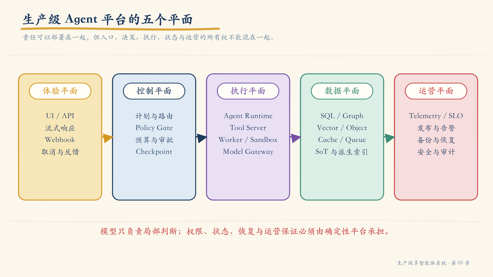
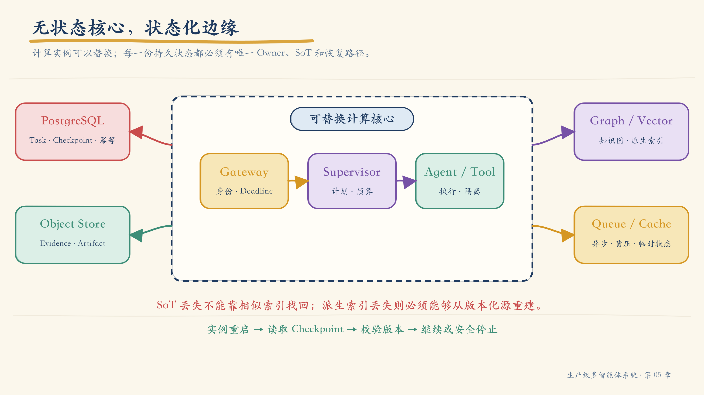
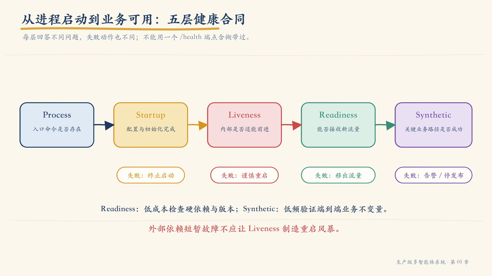
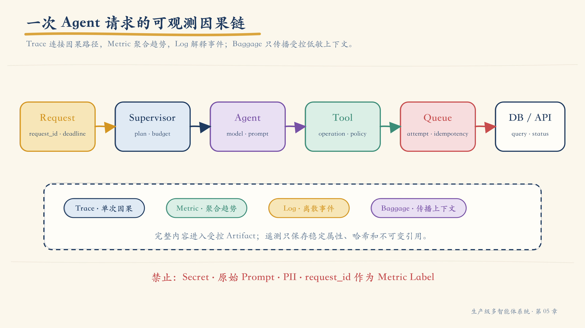
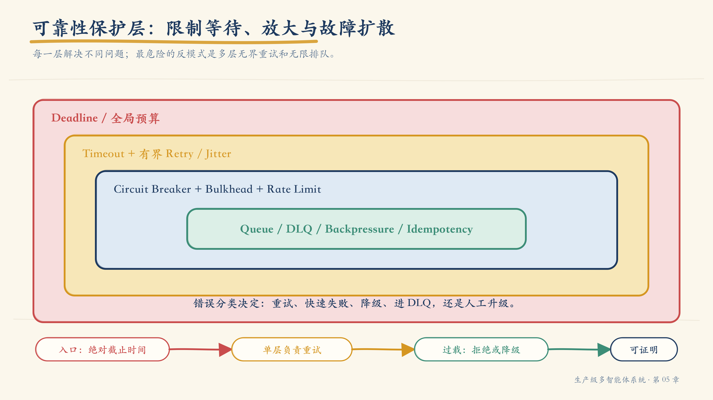
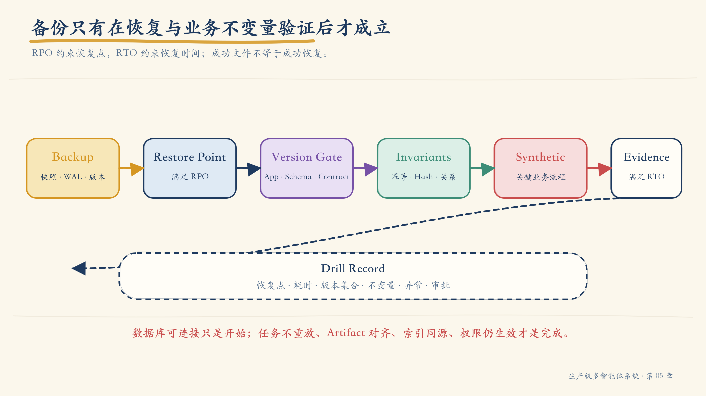

# 第 05 章：从“能启动”到“可恢复”——生产基础设施、可观测性与故障恢复

上一章中，事故调查 Agent 已经能够在权限、时间与证据约束下回答问题。开发团队把它和 Supervisor、Tool Server、PostgreSQL、图数据库、向量数据库、对象存储、队列以及可观测组件一起写进 Compose 文件，执行一条命令，所有容器很快都变成了绿色。

项目群里出现了一句令人安心的话：

> “系统已经跑起来了。”

十分钟后，第一位用户却得到 `503`。API 进程确实存活，但数据库迁移停在旧版本；Worker 在网络抖动后重放了已经完成的写操作；向量索引恢复成功，却使用了另一版 Embedding；请求经过三个 Agent 和两个工具，Trace 在队列边界断开；数据库密码已经轮换，连接池仍持有旧凭证；备份任务每天显示成功，但从未有人真正恢复过。

容器都在运行，业务系统却没有准备好。日志都存在，事故原因却无法关联。备份文件也存在，恢复能力却只是一个未经验证的假设。

这类问题揭示了 Agent 原型与生产系统之间最容易被低估的距离：

> **能启动，只证明进程曾经开始运行；生产就绪要求系统能够在约束内持续服务、暴露真实状态、控制故障扩散，并在数据或基础设施损坏后恢复到可验证的业务状态。**

本章不把“生产化”理解成把 `docker compose up` 改写为 Kubernetes YAML，也不罗列一串基础设施产品。我们将建立一条完整的保证链：

```text
架构边界
  → 状态所有权
  → 可重复构建
  → 运行时契约
  → 健康与流量门禁
  → 遥测与 SLO
  → 弹性控制
  → 备份、恢复与业务不变量
```

这条链上的任何一环缺失，平台都可能“看起来正常”，却无法对外给出可信承诺。

## 1. 先定义“生产级”究竟承诺什么

生产级不是某个部署工具的属性，而是一组可以被验证的系统保证。对于多 Agent 系统，至少要回答六个问题：

1. **可交付**：同一份源码、依赖、配置和数据迁移能否构建出可追溯的版本？
2. **可服务**：实例何时可以接收流量，何时必须停止接收？
3. **可观测**：能否从一次业务请求追到 Agent、Tool、模型、队列和数据存储？
4. **可控制**：超时、重试、并发、成本和副作用是否存在硬边界？
5. **可恢复**：进程、节点、区域或数据损坏后，状态能否在 RPO / RTO 内恢复？
6. **可演进**：配置、Schema、模型、Prompt、索引和服务版本能否兼容升级与回滚？

“服务有三个副本”“已经上 Kubernetes”“接了 Grafana”都只是实现事实，不等于上述保证已经成立。

### 1.1 生产成熟度是一条保证阶梯

| 层级 | 可以证明什么 | 仍不能证明什么 |
|---|---|---|
| 进程启动 | 入口命令可执行 | 能处理真实请求 |
| 容器健康 | 进程未卡死或可完成低成本自检 | 关键依赖和 Schema 可用 |
| 实例就绪 | 当前实例可以接收某类流量 | 端到端业务一定成功 |
| 服务可用 | 业务 SLI 在目标窗口内达标 | 故障后一定能恢复数据 |
| 系统可恢复 | 恢复演练通过业务不变量 | 下一版本仍然兼容 |
| 持续可运营 | 发布、告警、容量、成本和恢复均有闭环 | 不代表永远不会失败 |

成熟度越高，证据越接近真实业务，而不是越接近基础设施表面。

### 1.2 本章沿用的支付事故主线

我们继续使用前几章的事故调查系统。它包含：

- Gateway：接收调查请求并传播身份；
- Supervisor：拆解任务、分配预算、汇总结果；
- Specialist Agent：分别调查部署、日志、服务关系和政策；
- Tool Runtime：执行 SQL、Graph、Search、Object 与外部 API 调用；
- Worker：处理耗时检索、索引和报告生成；
- PostgreSQL：持久化任务、Checkpoint、审批和审计；
- Graph Store：保存 Knowledge Graph；
- Vector Store：保存可重建的语义索引；
- Object Store：保存不可变 Evidence 与 Artifact；
- Queue：承载异步任务；
- Telemetry Stack：接收 Trace、Metric 和 Log。

本章的目标不是选出“唯一正确”的产品组合，而是让每一项状态、流量、故障和恢复责任都有明确所有者。

## 2. 五个平面：不要把所有生产责任塞进 Agent Runtime

一个可运营的 Agent 平台可以被划分为五个显式平面。



*图 5-1　五个平面关注不同的变化速度、风险和所有权；它们可以物理合并，但责任不能混淆。*

| 平面 | 核心职责 | 典型能力 | 关键问题 |
|---|---|---|---|
| Experience Plane | 用户与外部系统体验 | UI、API、流式响应、Webhook | 用户看到了什么、能否取消 |
| Control Plane | 决定做什么以及是否允许 | 路由、计划、策略、预算、审批 | 谁能做什么、何时停止 |
| Execution Plane | 真正执行 Agent 与 Tool | Runtime、Worker、Sandbox、Model Gateway | 动作怎样执行并被隔离 |
| Data Plane | 保存权威状态与派生数据 | SQL、Graph、Vector、Object、Cache、Queue | 真相在哪里、怎样恢复 |
| Operations Plane | 证明系统正在正确运行 | Telemetry、SLO、发布、备份、恢复、安全 | 如何发现、限制和修复故障 |

这种划分首先是一种责任模型，而不是微服务数量要求。小团队完全可以让多个平面运行在同一集群，甚至同一代码仓库中；但不能让边界消失。

例如：

- 模型可以提出“调用退款工具”，但策略与审批属于 Control Plane；
- Tool Runtime 可以执行写入，但业务记录的真相属于 Data Plane；
- Supervisor 可以汇总结果，但告警是否触发不能由模型自行决定；
- Agent 可以生成恢复建议，但恢复任务必须由受控运维流程执行。

### 2.1 十二项平台能力

五个平面落到工程上，至少包含以下能力：

1. 统一入口、认证和身份传播；
2. 编排、Checkpoint、幂等与取消；
3. Agent / Tool 发现、版本和兼容性；
4. 模型路由、限流、配额与成本控制；
5. SQL、Graph、Vector、Object、Cache 的角色分工；
6. 队列、异步执行、背压和死信；
7. Secret、证书与服务身份；
8. 结构化日志和分布式 Trace；
9. RED / USE 指标、SLO 与告警；
10. Startup、Liveness、Readiness 和 Synthetic Check；
11. 备份、恢复与灾难恢复；
12. 版本化配置、迁移、发布门禁和回滚。

如果平台只提供“启动 Agent”和“调用模型”，其余能力最终仍会以散落脚本、人工约定和事故补丁的形式出现。

## 3. 参考拓扑：无状态核心，状态化边缘

多 Agent 系统中最危险的部署误区，是把所有服务都当成可以随意扩容的无状态容器。

Supervisor、Agent Runtime 和 API 通常适合保持无状态：请求上下文从明确的 State Store 读取，阶段结果写入 Checkpoint 或 Artifact，实例本身可以替换。数据库、对象存储、队列和索引则具有持久性、顺序、复制或恢复约束，不能用同样的生命周期管理。



*图 5-2　计算实例可替换，权威状态与恢复责任不能随实例一起消失。*

### 3.1 为什么要让核心尽量无状态

无状态不等于系统没有状态，而是：

- 请求不会依赖某一个固定实例的内存；
- Checkpoint、Artifact 和 Idempotency Record 有外部持久化所有者；
- 实例重启后可以从持久状态继续或安全终止；
- 横向扩容不要求会话粘滞；
- 发布和回滚不需要搬运本地业务数据。

下面这些数据不应只存在进程内存中：

- 当前 Task Graph 与步骤状态；
- 已执行 Tool Call 的幂等记录；
- Human Approval 的结果；
- 长任务进度与取消标志；
- 已生成 Artifact 的不可变引用；
- 预算消耗和全局截止时间。

### 3.2 状态化边缘不等于“把数据库丢给云厂商”

托管服务可以承担复制、补丁和部分备份，但应用团队仍然需要定义：

- 该存储保存什么，不保存什么；
- 谁是唯一写入者；
- 一致性与顺序要求；
- Schema、索引和 Embedding 版本；
- 备份频率和保留策略；
- RPO / RTO；
- 恢复后的业务验证；
- 故障时降级、只读或停止策略。

托管能力替代的是部分操作，不是状态所有权。

## 4. 每一种状态必须有一个所有者和一条恢复路径

系统存在多个数据产品时，“都存一份”很容易被误认为冗余。事实上，如果没有权威来源与派生关系，多份副本只会制造无法裁决的冲突。

### 4.1 State Ownership Catalog

在部署之前，先建立状态所有权目录。

| 状态 | 权威所有者 | 一致性 | 可重建 | 恢复依据 | 示例目标 |
|---|---|---|---|---|---|
| Task / Checkpoint | PostgreSQL | 强一致或事务一致 | 否 | PITR + 业务校验 | RPO ≤ 5 min |
| Tool Idempotency | PostgreSQL | 强一致 | 部分 | 事务日志 | 重复调用不重复副作用 |
| Evidence / Artifact | Object Store | 写后读、不可变 | 否 | 版本化 + 跨域复制 | 哈希一致 |
| Knowledge Graph | Graph Store | 按导入批次 | 可部分重建 | 源清单 + 增量事件 | 关系与约束通过 |
| Vector Index | Vector Store | 最终一致 | 是 | 原文 + Chunker + Embedding 版本 | 与 SoT 对齐 |
| Cache | Redis 等 | 最终一致 | 是 | 重新计算 | 丢失不破坏正确性 |
| Queue Message | Broker | 至少一次或指定语义 | 否 | Broker 持久化 + DLQ | 不丢、可去重 |
| Telemetry | Telemetry Backend | 最终一致 | 通常否 | 采样与保留策略 | 满足审计窗口 |

完整可复制模板见[生产就绪与恢复契约](../toolkit/production-readiness-contract.md)。

### 4.2 Source of Truth 与 Derived Index

**Source of Truth（SoT）**是某项业务事实发生冲突时的最终裁决来源。**Derived Index** 是为了查询效率、相关性或分析而生成的派生结构。

例如：

```text
Object Store 中的原始政策文档
  ├─> Chunk + Embedding ─> Vector Index
  ├─> Entity Extraction ─> Knowledge Graph
  └─> Metadata Parsing ─> Search Index
```

Vector、Graph 和 Search 可以同时存在，但必须记录：

- `source_id` 与内容哈希；
- Parser / Chunker / Embedding 版本；
- 生成时间和有效时间；
- 删除与权限传播状态；
- 重建游标；
- 当前索引接受的 Schema 版本。

如果向量库丢失，系统应从 SoT 重建；如果 SoT 丢失，向量相似度无法替代原始证据。

### 4.3 Knowledge Graph 与 Context Graph 分开恢复

第四章区分了两类图：

- Knowledge Graph 描述业务实体与关系；
- Context Graph 描述一次执行中的 Goal、Task、Tool、Evidence 与 Claim。

它们可能使用同一种图数据库，却不能共用同一恢复假设。前者通常可以从业务源和变更事件重建；后者可能承担审计与因果追踪，必须与 Task、Trace 和 Artifact 版本对齐。

### 4.4 一个状态只能有一个最终写入权

多 Agent 并行并不意味着可以并行修改同一事实。常见策略包括：

- 单一 Owner Agent 写入，其他 Agent 提交建议；
- 乐观锁与版本号；
- Append-only Event + 确定性投影；
- 按业务键分区的单写者；
- 需要人工裁决的冲突队列。

“最后写入者获胜”只有在业务明确接受丢失中间更新时才成立。

## 5. 服务边界：按变化率、风险与资源模型拆分

把每个 Agent 部署成独立微服务，并不会自动得到更好的边界。物理拆分应该解决真实差异。

### 5.1 值得独立部署的信号

当两个责任单元存在以下差异时，独立部署更有价值：

- 发布频率明显不同；
- 安全域或数据分类不同；
- CPU、内存、GPU 或并发模型不同；
- 扩缩容指标不同；
- 故障需要隔离；
- 团队所有权不同；
- 运行时或依赖冲突；
- SLO 与维护窗口不同。

如果这些差异不存在，把进程拆成十几个服务只会增加网络调用、版本协调和故障面。

### 5.2 同一个 Agent 的控制逻辑与执行环境

高风险 Agent 常常需要两个边界：

1. **控制逻辑**：规划、选择工具、判断结果；
2. **执行环境**：访问数据库、运行代码、调用外部系统。

控制逻辑可以运行在通用 Runtime，执行环境则按工具权限进入 Sandbox、受限 Worker 或专用 Tool Server。这样可以避免“模型所在进程天然拥有全部生产凭证”。

### 5.3 资源模型必须显式

LLM 调用常受外部配额和延迟影响，Embedding 受批量吞吐影响，浏览器或代码执行受 CPU / 内存影响，图查询受数据库连接和查询复杂度影响。它们不应只共享一个“实例数”扩缩容指标。

一个基本容量模型可以写成：

```text
所需并发 ≈ 到达率 × 平均服务时间
```

但 Agent 任务还必须加入：

- 每任务最大步骤数；
- 每步骤最大 Tool Call；
- 模型 Token 与金额预算；
- 队列等待时间；
- 长尾延迟；
- 外部 API 配额；
- 人工审批等待；
- 重试放大系数。

## 6. 预算从请求入口开始传播

如果入口给出 30 秒超时，Supervisor 却允许三个 Agent 各运行 30 秒，再让每个工具重试三次，系统并没有超时策略，只有多层互相矛盾的定时器。

### 6.1 Deadline 优先于局部 Timeout

请求进入系统时生成绝对截止时间：

```json
{
  "request_id": "req-20260723-1042",
  "deadline_at": "2026-07-23T02:10:30Z",
  "max_agent_steps": 12,
  "max_tool_calls": 24,
  "max_model_tokens": 48000,
  "max_cost_usd": 1.20
}
```

下游每一层根据剩余时间分配局部 Timeout，而不是重新获得完整预算。

```python
remaining = deadline_at - now()
tool_timeout = min(configured_tool_timeout, remaining - response_margin)
if tool_timeout <= 0:
    return DeadlineExceeded()
```

### 6.2 预算是控制平面状态

Token、成本、步骤、并发和重试次数必须由确定性代码记账。模型可以看到剩余预算并调整计划，但不能自行扩大预算。

当预算耗尽时，系统应进入定义好的终止状态：

- 返回已有证据和未完成项；
- 降级到更便宜的模型或检索策略；
- 请求人工批准追加预算；
- 对高风险动作停止，而不是“尽力执行”。

## 7. 部署工具不是成熟度标签

Docker Compose、Swarm、Kubernetes 和托管平台提供的能力不同，但工具名本身不能替代保证清单。

| 能力 | 单机 Compose 常见情况 | 集群编排常见情况 | 应验证的证据 |
|---|---|---|---|
| 可重复启动 | 强 | 强 | 锁定版本与配置 |
| 多节点调度 | 无 | 有 | 节点故障迁移 |
| 滚动发布 | 需自行实现 | 通常内置 | 无损流量切换 |
| 自动扩缩容 | 需外部实现 | 通常可扩展 | 指标与冷启动验证 |
| Secret / Identity | 基础或外接 | 通常更完整 | 轮换、最小权限 |
| 网络策略 | 有限 | 通常更完整 | 默认拒绝与显式放行 |
| 状态服务恢复 | 取决于外部方案 | 仍取决于数据方案 | Restore Drill |
| SLO / Telemetry | 需接入 | 仍需接入 | Dashboard 与告警演练 |

Compose 很适合本地实验、集成测试、单机交付和可重复演示；在某些受控生产场景也可以使用，但高可用、调度、发布、安全和恢复能力必须由其他机制补足。Kubernetes 提供更多控制原语，却不会自动修复错误的状态所有权、幂等或备份设计。

正确问题不是“要不要上 Kubernetes”，而是：

> **目标环境需要哪些保证，当前平台已经提供哪些，缺口由谁补齐，怎样验证？**

## 8. 镜像是第一份可执行供应链合同

镜像不只是代码打包格式。它同时确定运行用户、系统依赖、启动行为、诊断入口和可追溯版本。

### 8.1 生产镜像的最低要求

- 使用确定版本或 Digest，不使用可漂移的 `latest`；
- 多阶段构建，运行镜像不携带编译工具；
- 锁定语言依赖并验证哈希；
- 以非 Root 用户运行；
- 在可行时使用只读 Root Filesystem；
- 不把 Secret、Token、私钥或生产配置写进层；
- 输出 SBOM 并执行漏洞扫描；
- 暴露低成本健康端点；
- 正确处理 `SIGTERM`，停止接流量后再退出；
- 写出 Build Revision、Schema 版本和启动诊断；
- 对基础镜像和依赖建立更新策略。

Kubernetes 官方文档明确建议生产部署避免 `:latest`，并说明 Digest 可以把运行代码固定到唯一镜像内容。这里的重点不在 Kubernetes，而在“版本必须可追溯、可复现、可回滚”。

### 8.2 启动命令必须成为合同

一个服务不应靠隐含知识启动：

```text
entrypoint
  ├─ validate typed config
  ├─ load workload identity
  ├─ check schema compatibility
  ├─ register build metadata
  ├─ start server
  ├─ pass startup probe
  └─ become ready
```

启动失败应返回明确错误类别，而不是无休止重启：

- `CONFIG_INVALID`
- `SECRET_UNAVAILABLE`
- `SCHEMA_TOO_OLD`
- `SCHEMA_TOO_NEW`
- `DEPENDENCY_PERMISSION_DENIED`
- `MODEL_ROUTE_MISSING`

### 8.3 优雅终止保护长任务

实例收到终止信号后，顺序通常是：

1. 将 Readiness 置为失败，停止接收新任务；
2. 停止从队列领取新消息；
3. 为正在处理的请求传播取消或完成关键区；
4. 写入 Checkpoint；
5. 释放租约、连接和临时资源；
6. 在 Grace Period 内退出；
7. 超时后由平台强制终止。

没有这一过程，滚动发布本身就可能制造重复 Tool Call 和损坏的 Artifact。

## 9. 健康检查：Running 不等于 Ready



*图 5-3　Startup、Liveness、Readiness、Dependency Check 与 Synthetic Check 分别回答不同问题。*

### 9.1 五种检查不能互相替代

| 检查 | 回答的问题 | 失败动作 | 不应包含 |
|---|---|---|---|
| Process | 进程是否存在 | 由运行时重启 | 业务依赖 |
| Startup | 初始化是否在合理时间内完成 | 终止并按策略重启 | 永久循环等待 |
| Liveness | 进程是否陷入不可恢复的内部故障 | 重启容器 | 外部数据库短暂不可用 |
| Readiness | 当前实例能否接收新流量 | 从流量端点移除 | 昂贵端到端查询 |
| Synthetic | 关键业务路径是否真的工作 | 告警、停止发布或切流 | 高频执行的全量回归 |

Kubernetes 的语义非常清楚：Startup Probe 成功前不会执行 Liveness 与 Readiness；Liveness 失败会触发容器重启；Readiness 失败只会让实例停止接收匹配 Service 的流量。错误实现 Liveness 还会在高负载时造成重启风暴和级联故障。

### 9.2 一个 Readiness 响应应解释原因

```json
{
  "status": "not_ready",
  "build": "git:a6d42f1",
  "schema": {
    "required": 42,
    "observed": 41,
    "status": "incompatible"
  },
  "dependencies": {
    "postgres": "reachable_but_schema_old",
    "queue": "ready",
    "vector": "degraded_optional"
  }
}
```

外部响应只暴露必要信息，详细错误写入受控日志。健康端点不能泄露连接串、Secret、堆栈或客户数据。

### 9.3 Readiness 需要区分硬依赖与可降级依赖

并非所有依赖失败都应该让 API 完全停止接流量。

| 依赖 | 失败时策略 |
|---|---|
| Task Store | 硬失败；无法安全持久化任务 |
| Idempotency Store | 写操作硬失败；只读请求可评估降级 |
| Vector Index | 可回退 FTS，但返回降级标记 |
| Graph Store | 关系调查降级，简单检索仍可服务 |
| Telemetry Backend | 允许短时缓冲；审计型操作可能硬失败 |
| Model Provider A | 路由到兼容模型；若无兼容路由则停止 |

依赖分类应写入 Service Runtime Contract，而不是散落在异常处理代码中。

### 9.4 端口打开不是业务就绪

TCP 检查只能证明存在监听者。数据库真正可用至少可能要求：

- TLS 与身份验证成功；
- 当前角色拥有所需权限；
- Schema 版本兼容；
- 只读 / 读写模式符合预期；
- 连接池没有耗尽；
- 时钟偏差在范围内。

但这些检查也不能每秒执行一次昂贵查询。Readiness 应低成本、可缓存、带超时；完整业务能力由较低频率 Synthetic Check 验证。

## 10. 配置、Schema 与发布版本必须一起演进

Agent 系统的版本不只有应用代码。至少还包括：

- 配置 Schema；
- 数据库 Schema；
- Tool Contract；
- Prompt / Policy；
- Model Route；
- Chunker / Embedding；
- Knowledge Graph Schema；
- Artifact Schema；
- Telemetry Semantic Convention。

### 10.1 配置必须类型化

每一项配置需要：

- 名称、类型、单位；
- 默认值与允许范围；
- 是否敏感；
- 适用环境；
- 动态更新还是重启生效；
- Owner；
- 弃用版本；
- 与其他配置的约束。

`TIMEOUT=30` 是不完整的。它应明确是毫秒还是秒、作用于哪一层、能否超过上游 Deadline，以及失败后是否允许重试。

### 10.2 数据迁移遵循 Expand—Migrate—Contract

直接让新代码依赖一次破坏性迁移，会把发布和数据库锁定在同一个故障窗口。

更稳妥的顺序是：

1. **Expand**：先增加向后兼容字段或表；
2. **Deploy Compatible Code**：新旧代码都能读写；
3. **Migrate**：回填数据并验证；
4. **Switch**：切换读路径或功能标志；
5. **Contract**：确认无旧版本后移除旧结构。

Startup Gate 应检查兼容区间，而不是自动在每个副本启动时抢跑迁移。

### 10.3 索引迁移也要版本化

Embedding 或 Chunker 变化时，不要原地覆盖：

```text
documents_v1  ── serving
documents_v2  ── backfill → validate → shadow query → cutover
```

切换后保留足够回滚窗口。检索结果必须携带索引和 Embedding 版本，避免恢复后把不同向量空间混用。

## 11. Secret 是生命周期，不是 `.env` 文件

Secret 管理包含创建、分发、使用、轮换、吊销和审计。

### 11.1 Secret 不应出现的位置

- Git 仓库；
- 镜像层；
- Prompt 或模型上下文；
- Trace Attribute；
- Metric Label；
- 普通应用日志；
- 构建产物；
- 未加密的备份；
- 错误响应。

模型通常只需要知道“当前动作已获授权”，不需要看到原始凭证。

### 11.2 双版本轮换

直接替换 Secret 容易让旧连接和新凭证错位。更安全的过程是：

```text
创建新版本
  → 服务接受旧/新版本
  → 分批刷新实例与连接池
  → 验证新版本使用率
  → 吊销旧版本
  → 验证无旧连接
  → 保存审计证据
```

轮换成功标准不是 Secret Manager 中出现了新值，而是所有消费者已经切换，旧值不可再用。

### 11.3 服务身份优先于共享静态密钥

在平台支持时，应优先使用短期 Workload Identity、mTLS 或受众受限的临时凭证。授权至少受以下条件约束：

- 调用服务身份；
- 目标资源；
- 允许动作；
- 租户与地域；
- 有效期；
- 请求或任务上下文；
- 是否需要人工批准。

### 11.4 网络默认拒绝

一个常见的最小暴露面是：

- 公网只暴露 Gateway；
- 管理界面通过受控入口访问；
- 数据库不暴露公网；
- Agent Runtime 只能访问允许的 Tool Server；
- Tool Server 只能访问自己负责的数据源；
- Telemetry 单向发送到 Collector；
- 开发端口只绑定 `127.0.0.1`；
- 出站访问按域名、目标和用途限制。

网络策略不能替代应用授权，但可以显著缩小凭证泄露后的爆炸半径。

## 12. 可观测性要重建一次业务因果链

Agent 请求跨越模型、工具、队列和多个数据存储。只看某个容器的 CPU 或日志，很难回答“为什么这个结论慢、贵、错或重复执行”。



*图 5-4　Trace 连接因果路径，Metric 聚合运行趋势，Log 保存离散事件；Baggage 传播受控上下文，但不应携带敏感数据。*

### 12.1 三类遥测信号与传播上下文

OpenTelemetry 把 Trace、Metric 和 Log 作为主要遥测信号；Baggage 是随请求传播的键值上下文，可以帮助下游关联租户、场景或实验，但它不是业务数据库，也不应携带敏感信息。

| 类型 | 解决的问题 | 典型粒度 |
|---|---|---|
| Trace | 这一次请求经过哪里、在哪里等待或失败 | 单次请求 / 任务 |
| Metric | 一段时间内错误、延迟、吞吐和资源如何变化 | 聚合时间序列 |
| Log | 某个离散事件发生了什么 | 结构化事件 |
| Baggage | 哪些低敏上下文需要跨进程传播 | 受控键值 |

OpenTelemetry 官方文档特别提醒，Baggage 会随网络请求传播到下游，甚至可能进入第三方 API；因此不能放入 Secret、客户明细或未经验证的身份结论。

### 12.2 Trace 必须穿过异步边界

一条有用的调用链可能是：

```text
gateway.request
└── supervisor.run
    ├── agent.deployment_investigation
    │   ├── model.plan
    │   └── tool.deployment_query
    │       └── db.query
    ├── queue.publish
    └── worker.consume
        └── agent.evidence_synthesis
            ├── retrieval.hybrid
            └── artifact.write
```

队列消息至少携带：

- Trace Context；
- `request_id`；
- `task_id`；
- `attempt`；
- `idempotency_key`；
- `deadline_at`；
- 非敏感租户或策略标签；
- Producer Build Revision。

Consumer 创建新 Span 并与 Producer 建立正确的父子或 Link 关系。不能只在消息体里记录一个字符串，然后期望平台自动拼接 Trace。

### 12.3 Span 记录决策边界，而不是倾倒全部内容

推荐属性：

```text
agent.name
agent.version
task.id
tool.name
tool.operation
model.provider
model.name
prompt.version
policy.decision
artifact.id
retrieval.index_version
retry.attempt
deadline.remaining_ms
```

避免记录：

- 完整 Prompt 与用户原文；
- Tool 参数中的 PII；
- SQL 中的客户值；
- 模型密钥和连接串；
- 高基数原始文本；
- 未脱敏的 Tool Result。

需要调试原文时，应写入受控 Artifact Store，并在 Span 中只记录不可变引用、哈希和访问分类。

## 13. 指标：从服务 RED 到 Agent 质量与成本

### 13.1 先看用户可感知的 RED

对请求型服务，最基本的是：

- **Rate**：请求或任务速率；
- **Errors**：按稳定错误类别统计失败；
- **Duration**：端到端与关键阶段延迟。

对资源和队列，再补充 USE / 饱和度类指标：

- CPU、内存、连接池、线程池；
- 队列深度、最老消息年龄、消费延迟；
- 模型配额使用率；
- Worker 并发和租约占用；
- 数据库锁等待与复制延迟。

### 13.2 Agent 特有指标

| 维度 | 指标示例 | 目的 |
|---|---|---|
| 路由 | Agent 选择率、回退率 | 发现错误路由 |
| 循环 | 步骤数、终止原因、预算耗尽率 | 发现不收敛 |
| 工具 | 调用率、错误率、重试率、幂等命中 | 控制动作可靠性 |
| 模型 | Token、延迟、限流、成本 | 容量与成本治理 |
| 检索 | Recall Proxy、空结果率、证据覆盖 | 发现知识链退化 |
| 质量 | 引用有效率、人工驳回率、任务成功率 | 连接运行与结果质量 |
| 安全 | Policy Deny、审批升级、注入拦截 | 发现风险变化 |

指标不能替代离线评测。线上指标发现分布和运行异常，Golden Dataset 评测验证质量回归，两者需要通过版本和 Trace 关联。

### 13.3 控制指标基数

不要把 `user_id`、`request_id`、`prompt_text`、`document_id` 或异常消息作为 Metric Label。Prometheus 官方实践指出，每个 Labelset 都会产生额外时间序列和资源成本，高基数维度应转移到 Trace、Log 或分析系统。

稳定 Label 可以是：

- `service`
- `environment`
- `agent_name`
- `tool_name`
- `model_route`
- `error_class`
- `result_status`

单次请求定位使用 Trace ID，不使用高基数 Metric Label。

## 14. Dashboard、SLO 与告警必须指向动作

### 14.1 分层 Dashboard

建议至少建立六类视图：

1. **Platform Overview**：请求、错误、P95 / P99、队列、模型与依赖；
2. **Agent View**：路由、步骤、终止、预算和质量；
3. **Tool View**：调用、错误、重试、幂等与权限拒绝；
4. **Retrieval View**：索引版本、空结果、延迟、证据覆盖；
5. **Dependency View**：数据库、队列、对象存储、模型供应商；
6. **SLO View**：SLI、错误预算消耗、Burn Rate 与发布标记。

图表上应显示部署、配置、Prompt、模型路由和索引切换事件。否则只能看见“10:02 变坏了”，无法立即关联“10:01 发布了什么”。

### 14.2 SLO 从用户结果定义

基础设施指标不是 SLO。事故调查系统可以定义：

```text
SLI:
  在 120 秒内返回状态为 completed 或 evidence_insufficient，
  且所有关键 Claim 均绑定可访问 Evidence 的调查任务比例

SLO:
  过去 28 天内 ≥ 99.0%
```

这里把“证据不足但安全停止”视为有效结果，而不是强迫 Agent 在没有证据时生成结论。

### 14.3 错误预算控制发布速度

错误预算是 `1 - SLO`。它的价值不只是做一张图，而是形成操作政策：

- 预算健康：正常发布；
- 快速消耗：加强评审、降低变更频率；
- 预算耗尽：除紧急安全修复外暂停变更；
- 单次事故消耗过大：强制复盘与可靠性行动项。

Google SRE 的示例政策同样把错误预算与发布冻结、复盘和可靠性投入直接连接。

### 14.4 可执行告警

一条告警至少包含：

- 哪个用户结果受影响；
- 当前值、阈值和持续时间；
- 可能故障域；
- 相关部署或配置变更；
- Dashboard、Trace 查询和 Runbook；
- Owner 与升级路径；
- 自动缓解动作；
- 何时静默或关闭。

“CPU > 80%”通常不是完整告警。“调查任务 P99 超过 SLO 且队列最老消息年龄持续增长，最近十分钟发布了 Worker v2.4.1”才接近可执行信息。

## 15. 可靠性是一组分层失效控制



*图 5-5　超时、重试、熔断、舱壁、限流与队列解决不同问题；叠加时必须防止重试和并发被乘法放大。*

### 15.1 Timeout：限制等待

每一次网络、模型、数据库和工具调用都需要明确 Timeout。Timeout 要覆盖连接、读取和整体操作，并从上游 Deadline 推导。

### 15.2 Retry：只重试可能恢复且可安全重复的失败

可以考虑重试：

- 临时网络中断；
- 明确的 `429` 或可恢复 `5xx`；
- 乐观锁冲突；
- 短暂 Leader 切换。

通常不应自动重试：

- 参数校验失败；
- 权限拒绝；
- Schema 不兼容；
- 非幂等写入且结果未知；
- 业务规则拒绝；
- Deadline 已耗尽。

重试必须具备：

- 有上限的次数或 Token Budget；
- 指数退避；
- Jitter；
- 对服务端 `Retry-After` 的尊重；
- 幂等键；
- 全链路重试预算；
- 可观测 Attempt。

如果 Gateway、Supervisor、Tool Runtime 和 SDK 各重试三次，一次请求最坏可能放大为 `3 × 3 × 3 × 3 = 81` 次下游调用。通常应选择一个负责重试的层，其余层快速返回稳定错误。

### 15.3 Circuit Breaker：停止向已知故障持续施压

熔断器根据一段窗口内的失败和延迟进入：

- Closed：正常调用；
- Open：快速失败或走降级；
- Half-open：少量探测恢复。

熔断状态需要按真实故障域隔离。例如按 `provider + model_route + region`，而不是所有模型共用一个开关。

### 15.4 Bulkhead：隔离并发与资源

低优先级批量索引不应耗尽在线调查的连接池；浏览器工具不应占满普通 Agent Worker；某个租户的长任务不应堵塞全局队列。

可以按以下维度设置舱壁：

- 任务类型；
- 租户；
- 风险级别；
- Tool；
- 模型供应商；
- 在线 / 离线；
- 资源类型。

### 15.5 Backpressure：在过载时拒绝、排队或降级

没有背压的系统会把流量变成内存、线程、连接和账单。

过载策略应显式选择：

- 快速拒绝并返回可重试时间；
- 有界队列；
- 合并相同请求；
- 采样或降低检索深度；
- 切换轻量模型；
- 只读或只返回已有 Artifact；
- 降低低优先级 Worker 配额。

“全部接收，慢慢处理”不是无限流量下的可靠策略。

## 16. 队列：异步不等于自动可靠

把长任务放进队列可以解耦速率和失败，但同时引入重复、乱序、晚到和毒消息。

### 16.1 队列合同

每类消息至少定义：

```yaml
message_type: evidence_index_requested
schema_version: 3
idempotency_key: source-42:content-sha256
partition_key: source-42
deadline_at: 2026-07-23T02:15:00Z
max_attempts: 5
visibility_timeout: 120s
owner: knowledge-platform
dlq: evidence-index-dlq
```

还要说明：

- Delivery 语义；
- 顺序范围；
- Producer / Consumer 兼容矩阵；
- 重试与退避；
- DLQ 进入条件；
- 重放权限；
- 消息保留；
- PII 与加密；
- Trace Context。

### 16.2 至少一次投递要求幂等 Consumer

Consumer 的安全顺序通常是：

1. 读取消息并校验 Schema；
2. 检查 Deadline；
3. 用 Idempotency Key 查询或锁定处理记录；
4. 执行业务动作；
5. 原子写入结果与完成状态；
6. 确认消息；
7. 失败则按错误分类重试或进入 DLQ。

如果业务写入和消息确认不能原子完成，就必须通过 Outbox / Inbox、事务日志或可重复补偿处理“写成功但确认失败”。

### 16.3 DLQ 不是墓地

DLQ 需要：

- 稳定错误分类；
- 原消息与 Attempt 历史；
- 可搜索 Dashboard；
- Owner 与响应时间；
- 修复后受控重放；
- 重放前的幂等验证；
- 数据保留和隐私策略。

每天清空 DLQ 只会把故障证据变成二次事故。

## 17. 备份只有在恢复验证后才成立



*图 5-6　备份文件只是输入；恢复点、兼容性、业务不变量和 Synthetic Check 共同构成恢复证据。*

### 17.1 RPO 与 RTO

- **RPO（Recovery Point Objective）**：可以接受丢失多少时间范围的数据；
- **RTO（Recovery Time Objective）**：从故障发生到恢复服务最多允许多久。

它们必须按状态类型定义，而不是整个平台共用一个模糊数字。

| Tier | 示例状态 | RPO | RTO | 典型策略 |
|---|---|---:|---:|---|
| Tier 0 | Idempotency、审批、任务状态 | ≤ 5 min | ≤ 30 min | PITR、跨域副本、频繁演练 |
| Tier 1 | Evidence、Artifact、Knowledge Graph | ≤ 30 min | ≤ 4 h | 版本化、复制、增量恢复 |
| Tier 2 | Vector Index、Search Index | 由 SoT 决定 | ≤ 8 h | 从版本化源重建 |
| Tier 3 | Cache、临时文件 | 0 | ≤ 1 h | 丢弃并重建 |

PostgreSQL 的连续归档与 WAL 回放可以支持时间点恢复，但恢复到某个时间点只是数据库层能力，仍需验证应用 Schema、任务状态和外部 Artifact 是否对齐。

### 17.2 恢复顺序由依赖关系决定

一种常见顺序是：

1. 身份、密钥和基础网络；
2. PostgreSQL 等权威状态；
3. Object Store 中的 Evidence / Artifact；
4. Queue 与未完成任务；
5. Knowledge / Context Graph；
6. Vector / Search 等派生索引；
7. Control 与 Execution Plane；
8. Telemetry；
9. Gateway 与流量；
10. Synthetic Business Flow。

这不是固定答案。关键是把顺序写入 Runbook，并证明每一步的前置条件和回退动作。

### 17.3 恢复验收必须检查业务不变量

恢复演练至少验证：

- 恢复点落在 RPO 内；
- 应用、Schema、Tool Contract 与配置版本兼容；
- 已完成任务不会再次产生副作用；
- 未完成任务能够安全继续或明确停止；
- Artifact 引用存在且内容哈希一致；
- Knowledge Graph 约束、关系数量和关键路径有效；
- 旧密钥可解密必要历史数据，新密钥可用于新写入；
- Vector Index 与 Source Hash、Chunker、Embedding 版本对齐；
- 权限删除和撤销仍然生效；
- Synthetic 业务流程在 RTO 内通过。

只验证“数据库能连上”远远不够。

### 17.4 恢复演练产生证据

每次 Drill 保存：

```yaml
drill_id: dr-2026-07-23-01
scenario: primary-region-loss
restore_point: 2026-07-23T01:58:00Z
data_loss_seconds: 92
service_restore_seconds: 1044
versions:
  application: 2.4.1
  schema: 42
  embedding: text-embed-v7
invariants:
  completed_task_replayed: false
  artifact_hash_match: true
  synthetic_investigation: passed
exceptions: []
approved_by: platform-oncall
```

这份证据才能支持“满足 RPO / RTO”的结论。

## 18. 发布：把变更风险变成可观测决策

### 18.1 发布单元必须声明版本集合

一次 Agent 发布可能同时改变：

- Runtime 代码；
- Agent / Tool Contract；
- Prompt；
- Model Route；
- Policy；
- Database Schema；
- Graph Schema；
- Embedding 与索引；
- Dashboard 与告警。

发布清单要记录这些版本的兼容矩阵。只记录镜像 Tag 无法解释结果质量变化。

### 18.2 Progressive Delivery

高风险变更可以依次经历：

1. 静态与供应链检查；
2. 单元、契约和迁移测试；
3. Ephemeral Environment 集成测试；
4. Shadow Traffic；
5. 内部租户或小比例 Canary；
6. 观察运行 SLI、质量指标和成本；
7. 分阶段扩大；
8. 达到门禁后全量；
9. 保留回滚窗口。

Canary 不只比较 HTTP 错误率，也应比较：

- 任务成功；
- 引用有效；
- 人工驳回；
- Tool 副作用；
- Token 与成本；
- 步骤数；
- 安全拒绝；
- 恢复与重放行为。

### 18.3 回滚不是所有变更的通用答案

代码和 Prompt 通常可回滚，破坏性 Schema、外部副作用和已经写入的新格式未必能直接回滚。因此发布前要定义：

- Forward Fix 还是 Rollback；
- 数据迁移是否可逆；
- 新旧 Consumer 是否兼容；
- 已执行 Tool Call 如何补偿；
- 索引是否保留双版本；
- Feature Flag 是否能切断新路径。

## 19. 从本地平台实验到生产环境

本地实验的价值，是让生产责任以最小形态可见，而不是假装一台笔记本具备生产高可用。

### 19.1 推荐的本地 Profiles

```text
core
  Gateway + Supervisor + Agent Runtime
  PostgreSQL + Redis + Object Store

telemetry
  OpenTelemetry Collector
  Prometheus + Grafana + Trace Backend

full
  core + telemetry
  Graph + Vector + Worker + Queue
  optional evaluation services
```

本地 Compose 应做到：

- 只暴露 Gateway 和必要开发 UI；
- 数据库端口只绑定 `127.0.0.1` 或内部网络；
- 使用命名卷并标注哪些可删除；
- 健康检查反映真实 Startup / Readiness；
- 使用确定镜像版本；
- 用样例 Secret 或本地 Secret 文件，不提交真实值；
- 一条命令启动不等于隐藏全部阶段；
- `make verify` 或等价命令验证业务路径。

### 19.2 验收不是数容器

不应该用：

```text
12/12 containers running
```

作为唯一完成条件。更有意义的是：

```text
✓ Gateway 未就绪时不接流量
✓ Schema 不兼容会阻断启动
✓ 一个请求拥有完整 Agent → Tool → DB Trace
✓ Worker 重复消费不会重复副作用
✓ 模型限流触发有界退避与降级
✓ Vector 丢失后能从 SoT 重建
✓ PostgreSQL 恢复后业务不变量通过
✓ Secret 轮换后旧凭证失效
```

### 19.3 六类最小故障注入

1. 数据库短时不可用；
2. 模型供应商 `429` 或高延迟；
3. Worker 在业务写入后、消息确认前崩溃；
4. Vector Index 版本不匹配；
5. Secret 在连接池存活期间轮换；
6. Telemetry Backend 不可用。

每次注入观察：

- 流量是否被正确门禁；
- 重试是否有界；
- 是否出现重复副作用；
- Trace 是否保留；
- 告警是否可执行；
- 服务是否按设计降级；
- 恢复后是否自动回到正常状态。

### 19.4 从本地映射到生产

| 本地能力 | 生产映射 | 不能假装已经获得的保证 |
|---|---|---|
| Compose Service | Deployment / Managed Workload | 多区高可用 |
| Named Volume | Managed Storage / Persistent Volume | 已验证备份 |
| `.env.example` | Secret Manager / Workload Identity | 自动轮换 |
| 单机网络 | Network Policy / Gateway | 零信任 |
| 本地 Collector | HA Telemetry Pipeline | 审计级不丢失 |
| 手动重启 | Self-healing / Rollout | 业务恢复正确 |
| 本地 Snapshot | PITR / Replication | 满足 RPO / RTO |

这张映射表的价值，是诚实地区分“代码路径已验证”和“生产保证仍需目标平台验证”。

## 20. 一份生产就绪 Definition of Done

### 20.1 构建与供应链

- [ ] 核心 Profile 可以从干净环境重复启动；
- [ ] 所有镜像使用确定版本或 Digest，无 `latest`；
- [ ] 依赖锁定，镜像扫描和 SBOM 可追溯；
- [ ] 进程非 Root 运行，Secret 不进入镜像；
- [ ] Build Revision 与所有合同版本可查询。

### 20.2 运行与流量

- [ ] Startup、Liveness、Readiness 语义分开；
- [ ] Schema 和配置不兼容会在接流量前失败；
- [ ] 优雅终止不会丢任务或重复副作用；
- [ ] Deadline、Timeout、Retry 与全局预算一致；
- [ ] 过载时存在有界队列、拒绝或降级。

### 20.3 状态与恢复

- [ ] 每类状态记录 Owner、SoT、一致性和可重建性；
- [ ] RPO / RTO 按状态分级；
- [ ] 备份、恢复和业务不变量验证可以重复执行；
- [ ] Vector / Graph / Search 与源版本可对齐；
- [ ] 已完成任务不会在恢复后重复执行。

### 20.4 安全

- [ ] Secret 不出现在 Git、镜像、Prompt、Log、Trace 和 Metric；
- [ ] 服务身份与最小权限可审计；
- [ ] Secret 轮换和旧版本吊销经过验证；
- [ ] 网络默认拒绝，公网暴露面最小；
- [ ] 高风险 Tool 仍受策略、审批和幂等约束。

### 20.5 可观测与运营

- [ ] 至少一条完整 Agent → Tool → DB / External API Trace；
- [ ] Dashboard 覆盖 RED、队列、Agent、Tool、成本和质量；
- [ ] Metric Label 不包含高基数或敏感字段；
- [ ] SLO 从用户结果定义，错误预算连接发布政策；
- [ ] 告警包含 Owner、Runbook、变更和验证动作；
- [ ] 至少六类故障注入已通过并保存证据。

可复制的 State Ownership Catalog、Service Runtime Contract、Deployment Verification 与 Restore Drill 模板见[生产就绪与恢复契约](../toolkit/production-readiness-contract.md)。

## 21. 回到开头：为什么所有容器都是绿色，系统仍然不可用

现在可以重新解释本章开头的事故：

- API 进程存活，但 Schema Gate 失败，因此不应 Ready；
- Worker 重放写操作，说明 Idempotency Record 或队列处理合同缺失；
- Vector 恢复了错误 Embedding，说明派生索引没有版本与 SoT 对齐；
- Trace 在队列处断开，说明异步消息没有传播 Trace Context；
- Secret 已轮换但连接池仍用旧凭证，说明轮换只更新了存储，没有验证消费者；
- 备份从未恢复，说明团队拥有文件，却没有恢复能力证据。

这些问题没有一个能靠“多加几个 Agent”解决。它们属于平台边界、状态所有权和运维保证。

生产级 Agent 系统真正重要的不是永不失败，而是：

> **失败能够被及时发现，影响能够被限制，动作能够被追踪，状态能够被恢复，恢复结果能够被业务不变量证明。**

当团队能够给出这些证据，“系统已上线”才不再是一句乐观判断，而是一项可审计的工程结论。

## 参考资料

- [Kubernetes：Liveness、Readiness 与 Startup Probes](https://kubernetes.io/docs/concepts/workloads/pods/probes/)
- [Kubernetes：Container Images](https://kubernetes.io/docs/concepts/containers/images/)
- [OpenTelemetry：Signals](https://opentelemetry.io/docs/concepts/signals/)
- [OpenTelemetry：Baggage](https://opentelemetry.io/docs/concepts/signals/baggage/)
- [Prometheus：Instrumentation Best Practices](https://prometheus.io/docs/practices/instrumentation/)
- [Google SRE Workbook：Error Budget Policy](https://sre.google/workbook/error-budget-policy/)
- [AWS Builders’ Library：Timeouts, Retries and Backoff with Jitter](https://aws.amazon.com/builders-library/timeouts-retries-and-backoff-with-jitter/)
- [PostgreSQL：Continuous Archiving and Point-in-Time Recovery](https://www.postgresql.org/docs/current/continuous-archiving.html)

