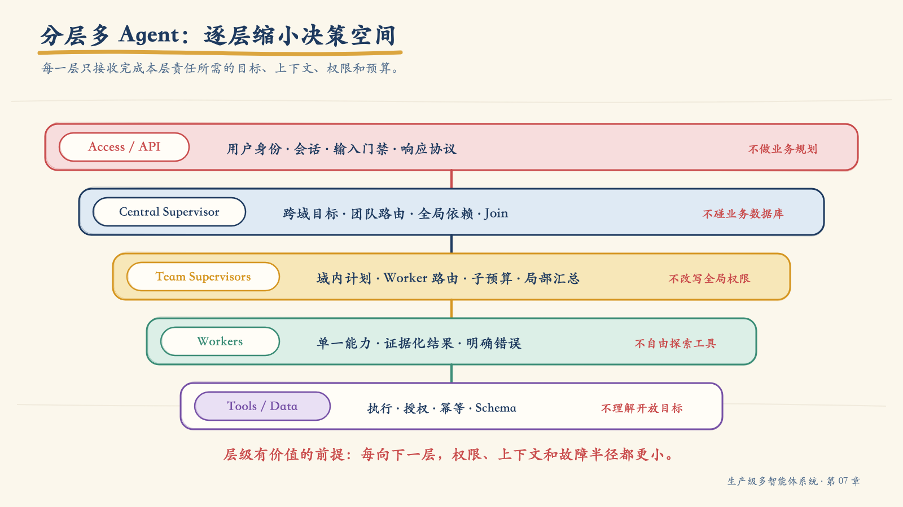
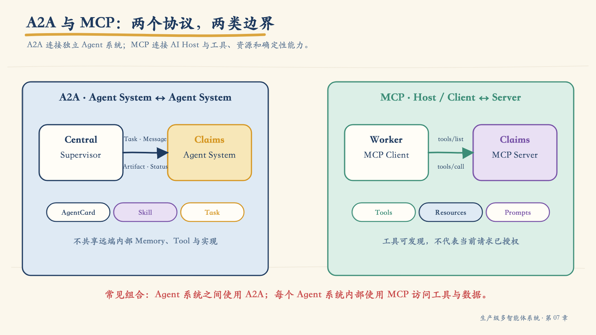
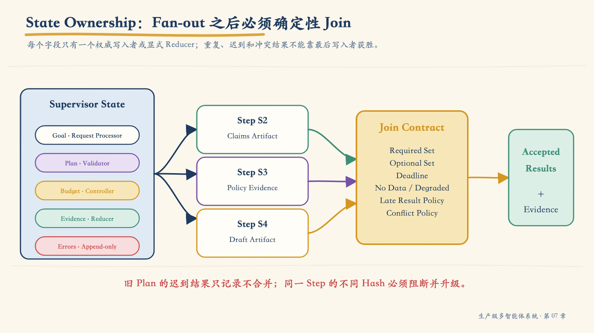
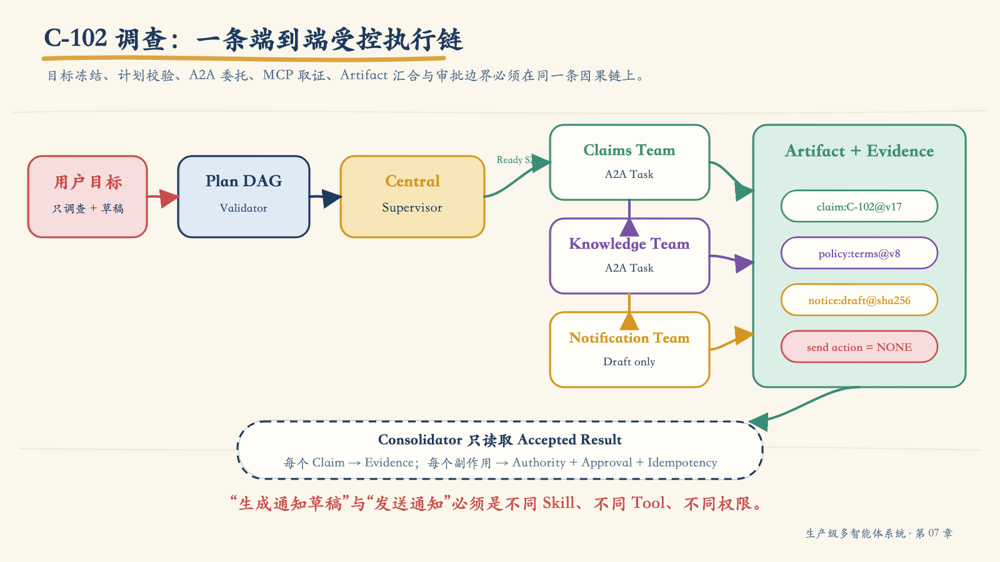
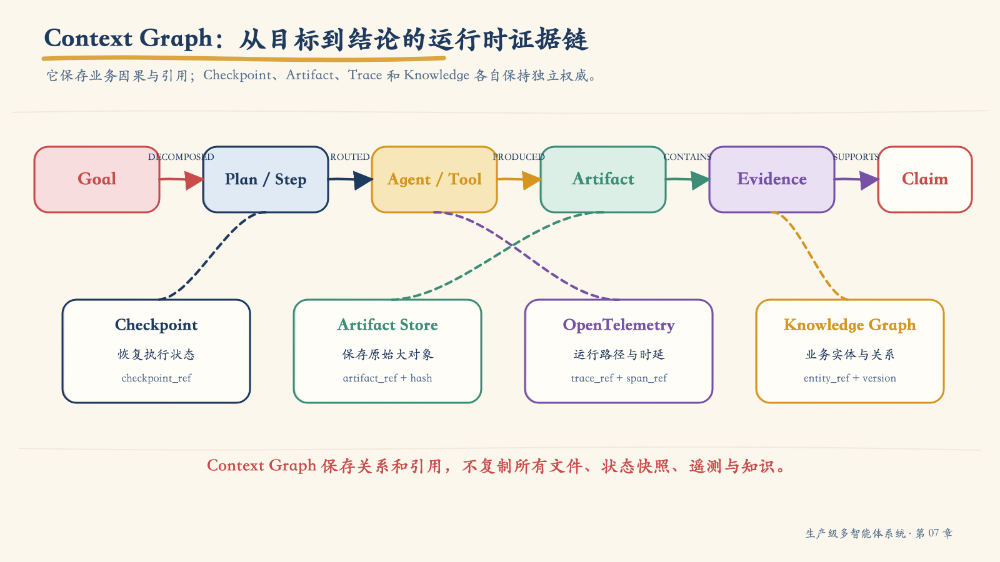
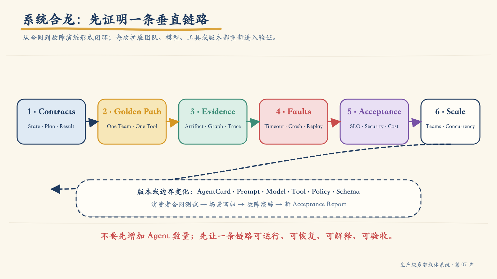

# 第 07 章：从组件拼装到系统合龙——分层多 Agent、Supervisor、A2A、MCP 与 Context Graph

前六章分别解决了 Agent 边界、工具调用、协作模式、上下文、生产平台和安全控制。本章要回答一个更难的问题：

> **这些能力怎样组成同一个可运行、可恢复、可解释、可验收的系统？**

支付事故调查系统已经能够检索知识、调用工具、记录 Trace，也能在高风险动作前执行 Tool Guard。此时，理赔运营人员提出了一个看似普通的请求：

> “帮我查清 C-102 为什么还没有处理完，告诉我缺什么。如果需要通知客户，先生成通知草稿，不要直接发送。”

这个请求至少横跨四类责任：

- 会员团队确认客户与租户身份；
- 理赔团队查询案件、材料和处理状态；
- 知识团队解释当前保单与补件规则；
- 通知团队生成草稿，但不得绕过审批执行发送。

如果只看 Demo，可以让四个 Agent 轮流说话。但生产系统必须继续回答：

- 谁把自然语言目标转成可执行计划？
- 哪些步骤可以并行，哪些必须等待？
- 中央层是否有资格直接访问理赔数据库？
- Agent 之间怎样发现能力、传递任务和接收产物？
- Agent 内部又怎样调用数据库、API 与文件工具？
- 某个团队超时后，系统返回失败、部分结果还是降级结果？
- 工具已经成功、Worker 却在写状态前崩溃，能否安全恢复？
- 最终结论能否回到具体数据版本、工具调用、权限和审批？

系统合龙，不是把 Agent “连通”，而是让**目标、权限、状态、依赖、证据、错误、预算和恢复语义**穿过多个进程后仍然一致。

本章沿 C-102 调查请求展开。我们先判断何时值得分层，再明确 Supervisor、A2A 与 MCP 的边界，随后把目标编译成 DAG，让状态、证据和恢复点进入 Context Graph，最后用故障注入和验收报告证明这不是一个只能顺利演示的系统。

!!! note "本章中的 Context Graph"
    `Context Graph` 是本书采用的运行时证据模型：它记录 Goal、Plan、Step、Agent、Tool、Evidence、Claim、Decision、Approval 与 Artifact 之间的关系。它不是 A2A、MCP 或 OpenTelemetry 的标准对象，也不等同于第四章的 Knowledge Graph。团队可以用图数据库、关系表、事件投影或混合存储实现这项责任。

## 1. 系统合龙的判断标准

一个多 Agent 系统不能因为“所有服务都返回了 200”就算合龙。更有意义的标准是：从任意最终结论出发，系统能否向后解释并在必要时恢复。

```text
最终 Claim
  → 来自哪个 TeamResult / Artifact
  → 由哪个 Step、哪个 Plan Version 产生
  → 哪个 Agent / Worker 执行
  → 调用了哪个版本的 Tool / MCP Server
  → 使用了什么身份、Scope 与审批
  → 读取了哪个版本的数据或文档
  → 失败后执行过什么重试、降级或补偿
```

这条链路至少需要满足六个性质：

| 性质 | 系统必须证明什么 |
|---|---|
| 可执行 | 自然语言目标已经变成有依赖、输入、预算和完成条件的计划 |
| 可约束 | 每次委托和工具调用都受身份、权限、任务范围与风险策略限制 |
| 可归并 | 并发结果、迟到结果、重复结果和冲突结果有确定的合并规则 |
| 可追溯 | 最终 Claim 能回到 Evidence、Artifact、数据版本和执行轨迹 |
| 可恢复 | 超时、崩溃、取消与未知副作用不会自动演变为重复动作 |
| 可验收 | 业务正确性、证据覆盖、安全不变量、SLO 和演练结果可度量 |

因此，本章的架构原则是：

> **LLM 提出计划和语义判断；Schema、Policy、State Machine、Scheduler、Reducer、Executor 与 Audit 决定什么能够发生，以及发生后怎样留下事实。**

## 2. 分层不是 Agent 越多越好

单 Agent 的上下文集中、调用链短、调试简单。对于低风险、工具少、共享上下文强的任务，它往往是更好的设计。

只有当系统存在真实的**领域、权限、状态、部署或故障边界**时，分层才有工程价值。

### 2.1 四个分层判断轴

1. **领域耦合**：任务能否稳定拆成合同明确的子目标？不同领域是否有自己的实体、规则和 Owner？
2. **风险隔离**：哪些能力涉及财务、隐私、外部通知或基础设施副作用？是否需要独立身份与审批？
3. **部署边界**：哪些能力需要独立扩缩容、独立密钥、独立发布节奏或由不同团队维护？
4. **时延预算**：多一次规划、网络往返和汇总，是否仍在用户可接受的关键路径内？

| 场景 | 更合适的形态 | 原因 |
|---|---|---|
| 一个领域、3 个只读工具、单轮问答 | 单 Agent | 分层只会增加协议与时延 |
| 路径稳定、规则明确、动作高风险 | 确定性工作流 | 应减少模型对控制流的影响 |
| 多领域、权限不同、结果可契约化 | 分层多 Agent | 能缩小上下文、权限与故障半径 |
| 跨组织或跨技术栈的独立 Agent 系统 | A2A + 内部编排 | 需要互操作而不暴露内部实现 |

!!! warning "组织结构不是系统边界"
    “财务部有一个 Agent、法务部有一个 Agent”不是充分理由。只有当它们拥有不同的数据、工具、权限、状态或生命周期，并且能用结果合同隔离，拆分才成立。

## 3. 五层职责：每一层都要有明确的“不负责”



*图 7-1　分层的价值是逐层缩小决策空间、权限和故障半径，而不是复制组织层级。*

本书使用五层作为讨论模型：

| 层 | 只负责什么 | 明确不负责什么 |
|---|---|---|
| Access / API | 用户身份、会话、输入门禁、响应协议 | 业务规划与工具执行 |
| Central Supervisor | 跨域目标分解、团队选择、全局依赖、预算与汇总 | 直接访问业务数据库或任意工具 |
| Team Supervisor | 域内实体解析、Worker 路由、团队子预算与局部汇总 | 改写全局目标或扩大用户权限 |
| Worker | 一个命名能力、受控工具调用、证据化结果 | 自由探索其他团队或重新规划全局任务 |
| Tool / Data | 确定性执行、资源级授权、幂等、Schema | 理解开放式用户目标 |

这五层不是五种大模型。Access、Scheduler、Reducer、Policy 和许多 Worker 完全可以是普通代码。

### 3.1 控制面与执行面

把所有逻辑放进 Supervisor Prompt，会让控制面和执行面重新混在一起。

**控制面**拥有：

- Goal 与约束；
- Plan Version；
- Ready Set 与依赖；
- Budget 与 Deadline；
- Policy Decision；
- Approval 与 Cancellation；
- Result Acceptance 与最终状态转换。

**执行面**拥有：

- Team / Worker 运行；
- 模型调用；
- MCP Tool Call；
- Sandbox 与适配器；
- 原始 Artifact 生成。

Supervisor 可以提出 `dispatch claims-team`，但不能因为自己“知道 SQL”就越过 Team 与 Tool 边界。执行面可以返回证据和错误，但不能自行宣布全局目标完成。

### 3.2 Supervisor 不是“权限最大的老板 Agent”

Supervisor 是一个编排责任，不是超级用户。

它至少应被拆成三个可独立验证的节点：

| 节点 | 输入 | 输出 | 确定性门禁 |
|---|---|---|---|
| Planner | Goal、能力快照、约束 | ExecutionPlan | Plan Validator |
| Router / Scheduler | Ready Steps、Registry、Budget | Dispatches | Policy、并发、Deadline |
| Consolidator | Accepted Results、Evidence | FinalAnswer | Claim-Evidence Validator |

这样做的意义不是增加服务，而是防止一个超级 Prompt 同时负责计划、授权、执行和自我验收。

## 4. Central、Team 与 Worker：三次收敛

一次跨域请求的决策空间应逐层收缩。

### 4.1 Central Supervisor：从用户目标到团队任务

中央层理解的是跨域目标：

```text
查明 C-102 未完成原因
├── 验证客户与租户身份
├── 查询理赔状态与缺失材料
├── 解释适用规则
└── 生成通知草稿，不允许发送
```

它选择 `member`、`claims`、`knowledge` 和 `notification` 团队，管理强弱依赖、全局预算和最终汇总。它不需要知道理赔数据库有哪张表。

### 4.2 Team Supervisor：从团队任务到命名能力

理赔团队收到的是已限定任务：

```text
skill: claim_status_and_missing_documents
claim_id: C-102
subject: tenant=t9, member=m42
allowed_actions: [read_claim, read_required_documents]
forbidden_actions: [update_claim, contact_customer]
deadline: 2026-07-23T09:00:08Z
```

Team Supervisor 可以选择查询状态和缺件清单的 Worker，并做局部汇总。它不能把 `claims:read` 扩大为 `claims:update`。

### 4.3 Worker：从命名能力到受控 Tool Call

Worker 的工作空间最小：

1. 验证输入 Schema、实体、租户与必要上下文；
2. 验证调用主体、Scope、Resource ACL 与 Purpose；
3. 检查 Deadline、Budget、Cancellation 与 Circuit Breaker；
4. 构造结构化参数，不把自由文本直接传给解释器；
5. 调用绑定的 MCP Tool；
6. 验证返回 Schema、来源、时间与业务不变量；
7. 生成 WorkerResult，并绑定 EvidenceRef；
8. 写 Trace 与 Context Graph 引用；失败时返回结构化错误。

如果 Worker 需要看到全部对话、全部团队和全部工具，说明边界已经失效。

## 5. A2A 与 MCP：不要让两个协议互相冒充



*图 7-2　A2A 连接独立 Agent 系统；MCP 连接 AI Host 与工具、资源和外部能力。*

A2A 1.0 面向独立、可能不透明的 Agent 系统之间的互操作。它定义 AgentCard、Message、Task、Part、Artifact，以及轮询、流式和推送等任务交互方式。

MCP 当前协议版本为 `2025-11-25`。它在 Host、Client 与 Server 之间标准化能力发现与调用，Server 可暴露 Prompt、Resource 和 Tool。MCP 也加入了实验性的 Tasks 能力，但这不意味着 MCP 已经变成 Agent 协作协议。

| 问题 | A2A | MCP |
|---|---|---|
| 主要边界 | 独立 Agent 系统之间 | AI Host / Client 与 Server 能力之间 |
| 发现对象 | AgentCard、Skills、Interfaces | Server Capabilities、Tools、Resources、Prompts |
| 主要交互 | Message、Task、Artifact | JSON-RPC 请求、Tool / Resource / Prompt |
| 长任务 | A2A Task 是核心对象 | MCP Tasks 在 2025-11-25 中仍属实验能力 |
| 内部状态 | 不要求公开远端内部状态、Memory 或 Tool | 不定义业务 Agent 的团队协作 |
| 授权 | 声明安全方案；每次操作仍需接收方授权 | HTTP 授权框架；资源与工具仍需业务授权 |

### 5.1 一个实用边界

```text
Central Supervisor（A2A Client）
  ── A2A Task / Message ──▶ Claims Agent System（A2A Server）
                               │
                               ├─ Team Supervisor
                               ├─ Claim Worker
                               └─ MCP Client ──▶ Claims MCP Server ──▶ Claims DB
```

A2A Server 对外暴露“查询理赔状态”这一业务能力。它内部使用什么框架、多少 Worker、什么数据库，不应成为中央层的前置知识。

### 5.2 协议不授予业务权限

以下推理都不成立：

- “AgentCard 里写了这个 Skill，所以当前用户可以调用。”
- “mTLS 成功，所以 Peer 可以访问这个租户的数据。”
- “A2A Token 有效，所以接收方可以跳过资源级 ACL。”
- “MCP Tool 出现在列表里，所以模型可以用任何参数执行。”

能力描述解决“宣称会什么”，认证解决“你是谁”，授权才解决“你能否代表此用户、为此目的、对这个资源执行此动作”。

## 6. 能力发现：从 AgentCard 到受控快照

A2A 的 AgentCard 描述 Agent 的身份、能力、技能、服务接口与安全要求。生产系统不应把互联网上发现的 Card 原样塞进 Planner。

能力进入计划前要经过四道处理：

| 阶段 | 控制 |
|---|---|
| Registry Ingest | 来源、签名、Owner、协议版本、健康、变更记录 |
| Capability Filter | 用户、租户、环境、风险、地区与数据分类 |
| Prompt Projection | 只投影 Planner 真正需要的 Skill 摘要 |
| Dispatch Revalidation | Endpoint、Audience、Scope、协议与合同版本 |

一个内部归一化快照可以这样表达：

```yaml
snapshot_id: cap-20260723-0900
source_agent_card:
  name: Claims Agent
  protocol_version: "1.0"
  signature_verified: true
interface:
  binding: HTTP+JSON
  url_ref: registry://agents/claims/v1
skills:
  - skill_id: claim-status
    description: 查询理赔状态和缺失材料
    input_schema: contracts/claim-status-input/1.2.0
    artifact_schema: contracts/claim-status-artifact/1.3.0
    risk: read_only
    latency_slo_ms: 2500
policy_projection:
  allowed_tenants: [t9]
  allowed_purposes: [claim_investigation]
  scopes: [claims:read]
expires_at: 2026-07-23T09:05:00Z
```

这是本系统的内部合同，不是 A2A AgentCard 的替代 Schema。分开保存能避免把本地权限决策误写进对外能力声明。

!!! tip "敏感能力不要全量公开"
    A2A 官方发现指南建议对包含敏感 URL 或 Skill 的 AgentCard 使用认证、授权和选择性披露；静态 Secret 不应写进 Card。

## 7. 把目标编译成可验证的 DAG

Planner 的产物不能只是一段“先查 A，再查 B”的文字。它必须能被确定性 Validator 和 Scheduler 读取。

```yaml
plan_id: plan-c102-18
version: 3
goal_id: goal-c102-7
steps:
  - id: s1
    team: member
    skill: resolve-member
    depends_on: []
    required: true
  - id: s2
    team: claims
    skill: claim-status
    depends_on: [s1]
    input_map:
      member_id: s1.artifact.member_id
    required: true
  - id: s3
    team: knowledge
    skill: policy-guidance
    depends_on: [s2]
    required: false
  - id: s4
    team: notification
    skill: draft-notice
    depends_on: [s2, s3]
    required: false
    side_effect: none
join:
  strategy: evidence_consolidation
  required_steps: [s1, s2]
  optional_steps: [s3, s4]
budget:
  max_steps: 6
  max_model_tokens: 12000
  max_tool_calls: 8
  deadline_ms: 9000
```

### 7.1 Plan Validator

执行任何步骤之前，Validator 至少检查：

- Schema 合法，`step_id` 唯一；
- Team / Skill 存在，协议和合同版本兼容；
- 依赖存在且无环；
- 必需输入可从上游 Artifact 映射；
- Step、Token、Tool、并发和 Deadline 在预算内；
- 用户、Workload 与任务对每个 Skill 的有效权限成立；
- 高风险步骤具有审批要求；
- Join 规则能判断完整、部分、降级、失败与取消；
- 最终 Claim 所需 Evidence 已在合同中声明。

Validator 不应偷偷补全未知字段后继续执行。它可以返回结构化诊断让 Planner 有界重规划，但 `replan_count` 必须受控。

### 7.2 Scheduler 只调度 Ready Set

```python
def ready(step, state):
    return (
        step.status == "pending"
        and all(state.steps[d].status == "completed"
                for d in step.strong_dependencies)
        and state.plan.version == step.plan_version
        and state.budget.remaining_ms > step.minimum_runtime_ms
        and not state.cancel_requested
    )
```

模型可以建议依赖，最终 Ready Set 必须由确定性代码计算。

## 8. State Contract：跨进程共享的是状态，不是聊天记录



*图 7-3　每个状态字段都需要唯一 Owner 或显式 Reducer；并发任务只能通过结果合同汇合。*

聊天消息适合表达对话，不适合承担分布式事务状态。Supervisor State 至少要区分：

```python
class SupervisorState(TypedDict):
    request_id: str
    session_id: str
    goal: Goal
    constraints: list[Constraint]
    plan: ExecutionPlan | None
    step_results: Annotated[dict[str, StepResult], merge_by_step_id]
    evidence: Annotated[list[EvidenceRef], dedupe_by_source_anchor]
    errors: Annotated[list[AgentError], append_only]
    approvals: dict[str, Approval]
    budget: BudgetState
    final_answer: FinalAnswer | None
    status: Literal[
        "received", "planned", "running", "blocked",
        "completed", "failed", "cancelled"
    ]
```

### 8.1 字段所有权

| 字段 | 权威写入者 | 合并规则 / 不变量 |
|---|---|---|
| Goal / Constraints | Request Processor | 创建后只能显式修订，禁止静默改写 |
| Plan | Planner + Plan Validator | 版本化；执行后修改必须产生 Replan Event |
| StepResult | 对应 Step Executor | `step_id + plan_version` 幂等归并 |
| Evidence | Worker / Tool Adapter | 按 Source + Anchor + Version 去重 |
| Errors | 所有执行节点 | Append-only，禁止吞错 |
| Budget | Budget Controller | 原子扣减，不接受 Agent 自报 |
| Approval | Approval Service | 与动作、资源、参数哈希、版本和有效期绑定 |
| FinalAnswer | Consolidator | 只能引用 Accepted Results 与 Evidence |

### 8.2 四条系统不变量

1. 任何 `completed` Step 都有符合合同的 Result；查询无结果必须写成 `no_data`。
2. 任何强依赖未完成时，下游 Step 都不能启动。
3. 任何最终业务 Claim 都绑定 `evidence_id`，或明确标记为推断及其不确定性。
4. 任何副作用都能回到授权、审批、Expected Version 和 Idempotency Key。

### 8.3 Result 状态不要混用

A2A Task State、MCP Task Status 与本系统的业务 Result Status 是三套不同层次的状态。

本书采用的业务结果词典是：

| 状态 | 业务语义 |
|---|---|
| completed | 合同满足，必需结果与证据齐全 |
| no_data | 查询成功但没有记录，不是技术失败 |
| partial | 已得到部分结果，明确列出缺失项 |
| degraded | 使用了降级路径，质量或时效受影响 |
| blocked | 等待输入、权限、审批或外部条件 |
| failed | 无法满足结果合同，附结构化错误 |
| cancelled | 用户、父任务或系统取消 |

协议适配器必须显式映射，不能假设名字相似就等价。例如，A2A 的 `TASK_STATE_INPUT_REQUIRED` 可以映射为本地 `blocked`，但映射原因和恢复条件要保留。

## 9. 一条请求如何跑完全程



*图 7-4　一个用户目标被编译为受合同约束的任务图，所有结论最终汇入证据与审批边界。*

现在沿 C-102 请求走一遍。

### 9.1 接入：先冻结目标和安全边界

Gateway 完成用户认证、租户解析、速率限制和输入检查，创建：

```yaml
request_id: req-7f2
session_id: ses-91
trace_id: 4bf92f3577b34da6a3ce929d0e0e4736
goal:
  purpose: claim_investigation
  claim_id: C-102
  requested_outputs:
    - cause
    - missing_documents
    - next_action
    - notification_draft
constraints:
  - notification_must_not_be_sent
  - no_claim_update
  - evidence_required_for_business_claims
```

“不要发送”不是普通提示词，而是进入 Goal Contract 的禁止动作。

### 9.2 规划：模型提议，Validator 裁决

Planner 基于经过权限过滤的能力快照生成 DAG。Validator 发现通知 Skill 只有 `draft-notice`，没有 `send-notice`，因此计划合法。

Plan Version 3 被写入状态和事件日志。后续所有 Dispatch 与 Result 都必须携带该版本。

### 9.3 中央路由：按依赖与预算签发最小委托

Scheduler 先派发 `s1`。`s1` 完成后，`s2` 进入 Ready Set。每个 Dispatch 只获得当前 Step 所需 Scope 与 Deadline。

```yaml
dispatch_id: dsp-s2-v3
task_ref: req-7f2
step_id: s2
plan_version: 3
target_agent: claims-agent
skill: claim-status
scopes: [claims:read]
forbidden_actions: [claims:update, notify:send]
deadline: 2026-07-23T09:00:08Z
input_ref: artifact://req-7f2/s1/member-resolution@sha256:...
```

### 9.4 A2A 委托：远端系统独立验权

Claims Agent 验证：

- A2A 协议版本与接口；
- 调用方工作负载身份；
- Token Audience、Expiry 与 Scope；
- Task / Context 可见性；
- Skill 是否存在；
- 用户、租户、Purpose 与资源 ACL；
- Message / Part 的媒体类型与 Schema。

认证通过不代表授权通过。Claims Agent 必须基于自己的 Policy 重新计算权限。

### 9.5 团队执行：Worker 通过 MCP 取证

Team Supervisor 选择 `claim-status-worker`。Worker 的 MCP Client 只连接只读 Claims MCP Server，并只暴露：

```text
claims.get_status
claims.list_missing_documents
```

工具结果进入 WorkerResult 前经过输出 Schema、租户、版本和 Evidence Anchor 检查。

### 9.6 Artifact：结果不是聊天消息

A2A 1.0 明确区分 Message 与 Artifact：Message 用于发起任务、澄清和状态交互；任务输出应通过 Artifact 交付。

理赔团队返回：

```yaml
artifact_id: art-claims-c102-v17
name: claim-status
media_type: application/json
schema: contracts/claim-status-artifact/1.3.0
data:
  claim_id: C-102
  status: pending_documents
  missing_documents:
    - accident_report
  updated_at: 2026-07-22T14:11:09Z
evidence:
  - evidence_id: ev-391
    source: claims-db
    anchor: claim:C-102@v17
    observed_at: 2026-07-23T09:00:02Z
content_hash: sha256:...
```

### 9.7 依赖推进：先形成政策解释，再生成通知草稿

`s2` 完成后，知识团队解释为什么缺少事故证明会阻塞处理。`s3` 被接受后，通知团队只接收理赔事实与已接受的政策结论，生成草稿 Artifact。其他互不依赖的只读调查步骤仍可并行，但这条链路不能为了降低时延而跳过内容依赖。

草稿不是副作用；发送是另一项受保护动作。两者必须是不同 Skill、不同 Tool 和不同权限。

### 9.8 Join：完整、部分与降级由合同决定

如果知识团队超时，但 `s1` 和 `s2` 已完成：

- 理赔状态和缺件事实仍可返回；
- 政策解释标记缺失；
- 通知草稿可能因缺少政策措辞而跳过；
- 全局状态为 `degraded`，不能伪装成 `completed`；
- 用户看到缺失项和影响。

### 9.9 Consolidation：只从 Accepted Results 生成答案

Consolidator 不读取任意 Worker 对话，只读取：

- 已通过合同验证的 Artifact；
- Accepted StepResult；
- EvidenceRef；
- Warnings、Missing Steps 与 Policy Decisions。

最终回答中的“C-102 正在等待事故证明”绑定 `ev-391`；“提交后会继续审核”绑定当前保单条款 Evidence；通知内容标记为草稿且没有执行发送动作。

## 10. A2A 合同：上下文、任务和产物要分开

A2A 的 `contextId` 用于把相关 Task 与 Message 逻辑归组，`taskId` 表示一个有生命周期的工作单元。不要把它们与内部 `request_id`、`plan_id`、`step_id` 混成一个字段。

推荐维护显式关联：

```yaml
correlation:
  request_id: req-7f2
  goal_id: goal-c102-7
  plan_id: plan-c102-18
  plan_version: 3
  step_id: s2
  a2a_context_id: ctx-claims-92
  a2a_task_id: task-claims-882
  trace_id: 4bf92f3577b34da6a3ce929d0e0e4736
```

### 10.1 任务状态不是可靠事件日志

A2A 支持轮询、流式更新和 Push Notification。客户端断开后可能错过瞬时状态消息；关键事实不能只存在流式文本中。

因此：

- 业务结果进入 Artifact；
- 状态变化进入持久事件；
- 当前视图进入 State Store；
- 可观测数据进入 Trace / Metric / Log；
- 因果与证据关联进入 Context Graph。

### 10.2 版本必须显式

A2A 1.0 客户端应在请求中声明 `A2A-Version`。系统需要分别管理：

- A2A Protocol Version；
- AgentCard / Interface Version；
- 本地 Skill Contract Version；
- Artifact Schema Version；
- Plan Version。

协议向后兼容不代表业务 Schema 自动兼容。消费者合同测试仍然不可省。

## 11. MCP 合同：工具调用仍是特权边界

MCP Tool Description 帮助模型理解能力，Tool Input Schema 约束结构；它们都不能替代资源级授权。

一个生产 Tool Contract 至少应登记：

```yaml
tool: claims.get_status
server: claims-read-mcp
protocol_version: "2025-11-25"
input_schema: contracts/claims-get-status-input/2.0.0
output_schema: contracts/claims-get-status-output/2.1.0
side_effect: none
required_scopes: [claims:read]
resource_binding: tenant_id + claim_id
timeout_ms: 1200
idempotency: not_applicable_read
evidence:
  source_field: source
  anchor_field: record_version
task_support: forbidden
```

### 11.1 MCP Tasks 的使用边界

MCP `2025-11-25` 引入实验性的 Tasks，可为某些耗时 Tool Call 提供持久状态、轮询、结果读取与取消。使用前必须：

- 双方在初始化阶段声明 Tasks Capability；
- Tool 通过 `execution.taskSupport` 声明 required、optional 或 forbidden；
- 调用方处理 `working`、`input_required`、`completed`、`failed`、`cancelled`；
- 不把可选状态通知当成唯一可靠来源。

如果远端是一个拥有独立目标、技能、Artifact 与协作生命周期的 Agent 系统，优先使用 A2A；如果只是一个耗时确定性工具，可考虑 MCP Task。边界由责任模型决定，不由“调用持续多久”单独决定。

## 12. Join 与 Reducer：并发之后必须确定性收敛

Fan-out 容易，Join 才是真正的系统设计。

### 12.1 Join Contract

```yaml
join_id: join-c102
required_steps: [s1, s2]
optional_steps: [s3, s4]
completion_rule: all_required_terminal
success_rule: all_required_completed
deadline: 2026-07-23T09:00:09Z
on_optional_failure: degraded
on_required_no_data: completed_with_no_data
on_required_failure: failed
late_result_policy: record_but_do_not_merge
conflict_policy: block_and_escalate
```

Join 需要回答：

- 等谁？
- 等到什么时候？
- 哪些步骤是必需的？
- `no_data` 是否满足完成条件？
- 可选步骤失败后是 `partial` 还是 `degraded`？
- Late Result 是否还能进入最终答案？
- 两份 Evidence 冲突时谁有裁决权？

### 12.2 Reducer

```python
def apply(result, state):
    if result.plan_version != state.plan.version:
        return state.record_stale_result(result)

    existing = state.step_results.get(result.step_id)
    if existing:
        return state.require_same_hash(existing, result)

    contract = state.plan.contract_for(result.step_id)
    validated = contract.validate(result)
    state.step_results[result.step_id] = validated
    state.evidence = merge_evidence(state.evidence, validated.evidence)
    return state
```

同一步骤的重复结果：

- Hash 相同：幂等接受；
- Hash 不同：不能“最后写入者获胜”，必须记录冲突并阻断。

## 13. Context Graph：保存可解释因果，不承担所有存储



*图 7-5　Context Graph 把 Goal、Task、执行、证据、结论和审批连接起来，但原始大对象仍由 Artifact Store 保存。*

一个最小节点模型：

| 节点 | 关键字段 | 典型边 |
|---|---|---|
| Goal | Owner、Purpose、Constraints、Status | DECOMPOSED_INTO |
| Plan / Step | Version、Team、Skill、Required、Status | DEPENDS_ON、ROUTED_TO |
| Agent / Tool | Identity、Contract、Deployment | EXECUTED_BY、CALLED |
| Result / Artifact | Schema、Status、Hash、Trace Ref | PRODUCED |
| Evidence | Source、Anchor、Observed At、ACL | SUPPORTS |
| Claim / Decision | Text、Confidence、Policy | DERIVED_FROM |
| Error / Approval | Category、Actor、Expiry、Resolution | BLOCKED_BY、AUTHORIZED_BY |

### 13.1 Context Graph 不是 Knowledge Graph

Knowledge Graph 回答：

> C-102 属于哪个客户？保单、事故与材料之间是什么业务关系？

Context Graph 回答：

> 为什么本次运行得出“等待事故证明”？哪个步骤读取了哪个版本的数据？哪个审批允许了什么动作？

两者可以互相引用，但生命周期、权限和事实语义不同。

### 13.2 Context Graph 不是 Trace

OpenTelemetry Trace 描述请求经过哪些操作、耗时多少、哪里报错。Context Graph 描述业务目标、计划、证据和决策关系。

推荐双向引用：

```text
Step Node ── trace_ref ──▶ Span / Trace
Span Attributes ── goal.id / task.id / step.id ──▶ Context Graph Node
```

异步队列导致新 Trace 时，可以用 OpenTelemetry Span Link 表达跨 Trace 因果关系。

## 14. Checkpoint、Event Log、Artifact 与 Context Graph 各有 Owner

| 机制 | 负责什么 | 不应承担什么 |
|---|---|---|
| Checkpoint | 恢复某一执行状态 | 完整审计与业务因果解释 |
| Event Log | 保存不可变状态变化与重放输入 | 直接充当查询友好的当前视图 |
| State Store | 当前任务、步骤、预算与锁 | 保存所有历史和大对象 |
| Context Graph | 计划、执行、证据、Claim 与审批关系 | 保存大文件或每条遥测细节 |
| Artifact Store | 原始工具输出、报告、文件、快照 | 流程调度 |
| Trace / Metric / Log | 运行诊断、时延、错误、容量与告警 | 业务事实的最终裁决 |

“一个数据库存所有东西”在物理上可能可行，但逻辑 Owner 仍必须分开。否则恢复逻辑会误把审计事件当当前状态，或把 Trace 采样当完整业务证据。

### 14.1 推荐写入顺序

对于只读步骤：

1. 写 Step Started Event；
2. 执行 Tool Call；
3. 保存原始 Artifact；
4. 验证 Result 与 Evidence；
5. 原子写 StepResult / Outbox；
6. 投影 Context Graph；
7. 完成 Trace Span；
8. Scheduler 解锁下游。

对于副作用：

1. 固定 `command_id / idempotency_key`；
2. 写 Intent；
3. 重新授权并绑定 Approval；
4. 执行外部动作；
5. 查询或记录 Side Effect State；
6. 写 Completed / Failed Event；
7. 更新 State、Artifact 与 Context Graph；
8. 任何不确定结果进入 Reconcile，不得盲重试。

## 15. 恢复、取消和未知副作用

最危险的故障不是明确失败，而是“不知道外部动作是否成功”。

| Side Effect State | Safe to Retry | 恢复动作 |
|---|---|---|
| not_started | 是 | 使用相同 Idempotency Key 有界重试 |
| unknown | 否 | 查询外部系统或人工核对 |
| completed | 否 | 读取既有结果，幂等归并 |
| partially_completed | 条件式 | 执行补偿或人工介入 |

### 15.1 Checkpoint 恢复不等于继续用旧凭证

恢复时必须重新检查：

- 用户与 Workload 身份是否仍有效；
- Delegation 与 Approval 是否过期；
- 资源版本是否变化；
- Deadline 与 Budget 是否还有余量；
- Plan Version 是否仍是当前版本；
- 已完成外部动作能否通过 Idempotency / Reconcile 识别；
- Cancellation 是否已经传播。

Token、Nonce 和短期审批不能因为写进 Checkpoint 就获得更长生命。

### 15.2 取消是一项分布式状态转换

父 Goal 进入 `cancelling` 后：

1. 不再启动新的 Ready Step；
2. 向 Running A2A / MCP Task 发送取消；
3. Worker 定期检查 Cancellation Token；
4. 已开始的副作用转入 Reconcile 或补偿；
5. Late Result 记录但不污染已取消状态；
6. Context Graph 记录 `CANCELLED_BY` 和未决动作。

取消请求成功返回，只能证明“系统接受了取消意图”，不能证明所有外部动作瞬间停止。

## 16. 上下文压缩：三处压缩，三种损失预算

多层系统不应把完整会话和全局 State 复制给每个 Agent。压缩发生在三个不同位置：

| 位置 | 可压缩 | 必须保留 |
|---|---|---|
| 会话 → Central | 寒暄、重复表达、已完成细节 | Goal、约束、实体、否定、待办 |
| Central → Team | 其他团队信息、冗余解释 | 依赖字段、Scope、Deadline、风险 |
| Tool Result → Result | 展示字段、重复行、低相关片段 | 来源、Anchor、关键事实、异常、时效 |

一个压缩合同至少包含：

```yaml
compressed_context:
  preserved_constraints:
    - notification_must_not_be_sent
    - evidence_required
  resolved_entities:
    claim_id: C-102
    member_id: m42
  facts:
    - claim_status: pending_documents
  open_questions:
    - policy_effective_date
  evidence_refs: [ev-391]
  omitted_sections:
    - greeting
    - unrelated_session_history
  source_hash: sha256:...
  compressor_version: 2.1.0
```

压缩质量不能只看 Token 减少比例，还要测试金额、日期、否定、禁止动作、错误与 Evidence Anchor 的保持率。

## 17. 可观测性：一条 Trace 穿过多个责任平面

一次请求应能用共同的关联键串起：

```text
goal.id
request.id
plan.id + plan.version
task.id
step.id
agent.id
tool.name
trace.id + span.id
artifact.id
evidence.id
```

| 平面 | 关键指标 |
|---|---|
| 业务 | Goal Success、升级率、业务正确率、端到端 SLA |
| Agent | Plan Valid、Routing Precision、Handoff、Replan、Step Retry |
| 模型 | Prompt Version、Token、Latency、Structured Output Failure |
| Tool / Infra | Tool Success、Queue Depth、DB Latency、CPU / Memory |
| 安全 | Denied Action、Approval、Replay、Injection、DLP |
| 成本 | 按 Request / Team / Worker / Model / Tool 归因的成本 |

### 17.1 不要只盯平均时延

分层系统的用户体验由 DAG Critical Path 和最慢依赖决定。核心指标包括：

| 指标 | 定义 | 诊断价值 |
|---|---|---|
| Goal Success Rate | 满足用户目标且通过业务验收的比例 | 北极星，不等同 HTTP 200 |
| Plan Valid Rate | 首个计划通过验证的比例 | 能力描述与 Planner 质量 |
| Routing Precision | 目标路由到正确 Team / Worker 的比例 | 路由器质量 |
| Evidence Coverage | 有证据 Claim / 需证据 Claim | 可信与合规 |
| Critical Path Latency | DAG 最长依赖路径耗时 | 真正的体验瓶颈 |
| Recovery Success | 可恢复故障中自动恢复成功比例 | 韧性 |
| Cost per Successful Goal | 总成本 / 成功目标数 | 防止“便宜但无效” |

安全不变量不能被平均数稀释，例如：

```yaml
unauthorized_side_effects: 0
cross_tenant_data_leaks: 0
duplicate_high_risk_actions: 0
```

## 18. 先做垂直切片，再横向增加 Agent



*图 7-6　先证明一条端到端链路的合同、证据和恢复，再增加团队、并发与动态能力。*

推荐里程碑：

| 里程碑 | 必须证明 |
|---|---|
| M1 合同 | State、Plan、Dispatch、Result、Error、Evidence 与版本可独立验证 |
| M2 单路径 | 一个 Team / Worker / MCP 正确完成并产出 Evidence |
| M3 多团队 | 依赖、并行、Join、Artifact 与 Context Graph 成立 |
| M4 故障 | 超时、重复、崩溃、取消和未知副作用可安全恢复 |
| M5 生产门禁 | 权限、预算、可观测、SLO、回滚与验收证据齐全 |

一个合理的代码结构是：

```text
contracts/
  state/ plan/ dispatch/ result/ error/ evidence/
services/
  access_api/
  central_supervisor/
  teams/member/
  teams/claims/
  teams/knowledge/
  teams/notification/
mcp/
  member_tools/
  claims_tools/
  knowledge_tools/
runtime/
  scheduler.py
  reducer.py
  checkpoint.py
  context_graph.py
security/
  delegation.py
  policy.py
  approval.py
observability/
  tracing.py
  metrics.py
  audit.py
tests/
  contract/
  planner/
  routing/
  recovery/
  e2e/
```

目录不是架构本身，但它能暴露一个事实：如果 Plan Validator、Policy、Reducer 和 Context Graph 全部藏在 `supervisor_prompt.py`，系统还没有真正建立控制边界。

## 19. 测试与故障演练：证明失败时仍然正确

| 层 | 测试对象 | 代表性断言 |
|---|---|---|
| Static | Schema、AgentCard、配置、Prompt Variables | 版本兼容，无未声明字段 |
| Unit | Validator、Scheduler、Reducer、Policy | 确定性不变量成立 |
| Contract | A2A、MCP、Result、Error、Artifact | 生产者与消费者兼容 |
| Component | Team + Fake MCP | 路由、证据和错误语义正确 |
| Integration | 真实 DB、Queue、Graph、Trace | 状态与可观测一致 |
| Failure | 超时、重放、崩溃、部分副作用 | 安全恢复，无重复动作 |
| E2E | 真实用户目标 | 业务正确、证据完整、SLO 达标 |

### 19.1 八个必做故障实验

| 实验 | 注入方式 | 通过标准 |
|---|---|---|
| F1 非法计划 | 未知 Skill、环依赖、超预算 | Validator 阻断，无 Tool Call |
| F2 A2A 超时 | 延迟 Team 响应 | Deadline 内恢复或明确 Degraded |
| F3 MCP 脏 Schema | 删除必需字段 | Worker 拒绝，Result 不入 State |
| F4 Worker 崩溃 | Tool 成功后、状态写入前 Kill | Reconcile，无重复副作用 |
| F5 过期 Token | 从旧 Checkpoint 恢复 | 重新认证授权，不复用旧 Token |
| F6 Context Graph 不可用 | 阻断图写入 | 按关键性 Fail Closed 或受控缓冲 |
| F7 取消竞争 | Running 时 Cancel | 停止下游，记录未决动作 |
| F8 Provider 故障 | 主模型持续 5xx | 熔断与受控 Fallback，记录版本变化 |

场景 Fixture：

```yaml
scenario_id: E2E-CLAIM-007
goal: 查询 C-102 状态并给出下一步
faults:
  - at: knowledge.worker
    inject: timeout
expected:
  status: degraded
  required_steps: [s1, s2]
  missing_steps: [s3, s4]
  answer_contains: [pending_documents, accident_report]
  evidence_min: 1
  notification_sent: false
  duplicate_side_effects: 0
  audit_complete: true
```

## 20. System Acceptance：从“能跑”到“允许发布”

系统完成的定义不应是“所有 Agent 已连接”，而应覆盖：

### 20.1 架构与合同

- 五层职责、部署边界、信任边界和 ADR 已评审；
- State、Plan、Step、Result、Error、Evidence、AgentCard 映射全部版本化；
- 所有跨层字段有 Owner、Reducer 和兼容策略；
- A2A 与 MCP 边界清晰，协议没有替代业务授权。

### 20.2 正确性与恢复

- 计划验证、依赖调度、Join 和降级语义通过测试；
- Checkpoint、Event Log、Context Graph、Artifact 与 Trace 的 Owner 明确；
- 重复、乱序、旧 Plan Result、取消和未知副作用可处理；
- 故障演练通过，没有重复高风险动作。

### 20.3 安全与运营

- 用户 → Workload → Delegation → Task → Tool 权限链可追溯；
- Token 与 Approval 不随 Checkpoint 恢复而复用；
- 业务、Agent、模型、工具、安全和成本指标可按 Trace 关联；
- 告警有 Runbook、Owner、升级路径与演练记录；
- 灰度、回滚、备份、保留和删除策略可执行。

### 20.4 业务验收

- Golden Scenarios 中必需业务结果正确；
- 高风险 Claim 的 Evidence Coverage 达标；
- 用户能区分 `partial`、`degraded`、`no_data` 和 `failed`；
- 业务 Owner 签署剩余风险、SLO 和已知限制。

```yaml
release: chapter07-reference-v1.0
scope:
  teams: [member, claims, knowledge, notification]
  skills: [resolve-member, claim-status, policy-guidance, draft-notice]
quality:
  goal_success_rate: 98.2%
  plan_valid_rate: 96.4%
  evidence_coverage: 100%
  p95_latency_ms: 7420
reliability:
  recovery_success_rate: 97.5%
  failure_drills_passed: 8/8
  duplicate_side_effects: 0
security:
  unauthorized_side_effects: 0
  notification_sent_without_approval: 0
  replay_block_rate: 100%
decision: go_with_guardrails
known_limits:
  - knowledge team may degrade during index rebuild
owners:
  business: claims-ops
  engineering: agent-platform
  security: appsec
```

| Gate | Go | No-Go |
|---|---|---|
| 合同 | 生产者与消费者兼容，Migration 已演练 | 未版本化或破坏兼容 |
| 业务 | 关键场景达标，限制已接受 | Goal Success / Evidence 不达标 |
| 恢复 | 演练通过，重复副作用为 0 | Unknown Side Effect 无处置 |
| 安全 | 最小权限、审批、审计与 DLP 通过 | 可越权、可重放或跨租户 |
| 运营 | SLO、告警、Runbook、On-call 就绪 | 只能靠开发者手工观察 |
| 回滚 | 旧版本和数据迁移可回退 | 不可逆变更无补偿 |

## 21. 常见误判

### 21.1 “Supervisor 能调用所有 Agent，所以它应该拥有所有权限”

错误。Supervisor 只拥有调度责任。每次委托的有效权限仍是用户、Workload、任务、Skill、资源、环境与审批的交集。

### 21.2 “用了 A2A，就不需要内部状态机”

错误。A2A 定义跨 Agent 系统的互操作对象和操作，不替你定义业务 DAG、Join、Budget、Policy 与 Reducer。

### 21.3 “用了 MCP Task，就可以把远端 Agent 当工具”

不一定。MCP Task 解决耗时请求的持久执行；如果远端拥有独立目标、技能发现、协作状态和 Artifact，A2A 的责任模型更匹配。

### 21.4 “Context Graph 是新的唯一数据库”

错误。它是因果与证据关系的权威视图，不应吞并 Artifact、Checkpoint、Event 与 Trace 的职责。

### 21.5 “有 Trace，就能解释最终答案”

Trace 能告诉你发生了什么操作，不自动证明某个 Claim 来自哪个数据版本。业务解释仍需 Evidence 与 Context Graph。

### 21.6 “所有必需服务都健康，系统就 Ready”

Readiness 还需要检查合同版本、关键状态层、审计写入、能力快照、模型 Fallback 与安全依赖。进程存活不代表可以接收新目标。

## 22. 架构评审清单

- 是否有一个组件同时负责规划、授权和执行？
- Central Supervisor 是否直接访问业务数据或任意工具？
- Team / Worker 的输入输出是否都有版本化 Schema？
- Plan 是否在执行前检查能力、依赖、环、预算、权限和风险？
- 能力发现是否经过签名、Allowlist、版本和权限过滤？
- A2A 接收方是否对每次操作重新授权？
- MCP Tool 是否执行参数校验、幂等、输出校验和审计？
- State 字段是否有唯一 Owner 或明确 Reducer？
- 旧 Plan 的 Late Result 是否可能污染新状态？
- 外部动作成功、本地写入失败时如何 Reconcile？
- Checkpoint 恢复时是否重新认证、授权并检查 Deadline？
- Cancellation 是否传播到 Running Step，并处理未知副作用？
- Context Graph 是否能从 Claim 回到 Plan、Tool 与 Evidence？
- 压缩是否保留约束、否定、金额、日期、错误和 Evidence Anchor？
- `partial`、`degraded`、`no_data` 是否与 `completed` 明确区分？
- 业务、Agent、模型和工具是否共享关联 ID？
- 是否有自动化故障演练和明确通过标准？
- 部署、Readiness、灰度、回滚、备份与 Runbook 是否就绪？

## 23. 本章结论

多 Agent 系统真正的“合龙点”不是 Supervisor Prompt，而是一组跨边界仍成立的合同：

- 分层只在能缩小上下文、权限和故障半径时采用；
- Central Supervisor 负责跨域计划，Team Supervisor 负责域内收敛，Worker 负责单一能力；
- A2A 连接独立 Agent 系统，MCP 连接工具与资源，两者都不替代业务授权；
- Goal 被编译成版本化 DAG，Validator、Scheduler 与 Reducer 决定可执行状态；
- State、Checkpoint、Event、Artifact、Context Graph 与 Trace 各自拥有明确责任；
- Join、Late Result、Cancellation 与 Unknown Side Effect 有确定语义；
- 每个最终 Claim 都能回到 Agent、Tool、权限、数据版本与 Evidence；
- 系统只有通过场景测试、故障演练、安全不变量、SLO 与验收报告，才有资格发布。

当你能从“C-102 为什么未完成”这个结论，一路回到 `claim:C-102@v17`、对应 Tool Call、A2A Task、Plan Version、Scope 和审批边界时，系统才不再是一组会互相说话的 Agent，而是一套可以运营的生产系统。

## 参考资料

- [A2A Protocol 1.0 Specification](https://a2a-protocol.org/latest/specification/)
- [A2A Agent Discovery](https://a2a-protocol.org/latest/topics/agent-discovery/)
- [Model Context Protocol Architecture](https://modelcontextprotocol.io/docs/learn/architecture)
- [MCP 2025-11-25 Tools](https://modelcontextprotocol.io/specification/2025-11-25/server/tools)
- [MCP 2025-11-25 Authorization](https://modelcontextprotocol.io/specification/2025-11-25/basic/authorization)
- [MCP 2025-11-25 Tasks（实验能力）](https://modelcontextprotocol.io/specification/2025-11-25/basic/utilities/tasks)
- [LangChain Multi-Agent Subagents](https://docs.langchain.com/oss/python/langchain/multi-agent/subagents)
- [OpenTelemetry Traces](https://opentelemetry.io/docs/concepts/signals/traces/)

本章配套的可复制合同见[《多 Agent 系统合龙与验收契约》](../toolkit/multi-agent-system-integration-contract.md)。
