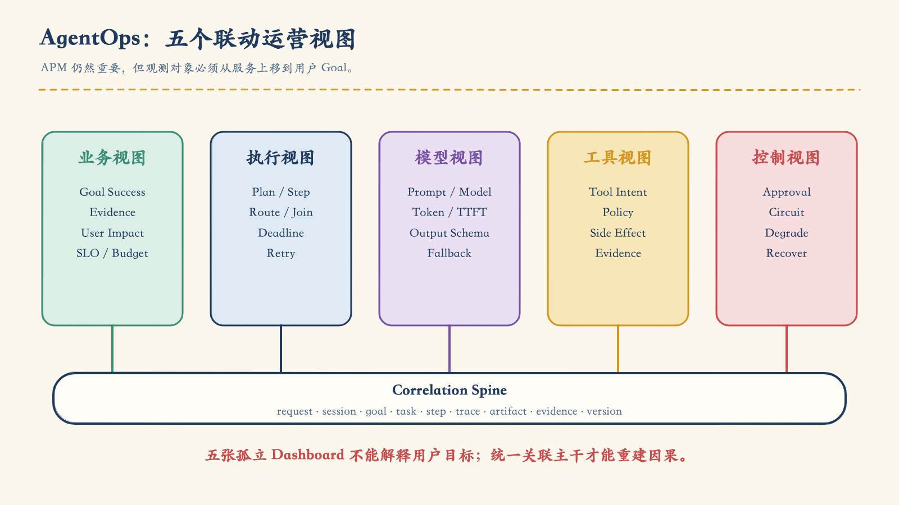
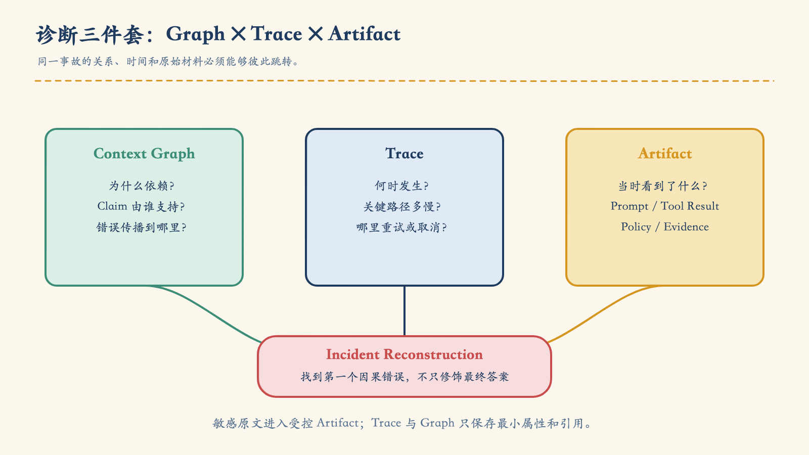
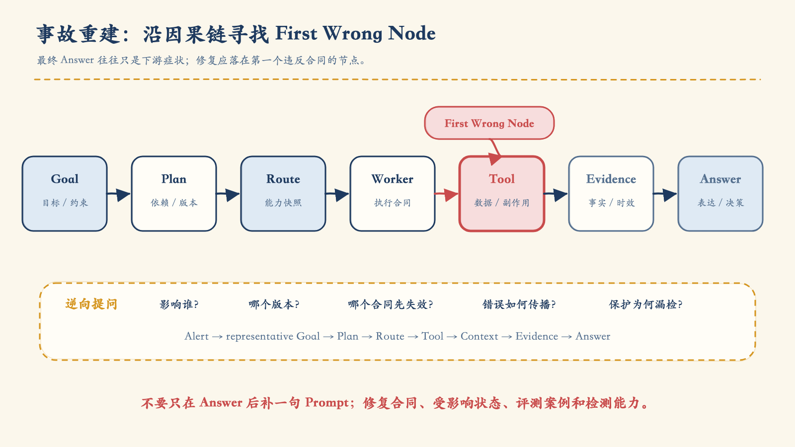
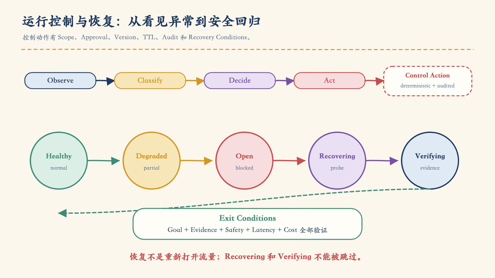
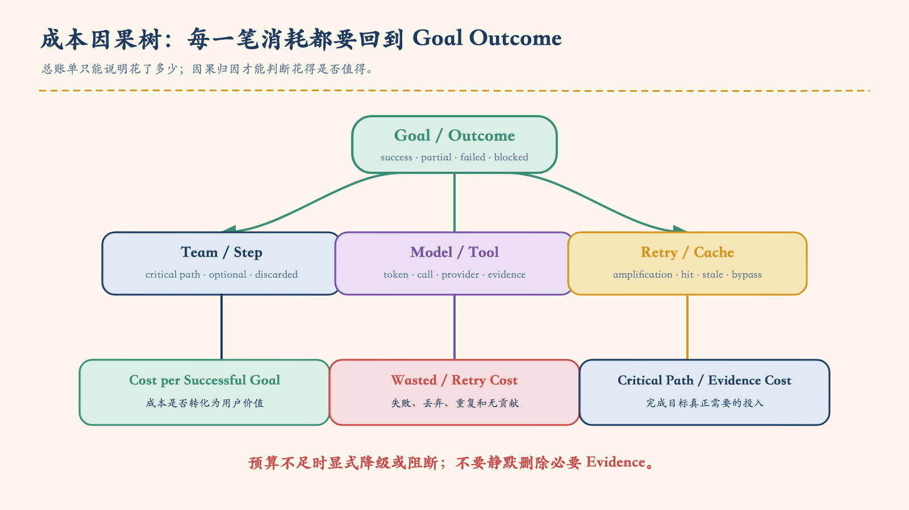
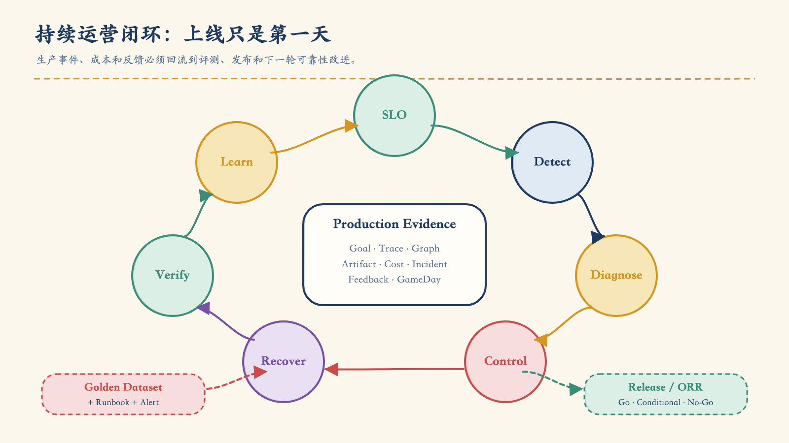

# 第 09 章：上线只是运营的第一天——AgentOps、事件诊断、韧性与持续优化

第八章结束时，C-102 理赔调查系统已经通过离线回归、N-run 和灰度门禁。新版本的 Planner Prompt 能更快识别“只生成通知草稿，不要发送”这条约束，证据覆盖率也优于旧版本。团队完成发布，仪表盘一片绿色：

- API 请求成功率没有明显下降；
- CPU、内存和 Pod 数量都在正常区间；
- 模型 Provider 没有大面积报错；
- 数据库连接池也没有耗尽。

可是客服很快报告了一种难以解释的异常：少量案件的答案引用了正确的理赔状态，却漏掉了关键材料；另一些案件的最终文字没有错误，完成时间和成本却突然翻倍。更棘手的是，一条关于 C-099 的历史记忆被错误地合并进 C-102 的解释，最终答案仍返回了 HTTP 200。

传统 APM 会告诉我们“服务还活着”。它无法独自回答：

- 用户的目标究竟有没有完成？
- Planner 为什么生成了这条计划？
- Router 为什么把任务交给了这个 Team？
- 哪个上下文片段改变了模型判断？
- 工具结果是“事实不存在”，还是“本次没有取到数据”？
- 哪个 Claim 缺少 Evidence？
- 重试是在恢复故障，还是在放大成本和副作用？
- 此刻应该继续观察、降级、熔断、回滚，还是转人工？

这正是 AgentOps 要处理的生产问题。

> **AgentOps 不是给 LLM 加一张 Dashboard，而是围绕 Goal、Plan、Route、Tool、Evidence、Decision 与 Control，建立可诊断、可干预、可恢复、可持续优化的运营系统。**

“AgentOps”目前不是一套统一的行业标准。本章把它作为一种工程责任边界：多 Agent 系统进入生产后，团队如何看见用户目标、重建因果链、执行受审计的控制动作、安全恢复状态，并把事故、成本和反馈转化为下一次可靠发布。

## 1. APM 还在，但观测对象必须上移

Agent 系统仍然运行在服务、容器、队列、数据库和网络之上，因此 APM、基础设施监控与分布式追踪一个都不能少。问题不在于这些能力失效，而在于它们观察的层级不够高。

| 观测层 | 传统系统常见对象 | AgentOps 还必须回答 |
|---|---|---|
| 业务 | 请求量、转化、错误率 | Goal 是否完成，用户是否得到可执行结果 |
| 执行 | 服务、Endpoint、Job | Plan、Step、依赖、Route、Join 是否正确 |
| 模型 | 调用次数、时延、Token | Prompt / Model 版本、结构化输出、推理退化 |
| 工具 | RPC、数据库、第三方 API | Tool Intent、权限决策、证据、未知副作用 |
| 控制 | 扩缩容、发布、回滚 | 预算、审批、熔断、降级、取消、恢复条件 |



*图 9-1　业务、执行、模型、工具和控制视图必须通过同一条关联主干连接；任何一张孤立仪表盘都不足以解释用户目标。*

### 1.1 从“请求成功”转向“目标成功”

HTTP 200 只说明某个请求被正常处理，不说明用户的目标完成。C-102 的回答即使语法正确，也可能存在四种生产失败：

1. **结果失败**：没有解释案件为什么未完成。
2. **证据失败**：结论正确，但无法追溯到权威事实。
3. **路径失败**：调用了不必要的 Team，或者绕过审批路径。
4. **控制失败**：系统发现风险后，无法及时止损或安全恢复。

所以第一层运营指标应围绕用户 Goal，而不是围绕某个微服务：

```text
goal_success_rate
safe_path_rate
claim_evidence_coverage
p95_goal_latency
human_escalation_rate
cost_per_successful_goal
error_budget_burn_rate
```

这些指标判断“用户有没有被服务好”。底层的模型、工具、队列和状态指标则负责解释“为什么”。

### 1.2 一条可连接的执行主干

没有稳定关联键，生产事故只能靠人工拼日志。每次执行至少要形成以下主干：

```text
request_id
  └── session_id
      └── goal_id
          └── task_id
              └── step_id
                  ├── trace_id / span_id
                  ├── tool_call_id
                  ├── artifact_ref
                  └── evidence_ref
```

同时记录会改变行为的版本：

```text
release_version
prompt_version
model_provider / model_id
agent_contract_version
tool_contract_version
policy_version
knowledge_snapshot
capability_snapshot
checkpoint_schema_version
```

这些字段不应全都塞进 Metric Label。`team`、`agent_type`、`tool_id`、`status`、`model_family`、`prompt_version`、`error_category`、`risk_level` 等低基数字段适合聚合；`request_id`、`user_id`、原始 Prompt、URL、查询文本和 Tool Output 则会造成高基数、隐私泄露或成本失控，应放在受控 Trace、Log 或 Artifact 中，以引用连接。

OpenTelemetry 已将生成式 AI 语义约定迁移到独立仓库，且相关属性仍在演进；其中也明确提示 Prompt、工具参数和结果可能包含敏感信息。生产系统不应假设所有 Goal、Plan、Evidence 字段都已有稳定标准，而应版本化自己的扩展 Schema，并显式记录所采用的语义约定版本。[^otel-genai]

## 2. 两层指标：先知道是否失信，再知道哪里失灵

把所有指标平铺在一张大屏上，会制造“信息很多、结论很少”的错觉。更实用的做法是把指标分成两层。

### 2.1 Tier 1：用户承诺和系统健康

Tier 1 只保留能够改变运营决策的指标：

| 指标 | 回答的问题 | 典型切片 |
|---|---|---|
| Goal Success Rate | 用户目标是否完成 | intent、risk、tenant、release |
| Safe Path Rate | 是否始终经过允许的执行路径 | tool、policy、risk |
| Evidence Coverage | 最终 Claim 是否都有证据 | claim_type、knowledge_version |
| Goal Latency | 用户完成目标要等多久 | p50 / p95 / p99、intent |
| Human Escalation Rate | 系统在哪些地方需要人接管 | reason、team、risk |
| Cost per Successful Goal | 花费是否转化为有效结果 | intent、release、provider |
| Error Budget Burn | 可靠性承诺正在以多快速度消耗 | fast / slow window |

Tier 1 的作用不是解释根因，而是触发判断：用户承诺是否受到影响，影响面多大，是否必须控制变更或执行止损。

### 2.2 Tier 2：按责任层定位

Tier 2 指标应与系统边界对应：

| 层 | 代表性指标 |
|---|---|
| Planner | `plan_valid_rate`、`replan_rate`、计划 Token、依赖违规 |
| Router | 路由精度、Fallback、未知能力、委派拒绝 |
| Team / Worker | 任务成功、重试、无数据、证据忠实度 |
| Tool | 时延、错误、限流、未知结果、幂等冲突 |
| Model | TTFT、Token、结构化输出失败、Provider Fallback |
| State | Checkpoint Lag、陈旧结果、Reconcile、取消时延 |
| Security | 拒绝、审批、注入、PII、重放、权限漂移 |

例如 `goal_success_rate` 下降，只告诉我们用户承诺正在失效；如果同一窗口内 `router_unknown_capability` 和 `replan_rate` 同时上升，问题才开始指向能力快照或路由合同。

### 2.3 SLI、SLO 与错误预算

一个可运营的 SLI 必须声明：

```yaml
sli:
  id: goal_success_rate
  population:
    include: [supported_intents]
    exclude: [user_cancelled, declared_dependency_outage]
  numerator: goals_completed_with_required_evidence_and_safe_path
  denominator: eligible_goals
  window: rolling_28d
  slices: [intent, risk, tenant_tier, release_version]
  source: goal_outcome_event_v2
```

SLO 是对这个 SLI 的目标，不是一个脱离业务的“漂亮数字”。阈值应来自用户损失、风险等级、当前基线和修复能力。Google SRE 的监控方法也强调：SLI / SLO 可以指出服务正在违约，却通常不能直接解释原因，因此必须配套诊断指标和可执行 Playbook。[^sre-monitoring]

错误预算把可靠性目标转化为变更政策。预算健康时可以正常迭代；快速消耗时缩小灰度并增加复核；预算耗尽时，可以冻结非关键 Prompt / Model 变更并优先修复可靠性。具体动作是组织政策，不是放之四海而皆准的阈值。[^sre-error-budget]

## 3. 告警必须帮助人行动

“P95 上升”“错误率超过 2%”并不是完整告警。值班人员还需要知道：

```yaml
alert:
  alert_id: AGENT-GOAL-BURN-01
  condition: fast_burn_on_goal_success_slo
  impact: "高风险理赔解释的成功目标正在快速下降"
  window: "5m / 1h"
  affected_slices: [intent, release_version, prompt_version]
  recent_changes: []
  example_goal_refs: []
  trace_queries: []
  context_graph_queries: []
  runbook_ref: ""
  owner: ""
  possible_containment:
    - stop_canary
    - rollback_prompt
    - degrade_to_read_only
```

一条好告警至少包含影响、切片、近期变更、代表性样本、Trace / Context Graph 入口、Runbook 和 Owner。它应把响应者带到第一个可验证问题，而不是让人从首页重新搜索。

采样策略也要服从事故重建。正常低风险流量可以按成本采样；错误、高风险动作、灰度版本和安全拒绝通常需要更高保留率；稀有慢请求可使用 Tail-based Sampling。无论采样比例多高，原始 Prompt、Tool Result 和个人信息都不应未经最小化与访问控制直接进入可观测平台。

## 4. 诊断三件套：Graph、Trace 与 Artifact

多 Agent 事故常常不是某个函数抛出异常，而是错误信息沿计划、委派、工具、记忆和汇总层传播。仅看 Trace，可能知道“何时慢、哪里错”；仅看 Context Graph，可能知道“谁依赖谁”；仅看原始 Artifact，则很难理解全局关系。



*图 9-2　Graph 解释关系与依据，Trace 解释时间与执行，Artifact 保存经过治理的原始材料；三者共同支持事故重建。*

### 4.1 Context Graph：为什么

Context Graph 应连接：

```text
Goal → Plan → Step → Team → Tool Call → Result
                             ↓
                       Artifact → Evidence → Claim → Answer
```

它回答：

- 这个 Claim 依赖哪些 Evidence？
- 这个 Worker 为什么被选择？
- 这段历史记忆属于哪个主体、租户和时间？
- 哪个 Plan Version 产生了当前 Step？
- 一条失败结果污染了哪些下游结论？

### 4.2 Trace：何时、多久、在哪失败

Trace 负责时间轴：

- Plan 编译用了多久；
- 哪个 Team 进入关键路径；
- Tool Call 是否超时、限流或重试；
- Provider Fallback 何时发生；
- Join 在等待谁；
- 取消信号何时发出，迟到结果何时到达。

Agent Span 应带上稳定 ID 和版本，但不要把完整 Prompt 当成默认 Span Attribute。敏感内容应经过脱敏后存入受控 Artifact，并在 Span 中记录引用与摘要。

### 4.3 Artifact：当时到底看到了什么

Artifact 保存经过治理的原始材料：

- 模型输入与结构化输出；
- Tool Request / Result；
- 检索片段与知识快照；
- Policy Decision；
- Plan、Checkpoint 和错误详情；
- 最终 Claim / Evidence 映射。

Artifact 必须有访问控制、保留期、敏感级别、内容摘要和删除政策。“为了排障什么都存”不是可观测性，而是新的数据风险。

## 5. 事故重建：找到第一个因果错误

C-102 的最终答案缺少材料，只是可见症状。正确诊断不是从最后一个 LLM Span 开始猜，而是沿因果链逆向检查，再定位第一个偏离合同的节点。



*图 9-3　最终答案通常是下游症状。真正需要修复的是第一个让事实、权限、状态或路径偏离合同的节点。*

一条可复用的重建顺序如下：

1. **确认影响**：哪个 SLO、用户群、意图、风险层和版本受到影响？
2. **锁定 Goal**：代表性请求的目标、约束和可接受 Outcome 是什么？
3. **检查 Plan**：计划是否满足依赖，是否丢失约束，是否发生异常 Replan？
4. **检查 Route**：能力快照是否过期，Team / Worker 是否具备合同能力？
5. **检查 Tool**：权限、参数、数据有效时间、错误语义和副作用是否明确？
6. **检查 Context**：主体、租户、时间和目的限制是否在压缩、记忆和 Join 后仍成立？
7. **检查 Evidence**：每个 Claim 是否由对应版本的 Evidence 支持？
8. **检查 Answer**：最终文本是否忠实表达了上游结果和不确定性？

C-102 的案例可能得到这样的因果链：

```text
Prompt p19 灰度
  → 新计划触发历史案件摘要
  → Context Compression 未保留 subject_id
  → C-099 的摘要通过相似实体进入 C-102
  → Consolidator 接收了结构合法但主体错误的 Claim
  → 最终答案返回 HTTP 200
```

如果只在最终答案后加一条“不要混淆案件”的 Prompt，系统仍然没有修复。第一个错误节点是压缩合同丢失主体约束；正确动作应包括修复 Context Contract、补充跨主体 Golden Case、清除受污染缓存或记忆，并重放受影响 Goal。

### 5.1 Incident Bundle：可移交的事实包

事故不应依赖某位专家屏幕上的十个标签页。响应过程中应持续生成 Incident Bundle：

```yaml
incident_bundle:
  incident_id: INC-2026-071
  severity: SEV-2
  window: {start: "", end: ""}
  impact:
    affected_goals: 0
    affected_tenants: []
    violated_slos: []
  versions:
    release: ""
    prompt: ""
    model: ""
    policy: ""
    knowledge: ""
  evidence:
    dashboards: []
    trace_queries: []
    context_graph_queries: []
    artifact_refs: []
  controls_applied: []
  rollback_ref: ""
  timeline_ref: ""
```

Timeline 只记录“时间—事实—证据—动作—结果”，明确区分已确认事实、工作假设和已排除原因。Google 的事故响应实践强调提前定义角色、持续记录调试和缓解过程，并优先减少用户影响；这也是 Incident Bundle 要服务的目标。[^sre-incident]

## 6. 运行控制面：让止损动作可预测

诊断只是找到问题。真正的生产能力还包括在不扩大风险的前提下改变系统行为。

运行控制面遵循四步：

```text
Observe → Classify → Decide → Act
```



*图 9-4　控制面把观测转化为受审计动作；恢复不是“重新打开流量”，而是经过探测、验证和退出条件回到健康状态。*

### 6.1 控制动作合同

每一次人工或自动控制都必须回答：

```yaml
control_action:
  action_id: ""
  type: stop_canary | circuit_open | degrade | rollback | cancel | rate_limit
  target: ""
  scope:
    tenant: []
    intent: []
    prompt_version: []
    tool: []
  reason: ""
  requested_by: ""
  approved_by: []
  expected_version: ""
  expires_at: ""
  recovery_conditions: []
  audit_ref: ""
```

关键字段是 Scope 和 Expiry。没有 Scope 的“关闭 Agent”会把局部事故扩大成全局中断；没有 Expiry 的临时权限可能变成永久后门；没有 Expected Version 的回滚可能覆盖其他并发变更。

AI 可以帮助汇总证据和提出建议，但不能成为“超级管理员”。熔断、权限覆盖、Break-glass、预算强制和恢复切换应由确定性政策执行，保留审批、版本、TTL 和审计证据。

### 6.2 熔断和降级要按业务语义设计

传统熔断器有 Closed、Open、Half-open 三态。多 Agent 系统还需要显式表达业务结果：

| 状态 | 允许行为 | 返回语义 |
|---|---|---|
| Healthy | 正常计划与执行 | complete |
| Degraded | 关闭可选 Team、缩短搜索、只读 | partial / degraded，并说明缺失 |
| Open | 阻断高风险 Tool 或故障 Provider | blocked / pending human |
| Recovering | 小流量探测、受控重放 | provisional |
| Verifying | 检查 Goal、Evidence、安全和成本 | 不立即全量 |

降级顺序应保护安全与证据，而不是先保护“回答看起来完整”：

1. 禁用非关键 Team；
2. 缩小检索和候选搜索；
3. 返回带缺失说明的部分结果；
4. 转为只读或草稿模式；
5. 进入人工队列；
6. 阻断无法安全执行的请求。

永远不要通过跳过 Tool Guard、Evidence Check 或租户过滤来换取可用性。

## 7. 恢复不是“从上次继续”

有状态执行崩溃后，最危险的动作是无条件从 Checkpoint 继续。恢复时，环境可能已经变化：

- 用户撤销了请求；
- 审批已经过期；
- Tool Call 超时，但外部副作用已经发生；
- Plan、Prompt、Tool Schema 或 Policy 已升级；
- 迟到结果正在返回；
- 目标 Deadline 已经过期。

安全恢复至少要做五个判断：

1. **重新授权**：主体、租户、目的、权限和审批是否仍有效？
2. **检查时限**：Goal 是否已取消、过期或被新版本取代？
3. **对账副作用**：未知结果是未执行、已执行还是部分执行？
4. **验证兼容性**：Checkpoint Schema、Plan 和 Tool Contract 能否由当前版本读取？
5. **重建不变量**：已接受结果、Evidence 和约束是否仍一致？

因此，状态应分层：

```text
Conversation Store  保存交互历史
Execution Store     保存 Step、Event、Checkpoint 和 Context Graph
Authorization Store 保存授权与审批状态
Artifact Store      保存不可变执行证据
Experience Store    保存经过治理的可复用经验
```

把所有内容塞进一段“长期记忆”，会同时破坏恢复、权限和审计。

### 7.1 Replan 的边界

Replan 适合处理能力不可用、可选步骤失败或数据前置条件变化，但必须：

- 保留用户 Goal、约束、已接受结果和 Evidence；
- 不扩大权限；
- 不重复已完成的副作用；
- 设置最大尝试次数；
- 记录 `plan_event` 和变更原因；
- 超过边界后明确降级或转人工。

“让模型再想一次”不是恢复政策。

## 8. Deadline、重试和未知副作用

多 Agent 系统很容易形成重试放大：Supervisor 重试 Team，Team 重试 Worker，Worker SDK 又重试 Tool 或 Provider。每层只重试两次，末端就可能出现指数级请求。

```text
retry_amplification
  = total_physical_attempts / unique_logical_operations
```

Goal 应有端到端 Deadline，再分配给：

```text
Planning → Team → Worker → Tool → Consolidation
```

下游预算必须从剩余时间中扣除，而不是每一层重新获得完整 Timeout。

只对安全的瞬时错误重试，例如明确的限流、临时不可用和连接中断；采用有上限的指数退避与抖动，遵守 `Retry-After`。对于非幂等 Tool，Timeout 只说明客户端没有及时得到结果，不说明服务端没有产生副作用。AWS Builders’ Library 对这一点有清晰提醒：超时、重试、退避和抖动必须一起设计，重试可能增加系统负载。[^aws-retry]

未知副作用应进入 Reconcile：

```text
Query by idempotency_key
  ├── committed    → 接受已有结果
  ├── not_found    → 在政策允许时重试
  ├── in_progress  → 等待或取消
  └── ambiguous    → 人工处理，不盲目重放
```

## 9. Provider Failover 不是换一个模型名

两个模型都支持文本生成，不代表它们可以无条件互换。Provider Contract 应描述：

| 维度 | 需要验证的内容 |
|---|---|
| Capability | Tool Calling、结构化输出、上下文、视觉 |
| Evaluation | 适用意图、风险切片、Golden / N-run 结果 |
| Performance | TTFT、P95、吞吐、限流行为 |
| Accounting | 输入、输出、缓存 Token 与价格版本 |
| Governance | 数据保留、地域、合规、内容政策 |
| Runtime | Timeout、Cancel、Error Normalization |

统一错误分类：

```text
rate_limited
timeout
unavailable
invalid_output
safety_block
context_exceeded
authentication
billing
```

Failover 必须经过离线评测和灰度验证，保留原安全政策，并记录原 Provider、目标 Provider、触发原因、能力差异和结果退化。若备选模型无法稳定满足结构化 Tool Contract，正确结果可能是降级或阻断，而不是“至少返回一段文字”。

## 10. 成本必须能解释，预算必须能执行

只看“本月模型账单”无法做架构决策。AgentOps 需要把成本归因到 Goal 的因果链：



*图 9-5　成本必须同时关联执行路径与业务结果，才能区分必要成本、浪费成本和风险成本。*

每个 Cost Event 至少包含：

```yaml
cost_event:
  goal_id: ""
  task_id: ""
  step_id: ""
  team: ""
  agent_type: ""
  provider: ""
  model: ""
  prompt_version: ""
  model_cost: 0
  tool_cost: 0
  retry_attempt: 0
  cache_status: hit | miss | bypass
  outcome: success | partial | failed | blocked
```

值得运营的指标包括：

- `cost_per_successful_goal`：总有效成本 / 成功 Goal 数；
- `wasted_cost`：失败、被丢弃或无贡献步骤的成本；
- `retry_cost`：重复物理尝试造成的成本；
- `critical_path_cost`：真正决定结果的路径成本；
- `evidence_cost`：为了获得可核验证据付出的成本；
- 按 intent、risk、tenant、release、provider 切分的单位成本。

FinOps 的单位经济性强调把可变成本与可测量的业务单位关联。对 Agent 系统，比“每 Token 成本”更接近业务价值的单位通常是“每个成功目标”“每个安全完成的高风险决策”或“每个有证据的 Claim”。[^finops-unit]

### 10.1 预算控制不能偷偷牺牲质量

预算应在 Planner 或 Budget Controller 中成为显式约束：

```yaml
goal_budget:
  max_cost: ""
  max_model_tokens: 0
  max_tool_calls: 0
  max_replans: 0
  max_parallelism: 0
  degradation_order: []
  on_exhausted: partial | human | blocked
```

预算不足时可以减少可选工作、使用已验证的低成本路径或返回部分结果；不能静默删除必要 Evidence，再把低质量回答伪装成完成。

## 11. Knowledge Ops：知识错误也是生产事故

Agentic RAG 和 GraphRAG 的失败不只表现为“没搜到文档”。常见运营故障包括：

- ETL 丢失一跳关系；
- 实体碰撞或 Tenant Key 缺失；
- Ontology 与 Tool Schema 不兼容；
- 索引、图边或业务事实超过有效时间；
- 遍历范围失控；
- 跨权限边进入检索结果；
- `no_data` 被误写为“业务事实不存在”。

应监控：

```text
entity_resolution_error
cross_scope_edge_count
knowledge_freshness_lag
retrieval_no_data_rate
graph_traversal_expansion
claim_evidence_mismatch
ontology_tool_contract_failure
```

知识发布要像代码发布一样有快照、兼容性测试、灰度和回退。特别是 Ontology 改名或关系迁移后，工具参数、Context Pack、Golden Facts 与 Evidence Evaluator 必须一起验证。

### 11.1 Context Compression 不是摘要美化

压缩长对话或长期记忆时，应先过滤，再压缩：

```text
Tenant Filter
  → Subject ACL
  → PII Minimize
  → Active Purpose
  → Compress
  → Validate Context Contract
```

运营指标至少包括压缩率、约束保留率、实体解析准确率、证据保留率、陈旧记忆使用率和跨会话泄露。摘要语言再流畅，只要丢了 `tenant_id`、`subject_id`、有效时间或“不要发送”的约束，就是生产缺陷。

## 12. Semantic Cache：命中率越高，不一定越好

缓存层越靠近最终答案，语义风险越高：

| 层级 | 收益 | 主要风险 |
|---|---|---|
| Tool Result | 稳定、容易校验 | 数据陈旧 |
| Worker Result | 减少重复局部工作 | 权限、版本不一致 |
| Team Plan / Result | 节省编排成本 | 前置条件变化 |
| Central Plan | 显著减少推理 | Goal / 能力漂移 |
| Full Response | 命中收益最大 | 主体、证据、时效和语境错误 |

一个安全 Cache Key 至少考虑：

```text
tenant_id
user_scope_hash
intent
sorted_entity_ids
normalized_arguments
tool_and_data_version
policy_version
locale
valid_time
```

除了 `hit_rate`、节省时延和节省成本，还必须看 `stale_hit_rate`、`wrong_entity_hit_rate`、权限拒绝和失效传播。缓存命中但使用了错误主体，远比 Cache Miss 严重。

## 13. 从生产反馈学习，但不要自动吸收

生产反馈很有价值，也很危险。用户纠正、人工审批、事故修复和成功路径都可能包含偏见、个人信息、局部规则或攻击载荷。它们不能自动写入 Prompt 或长期记忆。

治理流程应是：

```text
Feedback
  → Classify
  → Extract Candidate
  → Human Review
  → Store with Scope and Validity
  → Retrieve
  → Inject under Policy
```

Experience Entry 至少记录：

```yaml
experience:
  experience_id: ""
  trigger: ""
  conditions: []
  lesson: ""
  preferred_plan: []
  avoid: []
  provenance: []
  reviewer: ""
  scope: ""
  valid_from: ""
  expires_at: ""
  compatible_prompt_versions: []
  pii_status: ""
```

经验可能只适用于一个租户、一个业务规则版本或一个 Prompt 家族。没有 Provenance、Scope 和 Expiry 的“经验”，只是无法审计的生产 Few-shot。

### 13.1 失败分类比情绪标签有用

建议按责任边界建立 Failure Taxonomy：

```text
Input / Context
Planner
Router
Worker
Tool / Data
Consolidator
Runtime
Security
```

再按 `team × failure_class × version × intent` 聚类，并回到 Trace 和 Context Graph 检查代表样本。一个罕见案例不一定应该改 Prompt；它也可能应成为确定性规则、新工具、局部 Experience，或只进入人工流程。

## 14. Prompt 也是生产制品

Prompt 变更会改变计划、路由、工具参数和安全路径，必须进入完整生命周期：

```text
Draft → Review → Offline Eval → Canary → Promote
      → Operate → Rollback → Retire
```

Prompt Release Manifest 应包含：

```yaml
prompt_release:
  prompt_id: ""
  version: ""
  git_sha: ""
  variables: []
  compatible_contracts: []
  eval_run: ""
  canary_slices: []
  excluded_risks: []
  rollback_to: ""
  owner: ""
```

第八章的 Golden Dataset 和回归门禁在这里成为 AgentOps 的发布输入；本章的 SLO、Incident Bundle 和 Cost Event 又会产生新的 Golden Case 与失败切片。评测不是发布前的一次考试，而是生产运营的反馈回路。

## 15. 扩容、HA 与信任边界

“增加 Agent 数量”不是容量策略。系统应按真实瓶颈扩缩：

| 边界 | 可能的扩缩信号 |
|---|---|
| Access / Gateway | RPS、队列、CPU、限流 |
| Supervisor | Plan Queue、Model Concurrency、Deadline Miss |
| Team / Worker | Backlog、任务年龄、Tool Latency |
| MCP / Tool | Provider Rate Limit、连接池、配额 |
| Context Graph | 写入滞后、锁冲突、查询时延 |
| Evaluation | 回放积压、Judge Queue、报告时效 |

Kubernetes HPA 支持资源指标、容器指标以及自定义和外部指标；这为按队列或业务信号扩缩提供了基础，但指标选择和副作用安全仍由应用负责。[^k8s-hpa]

扩缩和故障转移必须守住四个不变量：

- 优雅 Drain，不丢失正在执行的 Goal；
- 在安全点写 Checkpoint；
- 不产生重复副作用；
- 授权、审批和租户隔离不因迁移而失效。

Trust Boundary 也不能在运营阶段隐身。Intent→Gateway、Gateway→Agent Zone、Agent→Tool、Agent→Knowledge / Context Graph 的每条边都应有身份、加密、Schema、最小权限和审计。Tool Output 是不可信输入，必须先做 Schema 校验、注入检测和敏感信息处理，再进入模型上下文。

## 16. Runbook：把已知安全动作写进系统

Runbook 不是“检查日志，必要时联系开发”。它要让一个不是系统作者的值班人员也能完成受控响应：

```yaml
runbook:
  alert_id: ""
  scope: ""
  first_checks: []
  containment: []
  diagnosis: []
  recovery: []
  exit_conditions: []
  owner: ""
  escalation: []
```

自动化适合：

- 收集版本、代表 Trace 和 Incident Bundle；
- 执行范围明确、可回滚、已验证的控制动作；
- 按合同做对账、健康探测和证据检查。

人应保留：

- 高风险业务取舍；
- Break-glass 与大范围权限变更；
- 不可逆副作用；
- 恢复确认与异常例外。

Runbook 必须与真实控制面一起演练。否则文档会在系统变化后悄悄过期。

## 17. GameDay：验证系统，也验证人和流程

适合多 Agent 系统的演练场景包括：

- 模型 Provider 持续 5xx 或限流；
- Tool 延迟升高并返回未知副作用；
- Knowledge Snapshot 陈旧；
- Checkpoint 写入后进程崩溃；
- A2A 能力卡漂移；
- Context Compression 混淆实体；
- 生产反馈被投毒；
- Semantic Cache 跨主体命中。

每次演练观察：

```text
MTTD / MTTA / MTTR
Affected Goals / Blast Radius
Safety Invariant Violations
Dashboard / Alert / Runbook / Control Effectiveness
Recovery Evidence
New Golden Cases and SLO Changes
```

AWS Well-Architected 建议定期在生产相似环境中开展 GameDay，让实际负责响应的团队使用真实流程，并在演练后追踪改进行动；Google 的事故响应实践同样强调通过定期演练形成共同语言和“肌肉记忆”。[^aws-gameday] [^sre-incident]

## 18. ORR：把“能上线”与“能运营”放在同一张桌上

Operational Readiness Review 不只是最后一张勾选表，而是一场由证据驱动的发布判断。至少要回答：

### 18.1 服务与承诺

- 支持哪些 Goal、意图、租户和风险级别？
- Tier 1 SLI / SLO 与错误预算是否明确？
- 哪些结果必须为零容忍？

### 18.2 质量与安全

- Golden Dataset、N-run 和灰度证据在哪里？
- 每个关键 Claim 是否可追溯？
- 权限、审批、隐私和 Tool Guard 是否经过验证？

### 18.3 韧性与恢复

- Provider、Tool、State、Knowledge 失败如何降级？
- Checkpoint、Reconcile、取消和恢复是否演练？
- 恢复的退出条件是什么？

### 18.4 运营与成本

- Dashboard、Alert、Runbook、On-call 和 Incident Bundle 是否可用？
- 成本能否归因到成功 Goal？
- 预算耗尽时会怎样？

### 18.5 决策

```text
Go
Conditional Go（写明条件、到期时间和批准人）
No-Go
```

“已知风险”不能只写风险描述，还要有 Owner、控制措施、到期时间和接受人。没有恢复证据、没有值班入口、没有成本归因的系统，即使离线评测很好，也还没有达到生产就绪。

## 19. 一个完整的 AgentOps 闭环



*图 9-6　运营不是发布之后的被动救火，而是把目标、诊断、控制、恢复、评测和发布连接成一条持续学习闭环。*

回到 C-102：

1. Tier 1 的 Goal Success 和 Evidence Coverage 先于 HTTP 错误暴露异常；
2. Alert 直接给出受影响的 Prompt p19 切片和代表 Goal；
3. Context Graph、Trace 与 Artifact 找到压缩合同丢失 `subject_id` 的第一个错误节点；
4. 控制面停止灰度，隔离受影响 Memory / Cache，并将相关意图降级为只读；
5. 系统重新授权、对账副作用、修复 Context Contract，再小流量重放；
6. 验证 Goal、Evidence、安全、时延和成本全部恢复；
7. 事故样本进入 Golden Dataset，压缩约束进入确定性评估器；
8. Runbook、Alert 和 GameDay 场景同步更新；
9. 通过新的 ORR 证据后，版本才重新放量。

这条链路的关键不是“更快找到一个错误 Prompt”，而是让系统具备组织记忆：同类故障下一次更早被发现、更小范围受影响、更少依赖专家直觉。

## 20. 本章结论

生产级多 Agent 系统上线后，工程对象从“会不会运行”转向“能不能持续兑现承诺”。

可以用七句话概括本章：

1. HTTP 和基础设施健康不等于 Goal 健康。
2. Tier 1 判断用户承诺，Tier 2 定位责任层。
3. Context Graph、Trace 和 Artifact 共同重建因果。
4. 事故要修复第一个错误节点，不只修饰最终答案。
5. 控制动作必须有范围、审批、版本、期限与恢复条件。
6. 恢复要重新授权、对账副作用并验证不变量。
7. 成本、反馈、演练和事故都必须回流到评测与发布。

当 Dashboard、Alert、Incident Bundle、Control Plane、Runbook、GameDay 和 ORR 形成闭环，AgentOps 才不再是“模型出了问题就查日志”，而是一套能承接业务责任的生产运营系统。

本章配套的[《AgentOps 生产运营与就绪契约》](../toolkit/agentops-operations-readiness-contract.md)可以直接用于定义 SLI / SLO、告警、事故事实包、控制动作、恢复、成本归因、GameDay 与 ORR。

## 参考资料

[^otel-genai]: OpenTelemetry, [Generative AI semantic conventions](https://opentelemetry.io/docs/specs/semconv/registry/attributes/gen-ai/) 与 [GenAI agent spans](https://github.com/open-telemetry/semantic-conventions-genai/blob/main/docs/gen-ai/gen-ai-agent-spans.md)。生成式 AI 语义约定仍在演进，采纳时应固定版本并审查敏感属性。
[^sre-monitoring]: Google SRE Workbook, [Monitoring](https://sre.google/workbook/monitoring/)。SLI / SLO 用于表达用户可见可靠性，诊断仍需要更细的内部指标。
[^sre-error-budget]: Google SRE Workbook, [Error Budget Policy](https://sre.google/workbook/error-budget-policy/)。错误预算政策把可靠性表现与发布、变更和修复优先级连接起来。
[^sre-incident]: Google SRE Workbook, [Incident Response](https://sre.google/workbook/incident-response/)。结构化角色、持续记录、优先缓解和定期演练有助于降低事故响应混乱。
[^aws-retry]: Amazon Builders' Library, [Timeouts, retries, and backoff with jitter](https://aws.amazon.com/builders-library/timeouts-retries-and-backoff-with-jitter/)。超时、重试、退避、抖动和幂等性必须组合设计。
[^finops-unit]: FinOps Foundation, [Unit Economics](https://www.finops.org/framework/capabilities/unit-economics/)。单位经济性把可变技术成本与可测量业务单位关联。
[^k8s-hpa]: Kubernetes Documentation, [Horizontal Pod Autoscaling](https://kubernetes.io/docs/concepts/workloads/autoscaling/horizontal-pod-autoscale/)。HPA 可基于资源、自定义和外部指标扩缩工作负载。
[^aws-gameday]: AWS Well-Architected Framework, [Conduct game days regularly](https://docs.aws.amazon.com/wellarchitected/latest/framework/rel_testing_resiliency_game_days_resiliency.html)。GameDay 应定期验证系统、流程和实际响应团队。
