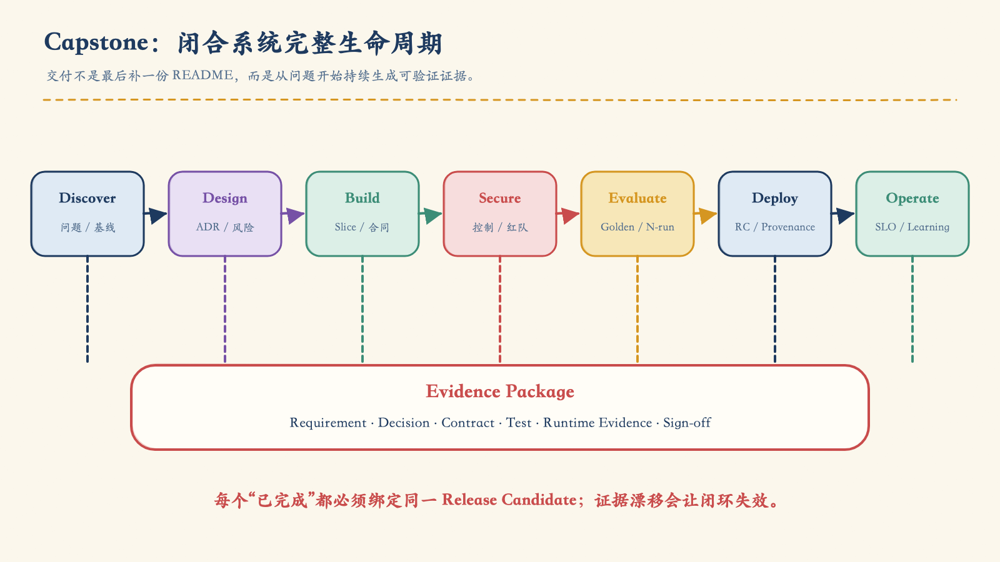
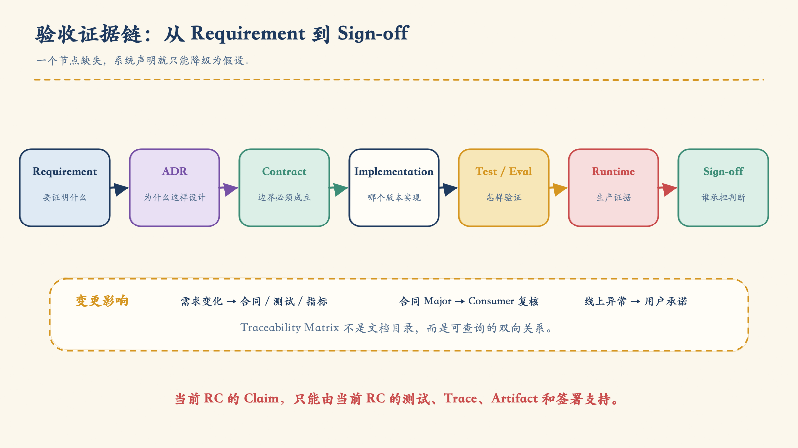
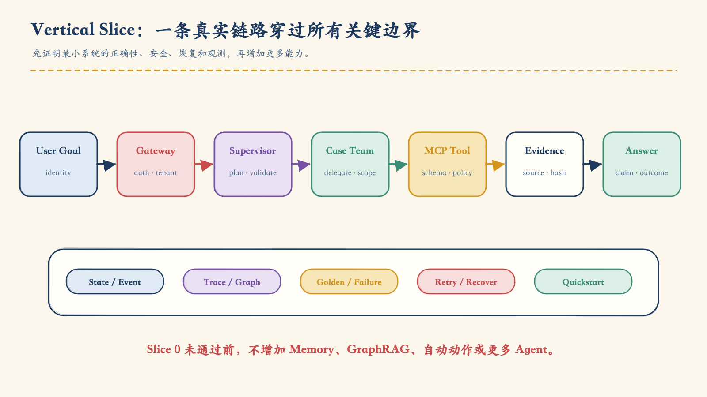
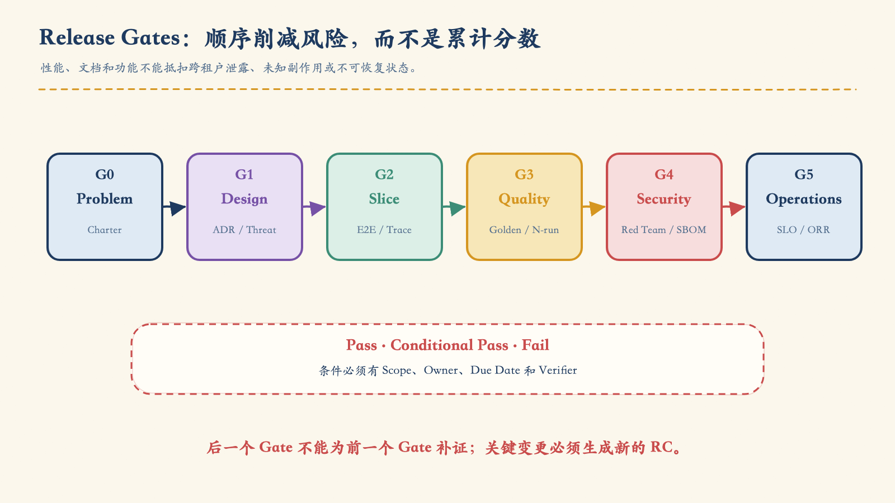
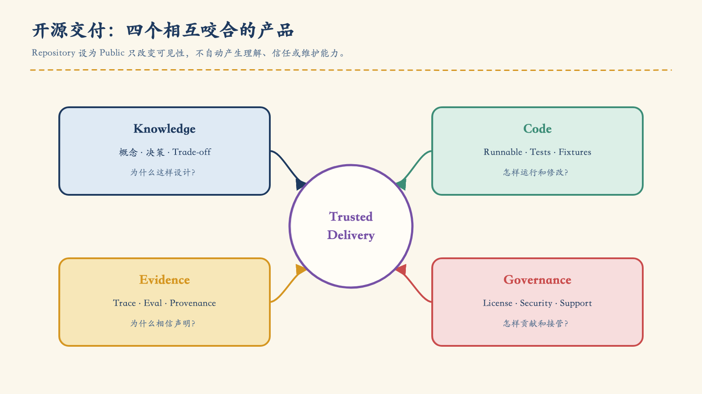
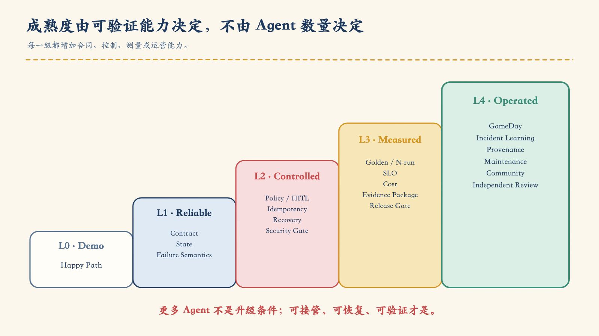

# 第 10 章：交付的不是 Demo，而是一套证据——Capstone 系统验收与 GitHub 开源交付

前九章把 C-102 理赔调查系统从一个模糊想法推进成了可运营系统：

- 第一章判断它为什么需要 Agent，以及自治边界在哪里；
- 第二章把工具调用变成受控状态机；
- 第三章定义多 Agent 的协作模式与合同；
- 第四章建立 Context、RAG、GraphRAG 与证据链；
- 第五章处理部署、状态、观测与恢复；
- 第六章加入纵深防御、Tool Guard、隐私与红队；
- 第七章通过 Supervisor、A2A、MCP 与 Context Graph 完成系统合龙；
- 第八章用 Golden Dataset、N-run 和持续回归证明质量；
- 第九章建立目标级 SLO、事件诊断、运行控制与 AgentOps 闭环。

到了这里，团队可以完成一场非常漂亮的演示：输入 C-102，多个 Team 协作，页面出现计划、工具调用、证据和答案；再注入一个 Provider 故障，系统自动降级并恢复。

演示结束后，评审者只问了四个问题：

1. 我怎样确认这不是一组预先准备好的成功数据？
2. 一个从未参与开发的人，能否在干净环境复现？
3. 这份 Release Artifact 是否真的来自被评审的代码？
4. 作者离开后，谁处理漏洞、兼容性、依赖和社区问题？

如果团队只能回答“你看，它刚才跑通了”，项目仍然没有完成。

> **生产交付不是作者证明自己会运行系统，而是让独立评审者能够追溯声明、复现路径、验证风险，并在没有作者口头补充的情况下继续维护。**

这也是 Capstone 的真正含义：它不是把 RAG、MCP、A2A、Memory、Graph、Guardrail 和更多 Agent 堆在一起，而是用最少必要组件闭合从问题、架构、实现、验收到发布和维护的完整生命周期。

## 1. Demo Paradox：看见成功，不等于可以接受

演示天然偏向 Happy Path。讲解者熟悉环境、知道正确输入、可以跳过等待，还能在异常出现时用口头解释补足缺失。系统验收的视角恰好相反：评审者要主动寻找那些 Demo 没有证明的东西。

| Demo 能展示 | Demo 不能独自证明 |
|---|---|
| 一次结果正确 | 在代表性切片上稳定正确 |
| 当前环境能运行 | 干净环境可以复现 |
| 某个失败被处理 | 失败分类、恢复与副作用对账完整 |
| 页面出现证据 | Claim 与权威 Evidence 可追溯 |
| 代码在仓库 | Release Artifact 来自该代码 |
| 项目已公开 | 许可、漏洞披露和维护责任清楚 |

系统验收的对象不是一个界面，也不是一个仓库，而是一组可验证声明：

```text
Claim: 系统可以安全解释理赔阻塞原因，并提出受控下一步。

Evidence:
  Requirement
  → Architecture Decision
  → Contract
  → Implementation
  → Test / Evaluation
  → Runtime Evidence
  → Independent Sign-off
```

任何断裂都会改变结论。测试通过但找不到对应需求，只能证明“某些代码按测试运行”；有 Trace 但没有固定版本，只能证明“某次环境发生过某件事”；仓库可克隆但 Quickstart 依赖作者本机秘密，也不能称为可复现。



*图 10-1　Capstone 把发现、设计、实现、安全、评测、发布和运营连接成可追溯的交付闭环。*

## 2. 先写 Project Charter，再决定要构建什么

很多毕业项目从“我要做五个 Agent”开始。这个起点已经把架构手段误写成了产品目标。

Project Charter 应先回答：

```yaml
project:
  name: CaseFlow
  problem: "服务人员在分散系统中查找状态、政策和下一步耗时过长"
  users: [customer, support_agent, supervisor]
  primary_goal: "缩短有证据的案件处理时间"
  in_scope:
    - read_case_status
    - explain_blockers_with_evidence
    - recommend_allowed_next_actions
    - propose_human_escalation
  out_of_scope:
    - autonomous_financial_approval
    - unrestricted_database_access
    - unsupported_decisions
  risks:
    - cross_tenant_access
    - unsupported_claim
    - unauthorized_side_effect
  success_metrics: []
  owner: service-operations
```

### 2.1 价值假设必须可证伪

| 假设 | 观测方式 | 否证后的动作 |
|---|---|---|
| 减少查找时间 | 处理时间与有证据解决时间 | 简化范围或停止 |
| 提升一次解决率 | 按 Intent 切片的解决率 | 检查知识与流程 |
| 降低错误建议 | 抽检、撤销、投诉与事故 | 阻断高风险能力 |
| 降低培训成本 | 新成员独立完成任务时间 | 改善文档与产品 |

指标阈值必须来自基线、风险和业务价值。原稿里的百分比、P95 和分钟数可以作为合同示例，不能直接成为所有系统的“生产标准”。

### 2.2 反目标防止技术失控

明确写下：

- 不以 Agent 数量、对话轮数和生成字数作为成功；
- 不把减少人工升级本身当作目标，必要升级是正确结果；
- 不用点赞替代事实、证据和业务 Outcome；
- 不为了展示框架而引入无人维护的组件；
- 不用公开仓库替代真正的开源许可与维护承诺。

当问题、用户、范围、风险、基线和成功定义没有 Owner 签署时，不应进入详细架构设计。

## 3. 需求不是愿望清单，而是验收入口

系统需求至少分七层：

| 层 | 需要回答 | 验收证据 |
|---|---|---|
| Business | 用户目标和业务结果是什么 | Golden Journey、业务签署 |
| Functional | 系统必须执行哪些能力 | E2E、Contract Test |
| Quality | 事实、证据、完整性如何 | 分层评测、N-run |
| Security | 租户、权限、PII、副作用 | 威胁模型、红队、硬门禁 |
| Reliability | 超时、重试、取消、恢复 | Failure Test、GameDay |
| Performance | 时延、吞吐、成本、容量 | Load / Cost Test |
| Operations | 告警、控制、回滚和维护 | Runbook、ORR、演练 |

### 3.1 Requirement Record

每一条高价值要求都应是独立记录：

```yaml
requirement:
  requirement_id: FR-CASE-004
  statement: "系统应使用当前、同租户授权的证据解释案件阻塞原因"
  risk: high
  acceptance:
    required_facts: [case.status, blocker.reason]
    evidence_coverage: 1.0
    freshness_policy: "由业务有效时间定义"
  forbidden:
    - cross_tenant_evidence
    - unsupported_reason
  verification:
    tests: [GOLD-CASE-031, SEC-TENANT-008]
    runtime_sli: claim_evidence_coverage
  owner: case-operations
```

“系统应智能地回答”无法验收；“使用当前、同租户授权的证据解释指定事实”则可以连接合同、测试和运行指标。

### 3.2 Traceability Matrix



*图 10-2　每个“已完成”都必须能从 Requirement 穿过 Decision、Contract、Test 和 Runtime Evidence 到达 Sign-off。*

| Requirement | Decision / Contract | Verification | Runtime Evidence | Owner |
|---|---|---|---|---|
| FR-CASE-004 | ADR-007 / CaseResult v1 | GOLD-031 | evidence coverage | Case Ops |
| SEC-TENANT-001 | ADR-011 / Policy v2 | SEC-008 | leakage event | Security |
| REL-RECOVER-003 | ADR-014 / Error v1 | FAIL-004 | reconcile backlog | SRE |

矩阵的价值不在“填满表格”，而在变更影响分析：

- Requirement 变化时，哪些合同、测试和指标要更新？
- Contract 发生 Major 变更时，哪些 Consumer 会受影响？
- 线上指标异常时，违反了哪条用户承诺？
- 一个风险被接受时，谁签署，何时到期？

## 4. Blueprint 和 ADR：让架构能够被反驳

架构蓝图应先描述层次和信任边界，再画框架 Logo：

```text
Experience  Web / API / Human Console
     ↓
Control     Gateway / Identity / Policy / Budget / HITL
     ↓
Agent       Central Supervisor / Domain Teams / Workers
     ↓
Capability  MCP Tools / A2A / Retrieval / Graph / Memory
     ↓
Platform    State / Event / Artifact / Observability / Cost
```

每条跨边界调用都重新验证身份、权限、合同和版本。Central Supervisor 不直接访问数据库；模型只提出高风险动作；确定性 Policy、Approval 和 Executor 决定是否执行。

关键决定进入 ADR：

- 为什么需要多 Agent，而不是工作流或单 Agent？
- Central、Team、Worker 为什么是当前层次？
- A2A 与 MCP 的边界在哪里？
- State、Event、Context Graph 和 Artifact 如何分工？
- 哪些动作必须 HITL，哪些应永久禁止？
- Prompt、Model、Knowledge 和 Tool 如何评测、发布和回滚？

ADR 不是事后美化。它必须记录 Context、Options、Decision、Consequences、Evidence 和 Supersedes。只有“采用某框架”而没有替代方案与后果，不是架构决策。

## 5. 先定义合同，再写 Agent

系统能否独立验收，取决于边界是否显式：

| Contract | 核心字段 |
|---|---|
| Goal | user、tenant、purpose、constraints、risk |
| Execution Plan | step、depends_on、team、budget、join |
| A2A Dispatch | task、delegation、deadline、contract version |
| Team Result | status、data、evidence、warnings、trace |
| Agent Error | category、retryable、side_effect_state |
| Evidence Ref | source、anchor、hash、freshness、ACL |
| Approval | actor、action hash、resource、expiry、expected version |
| Audit / Cost | identity、decision、outcome、tokens、tool cost |

### 5.1 兼容性要写成政策

```yaml
compatibility:
  versioning: semantic
  reject_unknown_major: true
  additive_minor_fields: allowed
  required_field_removal: breaking
  enum_extension: consumer_review
  consumer_contract_tests: required
  deprecation_window: "由使用者迁移能力决定"
```

Semantic Versioning 的核心前提是先声明 Public API；之后 Incompatible、Backward-compatible Feature 和 Backward-compatible Fix 才分别对应 Major、Minor、Patch。它不能替团队自动判断“一个 Prompt 或 Tool Schema 改动是否破坏语义”。[^semver]

### 5.2 必须始终成立的不变量

- `completed` 必须有满足合同的结果；
- `no_data`、`tool_error` 与业务事实为否严格分开；
- Claim 必须绑定同租户、有效期内 Evidence；
- 副作用必须有授权、审批、幂等键与 `expected_version`；
- 旧 Plan 的迟到结果不能覆盖当前状态；
- `partial` / `degraded` 必须列出缺失项与业务影响。

这些不变量应由代码、Schema、Policy 和测试执行，不能只写在 Prompt 里。

## 6. Vertical Slice：先纵向穿透，再横向扩张

一个 Capstone 最容易失败的方式，是同时创建多个空壳 Team，每个都只有 Happy Path。更稳妥的方式是先构建一条跨越所有关键边界的真实垂直切片。



*图 10-3　Slice 0 不追求功能数量，而要证明身份、计划、委派、工具、证据、状态、评测和观测能够连成一条链。*

CaseFlow 的 Slice 0 可以只有“读取案件状态”：

1. Gateway 验证用户、租户和请求合同；
2. Planner 生成单步骤计划并通过 Validator；
3. Supervisor 通过 A2A 委托 Case Team，Scope 仅为只读；
4. Team 选择 Status Worker；
5. Worker 通过 MCP 调用 Cases Tool；
6. Tool 验证参数、权限、版本与结果 Schema；
7. Result 绑定 EvidenceRef，写入 State、Graph 和 Trace；
8. Consolidator 生成结构化回答；
9. 评测记录 Goal Success、证据、时延和成本。

它的通过标准不是“页面有文字”，而是：

| 维度 | 必须证明 |
|---|---|
| 正确性 | Golden Fact 与 Evidence 一致 |
| 状态 | Step、Result、Event 和 Graph 一致 |
| 安全 | Tenant、Scope 和 Tool 权限正确 |
| 韧性 | Timeout、重复与崩溃可安全处理 |
| 可观测 | 一个 Trace 串起 Goal 到 Answer |
| 复现 | 独立环境能按公开步骤完成 |

Slice 0 没有通过前，不增加更多 Agent、Memory、GraphRAG 或自动动作。

### 6.1 从 Slice 0 演进

| Milestone | 新能力 | 新风险与证据 |
|---|---|---|
| M1 Status | 单 Team 只读 | Tenant、Evidence、no_data |
| M2 Guidance | Knowledge Team + RAG | 来源、时效、注入 |
| M3 Multi-team | 并行、依赖与 Join | 冲突、缺失、Late Result |
| M4 Action Proposal | Action Team + HITL | 授权、审批、幂等 |
| M5 Stateful | 多轮、取消、恢复 | 实体混淆、过期权限 |
| M6 Production | SLO、成本、Runbook | 容量、事故、回滚 |

每个 Milestone 都同时提交合同、代码、测试、威胁更新、Golden / Failure Case、文档和运行证据。功能先合并、证据后补，会让证据永远落后。

## 7. 仓库结构是一份架构声明

开源仓库应让目录边界与系统边界互相解释：

```text
caseflow/
├── README.md
├── LICENSE
├── SECURITY.md
├── CONTRIBUTING.md
├── CODE_OF_CONDUCT.md
├── CHANGELOG.md
├── docs/
│   ├── architecture/
│   ├── adr/
│   └── operations/
├── contracts/
│   ├── goal/
│   ├── plan/
│   ├── result/
│   ├── error/
│   └── evidence/
├── services/
│   ├── gateway/
│   ├── supervisor/
│   ├── teams/
│   └── mcp/
├── platform/
│   ├── state/
│   ├── security/
│   └── observability/
├── evals/
├── tests/
├── deploy/
└── examples/
```

依赖方向也要可检查：

- Contracts 不依赖 Services；
- 一个 Domain Team 不导入另一个 Team 的内部实现；
- Worker 依赖 Tool Interface，不依赖具体数据库客户端；
- Eval 通过公开入口观察系统，不侵入生产代码造出“测试捷径”；
- ADR、Contract、Runbook 与 Release Manifest 链接到对应版本。

## 8. Clean-room Reproduction：最诚实的公开评测

作者本机成功不是复现证据。Clean-room Reproduction 要求一个没有项目缓存、隐藏文件和口头指导的环境执行：

```text
Clone
→ Doctor
→ Bootstrap
→ Start
→ Seed
→ Smoke
→ Eval Smoke
→ Inspect Trace
→ Down
```

Quickstart 应声明：

- 支持的 OS、架构和 Runtime 版本；
- 所有必需环境变量及安全默认值；
- 合成数据版本和 Hash；
- 端口、资源与外部依赖；
- 期望输出与失败提示；
- 清理和卸载方式。

“15 分钟跑通”可以是某个项目的体验预算，但不是通用标准。真正的验收是：时间预算明确、CI 与独立复现者实际执行、失败原因有记录。

### 8.1 不要让 README 依赖作者的大脑

README 的第一条路径应覆盖：

1. 项目解决什么问题；
2. 适用范围和明确限制；
3. 最小架构图；
4. 环境要求；
5. Quickstart；
6. 一个成功场景和一个失败场景；
7. Trace / Evidence 的查看方式；
8. 测试、评测和安全命令；
9. 许可、支持与维护状态。

GitHub 也把 README 定位为访客理解“项目做什么、为什么有用、怎样开始、到哪里求助、谁在维护”的首要入口。[^github-readme]

## 9. 合成数据、秘密与公开边界

公开复现不能通过公开真实客户数据实现。Seed Manifest 应记录：

```yaml
seed:
  dataset: caseflow-demo
  version: 1.0.0
  synthetic: true
  generator_version: ""
  entities:
    tenants: 2
    users: 20
    cases: 100
  edge_cases:
    - no_data
    - stale_policy
    - cross_tenant_attempt
    - conflicting_evidence
    - partial_tool_failure
  hashes: {}
```

公开之前执行：

- Secret Scan 与历史提交检查；
- Token、URL、内部域名和凭据清理；
- PII 与可重识别数据检查；
- Prompt、Policy 和 Tool Output 的敏感信息审查；
- Notebook 输出、截图、Trace 和 Dashboard 的脱敏；
- 第三方数据、模型与工具的再分发权检查。

`.env.example` 只列变量名、说明和安全默认，不得提供可用秘密。“以后再轮换”不是公开仓库的控制措施。

## 10. Evidence Package：把“做完了”变成可审查对象

Evidence Package 应覆盖：

| 领域 | 代表性证据 |
|---|---|
| Product | Charter、Journey、Scope、Risk、Acceptance |
| Architecture | Blueprint、ADR、Contract Registry |
| Implementation | Commit、Build、Deployment、Artifact |
| Quality | Golden、N-run、Regression、Known Failure |
| Security | Threat Model、Red Team、SBOM、Exceptions |
| Reliability | Failure Matrix、Recovery、GameDay |
| Operations | SLO、Dashboard、Alert、Runbook、ORR |
| Traceability | Requirement 到 Owner 的完整索引 |

Evidence Record 不应只放文件路径：

```yaml
evidence_record:
  evidence_id: EVD-REL-031
  claim: "Release Candidate 可以安全处理只读案件状态查询"
  requirement_refs: [FR-CASE-004, SEC-TENANT-001]
  decision_refs: [ADR-003, ADR-007]
  contract_refs: [case-result@1.2.0]
  test_refs: [GOLD-031, SEC-008, FAIL-004]
  runtime_refs:
    trace: "trace://release-rc3/gold-031"
    graph: "context-graph://release-rc3/task-882"
  metrics:
    evidence_coverage: 1.0
  artifact_digests: []
  signed_by: [product, engineering, security]
  valid_for_release: rc3
```

Evidence 必须与 Release Candidate 绑定。拿上一个版本的红队报告、另一个数据快照的评测结果或开发环境的 Trace 为当前 RC 背书，都是证据漂移。

## 11. 验收必须覆盖失败

### 11.1 质量验收

需要分层检查：

```text
Planner        plan validity / dependency
Router / Team  route / scope / delegation
Worker / Tool  arguments / result / faithfulness
Consolidator   claim / evidence / contradiction
Decision       risk / HITL / allowed action
System         goal success / latency / cost
Safety         safe path / leakage / side effect
```

Golden Dataset 要覆盖常见、长尾、高风险、`no_data`、`partial`、冲突和多轮状态；N-run 检查分布，不用一次成功替代稳定性。

### 11.2 安全验收

至少覆盖：

- 直接与间接 Prompt Injection；
- Tool / MCP 参数、权限和输出；
- A2A 委派 Scope、Expiry 与 Replay；
- Memory / RAG 的租户、PII、实体和时效；
- Side Effect 的 Approval、Idempotency 与 Expected Version；
- 输出 DLP 与结构化结果；
- 依赖、镜像、模型和工具的供应链；
- Break-glass 与运营权限。

NIST SSDF 建议把安全开发实践集成到既有 SDLC 中，而不是发布前才添加一轮扫描；其 AI Community Profile 又扩展了生成式 AI 和双用途模型相关实践。[^nist-ssdf]

### 11.3 韧性、性能与成本

Failure Matrix 要说明：

| Failure | Expected Control | Expected Outcome |
|---|---|---|
| Provider unavailable | Circuit + evaluated fallback | degraded / blocked |
| Tool timeout | Deadline + reconcile | no blind side effect |
| Tool schema drift | contract reject | explicit incompatibility |
| Worker crash | checkpoint + resume policy | bounded recovery |
| Knowledge stale | freshness gate | partial / human |
| Trace unavailable | fail closed for high risk | diagnosable state |

性能预算按 Intent、Risk 和路径切片，包含 P95 / P99、并发、队列、Token、Tool Cost、Cost per Success 和 Retry Amplification。只测 HTTP RPS 会忽略真正瓶颈。

## 12. Release Gate 是顺序风险削减



*图 10-4　后一个 Gate 不能替前一个 Gate 补证；每一关都减少一类不同风险。*

| Gate | 核心问题 | 必要证据 | 决策人 |
|---|---|---|---|
| G0 Problem | 值得做吗 | Charter、Baseline、Risk | Product / Business |
| G1 Design | 架构可解释吗 | Blueprint、ADR、Threat Model | Architecture / Security |
| G2 Slice | 最小链路真实可运行吗 | E2E、Trace、Recovery、Quickstart | Engineering |
| G3 Quality | 结果稳定且有证据吗 | Golden、N-run、Regression | Quality / Domain |
| G4 Security | 高风险条件受控吗 | Red Team、SBOM、Exceptions | Security |
| G5 Operations | 能被接管和恢复吗 | SLO、Runbook、GameDay、ORR | Operations |

门禁是 `Pass / Conditional Pass / Fail`，不是一个可以互相抵扣的总分。性能更快不能抵扣一次跨租户泄露；README 更漂亮也不能抵扣未知副作用。

Conditional Pass 必须记录条件、Owner、到期时间、适用 Scope 和验证人。没有期限的例外等于永久降低标准。

## 13. Release Candidate 是冻结的验收对象

当系统进入 RC：

```yaml
release_manifest:
  release: caseflow-v1.0.0-rc3
  source_commit: ""
  contracts: {}
  agents: {}
  prompts: {}
  models: {}
  tools: {}
  knowledge_snapshot: ""
  policy_version: ""
  container_digests: []
  datasets: []
  evaluation_run: ""
  security_run: ""
  sbom_ref: ""
  provenance_ref: ""
  evidence_index: ""
  rollback_to: ""
```

验收期间如果 Prompt、Policy、Tool Schema、Knowledge Snapshot 或镜像发生变化，必须生成新的 RC，并重新执行受影响 Gate。继续沿用旧报告会破坏证据闭包。

### 13.1 SBOM 和 Provenance 解决不同问题

- **SBOM** 回答“制品包含什么依赖、版本和许可证”；
- **Provenance** 回答“制品由谁、在什么过程、使用什么输入构建”；
- **Attestation Verification** 回答“这些声明是否来自受信任身份，并符合预期”。

GitHub 可以从 Dependency Graph 导出 SPDX 格式 SBOM，也支持通过 Actions 生成 SBOM；Artifact Attestation 可将 Release Artifact 关联到 Repository、Workflow、Commit 和 Build 过程。[^github-sbom] [^github-attestation]

SLSA 1.2 将 Provenance 定义为可验证的制品来源信息，并把 Build 和 Source 分成独立 Track。需要特别注意：有 Attestation 不代表软件没有漏洞；消费者仍要验证签名、Builder Identity、Build Type 和外部参数是否符合自己的政策。[^slsa]

## 14. 灰度、回滚与 Kill Criteria

发布计划至少包含：

```text
Shadow → Canary → Dual Run → Promote → Rollback → Retire
```

回滚不只是容器 Tag：

- Prompt；
- Model / Provider；
- Agent Card 与 Capability Snapshot；
- Tool Schema；
- Policy；
- Knowledge Index / Graph；
- State Migration；
- Cache；
- Contract Compatibility。

Kill Criteria 应是机器可判断或人工可执行的显式条件：

```yaml
kill_or_pause_if:
  - unauthorized_side_effects > 0
  - cross_tenant_leakage > 0
  - high_risk_safe_path < approved_floor
  - error_budget_fast_burn == true
  - reconciliation_backlog > approved_limit
  - business_owner_requests_stop == true
```

其中阈值是项目政策。安全不变量通常应零容忍；质量、时延与成本阈值必须结合基线和风险。

## 15. Open Source 不是把 Repository 设为 Public



*图 10-5　可理解的知识、可运行的代码、可审查的证据和可持续的治理共同构成开源交付。*

一个成熟开源交付包含四个产品：

| 产品 | 用户要解决的问题 |
|---|---|
| Knowledge | 我怎样理解概念、边界和决策？ |
| Code | 我怎样运行、修改和验证？ |
| Evidence | 我为什么应该相信这些声明？ |
| Governance | 我怎样报告问题、贡献和判断维护状态？ |

把课程逐字稿、代码注释和 README 重复三遍不会增加价值。知识解释 Why 与 Trade-off；代码实现 Contract；Evidence 证明 Claim；Governance 定义参与和责任。

GitHub 的 Community Profile 会检查 README、LICENSE、CODE_OF_CONDUCT、CONTRIBUTING 等健康文件；这些文件不是装饰，而是向使用者和贡献者公开项目规则。[^github-community]

## 16. 许可证要按资产边界选择

一个仓库可能同时包含：

- 软件代码；
- 书稿与图表；
- 数据集与 Fixture；
- 模型权重或 Adapter；
- 第三方文档、图片和生成内容；
- 容器与依赖。

不要假设根目录一个 LICENSE 自动覆盖所有资产。应提供：

```yaml
asset_license:
  path: ""
  asset_type: code | documentation | data | model | media
  copyright_holder: ""
  license_id: ""
  source: ""
  modified: false
  redistribution_allowed: false
  notice_required: false
```

软件如果声称“开源”，应选择符合 Open Source Definition 的许可证。OSI 维护经审查批准的许可证列表；自创限制性条款可能使项目只是“源码可见”，而不是开源。[^osi-license]

许可证兼容与法律判断具有上下文差异。高风险发布应由合格法务复核，本章提供的是工程清单，不是法律意见。

## 17. 社区文件是一套维护接口

最低维护接口包括：

| 文件 | 必须说明 |
|---|---|
| README | 价值、范围、Quickstart、限制、支持 |
| CONTRIBUTING | 开发、测试、PR、评审与 DCO / CLA |
| CODE_OF_CONDUCT | 行为规范与执行方式 |
| SECURITY | 支持版本、私密报告、响应预期 |
| GOVERNANCE | 决策、角色、Owner 与升级 |
| SUPPORT | 支持范围、渠道与 SLA |
| CHANGELOG | 用户可见变更、迁移与弃用 |
| Issue / PR Templates | 复现、风险、证据与验收 |

GitHub 会在 Issue 和 PR 界面向贡献者展示 `CONTRIBUTING.md` 入口，帮助双方减少格式错误和反复沟通。[^github-contributing]

### 17.1 SECURITY.md 不能让漏洞进入公开 Issue

SECURITY.md 应写：

- 当前支持的版本；
- 私密报告渠道；
- 需要提供的复现与影响；
- 确认、分级、修复和披露流程；
- 安全 Advisory 与 CVE 策略；
- 哪些内容不得公开提交。

公共仓库还应根据风险启用 Secret Scanning、Push Protection、Dependency Alert 与 Code Scanning。GitHub 的仓库安全建议把这些能力列为公共仓库的基础保护。[^github-repo-security]

## 18. Release Notes 要诚实说明限制

一个 Release 页面至少回答：

```markdown
## What works
## Who this is for
## Quality and security evidence
## Known limitations
## Compatibility and migration
## Upgrade / rollback
## Artifact digests and provenance
## Support window
```

`v1.0.0` 不是“所有能力已经成熟”，而是当前 Public Contract 已经声明，并愿意按兼容政策维护。Release Notes 要区分：

- 经过验证的能力；
- 实验能力；
- 不支持范围；
- 已知风险；
- 数据、模型和环境假设。

## 19. 成熟度由可验证能力决定



*图 10-6　成熟度上升意味着合同、控制、测量和运营能力增强，不意味着 Agent 数量增加。*

| Level | 证明标准 |
|---|---|
| L0 Demo | 一个 Happy Path 能运行 |
| L1 Reliable | 合同、状态和失败语义明确 |
| L2 Controlled | 安全、审批、幂等和恢复受控 |
| L3 Measured | Golden、N-run、SLO 和成本可测 |
| L4 Operated | GameDay、Incident Learning 和维护闭环 |

小流量系统也可以达到较高成熟度；高流量系统也可能只是一场规模更大的 Demo。

## 20. 最终交付判断

评审者不再问“你用了几个 Agent”，而会问：

### 20.1 Product

- 问题、用户、范围和反目标是否明确？
- Goal Success 是否关联业务价值？
- 高风险 Outcome 是否有 Owner？

### 20.2 Architecture

- Blueprint、ADR 和 Contract 是否解释关键边界？
- 为什么选择当前 Agent 数量、协议、状态和知识方案？
- 变更影响是否可追溯？

### 20.3 Verification

- 一条 Vertical Slice 能否在干净环境复现？
- Golden、Red Team、Failure 和 N-run 是否绑定当前 RC？
- Evidence Package 能否支持每个验收 Claim？

### 20.4 Release and Operations

- Release Artifact 是否有 Digest、SBOM 和 Provenance？
- 灰度、回滚、Kill Criteria 和 ORR 是否完成？
- SLO、Alert、Runbook、GameDay 和维护责任是否存在？

### 20.5 Open Source

- 资产许可是否清楚且可再分发？
- README、CONTRIBUTING、SECURITY 和 Governance 是否完整？
- 外部使用者能否判断支持范围、已知限制和项目状态？

最终决策仍然只有三种：

```text
Accepted
Conditionally Accepted（条件、Owner、期限、验证人）
Rejected
```

### 20.6 Clean-room Sign-off

最有说服力的签署来自一个没有参与实现的人：

```yaml
independent_acceptance:
  reviewer: ""
  environment: ""
  source_commit: ""
  release_artifact_digest: ""
  steps_executed: []
  successful_scenarios: []
  failure_scenarios: []
  evidence_verified: []
  limitations_confirmed: []
  result: accepted | conditional | rejected
  conditions: []
  signed_at: ""
```

这份记录把“相信作者”转换成“验证系统”。

## 21. 全书收束：从架构判断到可公共验证

一本关于生产级多智能体系统的书，如果只告诉读者怎样创建 Agent，就没有完成自己的目标。真正完整的工程路径是：

```text
判断是否需要 Agent
→ 划定自治和责任边界
→ 把行动写成合同与状态机
→ 设计协作、Context 和证据
→ 建立平台、安全、评测和运营
→ 用垂直切片和 Evidence Package 验收
→ 通过可复现、可追溯、可维护的仓库公开交付
```

最终，生产级不是一个形容词，而是一组可以被外部验证的能力：

- 目标可以度量；
- 决策可以解释；
- 边界可以执行；
- 事实可以追溯；
- 失败可以恢复；
- 风险可以控制；
- 质量可以证明；
- 成本可以归因；
- 制品可以验证；
- 项目可以被别人接手。

这就是 Capstone 应交付的东西：不是更多组件，而是一个不依赖作者在场的可信系统。

本章配套的[《Capstone 系统验收与开源交付契约》](../toolkit/capstone-system-acceptance-and-open-source-delivery-contract.md)提供 Charter、Requirement、Traceability、Vertical Slice、Evidence Package、Release Gate、SBOM / Provenance、Clean-room Reproduction、社区治理与最终签署模板。

## 参考资料

[^semver]: Semantic Versioning, [Semantic Versioning 2.0.0](https://semver.org/)。版本号的兼容含义以已经声明的 Public API 为前提。
[^github-readme]: GitHub Docs, [About the repository README file](https://docs.github.com/en/repositories/managing-your-repositorys-settings-and-features/customizing-your-repository/about-readmes)。README 应解释项目用途、开始方式、支持与维护者。
[^nist-ssdf]: NIST, [Secure Software Development Framework](https://csrc.nist.gov/Projects/ssdf)。最终版本包括 SSDF 1.1 与 Generative AI Community Profile；较新的 SSDF 1.2 在本章写作时仍为 Draft。
[^github-sbom]: GitHub Docs, [Exporting a software bill of materials for your repository](https://docs.github.com/en/code-security/how-tos/secure-your-supply-chain/establish-provenance-and-integrity/export-dependencies-as-sbom)。GitHub Dependency Graph 可导出 SPDX SBOM。
[^github-attestation]: GitHub Docs, [Using artifact attestations to establish provenance for builds](https://docs.github.com/en/actions/how-tos/secure-your-work/use-artifact-attestations/use-artifact-attestations)。Artifact Attestation 连接制品与构建来源，但不替代漏洞和政策判断。
[^slsa]: SLSA, [SLSA specification v1.2](https://slsa.dev/spec/v1.2/) 与 [Verifying artifacts](https://slsa.dev/spec/v1.2/verifying-artifacts)。Provenance 只有在按受信任预期验证时才产生安全价值。
[^github-community]: GitHub Docs, [About community profiles for public repositories](https://docs.github.com/en/communities/setting-up-your-project-for-healthy-contributions/about-community-profiles-for-public-repositories)。Community Profile 检查公开仓库的关键健康文件。
[^osi-license]: Open Source Initiative, [OSI Approved Licenses](https://opensource.org/licenses)。OSI 批准列表用于判断许可证是否符合 Open Source Definition。
[^github-contributing]: GitHub Docs, [Setting guidelines for repository contributors](https://docs.github.com/en/communities/setting-up-your-project-for-healthy-contributions/setting-guidelines-for-repository-contributors)。贡献指南会在仓库、Issue 与 PR 流程中被展示。
[^github-repo-security]: GitHub Docs, [Best practices for repositories](https://docs.github.com/en/repositories/creating-and-managing-repositories/best-practices-for-repositories)。公共仓库应启用适用的依赖、秘密与代码安全能力。
